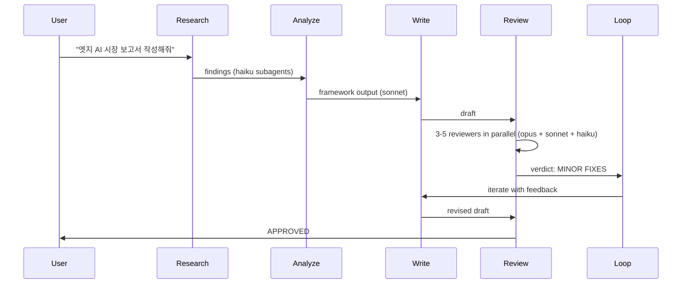
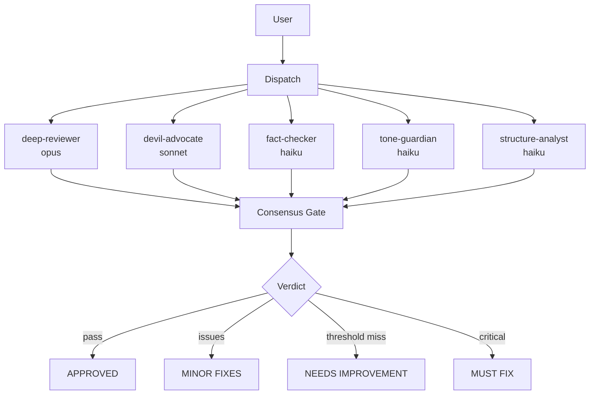

[English](README.md) | **한국어**


---

# Second Claude Code — 지식 작업 OS


Second Brain이 200개 앱이 아니라 하나의 PARA 시스템이듯, Second Claude Code는 200개 스킬이 아니라 **8개 명령어로 지식 작업을 커버하는 OS**입니다.

지식 노동자는 도구 파편화에 빠지기 쉽습니다. 리서치용 플러그인 따로, 글쓰기용 따로, 리뷰용 따로 — 서로 연결되지 않는 도구들의 늪. Second Claude Code는 이 혼잡함을 **8개의 조합 가능한 킬러 스킬**, **10개의 전문 서브에이전트**, **15개의 전략 프레임워크**로 대체합니다. 넓고 얕은 기능 나열 대신 깊이 있는 분석이 필요한 연구자, 전략가, 콘텐츠 크리에이터를 위해 설계되었습니다.

---

## 지식 작업 사이클

이 구조는 두 레이어로 읽히도록 정리했습니다. 먼저 핵심 워크플로를 이해하고, 그다음 보조 명령어를 보게 됩니다.

**핵심 흐름**

`Research` → `Analyze` → `Write` → `Review` → `Loop`

**보조 명령어**

| 명령어 | 역할 |
|--------|------|
| `hunt` | 워크플로 주변에서 필요한 기능을 탐색 |
| `collect` | 자료와 메모를 PARA 친화적으로 저장 |
| `pipeline` | 여러 명령어를 반복 가능한 흐름으로 연결 |

---

## 빠른 시작

**1. 설치**

```bash
claude plugin add github:EungjePark/second-claude-code
```

**2. 확인** — 새 Claude Code 세션을 시작하면 컨텍스트가 주입됩니다:

```
# Second Claude Code — Knowledge Work OS

8 commands for all knowledge work:
| Command | Purpose |
...
```

아무것도 표시되지 않으면 플러그인 설치를 확인하세요: `claude plugin list`

**3. 바로 사용** — 자연어로 입력하세요:

```
AI 에이전트 프레임워크 현황을 조사해줘
```

자동 라우터가 `/second-claude-code:research`를 자동으로 선택합니다. 슬래시 명령어를 외울 필요가 없습니다.

자동 라우팅이 작동하지 않으면 명시적 명령어를 사용하세요: `/second-claude-code:research "AI 에이전트 프레임워크 2026"`

---

## 스킬 선택 가이드

| 하고 싶은 것 | 사용할 스킬 |
|-------------|------------|
| 주제에 대한 정보 조사 | `research` |
| 전략 프레임워크 적용 (SWOT, Porter 등) | `analyze` |
| 뉴스레터, 아티클, 보고서 작성 | `write` |
| 초안에 대한 다중 관점 피드백 받기 | `review` |
| 목표 점수까지 초안 반복 개선 | `loop` |
| URL, 메모, 발췌를 저장 | `collect` |
| 여러 스킬을 반복 가능한 워크플로우로 연결 | `pipeline` |
| 없는 스킬을 찾아 설치 | `hunt` |

---

## 8개의 명령어

명령어는 `/second-claude-code:` 접두사를 사용합니다.

### 탐색 (Discover)

| 명령어 | 설명 | 예시 |
|--------|------|------|
| [`research`](docs/skills/research.md) | 반복 정제를 거치는 자율 심층 리서치 | `/second-claude-code:research "AI 에이전트 동향 2026"` |
| [`hunt`](docs/skills/hunt.md) | 스킬 탐색 — 새로운 기능을 찾아 설치 | `/second-claude-code:hunt "terraform 보안 감사"` |

### 생성 (Create)

| 명령어 | 설명 | 예시 |
|--------|------|------|
| [`write`](docs/skills/write.md) | 콘텐츠 제작 (아티클, 뉴스레터, 대본 등) | `/second-claude-code:write article "바이브 코딩의 미래"` |
| [`analyze`](docs/skills/analyze.md) | 전략 프레임워크 분석 (15개 내장 프레임워크) | `/second-claude-code:analyze swot "우리 SaaS 제품"` |

### 품질 (Quality)

| 명령어 | 설명 | 예시 |
|--------|------|------|
| [`review`](docs/skills/review.md) | 다중 관점 품질 게이트 + 합의 투표 | `/second-claude-code:review docs/draft.md --preset content` |
| [`loop`](docs/skills/loop.md) | 목표 점수를 향한 반복 개선 | `/second-claude-code:loop "이 아티클을 4.5/5로 올려" --max 3` |

### 관리 (Manage)

| 명령어 | 설명 | 예시 |
|--------|------|------|
| [`collect`](docs/skills/collect.md) | 지식 수집 및 PARA 분류 | `/second-claude-code:collect https://example.com/article` |
| [`pipeline`](docs/skills/pipeline.md) | 커스텀 워크플로우 빌더 및 실행기 | `/second-claude-code:pipeline run "weekly-digest"` |

---

## 자동 라우팅

슬래시 명령어를 외울 필요 없습니다. 훅 기반 자동 라우터가 한국어와 영어 자연어에서 의도를 감지하고 적절한 스킬을 실행합니다.

### 한국어 트리거 키워드

| 스킬 | 키워드 |
|------|--------|
| **research** (조사) | `조사해`, `리서치`, `찾아봐`, `알아봐`, `검색해`, `탐색` |
| **write** (작성) | `뉴스레터`, `보고서`, `대본`, `아티클`, `글 써`, `써줘`, `작성해`, `카드뉴스` |
| **analyze** (분석) | `분석해`, `전략` |
| **review** (리뷰) | `리뷰`, `검토`, `품질`, `체크`, `피드백` |
| **loop** (반복) | `개선`, `반복`, `더 좋게`, `다듬어` |
| **collect** (수집) | `저장`, `캡처`, `정리해줘`, `메모`, `기록`, `클리핑`, `수집`, `수집해` |
| **pipeline** (파이프라인) | `파이프라인`, `자동화`, `워크플로우` |
| **hunt** (탐색) | `스킬 있`, `어떻게 해`, `할 수 있`, `방법`, `도구` |

### 라우팅 예시

```
"AI 에이전트에 대해 조사해"              →  /second-claude-code:research
"이 주제로 아티클 작성해"                →  /second-claude-code:write
"SWOT으로 분석해"                       →  /second-claude-code:analyze
"이 초안을 리뷰해"                      →  /second-claude-code:review
"더 좋게 다듬어"                        →  /second-claude-code:loop
"이 링크 저장해줘"                      →  /second-claude-code:collect
"주간 워크플로우 자동화"                 →  /second-claude-code:pipeline
"보안 감사 스킬 있어?"                   →  /second-claude-code:hunt
```

`hooks/prompt-detect.mjs`에서 영어 약 58개, 한국어 약 41개의 트리거 패턴을 매칭하여 모델 응답 전에 적절한 스킬 컨텍스트를 주입합니다. 여러 스킬이 매칭될 경우, 프롬프트에서 가장 먼저 나타나는 패턴의 스킬이 선택됩니다.

---

## 스킬 조합

스킬은 서로를 호출하며 자연스럽게 체이닝됩니다. 하나의 프롬프트로 전체 프로덕션 파이프라인을 실행할 수 있습니다.



**자주 쓰는 체인:**

```
research → write → review → loop → done          # 풀 콘텐츠 파이프라인
research → analyze → review → done                # 전략 분석
collect → research → write → pipeline(save)       # 지식 → 콘텐츠 전환
```

`/second-claude-code:write`는 내부적으로 `/second-claude-code:research`와 `/second-claude-code:review`를 자동 호출하므로, 하나의 write 명령어만으로 리서치 기반 + 리뷰 검증된 콘텐츠를 생산할 수 있습니다.

---

## 다중 관점 리뷰

`/second-claude-code:review`는 3~5명의 전문 서브에이전트를 병렬로 실행합니다. 각각 다른 모델과 전문 영역을 가집니다.

### 리뷰어

| 리뷰어 | 모델 | 전문 영역 |
|--------|------|-----------|
| deep-reviewer | opus | 논리, 구조, 완결성 |
| devil-advocate | sonnet | 약점과 사각지대 공격 |
| fact-checker | haiku | 주장, 수치, 출처 검증 |
| tone-guardian | haiku | 어조와 독자 적합성 |
| structure-analyst | haiku | 구성과 가독성 |

### 리뷰 흐름



**Consensus gate (합의 게이트):** 2/3 통과 시 APPROVED (full 프리셋은 3/5). 임계값 미달 + Critical 없음 = NEEDS IMPROVEMENT. Critical 발견 시 즉시 MUST FIX.

### 프리셋

| 프리셋 | 리뷰어 | 적합한 용도 |
|--------|--------|-------------|
| `content` | deep-reviewer + devil-advocate + tone-guardian | 뉴스레터, 아티클 |
| `strategy` | deep-reviewer + devil-advocate + fact-checker | PRD, SWOT, 전략 문서 |
| `code` | deep-reviewer + fact-checker + structure-analyst | 코드 리뷰 |
| `quick` | devil-advocate + fact-checker | 빠른 검증 |
| `full` | 5명 전원 | 최종 퍼블리시 전 검수 |

**외부 리뷰어:** `--external` 플래그로 mmbridge, kimi, codex, gemini를 통한 크로스 모델 리뷰를 추가할 수 있습니다.

---

<details>
<summary><strong>15개 전략 프레임워크</strong></summary>

`/second-claude-code:analyze`는 용도별로 분류된 15개의 내장 프레임워크를 지원합니다:

| 카테고리 | 프레임워크 |
|----------|------------|
| **전략 (Strategy)** | ansoff, porter, pestle, north-star, value-prop |
| **기획 (Planning)** | prd, okr, lean-canvas, gtm, battlecard |
| **우선순위 (Prioritization)** | rice, pricing |
| **분석 (Analysis)** | swot, persona, journey-map |

각 프레임워크는 `skills/analyze/references/frameworks/`에 독립 레퍼런스 문서로 존재합니다. 프롬프트에서 자동으로 적절한 프레임워크를 선택하거나, 직접 지정할 수도 있습니다:

```bash
/second-claude-code:analyze porter "클라우드 인프라 시장"
/second-claude-code:analyze rice --input features.md
/second-claude-code:analyze lean-canvas "내 스타트업 아이디어"
```

</details>

---

<details>
<summary><strong>아키텍처</strong></summary>

```
second-claude/
├── .claude-plugin/plugin.json    # 플러그인 매니페스트 (v0.2.0)
├── skills/                       # 8개 스킬 (각각 SKILL.md 포함)
│   ├── research/                 # 자율 심층 리서치
│   ├── write/                    # 콘텐츠 제작
│   ├── analyze/                  # 전략 프레임워크 분석 (15개 프레임워크)
│   ├── review/                   # 다중 관점 품질 게이트
│   ├── loop/                     # 반복 개선
│   ├── collect/                  # 지식 수집 (PARA)
│   ├── pipeline/                 # 커스텀 워크플로우 빌더
│   └── hunt/                     # 스킬 탐색
├── agents/                       # 10개 전문 서브에이전트
├── commands/                     # 8개 슬래시 명령어 래퍼
├── hooks/                        # 자동 라우팅 + 컨텍스트 주입
│   ├── hooks.json                # 훅 설정
│   ├── prompt-detect.mjs         # 자연어 자동 라우터
│   ├── session-start.mjs         # 세션 배너 + 상태 초기화
│   └── session-end.mjs           # 정리
├── references/                   # 설계 원칙, 합의 게이트
├── templates/                    # 출력 템플릿
├── scripts/                      # 셸 유틸리티
└── config/                       # 사용자 설정
```

| 디렉토리 | 역할 |
|----------|------|
| `skills/` | 각 스킬은 `SKILL.md`(짧고 컨텍스트 효율적)와 `references/` 하위 디렉토리(심층 문서)를 가집니다. 점진적 공개(Progressive Disclosure) 적용. |
| `agents/` | 10개 서브에이전트 정의: 프로덕션 에이전트 5개(researcher, analyst, editor, strategist, writer) + 리뷰어 5개(deep-reviewer, devil-advocate, fact-checker, tone-guardian, structure-analyst). |
| `commands/` | `/second-claude-code:*` 호출을 해당 스킬로 연결하는 얇은 래퍼. |
| `hooks/` | 세션 라이프사이클 훅과 자연어를 스킬에 매핑하는 자동 라우팅 엔진. |
| `references/` | 공유 지식: 설계 원칙, 합의 게이트 스펙, PARA 메소드. |

</details>

---

## 설계 철학

7가지 원칙이 플러그인 아키텍처를 지배합니다:

1. **Few but Deep** — 80개가 아닌 8개 스킬. 각각 내부적으로 깊습니다.
2. **Gotchas over Instructions** — 행복한 경로뿐 아니라 실패 모드를 문서화합니다.
3. **Progressive Disclosure** — SKILL.md는 짧게, `references/`에서 깊게.
4. **Context-Efficient** — 8개 스킬 설명 전체가 100 토큰 이내.
5. **Zero Dependency Core** — `npm install` 불필요. 서브에이전트와 셸 스크립트만 사용.
6. **State in Files** — 플러그인 데이터 디렉토리에 JSON 상태 영속화.
7. **Composable** — 스킬이 서로를 호출하여, 8개 프리미티브로 무한한 워크플로우 구성.

**원칙 간 상호작용:** Few-but-deep + composable = 작은 표면적, 무한한 조합. Gotchas-first + progressive disclosure = 장문 없이도 안전한 사용. Context-efficient + zero dependency = 빠르고, 저렴하고, 플랫폼 무관.

---

## 호환성

| 플랫폼 | 설치 방법 | 상태 |
|--------|-----------|------|
| **Claude Code** (주력) | `claude plugin add github:EungjePark/second-claude-code` | 검증 완료 |
| **OpenClaw** | 표준 ACP 프로토콜 — 자동 감지 | 실험적 |
| **Codex** | SKILL.md 표준 호환 | 실험적 |
| **Gemini CLI** | SKILL.md 표준 호환 | 실험적 |

> Claude Code 이외 플랫폼은 SKILL.md 표준을 통해 동작할 것으로 기대되지만, 아직 완전히 검증되지 않았습니다. 호환성 문제를 발견하면 이슈로 알려주세요.

## 기여 및 라이선스

이슈와 PR은 [github.com/EungjePark/second-claude-code](https://github.com/EungjePark/second-claude-code)에서 환영합니다. [MIT](LICENSE) — Park Eungje
