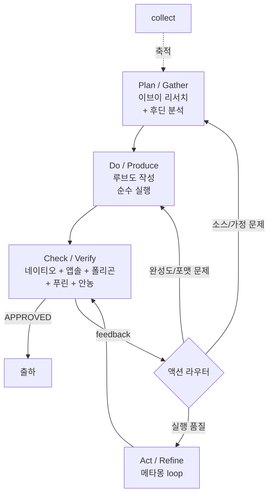
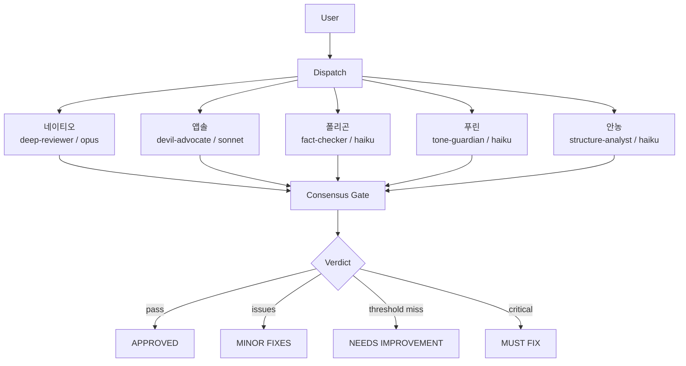

[English](README.md) | **한국어**


---

# Second Claude Code — 지식 작업 OS


Second Brain이 앱 200개가 아니라 하나의 PARA 시스템인 것처럼,
**Second Claude Code는 스킬 200개가 아니라 9개 명령어로 돌아가는 지식 작업 OS입니다.**

리서치 플러그인 따로, 글쓰기 따로, 리뷰 따로 — 연결은 안 되고 도구만 늘어나는 악순환. Second Claude Code는 이걸 **9개 스킬 + 16마리 포켓몬 서브에이전트 + 15개 전략 프레임워크**로 끝냅니다. 얕고 넓게가 아니라 깊고 정확하게. 싱글 패스 생성이 아니라 멀티모델 리뷰. 연구자, 전략가, 콘텐츠 크리에이터를 위해 만들었습니다.

---

## 지식 작업 사이클

**핵심 흐름**: `Research → Analyze → Write → Review → Loop`

**PDCA 품질 원리**를 따릅니다. 모든 산출물은 리뷰(Verify)와 반복 개선(Refine)을 거쳐야 출하합니다. 콘텐츠를 만드는 사이클이 스킬 자체를 개선하는 사이클이기도 합니다.

내부적으로는 `Gather → Produce → Verify → Refine`, PDCA로는 `Plan → Do → Check → Act`에 대응합니다.

| PDCA | Second Claude Code |
|------|--------------------|
| Plan | Gather (`research` → `analyze`, 질문 프로토콜 포함) |
| Do | Produce (`write` 순수 실행 모드) |
| Check | Verify (`review` 5명 병렬 리뷰) |
| Act | Refine (액션 라우터 → `loop` / Plan 복귀 / Do 복귀) |


<details>
<summary>Mermaid 폴백 (SVG 미지원 환경용)</summary>



</details>

**보조 명령어**

| 명령어 | 역할 |
|--------|------|
| `hunt` | 새로운 기능으로 사이클을 확장 |
| `collect` | 사이클 전반에 걸쳐 지식을 축적 |
| `pipeline` | 반복 가능한 사이클을 자동화 |

---

## 빠른 시작

**1. 설치**

```bash
claude plugin add github:EungjePark/second-claude-code
```

**2. 확인** — 새 Claude Code 세션을 시작하면 컨텍스트가 주입됩니다:

```
# Second Claude Code — Knowledge Work OS

9 commands for all knowledge work:
| Command | Purpose |
...
```

아무것도 표시되지 않으면 플러그인 설치를 확인하세요: `claude plugin list`

**3. 바로 사용** — 자연어로 입력하세요:

```
AI 에이전트 프레임워크 현황을 조사해줘
```

자동 라우터가 `/second-claude-code:research`를 자동으로 선택합니다. 슬래시 명령어를 외울 필요가 없습니다.

자동 라우팅이 작동하지 않으면 명시적 명령어를 사용하세요: `/second-claude-code:research "AI 에이전트 프레임워크 2026"`

---

## 스킬 선택 가이드

| 하고 싶은 것 | 사용할 스킬 |
|-------------|------------|
| 리서치→작성→리뷰→개선 전체 사이클 | `pdca` |
| 주제에 대한 정보 조사 | `research` |
| 전략 프레임워크 적용 (SWOT, Porter 등) | `analyze` |
| 아티클, 보고서, 뉴스레터 작성 | `write` |
| 초안에 대한 다중 관점 피드백 받기 | `review` |
| 목표 점수까지 초안 반복 개선 | `loop` |
| URL, 메모, 발췌를 저장 | `collect` |
| 여러 스킬을 반복 가능한 워크플로우로 연결 | `pipeline` |
| 없는 스킬을 찾아 설치 | `hunt` |

---

## 9개의 명령어

명령어는 `/second-claude-code:` 접두사를 사용합니다.

### 오케스트레이터

| 명령어 | 설명 | 예시 |
|--------|------|------|
| [`pdca`](docs/skills/pdca.md) | 품질 게이트 + 액션 라우터를 갖춘 전체 PDCA 사이클 | `/second-claude-code:pdca "AI 에이전트 시장 보고서"` |

`pdca` 명령어는 자연어에서 어떤 페이즈에 진입할지 감지하고 적절한 스킬을 체이닝합니다. "알아보고 보고서 써줘"라고 말하면 Plan→Do→Check→Act 전체 사이클이 게이트와 함께 실행됩니다. `--no-questions` 플래그로 질문 프로토콜을 생략할 수 있습니다.

### 수집 (Gather)

| 명령어 | 설명 | 예시 |
|--------|------|------|
| [`research`](docs/skills/research.md) | 반복 정제를 거치는 자율 심층 리서치 | `/second-claude-code:research "AI 에이전트 동향 2026"` |
| [`hunt`](docs/skills/hunt.md) | 스킬 탐색 — 새로운 기능을 찾아 설치 | `/second-claude-code:hunt "terraform 보안 감사"` |
| [`collect`](docs/skills/collect.md) | 지식 수집 및 PARA 분류 | `/second-claude-code:collect https://example.com/article` |

### 생산 (Produce)

| 명령어 | 설명 | 예시 |
|--------|------|------|
| [`write`](docs/skills/write.md) | 콘텐츠 제작 (아티클, 보고서, 뉴스레터 등) | `/second-claude-code:write article "바이브 코딩의 미래"` |
| [`analyze`](docs/skills/analyze.md) | 전략 프레임워크 분석 (15개 내장 프레임워크) | `/second-claude-code:analyze swot "우리 SaaS 제품"` |
| [`pipeline`](docs/skills/pipeline.md) | 커스텀 워크플로우 빌더 및 실행기 | `/second-claude-code:pipeline run "weekly-digest"` |

### 검증 (Verify)

| 명령어 | 설명 | 예시 |
|--------|------|------|
| [`review`](docs/skills/review.md) | 다중 관점 품질 게이트 + 합의 투표 | `/second-claude-code:review docs/draft.md --preset content` |

### 개선 (Refine)

| 명령어 | 설명 | 예시 |
|--------|------|------|
| [`loop`](docs/skills/loop.md) | 목표 점수를 향한 반복 개선 | `/second-claude-code:loop "이 아티클을 4.5/5로 올려" --max 3` |

---

## 자동 라우팅

슬래시 명령어를 외울 필요 없습니다. 훅 기반 자동 라우터가 한국어와 영어 자연어에서 의도를 감지하고 적절한 스킬을 실행합니다.

### 한국어 트리거 키워드

| 스킬 | 키워드 |
|------|--------|
| **research** (조사) | `조사해`, `리서치`, `찾아봐`, `알아봐`, `검색해`, `탐색` |
| **write** (작성) | `뉴스레터`, `보고서`, `대본`, `아티클`, `글 써`, `써줘`, `작성해`, `카드뉴스` |
| **analyze** (분석) | `분석해`, `전략` |
| **review** (리뷰) | `리뷰`, `검토`, `품질`, `체크`, `피드백` |
| **loop** (반복) | `개선`, `반복`, `더 좋게`, `다듬어` |
| **collect** (수집) | `저장`, `캡처`, `정리해줘`, `메모`, `기록`, `클리핑`, `수집`, `수집해` |
| **pipeline** (파이프라인) | `파이프라인`, `자동화`, `워크플로우` |
| **hunt** (탐색) | `스킬 있`, `어떻게 해`, `할 수 있`, `방법`, `도구` |

### 라우팅 예시

```
"AI 에이전트 알아보고 보고서 써줘"       →  /second-claude-code:pdca (전체 사이클)
"리뷰하고 개선해줘"                     →  /second-claude-code:pdca (Check+Act)
"AI 에이전트에 대해 조사해"              →  /second-claude-code:research
"이 주제로 아티클 작성해"                →  /second-claude-code:write
"SWOT으로 분석해"                       →  /second-claude-code:analyze
"이 초안을 리뷰해"                      →  /second-claude-code:review
"더 좋게 다듬어"                        →  /second-claude-code:loop
"이 링크 저장해줘"                      →  /second-claude-code:collect
"주간 워크플로우 자동화"                 →  /second-claude-code:pipeline
"보안 감사 스킬 있어?"                   →  /second-claude-code:hunt
```

`hooks/prompt-detect.mjs`에서 영어 약 58개, 한국어 약 41개의 트리거 패턴을 매칭하여 모델 응답 전에 적절한 스킬 컨텍스트를 주입합니다. 여러 스킬이 매칭될 경우, 프롬프트에서 가장 먼저 나타나는 패턴의 스킬이 선택됩니다.

---

## 스킬 조합

스킬은 서로를 호출하며 자연스럽게 체이닝됩니다. 하나의 프롬프트로 전체 PDCA 사이클을 실행할 수 있습니다.

**자주 쓰는 패턴:**

| 패턴 | 체인 | 용도 |
|------|------|------|
| 풀 PDCA | research → analyze → write → review → loop | 엔드투엔드 콘텐츠 |
| 빠른 검수 | review → loop | 기존 초안 다듬기 |
| 기획만 | research → analyze | 전략 분석 |
| 자동 PDCA | `pipeline run autopilot --topic "..."` | 원커맨드 생산 |

`/second-claude-code:pdca`는 다단계 작업의 권장 방법입니다 — 품질 게이트를 강제하고 액션 라우터로 리뷰 소견을 근본원인별로 분류합니다. `/second-claude-code:write`도 내부적으로 research와 review를 자동 호출하므로, 하나의 write 명령어만으로 리서치 기반 + 리뷰 검증된 콘텐츠를 생산할 수 있습니다.

---

## 다중 관점 리뷰

`/second-claude-code:review`는 3~5마리의 전문 서브에이전트를 병렬로 투입합니다. 모델도 다르고 전문 영역도 다릅니다.

### 리뷰어

| 리뷰어 | 포켓몬 | 모델 | 전문 영역 | 왜 이 포켓몬? |
|--------|--------|------|-----------|--------------|
| deep-reviewer | 네이티오(Xatu) | opus | 논리, 구조, 완결성 | 과거와 미래를 동시에 봄 = 구조적 결함 탐지 |
| devil-advocate | 앱솔(Absol) | sonnet | 약점과 사각지대 공격 | 재앙 감지 포켓몬, 위험을 경고 |
| fact-checker | 폴리곤(Porygon) | haiku | 주장, 수치, 출처 검증 | 디지털 네이티브, 데이터 기반 이진 판정 |
| tone-guardian | 푸린(Jigglypuff) | haiku | 어조와 독자 적합성 | THE 보이스 포켓몬, 톤에 민감 |
| structure-analyst | 안농(Unown) | haiku | 구성과 가독성 | 문자 형태, 구조에 집착 |

### 리뷰 흐름


<details>
<summary>Mermaid 폴백 (SVG 미지원 환경용)</summary>



</details>

**합의 게이트:** 2/3 통과 시 APPROVED (`full` 프리셋은 3/5). 임계값 미달인데 Critical 없으면 NEEDS IMPROVEMENT. Critical이 하나라도 있으면 즉시 MUST FIX.

### 프리셋

| 프리셋 | 리뷰어 | 적합한 용도 |
|--------|--------|-------------|
| `content` | 네이티오 + 앱솔 + 푸린 | 아티클, 블로그, 뉴스레터 |
| `strategy` | 네이티오 + 앱솔 + 폴리곤 | PRD, SWOT, 전략 문서 |
| `code` | 네이티오 + 폴리곤 + 안농 | 코드 리뷰 |
| `quick` | 앱솔 + 폴리곤 | 빠른 검증 |
| `full` | 5명 전원 | 최종 퍼블리시 전 검수 |

**외부 리뷰어 (선택 사항):** `--external` 플래그로 MMBridge를 통한 크로스 모델 리뷰(Kimi, Qwen, Gemini, Codex)를 추가할 수 있습니다. MMBridge 별도 설치 필요.

---

<details>
<summary><strong>15개 전략 프레임워크</strong></summary>

`/second-claude-code:analyze`는 용도별로 분류된 15개의 내장 프레임워크를 지원합니다:

| 카테고리 | 프레임워크 |
|----------|------------|
| **전략 (Strategy)** | ansoff, porter, pestle, north-star, value-prop |
| **기획 (Planning)** | prd, okr, lean-canvas, gtm, battlecard |
| **우선순위 (Prioritization)** | rice, pricing |
| **분석 (Analysis)** | swot, persona, journey-map |

각 프레임워크는 `skills/analyze/references/frameworks/`에 독립 레퍼런스 문서로 존재합니다. 프롬프트에서 자동으로 적절한 프레임워크를 선택하거나, 직접 지정할 수도 있습니다:

```bash
/second-claude-code:analyze porter "클라우드 인프라 시장"
/second-claude-code:analyze rice --input features.md
/second-claude-code:analyze lean-canvas "내 스타트업 아이디어"
```

</details>

---

<details>
<summary><strong>아키텍처</strong></summary>

3개 모델 티어(opus, sonnet, haiku)에 걸친 16마리 포켓몬 서브에이전트.
MMBridge를 통한 크로스 모델 리뷰(Kimi, Qwen, Gemini, Codex)는 선택 사항 — 없어도 동작합니다.


[전체 아키텍처 — 에이전트 목록, PDCA 매핑, 액션 라우터 →](docs/architecture.md)

```
second-claude/
├── skills/     # 9개 스킬 (SKILL.md + references/)
│   └── pdca/   # 오케스트레이터 (액션 라우터 + 질문 프로토콜)
├── agents/     # 16개 포켓몬 테마 서브에이전트
├── commands/   # 9개 슬래시 명령어 래퍼
├── hooks/      # 자동 라우팅 + 컨텍스트 주입
├── references/ # 설계 원칙, 합의 게이트
├── templates/  # 출력 템플릿
└── config/     # 사용자 설정
```

| 디렉토리 | 역할 |
|----------|------|
| `skills/` | 각 스킬은 `SKILL.md`(짧고 컨텍스트 효율적)와 `references/` 하위 디렉토리(심층 문서)를 가집니다. |
| `skills/pdca/` | 메타 스킬: 페이즈 게이트, 액션 라우터, 질문 프로토콜이 `references/`에 있습니다. |
| `agents/` | 16개 포켓몬 서브에이전트: 프로덕션 5개 + 리뷰어 5개 + 파이프라인/헌트 6개. |
| `commands/` | `/second-claude-code:*` 호출을 해당 스킬로 연결하는 래퍼. |
| `hooks/` | 세션 라이프사이클 훅과 자연어 자동 라우팅 엔진. |
| `references/` | 공유 지식: 설계 원칙, 합의 게이트 스펙, PARA 메소드. |

</details>

---

## 설계 철학

9가지 원칙이 아키텍처를 관통합니다:

1. **적지만 깊게** — 80개가 아닌 9개 스킬(도메인 8 + 오케스트레이터 1). 하나하나가 깊습니다.
2. **함정 먼저** — 해피 패스가 아니라 실패 모드를 문서화합니다.
3. **단계적 공개** — SKILL.md는 짧게, `references/`에서 깊게.
4. **컨텍스트 절약** — 스킬 설명 전체가 100토큰 이내.
5. **의존성 제로** — `npm install` 불필요. 서브에이전트와 셸 스크립트만.
6. **파일 기반 상태** — JSON으로 영속화, 외부 DB 불필요.
7. **조합 가능** — 스킬이 서로를 호출. 9개 프리미티브로 무한한 워크플로우.
8. **PDCA 내장** — 모든 산출물이 검증(Verify)과 개선(Refine)을 거침. 스킬이 자기 자신을 같은 사이클로 개선.
9. **액션 라우터** — 리뷰 실패를 근본원인으로 분류: 리서치 갭 → Plan, 실행 갭 → Do, 품질 이슈만 Loop으로. 모든 문제를 Loop으로 밀어넣지 않습니다.

**원칙이 맞물리는 방식:** 적지만 깊게 + 조합 가능 = 표면적은 작고 조합은 무한. 함정 먼저 + 단계적 공개 = 장문 없이도 안전. 컨텍스트 절약 + 의존성 제로 = 빠르고 싸고 플랫폼 무관. PDCA 내장 + 액션 라우터 = 맹목적 반복이 아닌 지능적 라우팅.

---

## 호환성

| 플랫폼 | 설치 방법 | 상태 |
|--------|-----------|------|
| **Claude Code** (주력) | `claude plugin add github:EungjePark/second-claude-code` | 검증 완료 |
| **OpenClaw** | 표준 ACP 프로토콜 — 자동 감지 | 실험적 |
| **Codex** | SKILL.md 표준 호환 | 실험적 |
| **Gemini CLI** | SKILL.md 표준 호환 | 실험적 |

> Claude Code 이외 플랫폼은 SKILL.md 표준을 통해 동작할 것으로 기대되지만, 아직 완전히 검증되지 않았습니다. 호환성 문제를 발견하면 이슈로 알려주세요.

## 기여 및 라이선스

이슈와 PR은 [github.com/EungjePark/second-claude-code](https://github.com/EungjePark/second-claude-code)에서 환영합니다. [MIT](LICENSE) — Park Eungje
