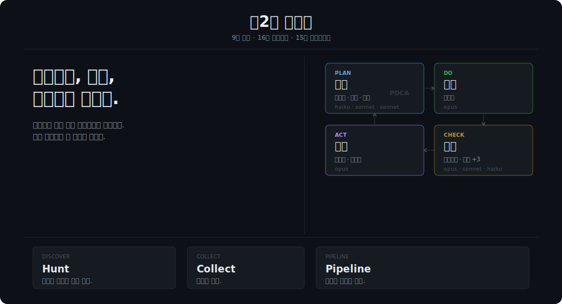
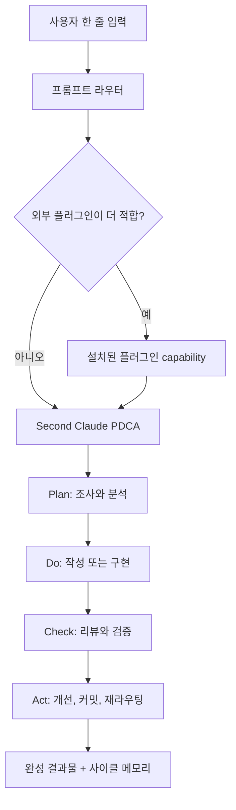
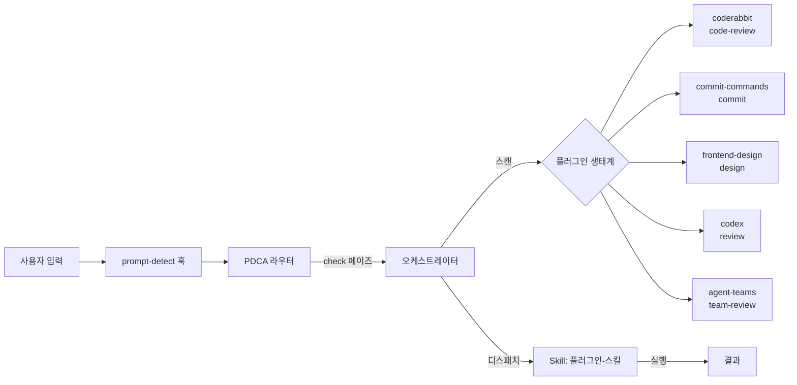
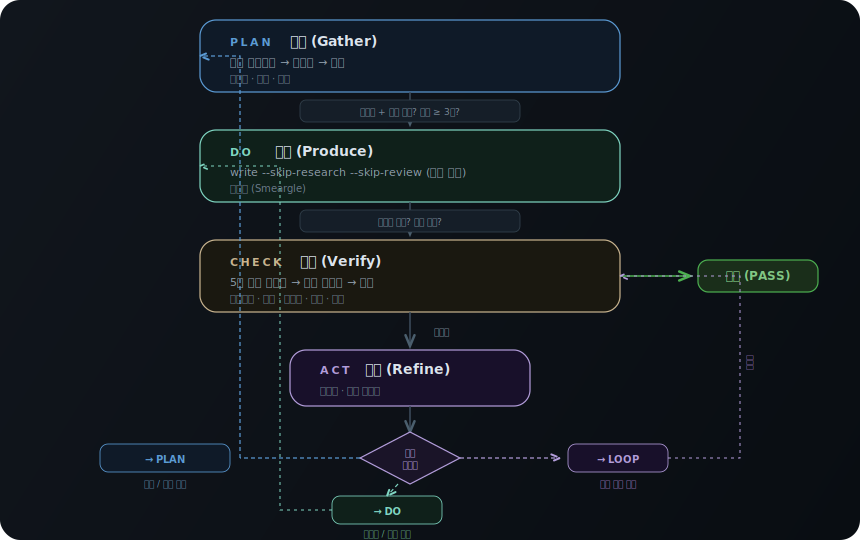
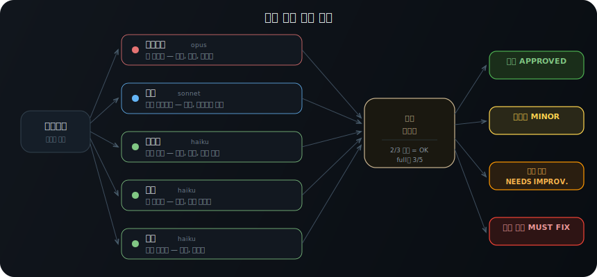
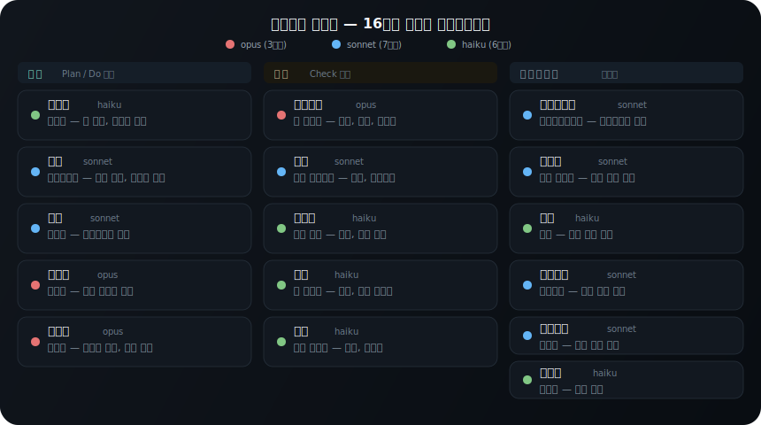

[English](README.md) | **한국어**


---

# Second Claude Code — 제2의 클로드

"AI 에이전트 알아보고 보고서 써줘."

이 한 줄을 치면 이브이가 웹을 뒤져요. 후딘이 패턴을 잡아요. 루브도가 3,000자를 쓰는데 — 저한테 오기도 전에 리뷰어 다섯 마리가 이미 초안을 뜯고 있어요. 네이티오가 논리를 보고, 앱솔이 약점을 치고, 폴리곤이 숫자를 검증해요.

무슨 일이 일어난 걸까요? **한 줄 입력. 전체 사이클. 플러그인 세 개 붙여놓고 기도하는 게 아니에요.**

[](https://www.scenesteller.com/studio/share/G2vdkxkjpj)
<sub>[SceneSteller](https://www.scenesteller.com/studio/share/G2vdkxkjpj)로 제작</sub>



[아키텍처](docs/architecture.ko.md) · [Architecture](docs/architecture.md) · [사용 매뉴얼](docs/notion-manual.ko.md) · [User Manual](docs/notion-manual.md) · [스킬 가이드](docs/skills/) · [GitHub Issues](https://github.com/unclejobs-ai/second-claude-code/issues) · [English README](README.md)

---

## 한눈에 보는 구조



Second Claude Code는 제어 루프입니다. v1.4.0 오케스트레이터는 그 루프 앞에서 설치된 플러그인이 더 적합한 경우 먼저 실행되도록 길을 터줍니다.

---

## v1.4.0에서 달라진 점

**크로스-플러그인 오케스트레이터** — 이제 Second Claude Code가 당신의 Claude Code에 설치된 *모든* 플러그인을 실시간으로 찾아내고 명령합니다.

"코드 리뷰해줘"라고 입력하면? Prompt-detect 훅이 의도를 포착합니다. 오케스트레이터가 실시간으로 플러그인 생태계를 스캔하고 `coderabbit`이 설치된 걸 감지합니다. 자체 리뷰를 돌리는 대신 자동 디스패치: `Skill: coderabbit-code-review`. "커밋해줘" → `commit-commands` 발견 → `/commit-commands:commit` 즉시 라우팅. "posthog event analysis"처럼 특정 플러그인 의도가 강하면 설치된 PostHog 스킬 `Skill: posthog-exploring-autocapture-events`가 먼저 잡힙니다.

하드코딩된 레지스트리 없음. 수동 플러그인 연결 없음. 설정 파일 없음. 오케스트레이터가 런타임에 플러그인을 탐지하고, 각각을 적절한 PDCA 페이즈(Plan/Do/Check/Act)에 매핑하고, 정확한 Skill 도구 호출 문자열을 생성합니다. 플러그인 설치 → 자동 등장. 삭제 → 자동 사라짐. 유지보수 제로.



- **MCP 도구 4종 신규** — `orchestrator_list_plugins`, `orchestrator_get_plugin`, `orchestrator_route`, `orchestrator_health`
- **런타임 플러그인 탐지** — 세션 시작 시 `~/.claude/plugins/` 스캔, 파일시스템에서 capability map 자동 구축 (설정 불필요)
- **동적 디스패치 가이드** — `prompt-detect`가 실시간 플러그인 라우팅 테이블과 정확한 `Skill:` / 슬래시 커맨드 호출 문자열을 주입
- **PDCA 페이즈 자동 라우팅** — plan → `claude-mem-knowledge-agent`, do → `frontend-design-frontend-design`, check → `coderabbit-code-review`, act → `/commit-commands:commit`
- **직접 플러그인 매칭 라우팅** — 설치된 플러그인 스킬/커맨드와 강하게 맞는 자연어 프롬프트는 자체 처리보다 외부 capability를 먼저 호출
- **소울 피드백 바인딩** — 시각적 진행 게이지, git shipping 메트릭(`soul_retro`), synthesis 준비도, retro 트렌드 감지
- **367개 테스트** (366개 통과, 0개 실패, 1개 스킵) — 실제 14개 플러그인 / 67개 스킬 / 3개 MCP 서버로 검증 완료

전체 릴리스 노트와 검증 요약은 `docs/RELEASE-v1.4.0.ko.md` 참고.

> **이전 v1.3.0에서는...**

**PDCA 하드 게이트** — 길이 floor, 리뷰어 다양성, 보정된 5+ 룰. v1.1.0과 v1.2.0은 Artifact Viewer UI를 PDCA의 기존 soft gate 위에 얹었어요. v1.3.0은 그 게이트 자체의 구조적 구멍을 9개 구체 강화로 막았고, 전부 실제 generic 토픽 사이클에서 end-to-end 검증했습니다.

- **PDCA가 메인 오케스트레이터, sub-skill은 빌딩 블록** — 아키텍처 명확화. `/threads`, `/newsletter`, `/academy-shorts`, `/card-news`는 PDCA의 **Do 페이즈 안에서 디스패치**돼요 (각자의 내부 페이즈가 Do 안에서 돌아감). PDCA를 대체하는 게 아닙니다. PDCA의 Check는 sub-skill 내부 리뷰가 끝난 뒤에도 외부 시각으로 한 번 더 돌아가요
- **도메인 자동 라우팅 (greedy)** — Do 페이즈가 사용자 프롬프트를 도메인 트리거 키워드와 매칭해서 가장 specialized한 sub-skill을 디스패치해요. "스레드" → `/threads`, "뉴스레터" → `/newsletter`, "쇼츠" → `/academy-shorts`, "카드뉴스" → `/card-news`, 그 외 → `/second-claude-code:write`
- **포맷별 길이 floor** — Do 게이트가 아티팩트가 포맷 최소치 미달이면 통과 안 시켜요. 스레드 아티클 ≥ 4,000자. 뉴스레터 ≥ 10,000자. 전략 리포트 ≥ 5,000자. Floor 미달 = sub-skill이 구체 scope expansion 지시와 함께 다시 디스패치, vague한 "더 길게 써" 금지
- **Plan brief floor** — Source 최소를 3 → 5로 올렸고, 새 minimum 추가: 사실 8개, named-source 인용 1개, 비교표 1개, 알려진 빈틈 1개, 미디어 1개, 본문 3,000자. Thin Plan → thin Do 실패 체인 차단
- **리뷰어 모델 다양성 룰 (false consensus 감지 포함)** — Check 페이즈가 content/strategy/full preset에 distinct 모델 2개 이상 + 외부 모델(Codex, Kimi, Qwen, Gemini, Droid) 1개 이상을 강제. Diversity score ≥ 0.6. 모든 리뷰어가 평균 0.9 초과 + critical 0개로 APPROVED를 반환하면 사용 안 한 외부 모델로 adversarial pass가 자동 디스패치돼서 Goodhart 스타일 "다들 괜찮대" 거짓 신호를 잡아요
- **5+ 룰 (보정된 AND 로직)** — Patch vs full rewrite 트리거. (a) any P0 finding OR (b) `p0+p1 ≥ 5` AND finding이 ≥ 3개 카테고리에 걸침일 때 발동. 초기 OR 로직이 surgical 4-finding patch set에서 over-trigger한 걸 실제 검증에서 발견하고 즉시 보정. 새 로직 6/6 routing 정확도 vs 이전 OR 3/6
- **새 284줄 `domain-pipeline-integration.md`** — Sub-skill 입출력 계약, 실패 처리(4가지 모드), 인접 페이즈와의 통합 지점 표준화
- **포켓몬 역할 라벨 명확화** — Eevee/Smeargle/Xatu 등은 conceptual role이지 직접 `Agent` 도구 dispatch target이 아닙니다. 실제 subagent dispatch는 `/second-claude-code:research`, `/second-claude-code:write`, `/second-claude-code:review`, `/second-claude-code:refine` 안에서 일어나요. 이전 실패 모드(포켓몬 이름이 dispatch 안 돼서 오케스트레이터가 셀프 처리로 fallback)가 이제 구조적으로 불가능
- **확장된 페이즈 출력 스키마** — `PlanOutput`, `DoOutput`, `CheckOutput` 모두 측정 가능한 검증 필드를 갖게 됐어요 (`meets_length_floor`, `diversity_score`, `false_consensus_check_passed` 등). PDCA가 sub-skill self-report를 신뢰하지 않고 독립 검증

**검증 (2026-04-07)**: generic 토픽으로 실제 PDCA 사이클 돌렸을 때 7,981자 Plan brief (floor 3,000), 6,962자 Do 아티클 (floor 4,000), 12개 출처 인용 (floor 5), Codex 포함 2 리뷰어 (diversity score 1.0), pre-v1.3.0 baseline에서는 놓쳤을 4개 P1 findings 발견. 전체 검증 리포트는 `docs/RELEASE-v1.3.0.ko.md` 참고.

<details>
<summary><strong>v1.2.0에서 달라진 점</strong></summary>

- **Dashboard 아티팩트** — KPI 카드, 차트, 마크다운을 조합한 grid layout(`2x2`, `3x1`, `1x2`) 아티팩트 타입
- **KPI 카드 컴포넌트** — 큰 숫자 + 변화율 지표, 색상 구분(초록/빨강/회색), 추세 화살표
- **Grid layout 시스템** — 아티팩트를 single-column 스택이 아닌 반응형 grid에 배치
- **페이즈 프리뷰 카드** — 타임라인 뷰에서 각 페이즈의 아티팩트 썸네일 요약
- **차트 + 마크다운 동시 표시** — 탭 전환 없이 나란히 렌더링
- **`ui/src` 전체 소스 코드** — Vite + React + TypeScript 프로젝트로 pre-built 번들 교체, 13 컴포넌트 × 4 디렉토리, Shiki lazy loading (번들 1MB → 262KB)

</details>

<details>
<summary><strong>v1.1.0에서 달라진 점</strong></summary>

- **Artifact Viewer** — PDCA 파이프라인 결과물을 로컬 웹 UI로. 마크다운, 레이더/바/파이 차트(Nivo), 플로우 다이어그램(SVG), 코드 하이라이팅(Shiki) 4가지 타입. WebSocket 실시간 연결
- **Viewer 스킬** — `/second-claude-code:viewer`로 뷰어 시작, 30분 비활동 시 자동 종료
- **반응형 레이아웃** — 데스크톱(768px+) 좌우 스플릿 패널, 모바일(<768px) 드래그 바텀 시트
- **Zero-dependency 서버** — Node.js HTTP + WebSocket with SPA fallback, RFC 6455 frame encoding, path traversal prevention

</details>

<details>
<summary><strong>v1.0.0에서 달라진 점</strong></summary>

- **PDCA 사이클 메모리** — 사이클이 끝나도 기억이 남아요. `.data/cycles/`에 페이즈별 마크다운, 이벤트 로그, 메트릭이 구조화돼서 저장돼요
- **MCP 도구 3개 추가** — `pdca_get_cycle_history`, `pdca_save_insight`, `pdca_get_insights`가 들어와서 전체 **24개** 도구 표면이 됐어요
- **4개 도메인 전체에 스테이지 계약** — `config/stage-contracts.json`이 4개 도메인 × 4개 페이즈 전부에 I/O 계약, DoD, 롤백 대상을 정의해요
- **테스트 323개** — `322`개 통과, `1`개 스킵, 실패 `0`개
- **사이클 메모리 하드닝** — 경로 순회 방지, 깨진 JSON 복구, critical-only gotcha 트리거

</details>

<details>
<summary><strong>v0.9.0에서 달라진 점</strong></summary>

- **테스트 기준선 정리** — 현재 검증 기준은 총 `323`개, `322`개 통과, `1`개 스킵, 실패 `0`개예요
- **도메인 기반 PDCA 시작** — `pdca_start_run`이 이제 `domain` 파라미터(`code`, `content`, `analysis`, `pipeline`)를 받아요. 첫 페이즈부터 도메인별 전문화된 스테이지 계약을 강제할 수 있어요
- **15개 스킬 전부 가드레일 강화** — 모든 스킬에 Iron Laws + Red Flags가 들어갔고, `hooks/lib/fact-checker.mjs`가 숫자 주장 검증까지 맡아요
- **품질 게이트가 더 정확해졌어요** — `config/stage-contracts.json` 기반의 도메인별 계약(code vs content), `Math.round` 기반 2/3 합의 보정, score + vote 듀얼 게이트, 프리셋별 threshold가 실제 전환 로직에 반영돼요
- **PDCA 결정이 3갈래가 됐어요** — `pdca_transition`이 이제 `PROCEED`, `REFINE`, `PIVOT`를 구분하고, refine/pivot 최대 횟수로 무한루프를 막아요
- **세션 끝나면 시각화까지 남아요** — 터미널 ANSI 요약 박스가 뜨고, `.data/reports/`에 Mermaid + Chart.js 기반 다크 테마 HTML 리포트가 자동 생성돼요
- **루프와 리뷰 러너가 더 단단해졌어요** — File Mutation Queue, MAD confidence scoring, cost/time budget 제한, iterative compaction으로 레이스와 장기 세션 손실을 줄였어요
- **MMBridge와 관측성도 강화됐어요** — optional `mmbridge` MCP 등록, Adapter Protocol(`Cli`, `Stub`, `Recording`), MetaClaw PRM effectiveness tracker가 추가됐어요

</details>

---

## 설치 후 첫 5분

처음이라면 이 순서대로 따라와주세요. 5분이면 충분해요.

**1단계. 설치**

터미널에서 이 명령어를 입력하세요:

```bash
claude plugin add github:unclejobs-ai/second-claude-code
```

설치가 끝나면 `Plugin installed successfully` 메시지가 나와요.

**2단계. 설치 확인**

새 세션을 열어보세요. 화면 상단에 이런 텍스트가 보이면 정상이에요:

```
# Second Claude Code — 제2의 클로드
15 commands and 15 skills for all knowledge work:
```

이 텍스트가 안 보이면 `claude plugin list`를 실행해서 목록에 `second-claude-code`가 있는지 확인해주세요. 목록에 없으면 1단계를 다시 진행하면 돼요.

**3단계. 첫 프롬프트 입력**

보통 이렇게 시작해요:

```
AI 에이전트 프레임워크 현황을 조사하고 보고서를 써줘
```

자동 라우터가 맞는 스킬을 골라줘요. 슬래시 명령어를 외울 필요 없어요. 영어도 돼요:

```
Research AI agent frameworks and write a report
```

**4단계. 결과 확인**

프롬프트를 입력하면 다음 순서로 진행돼요:

1. 리서치 에이전트(이브이, 부엉)가 소스를 수집해요
2. 분석 에이전트(후딘)가 패턴을 정리해요
3. 글쓰기 에이전트(루브도)가 초안을 써요
4. 리뷰어 5마리가 초안을 검토해요
5. 최종본이 나와요

진행 중에 `[Plan]`, `[Do]`, `[Check]`, `[Act]` 같은 페이즈 표시가 보이면 정상이에요. 전체 과정은 주제 난이도에 따라 2~5분 정도 걸려요.

이게 어떻게 돌아가는 걸까요?

---

## 빠른 시작: 메모리가 있는 첫 PDCA 사이클

v1.0.0부터 PDCA 사이클이 **기억**해요. 이전 사이클에서 뭘 배웠는지 다음 사이클이 알아요.

**첫 번째 사이클 — 그냥 돌려요:**

```
AI 에이전트 프레임워크를 조사하고 보고서를 써줘
```

사이클이 끝나면 `.data/cycles/cycle-001/`에 이런 파일이 남아요:

```
.data/cycles/cycle-001/
├── plan.md       ← Plan 페이즈 산출물
├── do.md         ← Do 페이즈 산출물
├── check.md      ← Check 결과 (리뷰어 소견)
├── act.md        ← Act 결정 (PROCEED/REFINE/PIVOT)
├── events.jsonl  ← 페이즈 전환 이벤트 로그
└── metrics.json  ← 점수, 시간, 비용 메트릭
```

**인사이트 저장 — 배운 걸 기록해요:**

사이클 도중이나 끝나고 이렇게 말하면:

```
이번 사이클에서 배운 점: 리서치 소스가 3개 미만이면 보고서 품질이 떨어진다
```

시스템이 `pdca_save_insight`를 호출해서 `.data/cycles/insights.json`에 기록해요. 카테고리(`process`, `technical`, `quality`)와 심각도(`info`, `warning`, `critical`)가 자동 분류돼요.

**두 번째 사이클 — 이전 기억이 작동해요:**

```
이번엔 멀티모달 AI 에이전트에 집중해서 보고서를 써줘
```

Plan 페이즈 시작 전에 시스템이 `pdca_get_insights`를 호출해서 이전 인사이트를 읽어요. "리서치 소스가 3개 미만이면 품질이 떨어진다"는 교훈이 있으니까, 이번엔 소스를 더 많이 확보하려고 해요. 이게 **Read-Before-Act** 패턴이에요.

**critical 인사이트가 3번 반복되면?**

같은 critical 인사이트가 3번 이상 기록되면 `.data/proposals/gotchas-{category}.md`에 gotcha 제안이 자동으로 생성돼요. "이 실수 또 했어요. 체크리스트에 넣을까요?" 같은 거예요. 이게 **Self-Evolution**이에요.

**시간 감쇠:**

인사이트는 30일에 걸쳐 가중치가 1.0에서 0.0으로 떨어져요. 오래된 교훈은 자연스럽게 영향력이 줄어들어요. `min_weight` 파라미터로 너무 오래된 인사이트를 필터링할 수 있어요.

---

## 이게 어떻게 돌아가는 걸까요?

### PDCA 흐름

```
나: "AI 에이전트 알아보고 보고서 써줘"

[Plan]  이브이 + 부엉 20개 이상 소스를 크롤링, 후딘이 합성
        ↓ 게이트: 리서치 브리프 없으면 집필 시작 안 됨
[Do]    루브도가 리서치 기반으로 전체 초안 작성
        ↓ 게이트: 초안은 저한테 안 오고 리뷰로 감
[Check] 리뷰어 5마리가 병렬로 — 논리, 팩트, 톤, 구조, 약점
        ↓ 게이트: score + vote 듀얼 게이트 + stage contract를 통과해야 승인
[Act]   액션 라우터가 피드백을 읽어요:
        → 거의 됐는데 다듬기 필요? REFINE.
        → 지금 페이즈가 틀렸거나 접근이 어긋남? PIVOT.
        → 조건 충족? PROCEED.

최종본이 저한테 와요. 리뷰 끝. 팩트체크 끝. 정제 끝.
```



---

### PDCA 사이클 메모리

v1.0.0의 핵심이에요. PDCA가 이제 **기억하는 사이클**이 됐어요.

#### 저장 구조

```
.data/cycles/
├── cycle-001/
│   ├── plan.md         ← 각 페이즈 산출물 (zero-context: 이 파일만 봐도 이해 가능)
│   ├── do.md
│   ├── check.md
│   ├── act.md
│   ├── events.jsonl    ← 페이즈 전환, 게이트 결정 등 이벤트 스트림
│   └── metrics.json    ← 점수, 시간, 비용
├── cycle-002/
│   └── ...
└── insights.json       ← 사이클 간 축적되는 인사이트
```

**트랜지션/종료 시 자동 저장:** 페이즈가 전환되거나 사이클이 끝나면 해당 페이즈의 마크다운과 이벤트가 자동으로 저장돼요. 별도 명령 필요 없어요.

#### Read-Before-Act

새 사이클이 시작되면 Plan 페이즈 진입 전에 이전 인사이트를 읽어요. 스테이지 계약의 DoD에도 "Previous cycle insights reviewed (if not first cycle)"이 들어가 있어요. 과거의 실수를 반복하지 않게 하는 구조예요.

#### Self-Evolution

인사이트에는 카테고리(`process`, `technical`, `quality`)와 심각도(`info`, `warning`, `critical`)가 붙어요.

- **30일 시간 감쇠** — 가중치가 `1.0 → 0.0`으로 선형 감소해요. 오래된 교훈은 자연스럽게 퇴색돼요
- **gotchas 자동 제안** — 같은 critical 인사이트가 **3번 이상** 반복되면 `.data/proposals/gotchas-{category}.md`에 제안서가 자동 생성돼요 (기존 파일에 append, 덮어쓰기 안 해요)
- **필터링** — `min_weight`로 너무 오래된 인사이트를 걸러내고, `category`로 도메인별 인사이트만 볼 수 있어요

사이클을 돌릴수록 시스템이 똑똑해져요. 첫 번째 사이클보다 다섯 번째 사이클이 더 나아요.

---

### 도메인 인식 PDCA

`pdca_start_run`에 `domain` 파라미터를 넘기면 해당 도메인에 맞는 스테이지 계약이 적용돼요. 4개 도메인이 있어요:

| 도메인 | 용도 | 예시 |
|---|---|---|
| `code` | 코드 작성/리팩터링 | "이 모듈을 리팩터링해줘" |
| `content` | 글쓰기, 보고서 | "AI 에이전트 보고서를 써줘" |
| `analysis` | 데이터 분석, 전략 분석 | "시장 SWOT 분석을 해줘" |
| `pipeline` | 멀티스텝 워크플로우 | "리서치→분석→작성 파이프라인을 돌려줘" |

#### 페이즈별 Stage Contract 예시

`config/stage-contracts.json`이 도메인 × 페이즈 조합마다 계약을 정의해요:

**Plan 페이즈:**

| 도메인 | DoD (완료 기준) |
|---|---|
| `code` | 요구사항이 테스트 가능한 태스크로 분해됨, 태스크별 복잡도 추정치 |
| `content` | 대상 독자 정의됨, 섹션별 분량 추정이 포함된 콘텐츠 아웃라인 |
| `analysis` | 분석 질문과 가설이 명확, 데이터 소스 식별 및 접근 가능 |
| `pipeline` | 파이프라인 스테이지가 I/O 계약과 함께 열거됨, 순환 의존성 없음 |

**Do 페이즈:**

| 도메인 | DoD (완료 기준) |
|---|---|
| `code` | 코드 컴파일/파스 에러 없음, 새 코드에 테스트 있음, lint 경고 없음 |
| `content` | 초안이 plan.md 요구사항을 커버, 독자 수준에 맞는 가독성, 목표 분량 ±10% |
| `analysis` | 데이터 수집 및 검증 완료, 분석 방법론 일관 적용, 중간 결과 재현 가능 |
| `pipeline` | 각 스테이지의 출력이 다음 스테이지 입력 스펙에 맞음 |

모든 도메인의 모든 페이즈에 **rollback target**이 정의돼 있어요. Check에서 문제가 나오면 Do로, Do에서 문제가 나오면 Plan으로 돌아가요. 도메인 지정 없이 시작하면 `content`가 기본값이에요.

---

### 에이전트 시스템

17마리 에이전트가 3개 모델 티어로 나뉘어요. 전부 opus로 돌리면 비용이 올라가요. 역할에 맞게 배분했어요.

- **opus(4마리)** — 깊은 추론과 글쓰기가 필요한 자리. 네이티오(딥리뷰), 루브도(집필), 메타몽(편집), 피카츄(소울 키퍼)
- **sonnet(9마리)** — 분석, 전략, 리서치, 인프라 실행. 이브이(리서처), 후딘(애널리스트), 뮤츠(전략가), 앱솔(데빌어드보킷), 폴리곤(팩트체커), 아르세우스, 괴력몬, 자포코일, 테오키스
- **haiku(4마리)** — 검색, 톤, 구조 같은 고빈도 작업. 부엉, 푸린, 안농, 캐이시

PDCA 페이즈별로 어떤 에이전트가 뛰는지 보면 이래요:

```
사용자 프롬프트
  ↓
자동 라우터 (훅: prompt-detect.mjs)
  ↓
PDCA 오케스트레이터
  ├── Plan: 이브이(sonnet) 리서치 → 후딘(sonnet) 분석
  ├── Do:   루브도(opus) 전체 초안 작성
  ├── Check: 리뷰어 5마리 병렬 실행
  │          네이티오(opus) ── 논리 + 완결성
  │          앱솔(sonnet) ─── 약점 공격
  │          폴리곤(sonnet) ─ 팩트체크
  │          푸린(haiku) ──── 톤
  │          안농(haiku) ──── 구조
  └── Act:  액션 라우터 → 메타몽(opus) 편집
```

각 에이전트는 전용 시스템 프롬프트와 제한된 도구 셋을 가진 서브에이전트예요. 하나가 뻗어도 다른 에이전트에 영향 안 가요.

포켓몬 이름을 쓰는 이유가 있어요. 디버깅할 때 "네이티오가 논리 빈틈 발견"이 "reviewer-3가 이슈 발견"보다 추적하기 쉬워요. 이름이 역할이랑 맞아떨어지면 머릿속에서 정리가 돼요.

---

### 품질 게이트

리뷰어마다 구조화된 JSON을 출력해요:

```json
{
  "score": 0.82,
  "verdict": "APPROVED",
  "findings": [
    { "severity": "Warning", "location": "3섹션", "note": "데이터 출처 없음" },
    { "severity": "Nitpick", "location": "도입부", "note": "문장 길이 불균형" }
  ]
}
```

합의 기준은 이제 두 줄로 봐야 해요:

- **점수 게이트** — 프리셋마다 최소 score threshold가 있어요
- **투표 게이트** — 프리셋마다 최소 pass vote가 있어요

여기에 `Math.round` 보정이 들어가서 `2/3` 프리셋이 더 이상 `3/3`처럼 동작하지 않아요. 리뷰어 3명이면 2명이 통과시켜도 돼요. 대신 **Critical 소견은 점수와 투표를 무시하고 바로 차단**해요.

**Stage Contracts:** `config/stage-contracts.json`이 code 작업과 content 작업을 구분해서 페이즈별 출구 조건을 다르게 잡아요. v1.0.0에서는 `analysis`와 `pipeline` 도메인까지 확장됐어요. 그래서 같은 PDCA라도 코드 리뷰, 보고서 리뷰, 데이터 분석 리뷰가 각각 다른 기준으로 판정돼요.

**전환 결과는 세 가지예요:**

- **PROCEED** — 점수, 투표, 계약 조건을 다 통과해서 다음 페이즈로 가요
- **REFINE** — 산출물은 맞는데 디테일이 부족해서 제한된 재작업을 돌려요
- **PIVOT** — 문제의 원인이 현재 페이즈가 아니라서 Plan/Do 같은 다른 페이즈로 방향을 틀어요

게이트는 PDCA 매 페이즈 사이에 있어요. 리서치 브리프가 통과해야 집필이 시작되고, 초안이 게이트를 통과해야 저한테 와요. 급하다고 건너뛸 수 없어요 — 의도적 설계예요.

**Definition of Done (DoD):** `refine` 스킬에 `--dod`를 쓰면 성공 기준을 체크리스트로 정의할 수 있어요 (예: `"팩트 오류 없음; 모든 섹션에 예시"`). 리뷰어가 매 라운드 기준별 PASS/FAIL을 평가하고, 에디터는 FAIL 기준을 우선 수정해요. 모든 DoD 기준이 PASS이고 판정 목표도 충족해야 종료돼요.

---

### 훅 시스템

8개 라이프사이클 훅이 PDCA를 지탱해요:

| 훅 | 하는 일 |
|---|---|
| **SessionStart** | 배너 출력 + 상태 초기화 |
| **UserPromptSubmit** | 자동 라우터 — 외부 플러그인 디스패치 + PDCA 복합 패턴 + 단일 스킬 패턴 |
| **SubagentStart** | 리뷰 세션 컨텍스트 주입 — 에이전트 생성 시 이전 리뷰 결과를 자동으로 넘겨줘요 |
| **SubagentStop** | 리뷰어 합의 집계 |
| **Stop** | 세션 정리 |
| **StopFailure** | Check 페이즈 품질 게이트 강제 — 게이트 미통과 시 프로세스 중단 |
| **PreCompact** | 컨텍스트 압축 전 PDCA 상태 직렬화 |
| **PostCompact** | 압축 후 상태 복원 — 긴 세션에서도 사이클 연속성을 유지해요 |

UserPromptSubmit 훅이 라우팅을 담당해요. 먼저 `getDispatchPlan()`으로 설치된 외부 플러그인 capability를 확인합니다. 강한 외부 매칭이 있으면 `[ORCHESTRATOR]` 컨텍스트를 주입해서 해당 Skill/command를 자체 처리보다 먼저 호출하게 해요. 외부 매칭이 없으면 "AI 에이전트 알아보고 보고서 써줘" 같은 PDCA 복합 패턴, 그다음 단일 스킬 패턴으로 내려갑니다. 그래서 "posthog event analysis"는 PostHog 플러그인이 설치되어 있을 때 외부 스킬로 가고, "AI 에이전트 알아보고 보고서 써줘"는 여전히 PDCA로 갑니다. 라우팅 결정에는 **신뢰도 점수(confidence scoring)**가 포함돼요 — 수정 사항은 소울 관찰로 캡처되어 장기 학습에 반영돼요.

---

### 시각화

세션이 끝나면 운영자 시점에서 두 가지가 바로 보여요:

- 터미널에는 ANSI 요약 박스
- 디스크에는 `.data/reports/` 아래 HTML 리포트

예시는 이런 느낌이에요:

```text
┌──────────────── PDCA 요약 ─────────────────┐
│ Cycle 2   Verdict: REFINE   Confidence: STRONG │
│ Phases: Plan ✓  Do ✓  Check !  Act ↺          │
│ Votes: 2/3  Score: 0.74  Time: 4m  Cost: $0.41 │
│ Report: .data/reports/cycle-2.html            │
└──────────────────────────────────────────────┘
```

HTML 리포트는 다크 테마고, Mermaid 플로우와 Chart.js 추세 그래프가 같이 들어가요. 터미널 출력이 사라져도 나중에 다시 볼 수 있는 게 포인트예요.

---

### MCP 상태 레이어

`pdca-state` MCP 서버(stdio 방식, `mcp/lib/` 핸들러 모듈로 모듈화)가 세션 간 상태와 플러그인 오케스트레이션을 관리해요. 전체 표면은 **31개 도구**예요.

**코어 PDCA 도구 (7개):**

| 도구 | 하는 일 |
|---|---|
| `get` | 현재 PDCA 상태 조회 |
| `start` | 새 사이클 시작 (`domain` 파라미터로 도메인 지정 가능) |
| `transition` | 페이즈 전환 (`auto_gate` 자동 평가 포함) |
| `check_gate` | 품질 게이트 판정 |
| `list_runs` | PDCA 실행 이력 조회 |
| `end` | 사이클 종료 |
| `update_stuck` | 막힌 상태 강제 해소 |

**사이클 메모리 도구 (3개, v1.0.0 신규):**

| 도구 | 하는 일 |
|---|---|
| `pdca_get_cycle_history` | 특정 사이클 또는 최근 N개 사이클의 전체 기록 조회 — 페이즈별 마크다운, 메트릭 포함 |
| `pdca_save_insight` | 인사이트 저장 — 카테고리(`process`/`technical`/`quality`), 심각도(`info`/`warning`/`critical`) 분류. critical 3회 반복 시 gotcha 자동 제안 |
| `pdca_get_insights` | 인사이트 조회 — 30일 시간 감쇠 가중치 적용, 카테고리/최소 가중치로 필터링 |

나머지 도구는 soul, project memory, daemon control, session recall, analytics, plugin orchestration 표면에 걸쳐 있어요.

**오케스트레이터 도구 (4개, v1.4.0 신규):**

| 도구 | 하는 일 |
|---|---|
| `orchestrator_list_plugins` | 설치된 플러그인의 스킬, 커맨드, MCP 서버, 에이전트 인벤토리 조회 |
| `orchestrator_get_plugin` | 특정 플러그인의 발견된 capability 상세 조회 |
| `orchestrator_route` | 키워드 또는 PDCA 페이즈에 맞는 `Skill:` / 슬래시 커맨드 디스패치 후보 반환 |
| `orchestrator_health` | 플러그인 생태계 준비 상태 요약 |

이벤트 소싱 방식으로 동작해요. 모든 PDCA 사이클이 로그로 남아요 — 페이즈 전환, 게이트 결정, 리뷰 점수, 액션 라우팅. 세션이 중간에 죽어도 마지막 체크포인트부터 재개해요. PreCompact/PostCompact 훅이 컨텍스트 압축 시에도 상태를 보존해요.

Playwright MCP는 선택 옵션이에요. JavaScript 기반 페이지가 대상인 리서치에서 이브이가 이걸 써요.

---

## 이게 해결하는 문제

AI로 글 쓰고, 리서치하고, 분석해요. 꽤 잘 돼요. 저도 몇 달을 그렇게 썼어요 — 프롬프트 치고, 결과 복사하고, 다음 프롬프트에 붙여넣고, 피드백 달라고 따로 요청하고, 수정 사항을 손으로 반영하고.

문제는 이거예요. 각 도구가 따로 놀아요. 리서치가 글쓰기를 모르고, 글쓰기가 리뷰를 몰라요. 그 사이를 잇는 건 전부 제 손이에요. 콘텐츠 하나에 컨텍스트 스위칭 다섯 번.

Second Claude Code는 그걸 고쳐요. 도구 모음이 아니라 제2의 클로드예요. 혼자 알아서 단계를 밟고, 실수를 스스로 잡고, 리뷰 안 거친 건 내보내지 않아요.

---

## 이런 상황에서 쓰세요

어떤 상황에서 Second Claude Code가 빛을 발하는지, 실전 시나리오 다섯 가지를 정리했어요.

### 시장 조사 보고서가 급할 때

내일까지 "AI 에이전트 시장 현황" 보고서를 내야 하는데, 소스 찾고 정리할 시간이 없어요.

```
AI 에이전트 시장을 조사하고, 주요 플레이어 비교와 트렌드 분석을 포함한 보고서를 써줘
```

20개 이상 소스를 크롤링하고, 패턴을 분석하고, 리뷰까지 거친 보고서가 나와요. 소스 목록도 같이 달려요.

### 경쟁사 SWOT 분석이 필요할 때

전략 회의 준비인데, 경쟁사 분석을 프레임워크에 맞춰서 정리해야 해요.

```
/second-claude-code:analyze swot "우리 회사의 SaaS 제품 vs 경쟁사 3개"
```

15개 내장 프레임워크(SWOT, Porter, RICE 등) 중 맞는 걸 골라서 구조화된 분석 결과를 줘요. 프레임워크를 직접 지정할 수도 있고, 주제만 던지면 자동으로 골라줘요.

### 뉴스레터/블로그를 매주 써야 할 때

매주 뉴스레터를 쓰는데, 매번 리서치부터 초안, 퇴고까지 반나절이 걸려요.

```
이번 주 AI 뉴스레터를 써줘. 주제: 멀티모달 에이전트의 부상. 독자층: 테크 리더
```

리서치 → 작성 → 리뷰 → 정제까지 한 번에 돌아가요. 매주 같은 패턴이면 `workflow`로 저장해두면 다음부턴 주제만 바꿔서 돌리면 돼요.

### 기존 초안을 제출 전에 검증할 때

보고서 초안은 다 썼는데, 논리 빈틈이나 팩트 오류가 없는지 확인하고 싶어요.

```
이 초안을 리뷰해줘. 외부 발표용이라 꼼꼼하게.
```

리뷰어 5마리가 논리, 팩트, 톤, 구조, 약점을 병렬로 검토해요. 2/3 통과 기준으로 승인 여부가 나오고, Critical 소견이 있으면 구체적인 수정 포인트를 알려줘요.

### 반복 워크플로우를 자동화할 때

"리서치 → 분석 → 초안 → 리뷰"를 매번 같은 순서로 돌리는데, 매번 프롬프트를 새로 치기 귀찮아요.

```
/second-claude-code:workflow run autopilot --topic "이번 달 업계 트렌드 리포트"
```

한 번 세팅해두면 주제만 바꿔서 돌릴 수 있어요. 커피 마시고 돌아오면 완성된 결과물이 기다리고 있어요.

---

## 스킬 고르기

단계니 사이클이니 신경 쓸 필요 없어요. 하고 싶은 말만 하면 돼요.

글감이 잡히면 `write` 하나면 충분해요. 초안이 이미 있으면 `review`로 다섯 관점에서 피드백을 받아요. 리서치부터 퍼블리싱까지 전부 돌리고 싶으면 `pdca`가 알아서 해요.

다음 작업에 뭘 쓸까요?

| 하고 싶은 것 | 스킬 | 결과물 |
|---|---|---|
| 리서치→작성→리뷰→개선 전체 사이클 | `pdca` | 조사하고 쓰고 검증한 글 — 프롬프트 하나로 |
| 주제 파기 | `research` | 20개 이상 소스 크롤링, 패턴 분석, 브리프 |
| SWOT, Porter, RICE 등 15개 프레임워크 | `analyze` | 구조화된 전략 분석 |
| 아티클, 보고서, 뉴스레터 | `write` | 리서치 + 초안 + 리뷰가 한 명령어로 |
| 3~5명 관점에서 초안 리뷰 | `review` | 병렬 리뷰 + 합의 투표 |
| 목표 점수까지 다듬기 | `refine` | 리뷰어가 통과할 때까지 반복 — `--dod`로 성공 기준 체크리스트 지원 |
| 프롬프트 자산 벤치마크 최적화 | `loop` | 고정 스위트 기반 루프 + 격리 우승 브랜치 |
| URL, 메모, 발췌 저장 | `collect` | PARA 분류 기반 지식 캡처 |
| 여러 스킬을 워크플로우로 연결 | `workflow` | 커스텀 자동화 |
| 없는 스킬 찾아 설치 | `discover` | 새 스킬 탐색 및 설치 |
| 나를 기억하고 학습하게 | `soul` | 너를 이해하고 기억한다 |
| 영어↔한국어 번역 | `translate` | 소울 기반 EN↔KO 번역 — 스타일, 포맷, 용어집 지원 |
| 대형 작업을 병렬로 쪼개기 | `batch` | 대형 작업 병렬 분해 |

스킬은 전부 자연어로 반응해요. 정밀하게 쓰고 싶으면 슬래시 명령어도 돼요: `/second-claude-code:write`, `/second-claude-code:review`, `/second-claude-code:loop`, `/second-claude-code:workflow`, `/second-claude-code:discover` 등. 저는 반은 한국어, 반은 영어로 쓰는데 라우터가 알아서 처리해요. 트리거 패턴 총 ~130개.

### 유지보수자용 Karpathy-Style Loop

`loop`는 일반 사용자 자동 라우팅용이 아니라 유지보수자용 최적화 표면이에요. `skills/**/SKILL.md`, `commands/*.md`, `agents/*.md`, `templates/*.md` 같은 프롬프트 자산을 고정 벤치마크 스위트로 반복 평가하고, 우승 후보만 격리된 `codex/loop-...` 브랜치에 승급합니다.

보통은 이렇게 써요:

```bash
/second-claude-code:loop list-suites
/second-claude-code:loop show-suite write-core
/second-claude-code:loop run write-core --targets skills/write/SKILL.md,commands/write.md --parallel 2 --max-generations 2
```

실행 상태는 `.data/state/loop-active.json`에 저장되고, 점수표, 세대 히스토리, 우승 diff 같은 산출물은 `.captures/loop-<run_id>/`에 남습니다.

```
"AI 에이전트 알아보고 보고서 써줘"       →  pdca (전체 사이클)
"이 주제로 아티클 작성해"                →  write
"Analyze this market with SWOT"        →  analyze
"이 초안을 리뷰해"                      →  review
```

---

## 리뷰 시스템

글 쓰고 퍼블리시하고 나서 10분 뒤에 뻔한 실수를 발견한 적 있지 않나요?

대부분의 AI 글쓰기 도구는 생성하고 바로 넘겨요. Second Claude Code는 생성한 다음 **자기 결과물을 공격한 후에** 넘겨요. 차이가 여기에 있어요.

`/second-claude-code:review`는 전문 에이전트 3~5마리를 병렬로 투입해요:

| 리뷰어 | 포켓몬 | 모델 | 하는 일 |
|---|---|---|---|
| 딥리뷰어 | 네이티오 (Xatu) | opus | 논리, 완결성, 논증 흐름 |
| 데빌어드보킷 | 앱솔 (Absol) | sonnet | 가장 약한 지점을 찾아서 때려요 |
| 팩트체커 | 폴리곤 (Porygon) | sonnet | 숫자, 주장, 출처를 전부 검증해요 |
| 톤가디언 | 푸린 (Jigglypuff) | haiku | 어조 일관성, 독자 적합성 |
| 구조분석가 | 안농 (Unown) | haiku | 가독성, 구성 |

왜 포켓몬이냐고요? 이름이 역할이랑 맞아떨어져요. 네이티오는 과거와 미래를 동시에 보는 포켓몬이에요 — 구조적 결함을 잡아요. 앱솔은 재앙을 감지하는 포켓몬이에요 — 취약점을 찾아요. 폴리곤은 디지털 네이티브예요 — 데이터 기반으로 판단해요. 외우기 쉽고, 외우니까 누가 뭘 하는지 진짜로 기억하게 돼요.

**합의 게이트:** 2/3 통과하면 APPROVED. Critical이 하나라도 나오면 MUST FIX. 급하다고 예외 없어요.

저는 외부에 내보내는 건 `full`로 돌려요. 내부용 초안은 `quick`이면 충분해요 — 앱솔이랑 폴리곤이 심각한 문제는 1분 안에 잡아요.



<details>
<summary><strong>리뷰 프리셋</strong></summary>

| 프리셋 | 리뷰어 | 용도 |
|---|---|---|
| `content` | 네이티오 + 앱솔 + 푸린 | 아티클, 블로그, 뉴스레터 |
| `strategy` | 네이티오 + 앱솔 + 폴리곤 | PRD, SWOT, 전략 문서 |
| `code` | 네이티오 + 폴리곤 + 안농 | 코드 리뷰 |
| `security` | 네이티오 + 폴리곤 + 안농 | 보안 감사 (CWE 분류, OWASP Top 10) |
| `academic` | 네이티오 + 폴리곤 + 안농 | 학술 논문, 연구 산출물, 인용 검증 |
| `quick` | 앱솔 + 폴리곤 | 빠른 검증 |
| `full` | 5마리 전원 | 퍼블리시 전 최종 검수 |

`--external`로 MMBridge 경유 크로스 모델 리뷰(Kimi, Qwen, Gemini, Codex)를 추가할 수 있어요. 지금은 Adapter Protocol(`Cli`, `Stub`, `Recording`) 뒤에 붙어 있어서, 실서버 연동은 선택으로 두고 테스트에서는 재현 가능한 stub 경로를 쓸 수 있어요. 실제 MMBridge 실행에는 별도 셋업이 필요해요.

</details>

---

## 에이전트 로스터 — 3개 모델 티어에 걸친 17마리

모델 분포: 4 opus / 9 sonnet / 4 haiku

| 페이즈 | 포켓몬 | 역할 | 모델 |
|---|---|---|---|
| **Plan** | 이브이 (Eevee) | 리서처 — 웹 검색, 데이터 수집 | sonnet |
| | 부엉 (Noctowl) | 검색 전문 | haiku |
| | 후딘 (Alakazam) | 애널리스트 — 패턴 인식, 합성 | sonnet |
| | 뮤츠 (Mewtwo) | 전략가 — 프레임워크 분석 | sonnet |
| **Do** | 루브도 (Smeargle) | 라이터 — 장문 콘텐츠 | opus |
| | 아르세우스 (Arceus) | 마스터 — 범용 실행 | sonnet |
| **Check** | 네이티오 (Xatu) | 딥리뷰어 — 논리, 구조 | opus |
| | 앱솔 (Absol) | 데빌어드보킷 — 약점 공격 | sonnet |
| | 폴리곤 (Porygon) | 팩트체커 — 숫자, 출처 | sonnet |
| | 푸린 (Jigglypuff) | 톤가디언 — 어조, 독자 | haiku |
| | 안농 (Unown) | 구조분석가 — 가독성 | haiku |
| **Act** | 메타몽 (Ditto) | 에디터 — 콘텐츠 정제 | opus |
| **인프라** | 괴력몬 (Machamp) | 스텝 실행기 | sonnet |
| | 자포코일 (Magnezone) | 인스펙터 — 스킬 후보 검사 | sonnet |
| | 테오키스 (Deoxys) | 평가자 — 스킬 점수 산정 | sonnet |
| | 캐이시 (Abra) | 커넥터 — 지식 연결 | haiku |
| | 피카츄 (Pikachu) | 소울 키퍼 — 사용자 행동 합성 | opus |



[전체 아키텍처 문서 →](docs/architecture.md)

---

## 사고방식

대부분의 AI 도구는 수동적이에요 — 시키면 해요. Second Claude Code는 품질에 대한 의견이 있고, 그걸 강제해요. 세 가지 생각이 전부를 관통해요.

**스킬 15개. 80개가 아니에요.** 하나하나가 깊어요 — 레퍼런스, 함정 문서, 품질 게이트가 내장되어 있어요. 80개 중에 뭘 골라야 하나 고민할 일이 없어요. 하고 싶은 말만 하면 15개 중 하나가 알아서 잡아요.

**모든 산출물은 리뷰를 거쳐요.** 이건 권장이 아니에요. 품질 게이트가 건너뛰기를 막아요. 합의 게이트를 안 통과한 초안은 물리적으로 저한테 안 와요.

**실패하면 원인을 찾아서 돌아가요.** 리뷰에서 문제가 나오면 액션 라우터가 근본원인을 분류해요. 리서치가 부족하면 Plan으로. 빠진 섹션이 있으면 Do로. 다듬기 문제면 Refine으로. 모든 문제를 refine으로 밀어넣으면 시간만 낭비돼요.

그래서 실전에서 뭐가 달라지냐고요? PDCA 두 번째 사이클이 첫 번째보다 압도적으로 좋아져요. 사이클 메모리 덕분에 이전 인사이트가 자동으로 반영되고, 액션 라우터가 각 사이클을 진짜 문제에 집중시키기 때문이에요.

---

## 스킬 조합

스킬은 서로를 호출해요. 여기서 재밌어져요.

| 패턴 | 돌아가는 방식 | 이럴 때 |
|---|---|---|
| 풀 PDCA | research → analyze → write → review → refine | 주제 잡고 글 완성까지 |
| 빠른 검수 | review → refine | 있는 초안 다듬기 |
| 기획만 | research → analyze | 시장 파악하고 판단하기 |
| 자동 PDCA | `workflow run autopilot --topic "..."` | 세팅하고 커피 마시고 오면 끝 |

저는 외부용은 전부 풀 PDCA로 돌려요. 내부 메모 수준이면 `write` 단독으로 충분해요 — 그것만으로도 리서치랑 리뷰를 내부적으로 자동 호출해요.

---

## 설정

설치하면 바로 돌아가요. 리서치 깊이를 바꾸고 싶거나, 리뷰 프리셋을 바꾸고 싶거나, 글쓰기 톤을 커스텀하고 싶으면 — JSON 파일 하나로 돼요.

```jsonc
{
  "defaults": {
    "research_depth": "medium",     // "shallow" | "medium" | "deep"
    "write_voice": "peer-mentor",   // 글쓰기 톤
    "review_preset": "content",     // "content" | "strategy" | "code" | "quick" | "full"
    "refine_max_iterations": 3,     // refine 최대 횟수
    "publish_target": "file"        // "file" | "notion"
  },
  "quality_gate": {
    "consensus_threshold": 0.67,    // 통과에 필요한 리뷰어 비율
    "external_reviewers": []        // MMBridge 경유: ["kimi", "qwen", "gemini", "codex"]
  }
}
```

전부 선택 사항이에요. 신경 안 쓰는 항목은 지워도 돼요.

저는 `refine_max_iterations`를 간단한 작업엔 2, 클라이언트용엔 5로 써요. 기본값 3이면 대부분 괜찮아요. `research_depth`를 `deep`으로 올리면 소스를 두 배로 긁어와요.

---

## 자주 묻는 질문

<details>
<summary><strong>Claude Code가 뭔가요?</strong></summary>

Anthropic이 만든 터미널 기반 AI 코딩 도구예요. 코드뿐 아니라 글쓰기, 리서치, 분석 등 지식 작업 전반에 쓸 수 있어요. Second Claude Code는 이 Claude Code 위에서 돌아가는 플러그인이에요.

설치 방법: [claude.ai/code](https://claude.ai/code)에서 안내를 따라주세요.

</details>

<details>
<summary><strong>영어로 써야 하나요?</strong></summary>

아니요. 한국어로 써도 돼요. 자동 라우터가 한국어 트리거 패턴 ~50개를 인식해요. "AI 에이전트 알아보고 보고서 써줘"처럼 자연스럽게 입력하면 돼요. 영어/한국어 섞어서 써도 문제없어요.

다만 리뷰 결과는 현재 영어로 나와요. 한국어 리뷰 출력은 준비 중이에요.

</details>

<details>
<summary><strong>비용이 얼마나 드나요?</strong></summary>

Second Claude Code 플러그인 자체는 무료(MIT 라이선스)예요. 비용은 Claude Code 사용료에서 나와요. 서브에이전트가 haiku/sonnet/opus 세 티어로 나뉘어서, 팩트체크 같은 고빈도 작업은 haiku가 처리해요. 비용 효율을 위해 설계된 구조예요.

대략적으로, 보고서 하나를 풀 PDCA로 돌리면 Claude Code 기준 $0.5~2 정도 나와요. 주제 복잡도와 refine 횟수에 따라 달라져요.

</details>

<details>
<summary><strong>다른 플러그인이랑 같이 쓸 수 있나요?</strong></summary>

네, 같이 쓸 수 있어요. 다만 활성 플러그인이 많으면 컨텍스트 윈도우가 빡빡해질 수 있어요. 안 쓰는 플러그인은 꺼두는 걸 추천해요.

Claude Code 외에 OpenClaw, Codex, Gemini CLI에서도 실험적으로 돌아가요. SKILL.md를 읽거나 ACP 프로토콜을 쓰는 플랫폼이면 호환돼요.

</details>

<details>
<summary><strong>결과물이 마음에 안 들면 어떻게 하나요?</strong></summary>

두 가지 방법이 있어요. 첫째, `refine`으로 목표 점수까지 반복 개선할 수 있어요. 리뷰어가 통과할 때까지 자동으로 다듬어요. 둘째, 구체적으로 피드백을 주면 돼요 — "톤을 더 캐주얼하게", "데이터를 더 넣어줘"처럼요. PDCA 사이클이 피드백 유형에 맞는 페이즈로 돌아가서 고쳐요.

</details>

<details>
<summary><strong>사이클 메모리는 어떻게 관리하나요?</strong></summary>

`.data/cycles/` 디렉토리에 사이클별로 저장돼요. 별도 설정 없이 자동으로 동작해요. 인사이트는 30일이 지나면 가중치가 0으로 떨어져서 자연스럽게 영향력이 사라져요. 디스크 공간이 걱정되면 오래된 사이클 디렉토리를 직접 삭제해도 돼요 — 다른 사이클에 영향 안 가요.

</details>

---

## 설계 선택과 트레이드오프

제한 사항이 아니라 선택이에요. 이유가 있어요:

- **자동 라우팅은 ~95% 정확해요.** 엣지 케이스에서는 `/second-claude-code:*` 슬래시 명령어로 정밀 제어가 돼요.
- **haiku 에이전트가 비용을 낮춰요.** 팩트체크 같은 고빈도 작업에 opus를 쓸 이유가 없어요. 대신 활성 플러그인이 많으면 컨텍스트가 빡빡해져요. 안 쓰는 플러그인은 끄면 해결돼요.
- **Claude Code가 메인 플랫폼이에요.** 완전 검증 완료. OpenClaw, Codex, Gemini CLI는 표준 프로토콜로 돌아가지만 아직 실험적이에요.
- **서브에이전트 결과는 한꺼번에 와요.** 스트리밍이 아닌 이유: 결과가 다 나오기 전에 품질 게이트를 통과시킬 수 없기 때문이에요. 의도적 설계예요.
- **리뷰 결과는 영어로 나와요.** 입력이 한국어여도 마찬가지예요. 한국어 출력은 준비 중이에요.
- **사이클 메모리는 로컬 전용이에요.** `.data/cycles/`는 클라우드에 동기화되지 않아요. 팀 공유가 필요하면 git에 커밋하거나 직접 복사해야 해요.

이 중에 거슬리는 게 있으면 [이슈](https://github.com/unclejobs-ai/second-claude-code/issues)를 열어주세요. 더 나은 근거가 있으면 바꿀 수 있어요.

---

## 호환성

Claude Code용으로 만들었어요. SKILL.md를 읽거나 ACP를 쓰는 플랫폼이면 호환돼요.

| 플랫폼 | 설치 | 상태 |
|---|---|---|
| **Claude Code** (메인) | `claude plugin add github:unclejobs-ai/second-claude-code` | 검증 완료 |
| **OpenClaw** | 표준 ACP 프로토콜 — 자동 감지 | 실험적 |
| **Codex** | SKILL.md 호환 | 실험적 |
| **Gemini CLI** | SKILL.md 호환 | 실험적 |

---

## 기여

이슈와 PR: [github.com/unclejobs-ai/second-claude-code](https://github.com/unclejobs-ai/second-claude-code)

만든 사람: [Unclejobs](https://github.com/unclejobs-ai). MIT 라이선스.

이 플러그인이 시간을 절약해줬다면 GitHub 별 하나가 큰 힘이 돼요.

---

<details>
<summary><strong>15개 전략 프레임워크</strong></summary>

`/second-claude-code:analyze`는 15개 내장 프레임워크를 지원해요:

| 카테고리 | 프레임워크 |
|---|---|
| **전략** | ansoff, porter, pestle, north-star, value-prop |
| **기획** | prd, okr, lean-canvas, gtm, battlecard |
| **우선순위** | rice, pricing |
| **분석** | swot, persona, journey-map |

각 프레임워크는 `skills/analyze/references/frameworks/`에 독립 문서로 있어요. 프롬프트에서 자동 선택되거나 직접 지정할 수 있어요:

```bash
/second-claude-code:analyze porter "클라우드 인프라 시장"
/second-claude-code:analyze rice --input features.md
```

</details>

<details>
<summary><strong>변경 이력</strong></summary>

### v1.0.0 — PDCA 사이클 메모리, 도메인 완성, 24개 MCP 도구

- **PDCA Cycle Memory** — `.data/cycles/`에 사이클별 구조화 저장 (`mcp/lib/cycle-memory.mjs`, 240+ 줄)
  - 사이클별 디렉토리에 페이즈 마크다운 (plan/do/check/act.md), events.jsonl, metrics.json
  - Zero-context 표준: 각 파일이 이전 컨텍스트 없이 독립적으로 읽힘
  - 30일 시간 감쇠 (가중치 1.0 → 0.0)
  - 카테고리 분류 (process/technical/quality) + 심각도 (info/warning/critical)
  - Critical 인사이트 3회 반복 시 `.data/proposals/`에 gotchas 제안 자동 생성 (append, 덮어쓰기 안 함)
  - `cycle_id` 검증 (정수 0–9999, 경로 순회 방지)
  - 깨진 JSON 상태 파일에 대한 graceful fallback
- **MCP 도구 3개 추가**: `pdca_get_cycle_history`, `pdca_save_insight`, `pdca_get_insights` (총 24개)
- **4개 도메인 전체에 스테이지 계약** — `config/stage-contracts.json`이 `code`, `content`, `analysis`, `pipeline` 4개 도메인 × 4개 페이즈에 I/O 계약, DoD, 롤백 대상을 정의
- **MCP 핸들러 테스트 커버리지** — cycle-memory (14), daemon-handlers (6), session-handlers (4), loop-handlers (4), pdca-analytics (6) 등 8개 신규 테스트 파일
- 총 테스트: 194 → 323개 (`322` 통과, `1` 스킵)

### v0.9.0 — 시각화, 추적, 릴리스 하드닝

- **311개 테스트 기준선** — 현재 스위트는 총 **323개** (`322` 통과, `1` 스킵)
- **MetaClaw PRM effectiveness tracker** — PRM 에이전트 효과를 추적하는 관측 지표 추가
- **시각화 레이어** — 세션 종료 시 ANSI 요약 박스 + HTML cycle report 자동 생성
- **보안/안정성 수정** — HTML injection, ENOENT, stdin fd `0` 처리 이슈 정리

### v0.8.0 — Runtime Contracts, MMBridge, Anti-Fabrication

- **Stage Contracts 런타임 연결** — `loadContracts`, `getDoD`, `getPhaseContract`가 도메인별 계약을 실제 전환에 반영
- **합의 게이트 수정** — `Math.round` 기준 2/3 보정, score + vote 듀얼 게이트, 프리셋 threshold 정리
- **Optional MMBridge MCP 등록** — `.claude-plugin/plugin.json`에서 `mmbridge` 서버를 선택 등록 가능
- **MMBridge Adapter Protocol** — `Cli`, `Stub`, `Recording` 어댑터 추가
- **Anti-Fabrication 레이어** — `hooks/lib/fact-checker.mjs`로 숫자 주장 검증 강화

### v0.7.0 — 레이스 방지와 루프 하드닝

- **File Mutation Queue** — 리뷰어 집계 레이스를 막는 cross-process 락/큐 추가
- **MAD confidence scoring** — 벤치마크 결과를 strong / marginal / noise로 분류
- **Loop budget 제한** — loop-runner에 cost/time 상한 추가
- **Iterative Compaction** — 압축 중에도 이전 요약과 핵심 인사이트를 보존
- **3-way decision** — `pdca_transition`이 `PROCEED`, `REFINE`, `PIVOT`를 구분

### v0.6.0 — 스킬 가드레일과 페이즈 계약

- **Iron Laws + Red Flags** — 15개 스킬 전체에 강한 운영 규칙 추가
- **Stage Contracts** — `config/stage-contracts.json` 도입, code vs content 경로 분리
- **워크플로우 보존 수정** — compaction 중 `workflow-active.json` 보존, session-start에서 전체 커맨드 복원
- **회귀 테스트 보강** — `subagent-stop`, `compaction`, `subagent-start`, `stop-failure` 범위 테스트 추가

### v0.5.7 — MCP 테스트 스위트, 신뢰도 점수, 학술 프리셋

- **MCP 서버 테스트 스위트 (72개)** — pdca-state-server 전체 커버리지 (전환, 게이트, 분석, 엣지 케이스)
- **`pdca_list_runs` 도구** — MCP 상태 서버에서 PDCA 실행 이력 조회
- **`auto_gate` on `pdca_transition`** — 페이즈 전환 시 자동 게이트 평가
- **학술 리뷰 프리셋** — 학술 논문 및 연구 산출물 전용 리뷰어 구성
- **신뢰도 점수(confidence scoring)** — 라우팅 결정에 신뢰도 점수 포함, 관찰성 강화
- **라우팅 수정 소울 관찰** — 소울 시스템이 라우팅 수정을 캡처하여 장기 학습에 반영
- **벤치마크 CI** — CI 파이프라인에 자동화된 벤치마크 스위트 추가
- **P0 수정** — package.json 정렬, 감사 정리, 스킬 카운트 수정, 메타데이터 수정, CI MCP 커버리지, 라우팅 가드 수정
- 총 테스트: 87 → 194개

### v0.5.5 — MMBridge CLI 정합성, 참조 파일 정리, 스킬 완성도

- **MMBridge CLI 정합성** — mmbridge v0.6.3 CLI에 맞게 전체 스킬의 호출 패턴 수정. `--export`는 `review` 전용으로 정리하고, 나머지 커맨드는 `--json`, `--write`, stdout 리다이렉트를 올바르게 사용
- **참조 파일 중복 해소** — 최상위 `references/`와 스킬별 `references/` 사이에 내용이 갈라진 5쌍을 최신 버전 기준으로 동기화
- **mmbridge-integration.md 전면 개편** — 잘못된 범용 `--export` 패턴을 커맨드별 호출 테이블로 교체. `resume`(120s), `embrace`(600s) 커맨드 추가
- **PDCA Subagents 섹션** — `pdca` SKILL.md에 11개 에이전트 YAML 블록 추가 (유일하게 빠져있던 스킬)
- **MMBridge Embrace 연동** — `pdca` 스킬에 `mmbridge embrace` 풀사이클 멀티모델 가속 문서화 (`--depth deep` 전용)
- **Soul 템플릿 추가** — `developer`, `writer`, `researcher` 3개 템플릿 신규 생성 (기존 `default`만 존재)
- **잔여 CLI 수정** — `check-phase.md`의 `mmbridge gate` 호출, `plan-phase.md`의 `mmbridge memory search` 플래그 정정

### v0.5.4 — 데몬 하드닝, 라우팅 가드레일, 릴리스 정렬

- **데몬 하드닝** — background run ID를 경로 안전하게 제한하고 daemon job/run 조회 표면을 CLI와 MCP에 노출
- **프로젝트 메모리 신뢰 경계** — instruction-like 메모리 항목은 세션 시작 주입 전에 차단하거나 redaction
- **라우팅 가드레일** — workflow 스케줄링/recall 프롬프트는 정확히 라우팅하고 엔지니어링 프롬프트는 지식작업 스킬로 오탐되지 않게 조정
- **알림 fallback 유지** — daemon heartbeat가 있어도 stdout 기반 알림 전달 계약을 계속 유지
- **상태 호환성 + 릴리스 정렬** — legacy `pipeline-active.json` resume 지원 복원 및 marketplace/plugin 버전 표면 재정렬

### v0.5.3 — 컴패니언 데몬 기반, 프로젝트 메모리 경계

- **컴패니언 데몬 기반** — 스케줄링, 백그라운드 실행, 알림 라우팅, 리콜 인덱싱을 위한 로컬 데몬 CLI와 상태 헬퍼 추가
- **프로젝트 메모리 레이어** — 세션 시작 시 `soul`과 분리된 프로젝트 사실 컨텍스트를 주입할 수 있게 정리
- **Hermes 경계 문서화** — 외부 런타임 아이디어는 차용하되 플러그인 안에 두 번째 에이전트 런타임을 넣지 않는다는 원칙 명시

### v0.5.1 — 에이전트 승격, MMBridge 전면 통합

- **SubagentStart 훅** — 에이전트 생성 시 리뷰 세션 컨텍스트 자동 주입
- **에이전트 모델 승격** — 이브이(리서처), 폴리곤(팩트체커) haiku → sonnet
- **MMBridge 전면 통합 (Phase 1-3)** — PDCA 전 페이즈에 10개 커맨드 통합
- **라이프사이클 훅 8개** (기존 7개) — SubagentStart, StopFailure 추가
- 모델 분포: 4 opus / 9 sonnet / 4 haiku (기존 4/7/6)

### v0.5.0 — Soul System, Batch, 이벤트 소싱

- **Dynamic Soul System** — 3가지 메모리 모드: manual / learning / hybrid. 세션을 거치며 사용자를 이해하고 행동을 조정해요
- **Batch 병렬 분해** — 대형 작업을 독립 단위로 자동 분해 후 병렬 실행, 결과 재합성. `batch` 스킬이 오케스트레이션 담당
- **이벤트 소싱 + 애널리틱스** — PDCA 사이클 전체 이벤트 로그. 히스토리 쿼리, 실패 패턴 분석, 크래시 후 재개 지원
- **Playwright 동적 웹 리서치** — JavaScript 기반 페이지 실행, 현대 SaaS/SPA 리서치 정상화
- **채널 알림** — Slack, Telegram, 이메일로 완료 알림 발송
- **7개 라이프사이클 훅** — 각 PDCA 페이즈 pre/post 훅 + 크래시 복구
- **21개 MCP 도구** — PDCA 상태, 애널리틱스, soul/project memory, daemon control, session recall 표면
- **17마리 포켓몬 서브에이전트** — 3개 모델 티어(4 opus / 7 sonnet / 6 haiku)
- **신규 스킬 2개**: `soul`, `batch`

### v0.3.0 — PDCA v2, 액션 라우터, 포켓몬 에이전트

- **PDCA v2 오케스트레이터** + 액션 라우터 — 리뷰 실패를 근본원인별로 라우팅
- **질문 프로토콜** — PDCA가 리서치 전에 명확화 질문 (`--no-questions`로 생략 가능)
- **16마리 포켓몬 서브에이전트** — 3개 모델 티어(opus/sonnet/haiku)
- **5명 병렬 리뷰어** + 합의 게이트 + 5개 프리셋
- **훅 기반 자동 라우팅** — 영어 ~77개 + 한국어 ~50개 트리거 패턴
- **자동 캡처** — 결과물을 `.captures/`에 자동 저장
- **19개 라우팅 테스트** — false positive 커버리지

### v0.2.0 — 보안 강화, 영어 로컬라이제이션

- 훅·스킬 전반 보안 강화 (13개 감사 소견 해결)
- 전체 스킬 문서 및 README 영어 번역
- `claude plugin add` 설치를 위한 마켓플레이스 매니페스트
- 전 스킬 품질 강화 (8개 도메인 스킬 9/10 목표; v0.3.0에서 pdca를 9번째로 승격)

### v0.1.0 — 최초 릴리스

- 도메인 스킬 8개 + 오케스트레이터 1개
- `/analyze`용 15개 전략 프레임워크
- PARA 기반 지식 수집
- 반복 가능한 워크플로우를 위한 파이프라인 빌더

</details>
