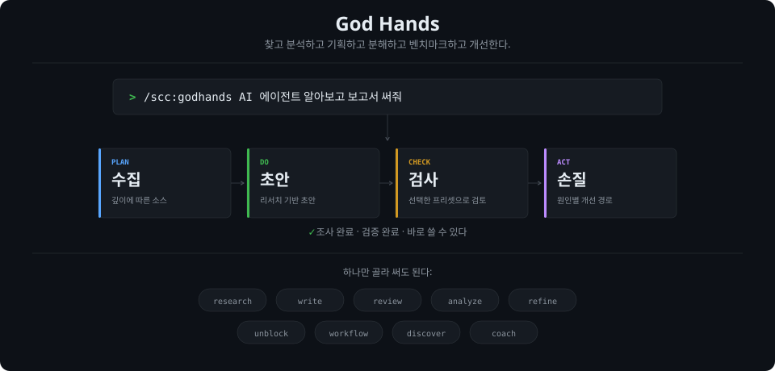
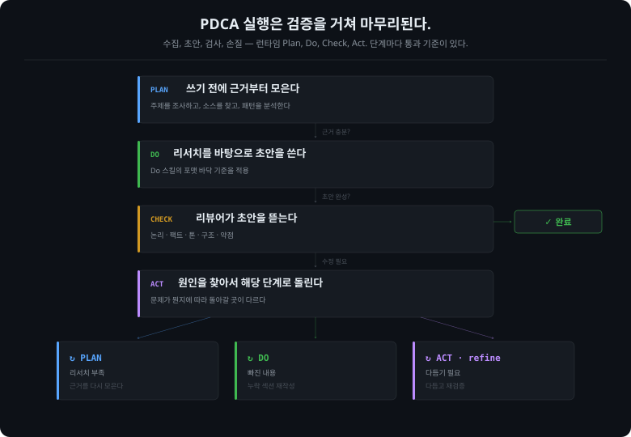
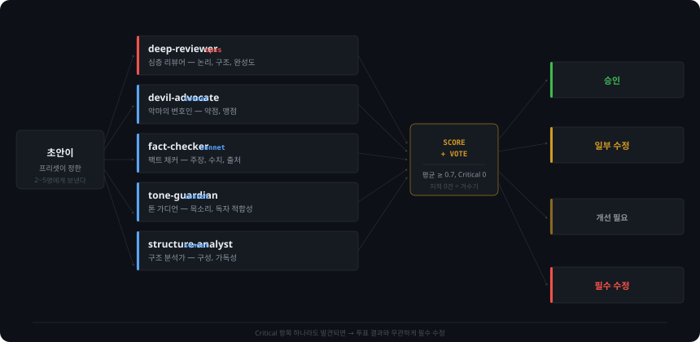
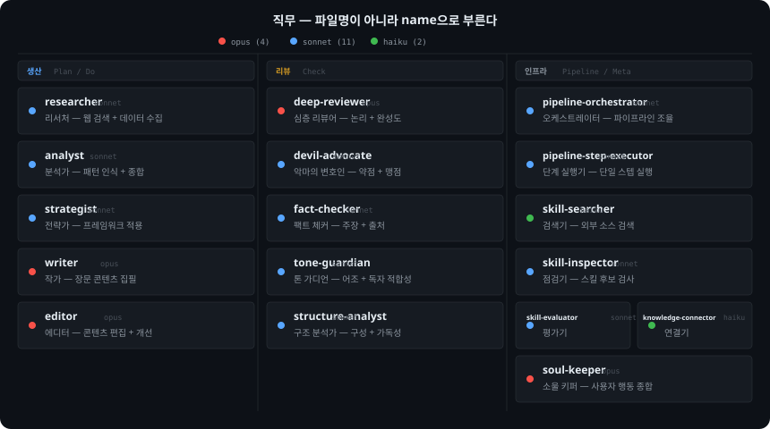

[English](README.md) | **한국어**


# Second Claude Code — 제2의 클로드

**한 줄 입력으로 조사·초안·리뷰·수정까지 지식노동 한 사이클을 통째로 도는 Claude Code 플러그인.**

"AI 에이전트 알아보고 보고서 써줘." 이 한 줄이면 이브이가 웹을 뒤지고, 후딘이 패턴을 잡고, 루브도가 3,000자를 씁니다. 그리고 그게 손에 들어오기 전에 리뷰어 다섯 마리가 이미 초안을 뜯고 있습니다. 네이티오는 논리를, 앱솔은 제일 약한 주장을, 폴리곤은 숫자 하나하나를.

핵심은 글을 쓴다는 게 아닙니다. **첫 초안을 그냥 건네주지 않는다**는 겁니다.

[](https://www.scenesteller.com/studio/share/G2vdkxkjpj)
<sub>[SceneSteller](https://www.scenesteller.com/studio/share/G2vdkxkjpj)로 제작</sub>



[아키텍처](docs/architecture.ko.md) · [사용 매뉴얼](docs/notion-manual.ko.md) · [스킬 가이드](docs/skills/) · [체인지로그](CHANGELOG.md) · [Issues](https://github.com/unclejobs-ai/second-claude-code/issues)

---

## 설치

```bash
claude plugin marketplace add unclejobs-ai/second-claude-code
claude plugin install scc
```

세션 열고 그냥 말하면 됩니다. 외울 슬래시 명령어는 없습니다. 라우터가 한국어든 영어든 의도를 읽습니다.

```
AI 에이전트 알아보고 보고서 써줘
Research the current state of AI agent frameworks and write a report
```

아무 반응이 없으면 `claude plugin list`로 설치를 확인하세요.

---

## 왜 쓰나

- **자기 결과물을 거부합니다.** 서로 다른 렌즈를 가진 리뷰어 서넛에서 다섯이 초안을 물어뜯습니다. 발견 0건인 리뷰는 통과가 아니라 거수기로 취급합니다.
- **실패를 원인별로 되돌립니다.** 근거가 얇으면 Plan으로, 실행이 어긋났으면 Do로, 다듬을 거리면 Refine으로. 전부 "다시 해봐"가 아닙니다.
- **게이트가 느낌이 아니라 검사입니다.** 서로 다른 소스 5개와 승인된 계획 없이는 Plan에서 Do로 못 넘어갑니다. 무엇이 빠졌는지 게이트가 이름을 대 줍니다.
- **당신의 문체를 배웁니다.** `SOUL.md`에 톤 규칙과 안티패턴이 쌓이고, 톤 리뷰어가 일반론이 아니라 그 규칙으로 검사합니다.
- **모든 런이 기록을 남깁니다.** 어떤 게이트가 걸렸고, 리뷰어가 뭘 잡았고, 몇 번 어디로 왜 되돌아갔는지. 공유 가능한 한 장으로 내보냅니다.
- **다른 건 아무것도 필요 없습니다.** API 키도, 두 번째 플러그인도, 외부 서비스도. 위의 전부가 이 플러그인 하나로 돕니다.

---

## 사이클

모든 프롬프트가 Plan → Do → Check → Act를 거칩니다. 단계 사이에는 통과 못 하면 못 넘어가는 게이트가 있습니다.

```
"AI 에이전트 알아보고 보고서 써줘"

[Plan]  20개+ 소스 크롤링, 패턴 추출, 브리프 작성
        ↓ 게이트: 서로 다른 소스 5개 + 승인된 계획
[Do]    그 리서치에 근거한 초안 작성
        ↓ 게이트: 완결된 산출물, 리서치 반영 확인
[Check] 리뷰어 3~5마리가 각자 다른 차원을 병렬로 검토
        ↓ 게이트: 점수 + 투표 기준. Critical 하나면 무조건 차단
[Act]   Action Router가 실패 원인을 읽고 되돌아갈 단계를 고름
```

중요한 건 Action Router입니다. 리뷰가 문제를 잡으면 근본 원인을 분류해서 그 원인이 생긴 단계로 재진입합니다. 리서치 구멍이면 리서치로 돌아가지, 뭉뚱그린 재시도로 가지 않습니다. 두 번째 패스가 첫 번째보다 확연히 나은 이유이고, 런이 뱅뱅 돌지 않고 수렴하는 이유입니다.



---

## 스킬

18개 스킬. 80개 중에 뭘 고를지 고민할 일이 없도록, 대신 하나하나가 깊습니다. 하고 싶은 말만 하면 라우터가 알아서 붙입니다. 정밀하게 쓰고 싶으면 슬래시 명령어(`/scc:write`, `/scc:review` …)도 그대로 됩니다.

**사이클 전체**

| 스킬 | 하는 일 |
|---|---|
| `pdca` | 리서치 → 작성 → 리뷰 → 원인별 재진입. 통과할 때까지 |

**Plan — 모으기**

| 스킬 | 하는 일 |
|---|---|
| `coach` | 방어 가능한 방향이 둘 이상이면 물어보고, 고른 답을 기준 문서로 남김 |
| `research` | 20개+ 소스 크롤링, 패턴 추출, 브리프 |
| `collect` | URL·메모를 던지면 쌓이는 게 아니라 PARA로 분류돼서 들어감 |
| `discover` | 없는 스킬을 찾아서 설치까지 |
| `unblock` | WebFetch가 못 뚫는 URL을 뚫음. 9단계 에스컬레이션, API 키 0개 |

**Do — 만들기**

| 스킬 | 하는 일 |
|---|---|
| `write` | 아티클·보고서·뉴스레터. 리서치 근거와 리뷰 검증까지 붙어서 나옴 |
| `analyze` | 15개 전략 프레임워크(SWOT·Porter·RICE…)를 이름만 빌리지 않고 제대로 적용 |
| `workflow` | 스킬들을 파이프라인으로 엮어 두고 주제만 바꿔 재실행 |
| `batch` | 큰 작업을 독립 단위로 쪼개서 동시에 실행 |

**Check — 검증하기**

| 스킬 | 하는 일 |
|---|---|
| `review` | 리뷰어 3~5마리, 서로 다른 관점, 합의 투표 |
| `investigate` | 고치기 전에 근본 원인부터 잡음 |

**Act — 다듬기**

| 스킬 | 하는 일 |
|---|---|
| `refine` | 리뷰어가 통과시킬 때까지 다시 씀. `--dod`로 합격선을 직접 지정 |
| `translate` | 문체를 뭉개지 않는 EN↔KO 번역 |
| `soul` | 세션을 넘어 톤 규칙을 학습하고, 당신 초안에 그 규칙을 적용 |
| `viewer` | 런 하나를 공유 가능한 페이지로. 게이트·판정·재진입 이력 전부 |

**유지보수자 전용** — 자동 라우팅되지 않는 슬래시 전용

| 스킬 | 하는 일 |
|---|---|
| `loop` | 프롬프트 자산을 고정 스위트로 벤치마크하고, 우승안만 격리 브랜치에 승급 |
| `evolve` | 반복되는 게이트 실패를 그 실패를 만든 자산에 되먹임 |

<details>
<summary><strong>유지보수자 루프 자세히</strong></summary>

`loop`은 `skills/**/SKILL.md`, `commands/*.md`, `agents/*.md`, `templates/*.md` 같은 프롬프트 자산을 고정 벤치마크 스위트로 반복 평가하고, 최고 후보만 격리된 `codex/loop-…` 브랜치에 올립니다. 실행 상태는 `.data/state/loop-active.json`에 재개 가능하게 저장되고, 점수표·세대 히스토리·우승 diff는 `.captures/loop-<run_id>/`에 남습니다.

```bash
/scc:loop list-suites
/scc:loop run write-core --targets skills/write/SKILL.md --parallel 2 --max-generations 2
```

`evolve`는 그 위에서 고리를 닫습니다. 같은 게이트가 계속 실패하면 그 실제 실패들을 수확하고, 구조 체크는 **메인테이너가 직접** 작성한 뒤, 자산을 손대지 않은 `loop` 엔진에 넘깁니다. 옵티마이저가 자기 합격 기준을 쓰는 일은 없고, 우승안 병합은 `winner.diff`를 읽은 다음의 수동 결정으로 남습니다.

```bash
/scc:evolve list-failures
/scc:evolve harvest <id> --assertion '/scc:'
/scc:evolve run evolve-<id>
```

전체 설계와 적대적 리뷰 이력: [evolve-ouroboros-spec.md](docs/proposals/evolve-ouroboros-spec.md)

</details>

---

## 리뷰 시스템

글 쓰고 퍼블리시하고 10분 뒤에 뻔한 실수를 발견한 적, 다들 있습니다. 그래서 모든 결과물은 손에 들어오기 전에 다중 에이전트 리뷰를 거칩니다.

| 리뷰어 | 보는 것 |
|---|---|
| **네이티오(Xatu)** — 딥 리뷰어 | 논리, 완결성, 논증 흐름 |
| **앱솔(Absol)** — 악마의 변호인 | 제일 약한 지점을 찾아서 침 |
| **폴리곤(Porygon)** — 팩트 체커 | 숫자, 주장, 출처 전부 |
| **푸린(Jigglypuff)** — 톤 가디언 | 목소리 일관성, 독자 적합성 |
| **안농(Unown)** — 구조 분석가 | 가독성, 구성, 흐름 |

각자 0.0~1.0 점수와 **Critical / Warning / Nitpick**으로 등급 매긴 소견을 냅니다. 게이트는 이중 트랙입니다. 점수는 얼마나 좋은지를, 투표는 몇 명이 나갈 준비가 됐다고 보는지를 말합니다. **Critical이 하나라도 있으면 점수와 무관하게 차단됩니다.**



<details>
<summary><strong>리뷰 프리셋</strong></summary>

| 프리셋 | 리뷰어 | 이럴 때 |
|---|---|---|
| `content` | 딥 + 변호인 + 톤 | 아티클, 블로그, 뉴스레터 |
| `strategy` | 딥 + 변호인 + 팩트 | PRD, SWOT, 전략 문서 |
| `code` | 딥 + 팩트 + 구조 | 코드 리뷰 |
| `security` | 딥 + 팩트 + 구조 | 보안 감사(CWE, OWASP Top 10) |
| `academic` | 딥 + 팩트 + 구조 | 논문, 연구 산출물, 인용 |
| `quick` | 변호인 + 팩트 | 1분 안에 빠른 검증 |
| `full` | 5마리 전부 | 퍼블리시 직전 최종 |

`--external`을 붙이면 MMBridge를 통해 크로스 모델 리뷰(Kimi, Qwen, Gemini, Codex)가 붙습니다. 어댑터 프로토콜 뒤에 있어서 테스트는 결정적인 스텁 경로를 유지합니다. 실제 외부 실행은 별도 설정이 필요하고, 켜면 초안이 해당 제공자로 전송됩니다. 민감한 건 끄고 쓰세요.

</details>

---

## 안쪽 구조

<details>
<summary><strong>사이클 메모리 — 10번째 런은 첫 번째보다 똑똑합니다</strong></summary>

단계가 넘어갈 때마다 산출물이 `.data/cycles/cycle-NNN/<phase>.md`에 저장되고, 그 결정이 사이클의 `events.jsonl`에 기록됩니다. 수동 저장은 없습니다.

런이 시작되면 `.data/cycles/insights.json`부터 읽습니다. 앞선 런들이 배운 걸 들고 출발한다는 뜻입니다. 30일 지난 인사이트는 순위가 떨어지고, 특정 범주에서 Critical이 반복되면 메인테이너가 체크리스트로 승격시킬 수 있게 gotcha 제안서로 정리됩니다.

```
.data/cycles/
├── cycle-001/
│   ├── plan.md / do.md / check.md / act.md
│   ├── metrics.json
│   └── events.jsonl
└── insights.json
```

</details>

<details>
<summary><strong>도메인 인식 게이트 — 코드와 글은 같은 잣대로 재지 않습니다</strong></summary>

`pdca_start_run(domain=…)`은 `config/stage-contracts.json`에서 다른 계약 세트를 불러옵니다. 단계별 진입 조건, 종료 조건, Definition of Done이 도메인마다 다릅니다.

| 도메인 | Plan | Do | Check | Act |
|---|---|---|---|---|
| **code** | 실행 가능한 계획 + 위험 작업 승인 게이트 | 범위 잡힌 브랜치/워크트리, 테스트, 스테이지 리포트 | 작업자 자기보고가 아니라 검증자 증거 | 정리·단순화, 핸드오프, CI 또는 로컬 검증 |
| **content** | 출처 있는 리서치 브리프 | 인용 붙은 완성 초안 | 리뷰어 5인 합의: 논리·사실·톤 | 편집 마감, 퍼블리시 가능 상태 |
| **analysis** | 데이터 수집 + 프레임워크 선정 | 구조화된 분석 결과 | 방법론과 숫자 검증 | 실행 가능한 권고안 |
| **pipeline** | 스펙 + 롤백 계획 | 구현 + 드라이런 | 통합·부하 테스트 | 배포 체크리스트 확인 |

`code` 도메인은 **코드 엔지니어링 레인**으로 돕니다. 네 단계는 그대로지만, 실행 가능한 인수 기준·작업자와 검증자 분리·넓은 변경에 대한 사람 승인·명시적 핸드오프 상태로 조여 둔 버전입니다.

`pdca_transition`은 세 가지 중 하나를 돌려줍니다. **PROCEED**(통과), **REFINE**(거의 다 됐으니 제한된 개선 라운드 한 번 더), **PIVOT**(단계 선택이 틀렸으니 다른 단계로 재진입, 재시도 횟수 상한 적용).

</details>

<details>
<summary><strong>에이전트 17마리, 모델 3티어</strong></summary>

전부 opus가 아니라 **opus 4 / sonnet 11 / haiku 2**로 비용을 맞췄습니다. 각자 좁은 프롬프트와 제한된 도구만 가집니다. 작성자에게는 웹 검색이 없고, 리뷰어는 글을 쓰지 않습니다. 포켓몬 이름을 쓰는 건 로그를 읽을 때 "reviewer-3가 이슈 발견"보다 "네이티오가 논리 구멍 발견"이 훨씬 따라가기 쉽기 때문입니다.

| 단계 | 에이전트 | 역할 | 모델 |
|---|---|---|---|
| **Plan** | 이브이(Eevee) | 리서처 — 웹 검색, 수집 | sonnet |
| | 야부엉(Noctowl) | 검색 전문 | haiku |
| | 후딘(Alakazam) | 분석가 — 패턴 인식 | sonnet |
| | 뮤츠(Mewtwo) | 전략가 — 프레임워크 분석 | sonnet |
| **Do** | 루브도(Smeargle) | 작성자 — 롱폼 | opus |
| | 아르세우스(Arceus) | 마스터 — 범용 실행 | sonnet |
| **Check** | 네이티오(Xatu) | 딥 리뷰어 — 논리, 구조 | opus |
| | 앱솔(Absol) | 악마의 변호인 | sonnet |
| | 폴리곤(Porygon) | 팩트 체커 | sonnet |
| | 푸린(Jigglypuff) | 톤 가디언 | sonnet |
| | 안농(Unown) | 구조 분석가 | sonnet |
| **Act** | 메타몽(Ditto) | 에디터 — 정제 | opus |
| **Infra** | 괴력몬(Machamp) | 파이프라인 스텝 실행 | sonnet |
| | 자포코일(Magnezone) | 스킬 후보 검사 | sonnet |
| | 테오키스(Deoxys) | 스킬 후보 채점 | sonnet |
| | 케이시(Abra) | 지식 커넥터 | haiku |
| | 피카츄(Pikachu) | 소울 키퍼 — 행동 패턴 종합 | opus |



</details>

<details>
<summary><strong>세션 종료 리포트 — 사이클이 대시보드를 남깁니다</strong></summary>

사이클이 Act까지 가면 `session-end`가 터미널에 요약 박스를 찍습니다.

```text
┌─── PDCA Cycle #2 ───┐
│ Plan ✓  Do ✓  Check ⚠  Act ✓  │
│ Time: 4m  Issues: 3  Score: 74 │
└────────────────────────────────┘
```

Check는 판정에 따라 `✓`, `⚠`, `✗`로 갈리고, 점수는 0~100입니다.

같이 `.data/reports/cycle-N.html`에 자체 완결형 HTML 대시보드(와 `.mmd` 흐름도)를 쓰고 경로를 출력합니다. 단계 타임라인, 리뷰어가 올린 이슈 전부, 다음 액션이 들어갑니다. `hooks/lib/report-generator.mjs`가 만들며, 끝난 런이 터미널 스크롤백 대신 남는 산출물을 갖게 됩니다.

</details>

<details>
<summary><strong>훅과 상태 — 라이프사이클 훅 8개, MCP 도구 31개</strong></summary>

훅은 알아서 뜹니다. 부를 일이 없습니다. `SessionStart`가 상태를 초기화하고, `UserPromptSubmit`이 오토 라우터를 돌리고, `SubagentStart`가 에이전트에 리뷰 맥락을 넣고, `SubagentStop`이 리뷰어 합의를 집계하고, `Stop`이 결과물을 저장하고 정리하고, `StopFailure`가 Check 게이트 실패 시 결과물 전달을 막고, `PreCompact`/`PostCompact`가 상태를 직렬화·복원해서 컨텍스트가 압축돼도 사이클 중간부터 이어집니다.

라우터는 복합 의도부터 봅니다. "알아보고 써줘"는 여기서 걸려 곧바로 `pdca`로 갑니다. 리뷰와 교정 루프를 붙이는 게 사이클이기 때문입니다. 단일 목적 프롬프트만 그다음 단계인 스킬 점수화와 외부 플러그인 디스패치로 넘어갑니다.

전용 `pdca-state` MCP 서버(stdio)가 **도구 31개**를 노출합니다. PDCA 상태, 사이클 메모리, 소울, 프로젝트 메모리, 데몬 제어, 세션 리콜, 플러그인 오케스트레이션까지. 모든 전이·게이트 판정·리뷰 점수·라우팅이 이벤트로 남아서 런 이력을 조회할 수 있고 반복되는 실패 패턴이 눈에 보입니다.

전체 도구 레퍼런스: [docs/architecture.ko.md](docs/architecture.ko.md)

</details>

<details>
<summary><strong>크로스 플러그인 디스패치 — 가속기지 의존성이 아닙니다</strong></summary>

오케스트레이터가 세션 시작 때 `~/.claude/plugins/`를 훑어서 찾은 걸 PDCA 단계에 매핑합니다. `coderabbit`이 깔려 있으면 "코드 리뷰해줘"는 내장 리뷰어 대신 그쪽으로 갑니다. "커밋해줘"는 `commit-commands`가 받습니다. 설치하면 나타나고 지우면 사라집니다. 설정 파일은 없습니다.

**하나도 없어도 나빠지는 건 없습니다.** 외부 매칭이 없으면 내장 리뷰어·작성자·커미터가 그대로 처리합니다.

발견이 아니라 고정된 게 하나 있습니다. 각 의도가 어떤 플러그인을 *선호*하는지입니다. `INTENT_PROFILES`는 리뷰 → `coderabbit`, act → `commit-commands`, 디자인 → `frontend-design`, 메모리 → `claude-mem`으로 출고됩니다. `CLAUDE_PLUGIN_DATA`에 `plugin-preferences.json`을 넣으면 덮어쓰고, 빈 배열을 넣으면 고정이 풀립니다.

</details>

<details>
<summary><strong>백그라운드 실행 — 큐에만 넣고 자동 실행은 안 합니다</strong></summary>

`daemon_start_background_run`은 그 작업을 시작하는 명령을 돌려줄 뿐, 스스로 아무것도 실행하지 않습니다.

```bash
claude --bg "/scc:workflow run weekly-digest"
claude agents
```

의도적입니다. Claude Code에 이미 백그라운드 에이전트가 있고, 플러그인 안에 다시 만들면 라이프사이클 관리도 크래시 복구도 더 나빠집니다. 더 큰 이유는 동의입니다. 이 플러그인은 퍼블리시·푸시·메일 발송을 **대화 안에서의 명시적 승인** 뒤에 둡니다. 백그라운드 실행기에는 물어볼 대화가 없습니다.

</details>

---

## 설정

기본값으로 바로 돕니다. JSON 파일 하나가 전부고, 그 안의 모든 필드가 선택입니다.

```jsonc
{
  "defaults": {
    "research_depth": "medium",     // "shallow" | "medium" | "deep"
    "write_voice": "peer-mentor",
    "review_preset": "content",     // content | strategy | code | security | academic | quick | full
    "refine_max_iterations": 3,
    "publish_target": "file"        // "file" | "notion"
  },
  "quality_gate": {
    "consensus_threshold": 0.67,
    "external_reviewers": []        // ["kimi", "qwen", "gemini", "codex"]
  }
}
```

---

## 한계와 선택

여기 있는 제약은 전부 의도한 선택입니다.

- **오토 라우팅은 프롬프트의 약 95%를 맞힙니다.** 나머지는 `/scc:*` 명령어로 직접 지정하면 됩니다.
- **가벼운 에이전트가 대량 작업 비용을 잡아 줍니다.** 대신 플러그인을 많이 켜 두면 컨텍스트가 빠듯해집니다. 안 쓰는 건 꺼 두세요.
- **테스트된 플랫폼은 Claude Code입니다.** OpenClaw, Codex, Gemini CLI는 SKILL.md와 ACP로 붙지만 실험적입니다.
- **서브에이전트 결과는 완성된 뒤 한 번에 옵니다.** 중간 결과를 흘리면 게이트 모델이 깨집니다.
- **리뷰 소견은 입력 언어와 무관하게 영어로 나옵니다.** 한국어 출력은 예정돼 있습니다.

납득이 안 되는 게 있으면 [이슈를 열어](https://github.com/unclejobs-ai/second-claude-code/issues) 주세요. 근거가 생기면 판단은 바뀝니다.

---

<details>
<summary><strong><code>/scc:analyze</code>의 전략 프레임워크 15개</strong></summary>

| 분류 | 프레임워크 |
|---|---|
| **전략** | ansoff, porter, pestle, north-star, value-prop |
| **기획** | prd, okr, lean-canvas, gtm, battlecard |
| **우선순위** | rice, pricing |
| **분석** | swot, persona, journey-map |

프롬프트에서 자동으로 고르거나, 직접 지정할 수 있습니다.

```bash
/scc:analyze porter "클라우드 인프라 시장"
/scc:analyze rice --input features.md
```

</details>

---

이슈와 PR 환영합니다. [Unclejobs](https://github.com/unclejobs-ai) 제작, MIT 라이선스.

릴리스 이력: [CHANGELOG.md](CHANGELOG.md)
