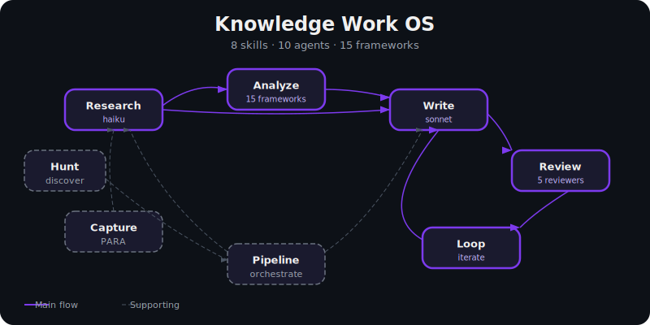
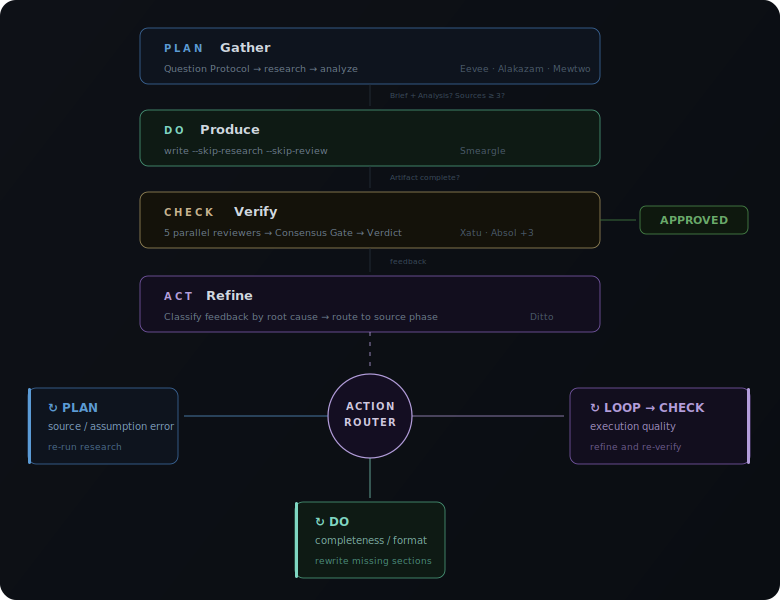
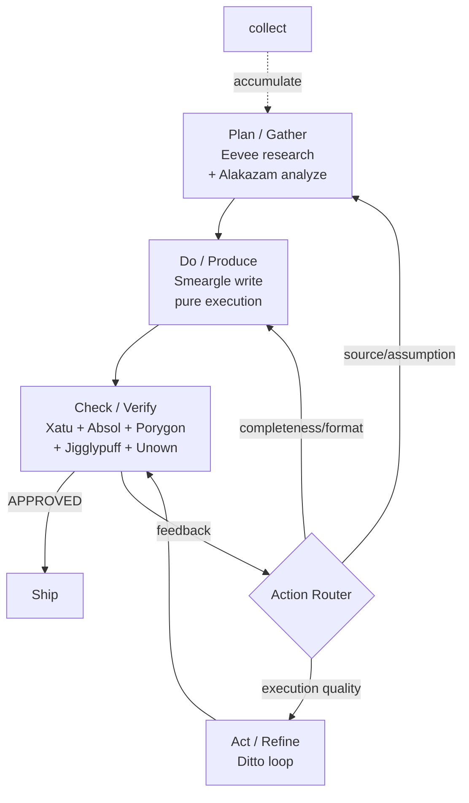
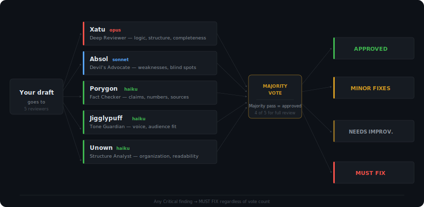
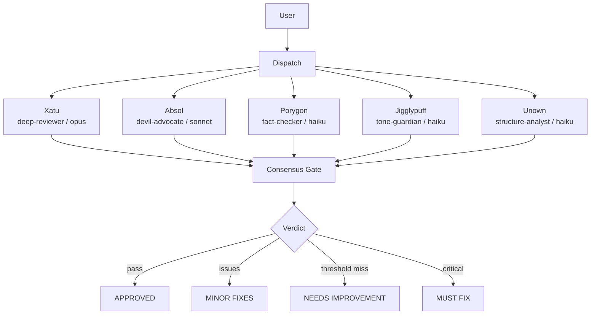
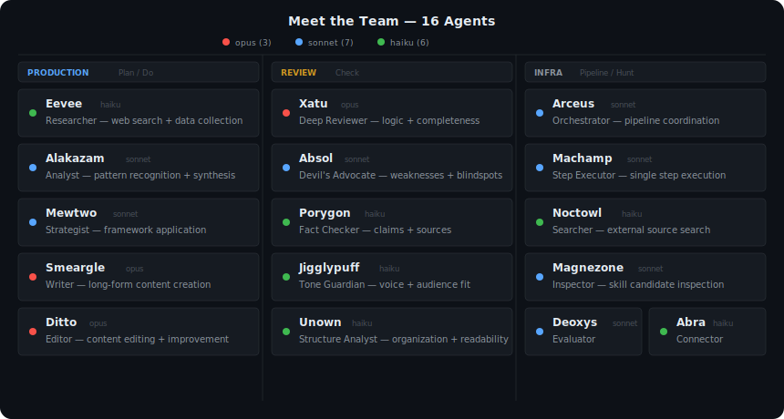

[English](README.md) | [한국어](README.ko.md)


---

# Second Claude Code — Knowledge Work OS



Just as Second Brain is not 200 apps but one PARA system,
**Second Claude Code is not 200 skills but an OS that covers knowledge work with 9 commands.**

Knowledge workers drown in tool fragmentation — a different plugin for research, another for writing, yet another for review, none of them talking to each other. Second Claude Code replaces that sprawl with 9 composable skills backed by 16 Pokemon-themed subagents and 15 strategic frameworks. Built for researchers, strategists, and content creators who need depth over breadth and multi-model review over single-pass generation.

---

## The Knowledge Work Cycle

**Core flow**: `Research → Analyze → Write → Review → Loop`

This flow follows the **PDCA quality principle**: every output passes through
Verify (review) and Refine (loop) before shipping. The same cycle that
produces content also improves the skills themselves.

In product language, the loop is expressed as `Gather → Produce → Verify → Refine`.
In PDCA terms, that maps to `Plan → Do → Check → Act`.

| PDCA | Second Claude Code |
|------|--------------------|
| Plan | Gather (`research` → `analyze`, with Question Protocol) |
| Do | Produce (`write` in pure execution mode) |
| Check | Verify (`review` with 5 parallel reviewers) |
| Act | Refine (Action Router → `loop` / back to Plan / back to Do) |



<details>
<summary>Mermaid fallback (for non-SVG renderers)</summary>



</details>

**Supporting commands**

| Command | Role |
|---------|------|
| `hunt` | Extend the cycle with new capabilities |
| `collect` | Accumulate knowledge across cycles |
| `pipeline` | Automate repeatable cycles |

---

## Quick Start

**1. Install**

```bash
claude plugin add github:EungjePark/second-claude-code
```

**2. Verify** — start a new Claude Code session and look for the context injection:

```
# Second Claude Code — Knowledge Work OS

9 commands for all knowledge work:
| Command | Purpose |
...
```

If nothing appears, verify the plugin is installed: `claude plugin list`

**3. Try it** — just type naturally:

```
Research the current state of AI agent frameworks in 2026
```

The auto-router picks `/second-claude-code:research` for you. No slash commands to memorize.

If auto-routing does not trigger, use the explicit command: `/second-claude-code:research "AI agent frameworks 2026"`

---

## Choose Your Skill

| I want to... | Use |
|--------------|-----|
| Run a full research→write→review→improve cycle | `pdca` |
| Find information about a topic | `research` |
| Apply a strategic framework (SWOT, Porter, etc.) | `analyze` |
| Produce an article, report, or newsletter | `write` |
| Get multi-perspective feedback on a draft | `review` |
| Iteratively improve a draft to a target score | `loop` |
| Save a URL, note, or excerpt for later | `collect` |
| Chain multiple skills into a repeatable workflow | `pipeline` |
| Find and install a new skill I do not have | `hunt` |

---

## The 9 Commands

Commands use the `/second-claude-code:` prefix.

### Orchestrator

| Command | Description | Example |
|---------|-------------|---------|
| [`pdca`](docs/skills/pdca.md) | Full PDCA cycle with quality gates and Action Router | `/second-claude-code:pdca "AI agent market report"` |

The `pdca` command auto-detects which phase to enter and chains the right skills. Say "research and write a report" and it runs the full Plan→Do→Check→Act cycle with gates. Use `--no-questions` for automation.

### Gather

| Command | Description | Example |
|---------|-------------|---------|
| [`research`](docs/skills/research.md) | Autonomous deep research with iterative refinement | `/second-claude-code:research "AI agent landscape 2026"` |
| [`hunt`](docs/skills/hunt.md) | Skill discovery — find and install new capabilities | `/second-claude-code:hunt "terraform security audit"` |
| [`collect`](docs/skills/collect.md) | Knowledge collection and PARA classification | `/second-claude-code:collect https://example.com/article` |

### Produce

| Command | Description | Example |
|---------|-------------|---------|
| [`write`](docs/skills/write.md) | Content production (articles, reports, newsletters) | `/second-claude-code:write article "The future of vibe coding"` |
| [`analyze`](docs/skills/analyze.md) | Strategic framework analysis (15 built-in frameworks) | `/second-claude-code:analyze swot "our SaaS product"` |
| [`pipeline`](docs/skills/pipeline.md) | Custom workflow builder and runner | `/second-claude-code:pipeline run "weekly-digest"` |

### Verify

| Command | Description | Example |
|---------|-------------|---------|
| [`review`](docs/skills/review.md) | Multi-perspective quality gate with consensus voting | `/second-claude-code:review docs/draft.md --preset content` |

### Refine

| Command | Description | Example |
|---------|-------------|---------|
| [`loop`](docs/skills/loop.md) | Iterative improvement toward a target score | `/second-claude-code:loop "Raise this article to 4.5/5" --max 3` |

---

## Auto-Routing

No slash commands to memorize. The hook-based auto-router detects intent from natural language and dispatches the right skill. Supports both English and Korean input.

```
"Research and write about AI agents"   →  /second-claude-code:pdca (full cycle)
"Review and improve this"              →  /second-claude-code:pdca (check+act)
"Write an article about AI agents"     →  /second-claude-code:write
"Research the state of AI agents"      →  /second-claude-code:research
"Analyze this market with SWOT"        →  /second-claude-code:analyze
"Review this draft"                    →  /second-claude-code:review
"Save this for later"                  →  /second-claude-code:collect
"How do I run a security audit?"       →  /second-claude-code:hunt
```

The router uses a two-layer detection system in `hooks/prompt-detect.mjs`:
1. **PDCA layer** — detects compound patterns ("research and write", "review and improve") that span multiple phases → routes to `/second-claude-code:pdca`
2. **Skill layer** — detects single-skill intent → routes to individual skills

PDCA compound patterns take priority. When no compound pattern matches, the earliest single-skill match wins.

> Korean auto-routing with ~41 trigger patterns is documented in the [한국어 README](README.ko.md).

---

## Skill Composition

Skills call each other and chain naturally. A single prompt can trigger a full PDCA cycle.

**Common patterns:**

| Pattern | Chain | Use for |
|---------|-------|---------|
| Full PDCA | `/pdca` → research → analyze → write → review → loop | End-to-end content with gates |
| Quick Check | review → loop | Polish existing draft |
| Plan Only | research → analyze | Strategic analysis |
| Auto PDCA | `pipeline run autopilot --topic "..."` | One-command production |

`/second-claude-code:pdca` is the recommended way to run multi-phase work — it enforces quality gates and uses the Action Router to classify review findings by root cause. `/second-claude-code:write` also auto-invokes research and review internally for single-step convenience.

---

## Multi-Perspective Review

`/second-claude-code:review` dispatches 3-5 specialized subagents in parallel, each with a different model and focus area.

### Reviewers

| Reviewer | Pokemon | Model | Focus |
|----------|---------|-------|-------|
| deep-reviewer | Xatu | opus | Logic, structure, and completeness |
| devil-advocate | Absol | sonnet | Attacks the weakest points and blind spots |
| fact-checker | Porygon | haiku | Verifies claims, numbers, and sources |
| tone-guardian | Jigglypuff | haiku | Voice and audience fit |
| structure-analyst | Unown | haiku | Organization and readability |

### Review Flow



<details>
<summary>Mermaid fallback (for non-SVG renderers)</summary>



</details>

**Consensus gate:** 2/3 passes = APPROVED (3/5 for `full` preset). Threshold not met with no Critical findings = NEEDS IMPROVEMENT. Any Critical finding = MUST FIX.

### Presets

| Preset | Reviewers | Best for |
|--------|-----------|----------|
| `content` | Xatu + Absol + Jigglypuff | Articles, blogs, newsletters |
| `strategy` | Xatu + Absol + Porygon | PRDs, SWOTs, strategy docs |
| `code` | Xatu + Porygon + Unown | Code review |
| `quick` | Absol + Porygon | Fast validation |
| `full` | all 5 reviewers | Final pre-publish pass |

**External reviewers (optional):** Pass `--external` to add cross-model review via MMBridge (Kimi, Qwen, Gemini, Codex). Requires MMBridge installed separately.

---

<details>
<summary><strong>15 Strategic Frameworks</strong></summary>

`/second-claude-code:analyze` supports 15 built-in frameworks, grouped by use case:

| Category | Frameworks |
|----------|------------|
| **Strategy** | ansoff, porter, pestle, north-star, value-prop |
| **Planning** | prd, okr, lean-canvas, gtm, battlecard |
| **Prioritization** | rice, pricing |
| **Analysis** | swot, persona, journey-map |

Each framework lives in `skills/analyze/references/frameworks/` as a standalone reference document. The analyze skill selects the right framework from your prompt or you can specify one directly:

```bash
/second-claude-code:analyze porter "cloud infrastructure market"
/second-claude-code:analyze rice --input features.md
/second-claude-code:analyze lean-canvas "my startup idea"
```

</details>

---

<details>
<summary><strong>Architecture</strong></summary>

16 Pokemon-themed subagents across 3 model tiers (opus, sonnet, haiku).
Optional cross-model review via MMBridge (Kimi, Qwen, Gemini, Codex) — works without it.



[Full architecture — agent roster, PDCA mapping, Action Router →](docs/architecture.md)

```
second-claude/
├── skills/     # 9 skills (SKILL.md + references/)
│   └── pdca/   # Orchestrator with Action Router + Question Protocol
├── agents/     # 16 Pokemon-themed subagents
├── commands/   # 9 slash command wrappers
├── hooks/      # Auto-routing + context injection
├── references/ # Design principles, consensus gate
├── templates/  # Output templates
└── config/     # User configuration
```

</details>

---

## Design Philosophy

Nine principles govern the plugin's architecture:

1. **Few but Deep** — 9 skills (8 domain + 1 orchestrator), not 80. Each one internally rich.
2. **Gotchas over Instructions** — Document failure modes, not just happy paths.
3. **Progressive Disclosure** — SKILL.md is short; `references/` goes deep.
4. **Context-Efficient** — All skill descriptions fit under 100 tokens total.
5. **Zero Dependency Core** — No `npm install`. Subagents and shell scripts only.
6. **State in Files** — JSON state persisted in the plugin data directory.
7. **Composable** — Skills call each other; 9 primitives yield infinite workflows.
8. **PDCA-Native** — Every output cycles through Verify and Refine. The skills improve themselves through the same cycle they serve.
9. **Action Router** — Review failures route by root cause: research gaps go back to Plan, execution gaps go back to Do, polish issues go to Loop. Not everything is a Loop problem.

**How the principles interact:**
Few-but-deep + composable = small surface area, infinite combinations.
Gotchas-first + progressive disclosure = safe usage without walls of text.
Context-efficient + zero dependency = fast, cheap, portable across platforms.
PDCA-native + action router = intelligent cycle routing, not blind iteration.

---

## Compatibility

| Platform | Install | Status |
|----------|---------|--------|
| **Claude Code** (primary) | `claude plugin add github:EungjePark/second-claude-code` | Tested |
| **OpenClaw** | Standard ACP protocol — auto-detected | Experimental |
| **Codex** | SKILL.md standard compatible | Experimental |
| **Gemini CLI** | SKILL.md standard compatible | Experimental |

> Non-Claude platforms are expected to work via the SKILL.md standard but have not been fully validated. Please report issues if you encounter compatibility problems.

## Contributing

Issues and pull requests welcome at [github.com/EungjePark/second-claude-code](https://github.com/EungjePark/second-claude-code).

## License

[MIT](LICENSE) — Park Eungje
