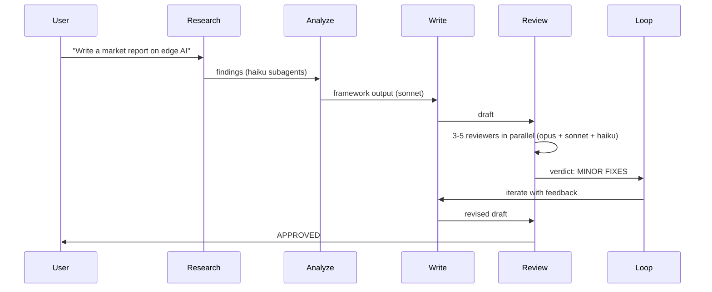
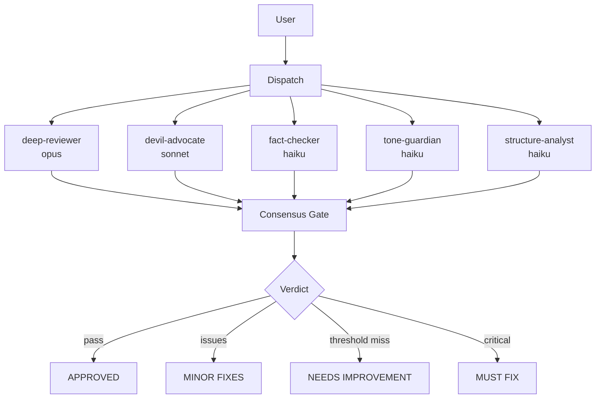

[English](README.md) | [한국어](README.ko.md)


---

# Second Claude Code — Knowledge Work OS


Just as Second Brain is not 200 apps but one PARA system,
**Second Claude Code is not 200 skills but an OS that covers knowledge work with 8 commands.**

Knowledge workers drown in tool fragmentation — a different plugin for research, another for writing, yet another for review, none of them talking to each other. Second Claude Code replaces that sprawl with 8 composable skills backed by 10 specialized subagents and 15 strategic frameworks. Built for researchers, strategists, and content creators who need depth over breadth and multi-model review over single-pass generation.

---

## The Knowledge Work Cycle

The product reads in two layers: a single core workflow, then a quieter support layer around it.

**Core flow**

`Research` → `Analyze` → `Write` → `Review` → `Loop`

**Supporting commands**

| Command | Role |
|---------|------|
| `hunt` | Discover missing capabilities around the workflow |
| `collect` | Save sources and notes into a PARA-friendly system |
| `pipeline` | Chain repeatable workflows across commands |

---

## Quick Start

**1. Install**

```bash
claude plugin add github:EungjePark/second-claude-code
```

**2. Verify** — start a new Claude Code session and look for the context injection:

```
# Second Claude Code — Knowledge Work OS

8 commands for all knowledge work:
| Command | Purpose |
...
```

If nothing appears, verify the plugin is installed: `claude plugin list`

**3. Try it** — just type naturally:

```
Research the current state of AI agent frameworks in 2026
```

The auto-router picks `/second-claude-code:research` for you. No slash commands to memorize.

If auto-routing does not trigger, use the explicit command: `/second-claude-code:research "AI agent frameworks 2026"`

---

## Choose Your Skill

| I want to... | Use |
|--------------|-----|
| Find information about a topic | `research` |
| Apply a strategic framework (SWOT, Porter, etc.) | `analyze` |
| Produce a newsletter, article, or report | `write` |
| Get multi-perspective feedback on a draft | `review` |
| Iteratively improve a draft to a target score | `loop` |
| Save a URL, note, or excerpt for later | `collect` |
| Chain multiple skills into a repeatable workflow | `pipeline` |
| Find and install a new skill I do not have | `hunt` |

---

## The 8 Commands

Commands use the `/second-claude-code:` prefix.

### Discover

| Command | Description | Example |
|---------|-------------|---------|
| [`research`](docs/skills/research.md) | Autonomous deep research with iterative refinement | `/second-claude-code:research "AI agent landscape 2026"` |
| [`hunt`](docs/skills/hunt.md) | Skill discovery — find and install new capabilities | `/second-claude-code:hunt "terraform security audit"` |

### Create

| Command | Description | Example |
|---------|-------------|---------|
| [`write`](docs/skills/write.md) | Content production (articles, newsletters, scripts) | `/second-claude-code:write newsletter "The future of vibe coding"` |
| [`analyze`](docs/skills/analyze.md) | Strategic framework analysis (15 built-in frameworks) | `/second-claude-code:analyze swot "our SaaS product"` |

### Quality

| Command | Description | Example |
|---------|-------------|---------|
| [`review`](docs/skills/review.md) | Multi-perspective quality gate with consensus voting | `/second-claude-code:review docs/draft.md --preset content` |
| [`loop`](docs/skills/loop.md) | Iterative improvement toward a target score | `/second-claude-code:loop "Raise this article to 4.5/5" --max 3` |

### Manage

| Command | Description | Example |
|---------|-------------|---------|
| [`collect`](docs/skills/collect.md) | Knowledge collection and PARA classification | `/second-claude-code:collect https://example.com/article` |
| [`pipeline`](docs/skills/pipeline.md) | Custom workflow builder and runner | `/second-claude-code:pipeline run "weekly-digest"` |

---

## Auto-Routing

You do not need to memorize slash commands. The hook-based auto-router detects intent from natural language in both English and Korean, then dispatches the right skill.

```
"Write an article about AI agents"     →  /second-claude-code:write
"AI 에이전트에 대해 조사해"              →  /second-claude-code:research
"Analyze this market with SWOT"        →  /second-claude-code:analyze
"이 초안을 리뷰해"                      →  /second-claude-code:review
"Save this for later"                  →  /second-claude-code:collect
"How do I run a security audit?"       →  /second-claude-code:hunt
```

The router matches against ~58 English and ~41 Korean trigger patterns via `hooks/prompt-detect.mjs` and injects the appropriate skill context before the model responds. When multiple skills match, the pattern that appears earliest in the prompt wins.

---

## Skill Composition

Skills call each other and chain naturally. A single prompt can trigger a full production pipeline.



**Common chains:**

```
research → write → review → loop → done          # Full content pipeline
research → analyze → review → done                # Strategic analysis
collect → research → write → pipeline(save)       # Knowledge-to-content
```

`/second-claude-code:write` automatically invokes `/second-claude-code:research` and `/second-claude-code:review` internally, so a single write command can produce research-backed, review-gated content.

---

## Multi-Perspective Review

`/second-claude-code:review` dispatches 3-5 specialized subagents in parallel, each with a different model and focus area.

### Reviewers

| Reviewer | Model | Focus |
|----------|-------|-------|
| deep-reviewer | opus | Logic, structure, and completeness |
| devil-advocate | sonnet | Attacks the weakest points and blind spots |
| fact-checker | haiku | Verifies claims, numbers, and sources |
| tone-guardian | haiku | Voice and audience fit |
| structure-analyst | haiku | Organization and readability |

### Review Flow



**Consensus gate:** 2/3 passes = APPROVED (3/5 for `full` preset). Threshold not met with no Critical findings = NEEDS IMPROVEMENT. Any Critical finding = MUST FIX.

### Presets

| Preset | Reviewers | Best for |
|--------|-----------|----------|
| `content` | deep-reviewer + devil-advocate + tone-guardian | Newsletters and articles |
| `strategy` | deep-reviewer + devil-advocate + fact-checker | PRDs, SWOTs, strategy docs |
| `code` | deep-reviewer + fact-checker + structure-analyst | Code review |
| `quick` | devil-advocate + fact-checker | Fast validation |
| `full` | all 5 reviewers | Final pre-publish pass |

**External reviewers:** Pass `--external` to add cross-model review via mmbridge, kimi, codex, or gemini.

---

<details>
<summary><strong>15 Strategic Frameworks</strong></summary>

`/second-claude-code:analyze` supports 15 built-in frameworks, grouped by use case:

| Category | Frameworks |
|----------|------------|
| **Strategy** | ansoff, porter, pestle, north-star, value-prop |
| **Planning** | prd, okr, lean-canvas, gtm, battlecard |
| **Prioritization** | rice, pricing |
| **Analysis** | swot, persona, journey-map |

Each framework lives in `skills/analyze/references/frameworks/` as a standalone reference document. The analyze skill selects the right framework from your prompt or you can specify one directly:

```bash
/second-claude-code:analyze porter "cloud infrastructure market"
/second-claude-code:analyze rice --input features.md
/second-claude-code:analyze lean-canvas "my startup idea"
```

</details>

---

<details>
<summary><strong>Architecture</strong></summary>

```
second-claude/
├── .claude-plugin/plugin.json    # Plugin manifest (v0.2.0)
├── skills/                       # 8 skills (SKILL.md each)
│   ├── research/                 # Autonomous deep research
│   ├── write/                    # Content production
│   ├── analyze/                  # Strategic framework analysis (15 frameworks)
│   ├── review/                   # Multi-perspective quality gate
│   ├── loop/                     # Iterative improvement
│   ├── collect/                  # Knowledge collection (PARA)
│   ├── pipeline/                 # Custom workflow builder
│   └── hunt/                     # Skill discovery
├── agents/                       # 10 specialized subagents
├── commands/                     # 8 slash command wrappers
├── hooks/                        # Auto-routing + context injection
│   ├── hooks.json                # Hook configuration
│   ├── prompt-detect.mjs         # Natural language auto-router
│   ├── session-start.mjs         # Session banner + state init
│   └── session-end.mjs           # Cleanup
├── references/                   # Design principles, consensus gate
├── templates/                    # Output templates
├── scripts/                      # Shell utilities
└── config/                       # User configuration
```

| Directory | Role |
|-----------|------|
| `skills/` | Each skill has a `SKILL.md` (short, context-efficient) plus a `references/` subdirectory for deep documentation. Progressive disclosure in action. |
| `agents/` | 10 subagent definitions: 5 production agents (researcher, analyst, editor, strategist, writer) and 5 reviewers (deep-reviewer, devil-advocate, fact-checker, tone-guardian, structure-analyst). |
| `commands/` | Thin wrappers that route `/second-claude-code:*` invocations to the matching skill. |
| `hooks/` | Session lifecycle hooks and the auto-routing engine that maps natural language to skills. |
| `references/` | Shared knowledge: design principles, consensus gate spec, PARA method. |

</details>

---

## Design Philosophy

Seven principles govern the plugin's architecture:

1. **Few but Deep** — 8 skills, not 80. Each one internally rich.
2. **Gotchas over Instructions** — Document failure modes, not just happy paths.
3. **Progressive Disclosure** — SKILL.md is short; `references/` goes deep.
4. **Context-Efficient** — All 8 skill descriptions fit under 100 tokens total.
5. **Zero Dependency Core** — No `npm install`. Subagents and shell scripts only.
6. **State in Files** — JSON state persisted in the plugin data directory.
7. **Composable** — Skills call each other; 8 primitives yield infinite workflows.

**How the principles interact:**
Few-but-deep + composable = small surface area, infinite combinations.
Gotchas-first + progressive disclosure = safe usage without walls of text.
Context-efficient + zero dependency = fast, cheap, portable across platforms.

---

## Compatibility

| Platform | Install | Status |
|----------|---------|--------|
| **Claude Code** (primary) | `claude plugin add github:EungjePark/second-claude-code` | Tested |
| **OpenClaw** | Standard ACP protocol — auto-detected | Experimental |
| **Codex** | SKILL.md standard compatible | Experimental |
| **Gemini CLI** | SKILL.md standard compatible | Experimental |

> Non-Claude platforms are expected to work via the SKILL.md standard but have not been fully validated. Please report issues if you encounter compatibility problems.

## Contributing

Issues and pull requests welcome at [github.com/EungjePark/second-claude-code](https://github.com/EungjePark/second-claude-code).

## License

[MIT](LICENSE) — Park Eungje
