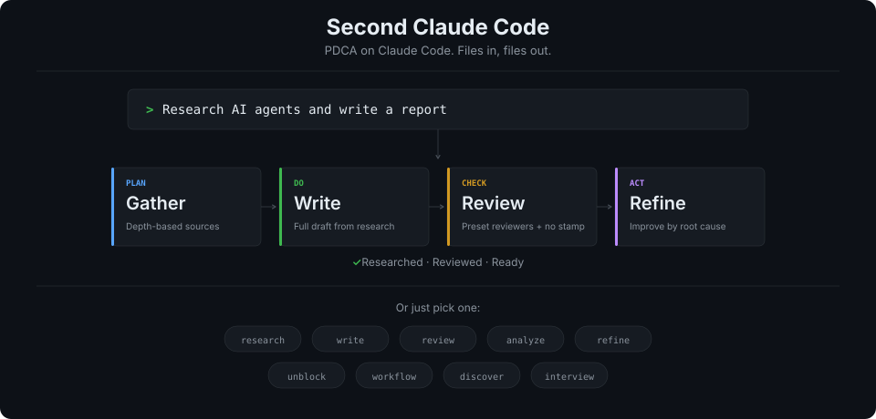
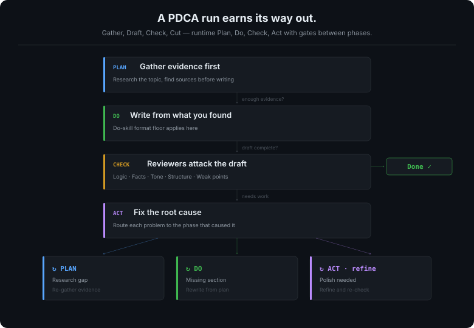
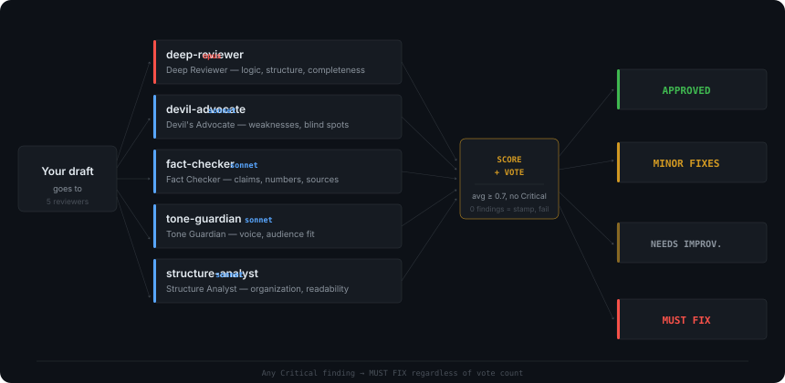
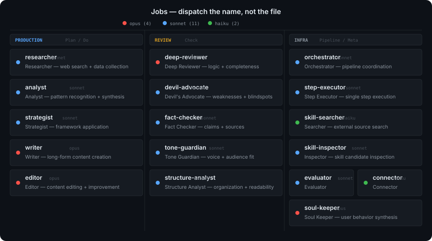

[English](README.md) | [한국어](README.ko.md)


# Second Claude Code

**A Claude Code plugin that runs the whole knowledge-work cycle — research, draft, review, revise — from a single prompt.**

You type one line. Researchers crawl 20+ sources. An analyst finds the patterns. A writer drafts 3,000 words — and before you ever see it, five reviewers are already tearing the draft apart. One checks the logic, one attacks the weakest claim, one verifies every number.

The point isn't that it writes. It's that **it won't hand you the first draft.**

[](https://www.scenesteller.com/studio/share/G2vdkxkjpj)
<sub>Image created with [SceneSteller](https://www.scenesteller.com/studio/share/G2vdkxkjpj)</sub>



[Architecture](docs/architecture.md) · [User Manual](docs/notion-manual.md) · [Skill Guides](docs/skills/) · [Changelog](CHANGELOG.md) · [Issues](https://github.com/unclejobs-ai/second-claude-code/issues)

---

## Install

```bash
claude plugin marketplace add unclejobs-ai/second-claude-code
claude plugin install scc
```

Start a session and just talk. No slash commands to memorize — the router reads intent, in English or Korean.

```
Research the current state of AI agent frameworks and write a report
AI 에이전트 알아보고 보고서 써줘
```

Set `CLAUDE_PLUGIN_DATA` to a path outside the plugin directory before you start. Runtime state — PDCA runs, cycle memory, and your `SOUL.md` profile — is written under the plugin install without it, and a reinstall wipes that directory.

```bash
export CLAUDE_PLUGIN_DATA="$HOME/.scc-data"
```

Decisions are unaffected: standards live in your project under `.scc/`, which is where they belong.

Nothing happening? `claude plugin list` to confirm the install.

---

## Why

- **Decisions outlive the session.** When a question has two defensible answers, it asks instead of guessing, then writes the answer to your project as a standard — the direction you picked, the ones you rejected, and why each lost. The next session reads it before it starts.
- **It refuses its own output.** Three to five reviewers with different lenses attack every draft. A review that returns zero findings is treated as a rubber stamp, not a pass.
- **Failures route by cause.** Thin research goes back to Plan. Botched execution goes back to Do. A rough edge goes to Refine. Not everything is "try again."
- **Gates are checks, not vibes.** Plan can't reach Do without 5 distinct sources and an approved plan. Each gate names what's missing.
- **It learns your voice.** `SOUL.md` holds your tone rules and anti-patterns, and the tone reviewer enforces those — not a generic style guide.
- **Every run leaves a record.** Which gates fired, what each reviewer caught, every re-entry and why. Exportable as one shareable page.
- **Nothing else required.** No API key, no second plugin, no service. Everything above runs on this plugin alone.

---

## The Loop

Every prompt runs through Plan → Do → Check → Act, with hard gates between phases.

```
"Research AI agents and write a report"

[Plan]  Crawl 20+ sources, find patterns, synthesize a brief
        ↓ gate: 5 distinct sources + an approved plan
[Do]    Write a full draft grounded in that research
        ↓ gate: complete artifact, findings integrated
[Check] 3–5 reviewers run in parallel, each on a different dimension
        ↓ gate: score + vote thresholds; any Critical blocks
[Act]   Action Router reads the failure and picks where to go back to
```

The Action Router is the part that matters. When review finds a problem it classifies the root cause and re-enters the phase that caused it — a research gap goes back to research, not to a generic retry. That's why the second pass is dramatically better than the first, and why runs converge instead of looping.



---

## Standards — the part that survives the session

You settle something on Tuesday. On Thursday a fresh session proposes the option you already rejected, because nothing on disk says you rejected it.

`/scc:coach` asks when a request has more than one defensible direction — the test is whether another competent agent reading the same evidence could land somewhere else, not whether this one feels unsure. You pick. It writes the answer into **your project**, not into a chat log:

```
.scc/standards/voice-two-track/STANDARD.md
```

The record carries the direction you chose, every option that lost and why, what would reopen the question, and any checks it can be verified with. Sessions read it at startup. Retiring one keeps the file and flips it to `superseded`, because the rejected options are the part that stops the same argument from happening a third time.

Then the standards check the work:

```bash
/scc:standard-check drafts/launch-post.md
```

```
FAIL no-hype / regex-absent — the target contains "단순히", which /단순히/ forbids
UNPROVEN no-hype — adversarial, needs an independent reviewer: does this read without overstatement?
  record answers against target_sha256 d0281896…
```

Checks are data, not code — five fixed checkers with structured arguments, and a standard carrying a `run:` field is rejected outright rather than executed, because standards travel through repositories. Questions no regex can settle stay `UNPROVEN` until a reviewer answers them, and the answer is bound to the exact bytes they read: edit the draft and it goes back to unproven. The tool that grades the work never records the passing grade.

---

## Skills

15 skills, each deep enough that you never have to pick between eighty. Say what you want; the router handles the rest. Slash commands (`/scc:write`, `/scc:review`, …) are there when you want to be precise.

**The whole cycle**

| Skill | What it does |
|---|---|
| `pdca` | Research → write → review → route back, until it passes |

**Plan — gather**

| Skill | What it does |
|---|---|
| `coach` | Puts a fork with more than one defensible direction to you, then records the answer as a standard |
| `research` | 20+ sources crawled, patterns synthesized, brief delivered |
| `collect` | Save a URL or note; it lands PARA-classified, not in a pile |
| `discover` | Finds and installs the skill you don't have yet |

**Do — produce**

| Skill | What it does |
|---|---|
| `write` | Article, report, newsletter — research-backed and review-verified |
| `analyze` | 15 strategy frameworks (SWOT, Porter, RICE…) applied properly, not name-dropped |
| `workflow` | Chain skills into a pipeline you can rerun with one argument changed |
| `batch` | Splits a large task into independent units and runs them at once |

**Check — verify**

| Skill | What it does |
|---|---|
| `review` | 3–5 reviewers, different lenses, consensus vote |

**Act — improve**

| Skill | What it does |
|---|---|
| `refine` | Rewrites until reviewers pass; `--dod` lets you set the bar |
| `translate` | EN↔KO that keeps your voice instead of flattening it |
| `soul` | Learns your tone rules across sessions and enforces them on your drafts |

**Tools** — slash commands with no judgment in them, so they take no slot in the skill list

| Command | What it does |
|---|---|
| `/scc:viewer` | Opens a run as a shareable page: gates, verdicts, every re-entry |
| `/scc:unblock` | Fetches what WebFetch can't — 9-phase escalation, zero API keys |
| `/scc:standard-check` | Runs your recorded standards against an artifact and reports every violation |

**Maintainer-only** — slash commands, never auto-routed

| Skill | What it does |
|---|---|
| `loop` | Benchmarks prompt assets against a fixed suite, promotes the winner on an isolated branch |
| `evolve` | Feeds repeated gate failures back into the asset that caused them |

<details>
<summary><strong>Maintainer loops in detail</strong></summary>

`loop` runs a fixed benchmark suite against prompt assets (`skills/**/SKILL.md`, `commands/*.md`, `agents/*.md`, `templates/*.md`) and promotes the best candidate only inside an isolated `codex/loop-…` branch. State is resumable in `.data/state/loop-active.json`; the leaderboard, score history, and winner diff land in `.captures/loop-<run_id>/`.

```bash
/scc:loop list-suites
/scc:loop run write-core --targets skills/write/SKILL.md --parallel 2 --max-generations 2
```

`evolve` closes the ring on top of it. When the same gate keeps failing, it harvests those real failures, has the **maintainer** hand-author the structural check, then hands the asset to the unmodified `loop` engine. The optimizer never writes its own success criterion, and merging the winner stays a manual decision after reading `winner.diff`.

```bash
/scc:evolve list-failures
/scc:evolve harvest <id> --assertion '/scc:'
/scc:evolve run evolve-<id>
```

Full design and its adversarial-review history: [evolve-ouroboros-spec.md](docs/proposals/evolve-ouroboros-spec.md).

</details>

---

## The Review System

Every output passes a multi-agent review before it reaches you.

| Reviewer | What it checks |
|---|---|
| **Xatu** — deep reviewer | Logic, completeness, argument flow |
| **Absol** — devil's advocate | Finds the weakest point and attacks it |
| **Porygon** — fact checker | Every number, claim, and source |
| **Jigglypuff** — tone guardian | Voice consistency, audience fit |
| **Unown** — structure analyst | Readability, organization, flow |

Each returns a 0.0–1.0 score plus findings tagged **Critical**, **Warning**, or **Nitpick**. The gate is dual-track: the score says how good it is, the votes say how many reviewers agree it's ready. **Any Critical finding blocks, regardless of score.**



<details>
<summary><strong>Review presets</strong></summary>

| Preset | Reviewers | Best for |
|---|---|---|
| `content` | Deep + Advocate + Tone | Articles, blogs, newsletters |
| `strategy` | Deep + Advocate + Facts | PRDs, SWOTs, strategy docs |
| `code` | Deep + Facts + Structure | Code review |
| `security` | Deep + Facts + Structure | Security audit (CWE, OWASP Top 10) |
| `academic` | Deep + Facts + Structure | Papers, research outputs, citations |
| `quick` | Advocate + Facts | Fast validation, under a minute |
| `full` | all 5 | Final pre-publish pass |

`--external` adds cross-model review through MMBridge (Kimi, Qwen, Gemini, Codex) behind an adapter protocol, so tests keep a deterministic stubbed path. Real external runs need separate setup, and they send the draft to those providers — leave it off for anything confidential.

</details>

---

## Under the Hood

<details>
<summary><strong>Cycle memory — the 10th run is smarter than the 1st</strong></summary>

Every phase transition writes its artifact to `.data/cycles/cycle-NNN/<phase>.md` and logs the decision to that cycle's `events.jsonl`. No manual saves.

When a run starts it reads `.data/cycles/insights.json` first, so it begins with what earlier runs learned. Insights older than 30 days decay in rank, and a category that keeps producing critical findings gets written up as a gotcha proposal for the maintainer to promote into a checklist.

```
.data/cycles/
├── cycle-001/
│   ├── plan.md / do.md / check.md / act.md
│   ├── metrics.json
│   └── events.jsonl
└── insights.json
```

</details>

<details>
<summary><strong>Domain-aware gates — code and prose aren't judged the same</strong></summary>

`pdca_start_run(domain=…)` loads a different contract set from `config/stage-contracts.json`, defining entry criteria, exit criteria, and Definition of Done per phase.

| Domain | Plan | Do | Check | Act |
|---|---|---|---|---|
| **code** | Executable plan + approval gate for risky work | Scoped branch/worktree, tests, stage report | Validator proof, not worker self-report | Cleanup, handoff, CI or local verification |
| **content** | Research brief with sources | Full draft with citations | 5-reviewer consensus: logic, facts, tone | Editorial polish, publish-ready |
| **analysis** | Data collection + framework choice | Structured analysis output | Methodology and numbers validated | Actionable recommendations |
| **pipeline** | Spec + rollback plan | Implementation + dry run | Integration and load tests | Deployment checklist verified |

The `code` domain runs the **Code Engineering Lane** — the same four phases, tightened around executable acceptance criteria, worker/validator separation, human approval for broad changes, and an explicit handoff state.

`pdca_transition` returns one of three outcomes: **PROCEED**, **REFINE** (bounded improvement round), or **PIVOT** (wrong phase — re-enter elsewhere, with retry caps).

</details>

<details>
<summary><strong>17 agents across 3 model tiers</strong></summary>

Cost-optimized, not all opus: **4 opus / 11 sonnet / 2 haiku**. Each agent has a focused prompt and limited tools — the writer has no web search, the reviewers don't write. Pokemon names because "Xatu found a logic gap" is easier to track in a log than "reviewer-3 found issue."

| Phase | Agent | Role | Model |
|---|---|---|---|
| **Plan** | Eevee | Researcher — web search, collection | sonnet |
| | Noctowl | Search specialist | haiku |
| | Alakazam | Analyst — pattern recognition | sonnet |
| | Mewtwo | Strategist — framework analysis | sonnet |
| **Do** | Smeargle | Writer — long-form | opus |
| | Arceus | Master — general execution | sonnet |
| **Check** | Xatu | Deep reviewer — logic, structure | opus |
| | Absol | Devil's advocate | sonnet |
| | Porygon | Fact checker | sonnet |
| | Jigglypuff | Tone guardian | sonnet |
| | Unown | Structure analyst | sonnet |
| **Act** | Ditto | Editor — refinement | opus |
| **Infra** | Machamp | Pipeline step executor | sonnet |
| | Magnezone | Skill candidate inspector | sonnet |
| | Deoxys | Skill candidate scorer | sonnet |
| | Abra | Knowledge connector | haiku |
| | Pikachu | Soul keeper — behavior synthesis | opus |



</details>

<details>
<summary><strong>Session-end report — the cycle leaves a dashboard behind</strong></summary>

When a cycle reaches Act, `session-end` prints a summary box to the terminal:

```text
┌─── PDCA Cycle #2 ───┐
│ Plan ✓  Do ✓  Check ⚠  Act ✓  │
│ Time: 4m  Issues: 3  Score: 74 │
└────────────────────────────────┘
```

Check shows `✓`, `⚠`, or `✗` depending on the verdict; score is 0–100.

It also writes a self-contained HTML dashboard to `.data/reports/cycle-N.html` (plus a `.mmd` flow diagram) with the phase timeline, every issue the reviewers raised, and the next action — and prints the path. Generated by `hooks/lib/report-generator.mjs`, so a finished run leaves a persistent artifact instead of terminal scrollback.

</details>

<details>
<summary><strong>Hooks and state — 8 lifecycle hooks, 31 MCP tools</strong></summary>

Hooks fire automatically; you never call them. `SessionStart` initializes state, `UserPromptSubmit` runs the auto-router, `SubagentStart` injects review context into the agent, `SubagentStop` aggregates reviewer consensus, `Stop` saves output and cleans up, `StopFailure` blocks delivery when the Check gate fails, and `PreCompact`/`PostCompact` serialize and restore state so a compacted session resumes mid-cycle instead of restarting.

The router checks compound intent first: "research and write" matches there and routes to `pdca` immediately — the cycle is the thing that adds review and correction. Only single-purpose prompts continue to skill scoring and external plugin dispatch.

A dedicated `pdca-state` MCP server (stdio) exposes **31 tools** across PDCA state, cycle memory, soul, project memory, daemon control, session recall, and plugin orchestration. Every transition, gate decision, review score, and action route is event-sourced, so run history is queryable and recurring failure patterns are visible.

Full tool reference: [docs/architecture.md](docs/architecture.md).

</details>

<details>
<summary><strong>Cross-plugin dispatch — an accelerant, not a dependency</strong></summary>

The orchestrator scans `~/.claude/plugins/` at session start and maps what it finds to PDCA phases. If you have `coderabbit` installed, "코드 리뷰해줘" dispatches there instead of running the built-in reviewers. `commit-commands` catches "커밋해줘." Install a plugin and it appears; uninstall it and it's gone. No config files.

**With none installed, nothing degrades** — the orchestrator finds no match and the built-in reviewers, writer, and committer handle it.

One thing is pinned rather than discovered: which plugin each intent *prefers*. `INTENT_PROFILES` ships with review → `coderabbit`, act → `commit-commands`, design → `frontend-design`, memory → `claude-mem`. Drop a `plugin-preferences.json` into `CLAUDE_PLUGIN_DATA` to override it, or an empty array to remove the pin.

</details>

<details>
<summary><strong>Background runs — queued, never auto-executed</strong></summary>

`daemon_start_background_run` returns the command that starts the work; it doesn't run anything itself.

```bash
claude --bg "/scc:workflow run weekly-digest"
claude agents
```

That's deliberate. Claude Code already ships background agents, and reimplementing them in a plugin would mean worse lifecycle handling and no crash recovery. The stronger reason is consent: this plugin gates publishing, pushing, and sending mail behind approval *in the conversation*, and a background executor has no conversation in which to ask.

</details>

---

## Configuration

Works out of the box. One optional JSON file, and every field in it is optional.

```jsonc
{
  "defaults": {
    "research_depth": "medium",     // "shallow" | "medium" | "deep"
    "write_voice": "peer-mentor",
    "review_preset": "content",     // content | strategy | code | security | academic | quick | full
    "refine_max_iterations": 3,
    "publish_target": "file"        // "file" | "notion"
  },
  "quality_gate": {
    "consensus_threshold": 0.67,
    "external_reviewers": []        // ["kimi", "qwen", "gemini", "codex"]
  }
}
```

---

## Trade-offs

Every limitation here is a choice.

- **Auto-routing gets ~95% of prompts right.** For the rest, `/scc:*` commands give you full control.
- **Cheap agents keep high-volume work affordable** — but with many plugins active, context gets tight. Disable what you don't use.
- **Claude Code is the tested platform.** OpenClaw, Codex, and Gemini CLI work through SKILL.md / ACP, but are experimental.
- **Subagent results arrive complete, not streamed.** Partial results would break the gate model.
- **Review findings come back in English** regardless of input language. Korean output is planned.

Disagree with one? [Open an issue](https://github.com/unclejobs-ai/second-claude-code/issues) — the reasoning changes with new evidence.

---

<details>
<summary><strong>15 strategy frameworks in <code>/scc:analyze</code></strong></summary>

| Category | Frameworks |
|---|---|
| **Strategy** | ansoff, porter, pestle, north-star, value-prop |
| **Planning** | prd, okr, lean-canvas, gtm, battlecard |
| **Prioritization** | rice, pricing |
| **Analysis** | swot, persona, journey-map |

Auto-selected from your prompt, or name one directly:

```bash
/scc:analyze porter "cloud infrastructure market"
/scc:analyze rice --input features.md
```

</details>

---

Issues and pull requests welcome. Built by [Unclejobs](https://github.com/unclejobs-ai). MIT License.

Release history: [CHANGELOG.md](CHANGELOG.md)
