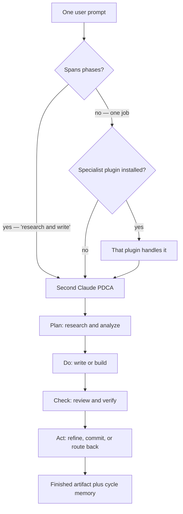
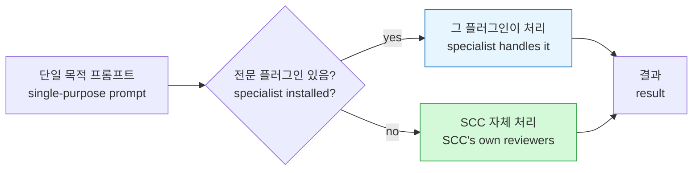

[English](README.md) | [한국어](README.ko.md)


---

# Second Claude Code — PDCA loop for knowledge work

A control loop that sits **on** Claude Code. Not a second agent OS. Not a session runtime.

You type one prompt. Research runs. A draft is written. Reviewers attack it. Failures go back to the phase that caused them. That loop is the product.

It does **not** fork sessions, collect per-agent trajectories, or swap Claude for Codex or DeepSeek Harness. Those jobs belong to a harness (Ouroboros, DSH). This plugin judges **artifacts**.

Pokemon names are **job labels**. `Agent(subagent_type: "eevee")` fails. Skills dispatch roles (`researcher`, `writer`, `deep-reviewer`). See [agents/README.md](agents/README.md).

[](https://www.scenesteller.com/studio/share/G2vdkxkjpj)
<sub>Image created with [SceneSteller](https://www.scenesteller.com/studio/share/G2vdkxkjpj)</sub>


[Docs](docs/architecture.md) · [한국어 문서](docs/architecture.ko.md) · [User Manual](docs/notion-manual.md) · [사용 매뉴얼](docs/notion-manual.ko.md) · [Skill Guides](docs/skills/) · [GitHub Issues](https://github.com/unclejobs-ai/second-claude-code/issues) · [한국어 README](README.ko.md)

---

## System at a Glance


```mermaid
flowchart TB
    U[One user prompt] --> R{Spans phases?}
    R -->|"yes — 'research and write'"| P[Second Claude PDCA]
    R -->|"no — one job"| O{Specialist plugin installed?}
    O -->|yes| E[That plugin handles it]
    O -->|no| P
    E --> P
    P --> PLAN[Plan: research and analyze]
    PLAN --> DO[Do: write or build]
    DO --> CHECK[Check: review and verify]
    CHECK --> ACT[Act: refine, commit, or route back]
    ACT --> OUT[Finished artifact plus cycle memory]
```

Second Claude Code is the control loop.

### What this is / is not

| It is | It is not |
|---|---|
| Plan → Do → Check → Act around a file | An agent runtime with its own session log |
| Same-host Claude subagents, results in files | Session fork / Trajectory (that is DSH) |
| Length floors and false-consensus checks | A second Ouroboros |
| `unblock` when a URL is gated | A scraper product |

Reviewers share the host conversation. They return an envelope. They do not share a live whiteboard. If every reviewer says APPROVED with zero findings, that is a rubber stamp — not a pass.

Hard floors (body only): newsletter **10000** chars, threads/article **4000**, report **5000**. Below the floor the Do gate fails. Do not pad.

---

## What You Get With Nothing Else Installed

**Everything below runs on this plugin alone.** No other plugin, no API key, no service.

| | |
|---|---|
| **It refuses its own output** | Five reviewers with distinct lenses attack every draft — logic, weak points, facts, voice, structure. A review that returns zero findings is treated as a rubber stamp, not a pass. |
| **Failures route by cause** | A thin brief goes back to Plan. A botched execution goes back to Do. A rough edge goes to Refine. Not everything is a "try again". |
| **Gates are checks, not vibes** | Plan cannot reach Do without 5 distinct sources and an approved plan. Do cannot reach Check without a complete artifact. Each gate names what is missing. |
| **It learns your voice** | `SOUL.md` holds your tone rules and anti-patterns, and the tone reviewer enforces them against your writing, not a generic style guide. |
| **The run leaves a record** | Which gates fired, what each reviewer caught, every re-entry and why. Exportable as one shareable page. |

The point is not that it writes. It is that **it will not let itself hand you the first draft.**

### Installed plugins make it faster, not functional

If you happen to have `coderabbit`, `commit-commands`, or `frontend-design` installed, single-purpose prompts route there instead of to the built-in equivalent — a specialist beats a generalist at its one job.

**If you have none of them, nothing degrades.** The orchestrator finds no external match and the built-in reviewers, writer, and committer handle it. Cross-plugin dispatch is an accelerant on top of a complete system, not a dependency.


```mermaid
flowchart LR
    P["단일 목적 프롬프트<br/>single-purpose prompt"] --> Q{"전문 플러그인 있음?<br/>specialist installed?"}
    Q -->|yes| E["그 플러그인이 처리<br/>specialist handles it"]
    Q -->|no| B["SCC 자체 처리<br/>SCC's own reviewers"]
    E --> R["결과<br/>result"]
    B --> R

    style B fill:#d3f9d8,stroke:#2f9e44
    style E fill:#e7f5ff,stroke:#1971c2
```

---

## Now (2026-08-18)

v2.2.0. 18 skills. Body floors: newsletter 10000 / article 4000 / report 5000 chars. Zero-finding reviews fail.

Claude Code **2.1.232+** forks subagents by default (`subagent_type: "fork"` keeps the parent prefix cache). SCC does not implement that fork. Host isolation got better; we still judge files, not session logs. Cross-session `SendMessage` is a host feature — do not treat PDCA cycle memory as a substitute.

History: [CHANGELOG.md](CHANGELOG.md).

---

## Quick Start

**1. Install**

```bash
claude plugin add github:unclejobs-ai/second-claude-code
```

**2. Verify** — start a new session and look for this in the context injection:

```
# Second Claude Code — PDCA loop
Control loop on Claude Code, not a second agent OS.
```

Nothing? Run `claude plugin list` to check.

**3. Just talk**

```
Research the current state of AI agent frameworks and write a report
```

The auto-router picks the right skill. No slash commands to memorize. Korean works too:

```
AI 에이전트 알아보고 보고서 써줘
```

---

## Your First PDCA Cycle

Here's what happens under the hood when you run a full cycle. The memory system records everything automatically.

```
You: "Research AI agents and write a report"

1. pdca_start_run({ topic: "AI agents report", domain: "content" })
   → Writes the active run to .data/state/pdca-active.json
   → Reads prior insights first (Read-Before-Act)

2. pdca_transition({ target_phase: "do", auto_gate: true,
                    artifacts: { plan_research: "…", plan_analysis: "…" },
                    phase_result: { sources_count: 20, plan_mode_approved: true } })
   → The plan→do gate is evaluated; on pass, the phase advances
   → The completed Plan artifact is saved to .data/cycles/cycle-001/plan.md

3. pdca_transition({ target_phase: "check", auto_gate: true,
                    artifacts: { do: "…" },
                    phase_result: { do_artifact_complete: true, plan_findings_integrated: true } })
   → Draft saved to .data/cycles/cycle-001/do.md, reviewers dispatched

4. pdca_save_insight({ cycle_id: 1, category: "quality", severity: "warning",
                      insight: "Reviewers flagged unsourced market-size claims twice" })
   → Appended to .data/cycles/insights.json
   → A category that recurs across cycles is promoted to a gotcha proposal

5. pdca_get_insights({ category: "quality" })
   → Returns insights ranked by decayed weight
   → Insights older than 30 days score lower; recent ones rank first

6. pdca_end_run()
   → Archives the final state to .data/state/pdca-last-completed.json
   → ANSI summary box printed, HTML report generated
```

After a few cycles, `.data/cycles/` looks like this:

```
.data/cycles/
├── cycle-001/
│   ├── plan.md        # Plan-phase artifact
│   ├── do.md          # Do-phase artifact
│   ├── check.md       # Check-phase artifact
│   ├── act.md         # Act-phase artifact
│   ├── metrics.json   # per-cycle metrics
│   └── events.jsonl   # phase transitions and gate decisions
├── cycle-002/
│   └── …
└── insights.json      # accumulated, decay-ranked insights
```

Every cycle feeds the next. No manual knowledge management required.

---

## The Problem This Solves

You've been using AI to write, research, and analyze. Each step works well on its own. The problem is in between — you're the one copying outputs, rephrasing prompts, doing five context switches for one piece of content. Each plugin works alone. Research doesn't know about writing. Writing doesn't know about review. You're the integration layer, and that tax adds up fast.

Second Claude Code eliminates the handoffs. You state the goal once, and the system runs the research, production, review, and revision cycle end to end.

---

## How It Works

### PDCA Execution Model

PDCA (Plan-Do-Check-Act) is the execution model. It's not a metaphor — every prompt runs through these four phases with hard gates between them.

```
You: "Research AI agents and write a report"

[Plan]  Crawl 20+ sources, find patterns, synthesize a structured brief
        ↓ gate: research brief must exist before writing starts
[Do]    Write a full draft grounded in the research
        ↓ gate: draft goes to review, not to you
[Check] 3-5 specialized reviewers run in parallel
        ↓ gate: score + vote thresholds + stage contract must pass; Critical still blocks
[Act]   Action Router reads the review feedback:
        → local issue? Refine and re-submit.
        → wrong phase or missing context? Pivot.
        → fully clear? Proceed.

You get the final output. Reviewed. Fact-checked. Refined.
```

The key is the Action Router. When review finds problems, it classifies the root cause and routes back to the right phase. A research gap goes back to research, not to a generic "try again." That's why the second pass through PDCA is dramatically better than the first.


---

### PDCA Cycle Memory

Every PDCA run is now a learning event, not a throwaway session.

**Auto-save on transition.** Each phase transition writes the completed phase's artifact to `.data/cycles/cycle-NNN/<phase>.md` and logs the transition to that cycle's `events.jsonl`. Metrics land in `metrics.json`. No manual saves.

**Read-Before-Act.** When a run starts, the system reads `.data/cycles/insights.json` for prior lessons, ranked by decayed weight, so a new run begins with what earlier runs learned. Cold starts disappear after your first run.

**Self-Evolution.** Two mechanisms keep the insight pool healthy:

- **Time decay** — insights older than 30 days score progressively lower in relevance rankings. Stale patterns don't crowd out fresh discoveries.
- **Gotcha proposals** — when a category keeps producing critical insights across cycles, the system writes a proposal to `.data/proposals/gotchas-<category>.md` for the maintainer to promote into a reusable checklist item.

The result: the 10th cycle is meaningfully smarter than the 1st.

```
.data/cycles/
├── cycle-001/                  # one directory per cycle
│   ├── plan.md / do.md / check.md / act.md
│   ├── metrics.json
│   └── events.jsonl
└── insights.json               # accumulated insights, each:
    # { category: process|technical|quality, severity, insight, weight, ... }
```

---

### Domain-Aware PDCA

Not all work is the same. Writing an article and shipping a code change have different quality criteria. Domain-aware PDCA enforces this from phase one.

**4 domains, 4 sets of stage contracts:**

| Domain | What it covers | Plan contract | Do contract | Check contract | Act contract |
|---|---|---|---|---|---|
| **code** | Features, bug fixes, refactors | Executable plan + approval gate for risky work | Scoped branch/worktree, tests, stage report when needed | Validator/reviewer proof, not worker self-report | Clean/simplify, handoff, CI or local verification |
| **content** | Articles, reports, newsletters | Research brief with sources | Full draft with citations | 5-reviewer consensus: logic, facts, tone | Editorial polish, publish-ready |
| **analysis** | SWOT, frameworks, market intel | Data collection + framework selection | Structured analysis output | Validity check: methodology, numbers | Actionable recommendations |
| **pipeline** | Workflows, automation, infra | Pipeline spec + rollback plan | Implementation + dry run | Integration test + load test | Deployment checklist verified |

Each domain loads its contracts from `config/stage-contracts.json`. The contracts define:
- **Entry criteria** — what must exist before a phase starts
- **Exit criteria** — what must pass before the gate opens
- **DoD (Definition of Done)** — the checklist that reviewers evaluate

When you say `pdca_start_run(domain="code")`, the system loads code-specific contracts and enforces them at every transition. No manual configuration needed per run.

#### Code Engineering Lane

The `code` domain uses the Code Engineering Lane: a PDCA specialization that absorbs the useful parts of `engineering-discipline` and `Hyper-Waterfall` without replacing Second Claude's cycle. It keeps Plan -> Do -> Check -> Act, but tightens code work around executable acceptance criteria, worker-validator separation, stage reports, human approval gates for broad work, cleanup/simplification, and issue/PR/local handoff state.

---

### Agent System

17 specialized agents handle each PDCA phase. Each agent has a focused system prompt and limited tool access — a writer doesn't have access to web search, a reviewer doesn't write.

**3 model tiers — cost-optimized, not all opus:**

| Tier | Agents | Assigned work |
|---|---|---|
| **opus** (4 agents) | Xatu, Smeargle, Ditto, Pikachu | Deep reasoning, long-form writing, editing, memory synthesis |
| **sonnet** (11 agents) | Eevee, Alakazam, Mewtwo, Arceus, Absol, Porygon, Machamp, Magnezone, Deoxys, Jigglypuff, Unown | Analysis, strategy, research, review, infrastructure |
| **haiku** (2 agents) | Noctowl, Abra | Search and knowledge routing — collection, not judgment |

Pokemon names are deliberate — when you're reading logs, "Xatu found a logic gap" is easier to track than "reviewer-3 found issue."

**Agent dispatch flow:**

```
User prompt
  ↓
Auto-router (hook: prompt-detect.mjs)
  ↓
PDCA Orchestrator
  ├── Plan: Eevee (sonnet) researches → Alakazam (sonnet) analyzes
  ├── Do:   Smeargle (opus) writes the full draft
  ├── Check: 5 reviewers in parallel
  │          Xatu (opus) ─── logic + completeness
  │          Absol (sonnet) ─ weak points
  │          Porygon (sonnet) fact-check
  │          Jigglypuff (sonnet) tone
  │          Unown (sonnet) ─── structure
  └── Act:  Action Router → Ditto (opus) edits
```

---

### Quality Gates

Every phase transition is gated. Outputs don't reach you until the review gate and the stage contract both clear.

Each reviewer emits structured JSON: a score from 0.0 to 1.0, plus findings tagged by severity — **Critical**, **Warning**, or **Nitpick**.

**Consensus logic:**
- Presets define both a minimum score threshold and a minimum pass-vote threshold
- Vote thresholds use corrected `Math.round` behavior, so a `2/3` preset now means `2` approvals instead of accidental unanimity
- Critical findings still block the transition regardless of score or votes
- Gate evaluation is dual-track: score says how good the output is, votes say how many reviewers agree it is ready

**Stage contracts:** `config/stage-contracts.json` defines domain-aware exit criteria for content work versus code work. That lets the same PDCA loop enforce different Definition-of-Done expectations depending on what the user asked for.

**Transition outcomes:** `pdca_transition` now supports a three-way decision model:
- **PROCEED** — gate passed, contract passed, move forward
- **REFINE** — the artifact is close, so the editor gets another bounded improvement round
- **PIVOT** — the failure points to the wrong phase or wrong approach, so the loop re-enters a different phase with max pivot/refine counts enforcing bounded retries

**Definition of Done (DoD):** The `refine` skill accepts `--dod` — a semicolon-separated checklist of success criteria (e.g., `"no factual errors; every section has examples"`). Reviewers evaluate each criterion as PASS/FAIL per iteration. The editor prioritizes failing criteria, and refine only exits when all DoD criteria pass alongside the verdict target.

---

### Hook System

8 lifecycle hooks run automatically. You don't call them; they fire at the right moment.

| Hook | When it fires | What it does |
|---|---|---|
| **SessionStart** | Session opens | Banner display, PDCA state initialization |
| **UserPromptSubmit** | Every prompt | Auto-router: external plugin dispatch + PDCA compound + single-skill patterns |
| **SubagentStart** | Agent spawns | Review session context injection into agent system prompt |
| **SubagentStop** | Agent completes | Reviewer consensus aggregation, score accumulation |
| **Stop** | Session ends | State cleanup, output save |
| **StopFailure** | Check phase gate fails | Quality gate enforcement — blocks output delivery |
| **PreCompact** | Before context compression | PDCA state serialization |
| **PostCompact** | After context compression | PDCA state restoration, mid-cycle resume |

The `UserPromptSubmit` auto-router checks for a compound intent first. "Research and write" matches there, routes to `pdca`, and returns — the external plan is never even computed, because the cycle is what adds the review and the correction loop. Only a single-purpose prompt reaches the next stage: it is scored against the built-in skills, then `getDispatchPlan()` looks for an installed specialist. A strong external match outranks the built-in choice and gets an `[ORCHESTRATOR]` instruction; otherwise the built-in one runs. So "posthog event analysis" goes to the PostHog plugin when it is installed, while "research and write" stays with PDCA either way. Routing decisions include **confidence scoring** for observability, and corrections are captured as soul observations for long-term learning.

---

### Visualization

Session end now produces two operator-facing views:

- An ANSI summary box in the terminal for fast at-a-glance cycle status
- A dark-theme HTML cycle report in `.data/reports/` with Mermaid flowcharts and Chart.js trend visuals

Example terminal summary:

```text
┌──────────────── PDCA Summary ────────────────┐
│ Cycle 2   Verdict: REFINE   Confidence: STRONG │
│ Phases: Plan ✓  Do ✓  Check !  Act ↺          │
│ Votes: 2/3  Score: 0.74  Time: 4m  Cost: $0.41 │
│ Report: .data/reports/cycle-2.html            │
└──────────────────────────────────────────────┘
```

The HTML report is auto-generated on session end, so maintainers get a persistent artifact instead of relying on transient terminal output.

---

### MCP State Layer

A dedicated `pdca-state` MCP server (stdio transport, modular architecture with 6 handler modules in `mcp/lib/`) manages persistent state across the session.

**31 tools** across PDCA state, cycle memory, soul, project memory, daemon control, session recall, and plugin orchestration surfaces.

**Core PDCA tools:**

| Tool | Purpose |
|---|---|
| `pdca_get_state` | Read current PDCA state |
| `pdca_start_run` | Initialize a new cycle |
| `pdca_transition` | Advance to next phase — `auto_gate` evaluates the gate, `phase_result` records the gate inputs |
| `pdca_check_gate` | Evaluate gate conditions |
| `pdca_list_runs` | Query PDCA run history |
| `pdca_end_run` | Complete the cycle |
| `pdca_update_stuck_flags` | Record a stuck/failed cycle |

**Cycle Memory tools (new in v1.0.0):**

| Tool | Purpose |
|---|---|
| `pdca_get_cycle_history` | Retrieve past cycle records — filter by domain, date range, or verdict |
| `pdca_save_insight` | Persist a lesson, gotcha, or preference to the domain insight store |
| `pdca_get_insights` | Fetch ranked insights for a domain with time-decay scoring applied |

**Orchestrator tools (new in v1.4.0):**

| Tool | Purpose |
|---|---|
| `orchestrator_list_plugins` | Inventory installed plugin skills, commands, MCP servers, and agents |
| `orchestrator_get_plugin` | Inspect one plugin's discovered capabilities |
| `orchestrator_route` | Return ranked `Skill:` / slash-command dispatch instructions for a keyword or PDCA phase |
| `orchestrator_health` | Summarize plugin ecosystem readiness |

**Event sourcing:** Every PDCA cycle is logged — phase transitions, gate decisions, review scores, action routes. You can query run history and spot recurring failure patterns.

**Crash recovery:** If the session restarts mid-cycle (context compression, network drop), `PostCompact` restores the last known state and resumes from where it stopped — not from the beginning.

**Playwright MCP** (optional): enables browser automation for JavaScript-heavy research targets. Separate setup required.

### Memory Boundary

Second Claude Code keeps two memory layers separate on purpose:

- `soul` stores persistent user identity and preference signals.
- Project recall comes from PDCA recovery state plus MMBridge continuity features such as memory search, handoff, and resume.

This project can borrow ideas from standalone agent runtimes, but it should not embed a second runtime inside the Claude Code plugin model.

---

## Pick Your Skill

You don't need to think about phases or cycles. Just say what you want.

I use `write` when I have a topic and want a finished piece by the end of the conversation. I use `review` when I already have a draft and want independent feedback before publishing. For anything bigger — research *then* write *then* review — `pdca` handles the whole thing.

| I want to... | Skill | What you get |
|---|---|---|
| Turn a vague idea into an approval-gated spec | `deep-interview` | Socratic questions, ambiguity scores, and a clear execution handoff |
| Run the full research → write → review → improve cycle | `pdca` | Researched, reviewed, refined output — one prompt |
| Dig into a topic | `research` | 20+ sources crawled, patterns synthesized, brief delivered |
| Apply strategic frameworks — SWOT, Porter, RICE, and more | `analyze` | Structured strategic analysis from 15 built-in frameworks |
| Write an article, report, or newsletter | `write` | Research-backed, review-verified output |
| Get 3-5 independent perspectives on a draft | `review` | Parallel review with consensus voting |
| Refine a draft to a target score | `refine` | Iterative improvement until reviewers pass — supports `--dod` for structured success criteria |
| Debug a failing workflow before fixing it | `investigate` | Root-cause report with evidence, hypotheses, and verification |
| Benchmark and evolve prompt assets | `loop` | Fixed-suite optimization with isolated winner branches |
| Evolve a prompt asset that keeps causing the same failure | `evolve` | Ouroboros maintainer loop — harvest real gate failures, maintainer-authored structural check, isolated winner branch |
| Save a URL, note, or excerpt | `collect` | PARA-classified knowledge capture |
| Chain skills into a reusable workflow | `workflow` | Custom multi-step automation |
| Find and install new capabilities | `discover` | Skill discovery and installation |
| Let the system learn your preferences | `soul` | Adaptive personalization across sessions |
| Translate between English and Korean | `translate` | Soul-aware EN↔KO translation with style and format control |
| Break a large task into parallel units | `batch` | Parallel decomposition and reassembly |
| Fetch a URL that WebFetch cannot crack | `unblock` | Zero-key adaptive chain through public APIs, TLS impersonation, headless browsers, and free archives |

Every skill responds to natural language. Slash commands work too: `/scc:deep-interview`, `/scc:write`, `/scc:review`, `/scc:translate`, etc. ~130 trigger patterns across English and Korean.

### Karpathy-Style Loop for Maintainers

`loop` is the maintainer-facing optimization surface. It does not route from normal user prompts in v1. Instead, it runs a fixed benchmark suite against prompt assets such as `skills/**/SKILL.md`, `commands/*.md`, `agents/*.md`, and `templates/*.md`, then promotes the best candidate only inside an isolated `codex/loop-...` branch.

Typical flow:

```bash
/scc:loop list-suites
/scc:loop show-suite write-core
/scc:loop run write-core --targets skills/write/SKILL.md,commands/write.md --parallel 2 --max-generations 2
```

The run writes resumable state to `.data/state/loop-active.json` and captures artifacts in `.captures/loop-<run_id>/`, including the leaderboard, score history, and winner diff.

### Ouroboros Loop — `evolve`

`evolve` closes the self-improvement ring on top of `loop`. When the same PDCA gate keeps failing across runs, it harvests those real failures (`list-failures`), lets the **maintainer** hand-author a structural check (`harvest <id> --assertion …`), then hands the asset to the unmodified `loop` engine to evolve on an isolated branch. The optimizer never authors its own success criterion — the maintainer does — and merging the winner stays a manual decision after reading `winner.diff`. Slash-only, like `loop`. See [docs/proposals/evolve-ouroboros-spec.md](docs/proposals/evolve-ouroboros-spec.md) for the full design and its adversarial-review history.

```bash
/scc:evolve list-failures
/scc:evolve harvest <id> --assertion '/scc:'
/scc:evolve run evolve-<id>
```

```
"Research and write about AI agents"       →  pdca (full cycle)
"Write an article about vibe coding"       →  write
"SWOT으로 분석해"                           →  analyze
"Review this draft"                        →  review
```

---

## The Review System

Ever published something and found an obvious flaw ten minutes later?

Most AI tools generate and hand it to you. Second Claude Code generates, then **reviews its own output** before you see it. Every output passes through a multi-agent review — 3-5 specialized reviewers running in parallel, each covering a different quality dimension:

| Reviewer | What it checks |
|---|---|
| **Deep Reviewer** (Xatu) | Logic, completeness, argument flow |
| **Devil's Advocate** (Absol) | Finds the weakest point and attacks it |
| **Fact Checker** (Porygon) | Every number, claim, and source |
| **Tone Guardian** (Jigglypuff) | Voice consistency, audience fit |
| **Structure Analyst** (Unown) | Readability, organization, flow |

**Consensus gate:** average score >= 0.7 AND no Critical findings = approved. Any Critical finding = must fix. No exceptions, even if you're in a hurry.

I run `full` before publishing anything externally. For internal drafts, `quick` is enough — the advocate and fact checker catch the worst problems in under a minute.


<details>
<summary><strong>Review presets</strong></summary>

| Preset | Reviewers | Best for |
|---|---|---|
| `content` | Deep + Advocate + Tone | Articles, blogs, newsletters |
| `strategy` | Deep + Advocate + Facts | PRDs, SWOTs, strategy docs |
| `code` | Deep + Facts + Structure | Code review |
| `security` | Deep + Facts + Structure | Security audit (CWE classification, OWASP Top 10) |
| `academic` | Deep + Facts + Structure | Academic papers, research outputs, citations |
| `quick` | Advocate + Facts | Fast validation |
| `full` | all 5 | Final pre-publish pass |

`--external` adds cross-model review via MMBridge (Kimi, Qwen, Gemini, Codex). The MMBridge integration now sits behind the Adapter Protocol (`Cli`, `Stub`, `Recording`), so live external runs stay optional while tests keep a deterministic stubbed path. Separate setup is still required for real MMBridge execution.

</details>

---

## How It Thinks

Three ideas drive the system's design:

**Eighteen skills, not eighty.** Each one is deep — references, gotchas, quality gates built in. You never wonder which of 80 skills to pick. Say what you want, and one of eighteen handles it.

**Every output gets reviewed.** This isn't a suggestion. Quality gates block you from skipping review. A draft that hasn't passed the consensus gate doesn't reach you.

**Failures get routed, not retried.** When review finds problems, the Action Router classifies the root cause. Research gap? Back to Plan. Missing section? Back to Do. Polish issue? Refine. Not every problem is a refine problem — treating them all the same wastes cycles.

---

## Running Work in the Background

A long PDCA cycle does not have to hold your session. Queue it, then start it as a background agent:

```bash
# 1. Queue the run — returns the command that starts it
#    (MCP: daemon_start_background_run { "workflow_name": "weekly-digest" })
#    → handoff: claude --bg "/scc:workflow run weekly-digest"

# 2. Run that command, then manage it like any other background agent
claude --bg "/scc:workflow run weekly-digest"
claude agents
```

**The queue does not execute anything, and that is deliberate.** Claude Code already ships background agents — reimplementing them inside a plugin would mean worse lifecycle handling, no crash recovery, and no cost control, for a feature that already exists.

The stronger reason is consent. This plugin gates external actions — publishing to Notion, pushing to GitHub, sending mail — behind explicit approval *in the conversation*. A background executor has no conversation in which to ask. It would either bypass that gate or be unable to do anything worth scheduling. So the queue records the intent and hands you the command; you decide when it runs.

---

## Skill Composition

Skills call each other. That's where the system becomes more than the sum of its parts.

| Pattern | What happens | Good for |
|---|---|---|
| Full PDCA | research → analyze → write → review → refine | Publish a researched article |
| Quick Check | review → refine | Polish an existing draft |
| Plan Only | research → analyze | Understand a market before committing |
| Autopilot | `workflow run autopilot --topic "..."` | End-to-end with no intervention |

I use Full PDCA for anything external-facing. For internal notes, `write` alone is enough — it still runs research and review internally.

---

## Agent Roster

17 jobs. 4 opus / 11 sonnet / 2 haiku. Dispatch the `name`, not the filename. See [agents/README.md](agents/README.md).

| Phase | Job | File | Model |
|---|---|---|---|
| **Plan** | researcher | eevee | sonnet |
| | skill-searcher | noctowl | haiku |
| | analyst | alakazam | sonnet |
| | strategist | mewtwo | sonnet |
| **Do** | writer | smeargle | opus |
| | pipeline-orchestrator | arceus | sonnet |
| **Check** | deep-reviewer | xatu | opus |
| | devil-advocate | absol | sonnet |
| | fact-checker | porygon | sonnet |
| | tone-guardian | jigglypuff | sonnet |
| | structure-analyst | unown | sonnet |
| **Act** | editor | ditto | opus |
| **Infra** | pipeline-step-executor | machamp | sonnet |
| | skill-inspector | magnezone | sonnet |
| | skill-evaluator | deoxys | sonnet |
| | knowledge-connector | abra | haiku |
| | soul-keeper | pikachu | opus |


[Full architecture docs →](docs/architecture.md)

---

## Configuration

Works out of the box. One JSON file to tune.

```jsonc
{
  "defaults": {
    "research_depth": "medium",     // "shallow" | "medium" | "deep"
    "write_voice": "peer-mentor",   // writing tone
    "review_preset": "content",     // "content" | "strategy" | "code" | "quick" | "full"
    "refine_max_iterations": 3,     // max rounds before stopping
    "publish_target": "file"        // "file" | "notion"
  },
  "quality_gate": {
    "consensus_threshold": 0.67,    // fraction of reviewers that must pass
    "external_reviewers": []        // ["kimi", "qwen", "gemini", "codex"] via MMBridge
  }
}
```

Every field is optional. Delete what you don't care about. I set `refine_max_iterations` to 2 for quick tasks and 5 for anything going to a client.

---

## Design Decisions & Trade-offs

Every limitation is a choice.

- **Auto-routing handles ~95% of prompts correctly.** For edge cases, explicit `/scc:*` commands give full control.
- **Lightweight agents keep costs low** for high-volume tasks like fact-checking. Trade-off: with many plugins active, context limits can be tight. Disable unused plugins to keep headroom.
- **Claude Code is the primary platform,** fully tested. OpenClaw, Codex, and Gemini CLI work via standard protocols but are experimental.
- **Subagent results arrive after completion,** not incrementally. Streaming partial results would break the quality gate model.
- **Review findings are in English** regardless of input language. Korean output is planned.

If one of these bothers you, [open an issue](https://github.com/unclejobs-ai/second-claude-code/issues). The reasoning might change with new evidence.

---

## Compatibility

Built for Claude Code. Compatible with anything that reads SKILL.md or speaks ACP.

| Platform | Install | Status |
|---|---|---|
| **Claude Code** (primary) | `claude plugin add github:unclejobs-ai/second-claude-code` | Tested |
| **OpenClaw** | Standard ACP protocol — auto-detected | Experimental |
| **Codex** | SKILL.md compatible | Experimental |
| **Gemini CLI** | SKILL.md compatible | Experimental |

---

## Contributing

Issues and pull requests welcome at [github.com/unclejobs-ai/second-claude-code](https://github.com/unclejobs-ai/second-claude-code).

Built by [Unclejobs](https://github.com/unclejobs-ai). MIT License.

---

<details>
<summary><strong>15 Strategic Frameworks</strong></summary>

`/scc:analyze` supports 15 built-in frameworks:

| Category | Frameworks |
|---|---|
| **Strategy** | ansoff, porter, pestle, north-star, value-prop |
| **Planning** | prd, okr, lean-canvas, gtm, battlecard |
| **Prioritization** | rice, pricing |
| **Analysis** | swot, persona, journey-map |

Each framework lives in `skills/analyze/references/frameworks/`. The skill auto-selects from your prompt, or you can specify:

```bash
/scc:analyze porter "cloud infrastructure market"
/scc:analyze rice --input features.md
```

</details>

Full changelog: [CHANGELOG.md](CHANGELOG.md)
