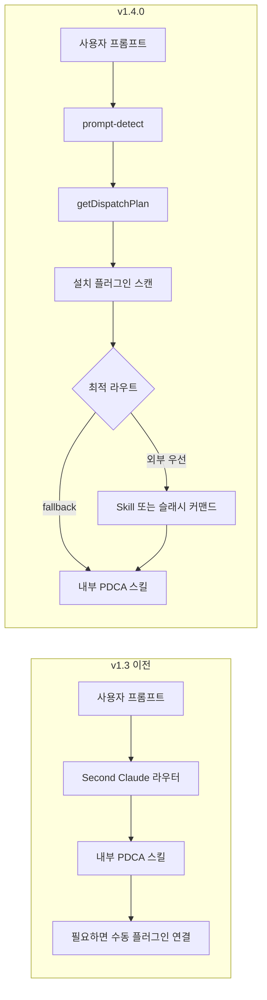

# 릴리스 노트 - v1.4.0

[English](RELEASE-v1.4.0.md) | **한국어**

v1.4.0은 Cross-Plugin Orchestrator를 추가합니다. Second Claude Code가 설치된 Claude Code 플러그인을 런타임에 발견하고, 현재 프롬프트나 PDCA 페이즈와 스킬/커맨드를 점수화한 뒤, 내부 fallback 전에 정확한 디스패치 지시를 주입합니다.

## 이전 / 이후 흐름

핵심 변화는 앞단 라우팅입니다. 설치된 플러그인 capability를 먼저 발견하고 점수화한 뒤, 더 나은 외부 경로가 없을 때 내부 PDCA 경로로 내려갑니다.

## 바뀐 점

- **런타임 플러그인 발견**: `hooks/lib/plugin-discovery.mjs`가 설치된 플러그인, 스킬, 커맨드, 에이전트, MCP 선언을 파일시스템에서 스캔합니다.
- **의도 점수화**: `getDispatchPlan()`이 키워드와 PDCA 페이즈를 정규화하고, 플러그인 capability를 점수화하고, preferred-plugin 보정을 적용한 뒤 `Skill:` 또는 슬래시 커맨드 호출 문자열을 정렬해 반환합니다.
- **프롬프트 레벨 외부 디스패치**: 설치된 외부 capability가 자체 처리보다 먼저 실행되어야 하면 `hooks/prompt-detect.mjs`가 `[ORCHESTRATOR]` 지시를 주입합니다.
- **PDCA 페이즈 라우팅**: 설치된 플러그인이 점수화에서 이기면 Plan은 `Skill: claude-mem-knowledge-agent`, Do는 `Skill: frontend-design-frontend-design`, Check는 `Skill: coderabbit-code-review`, Act는 `/commit-commands:commit`으로 갑니다.
- **직접 플러그인 매칭**: `posthog event analysis` -> `Skill: posthog-exploring-autocapture-events`처럼 built-in lifecycle 의도가 아니어도 강한 일반 플러그인 매칭이 동작합니다.
- **짧은 키워드 guard**: 작은 토큰이 긴 단어 안에서 우연히 매칭되는 일을 단어 경계 검사로 막습니다.
- **Soul feedback binding**: session-start가 readiness, retro/shipping signal, 진행 컨텍스트를 soul feedback loop로 표시합니다.

## MCP 표면

`pdca-state` 서버는 이제 **31개 MCP 도구**를 노출합니다.

- PDCA 상태 도구 9개
- 사이클 메모리 도구 3개
- Soul 도구 6개
- 프로젝트 메모리 도구 2개
- 데몬/세션 도구 7개
- 오케스트레이터 도구 4개: `orchestrator_list_plugins`, `orchestrator_get_plugin`, `orchestrator_route`, `orchestrator_health`

## 검증

- `npm test`: 367개 테스트, 366개 통과, 1개 스킵.
- 실제 Claude Code 플러그인 14개, 발견된 스킬 67개, MCP 서버 3개 기준으로 검증.
- `orchestrator_route phase=check`는 `Skill: coderabbit-code-review`로 디스패치.
- `orchestrator_route phase=act`는 `/commit-commands:commit`으로 디스패치.
- Prompt detection은 한국어 리뷰, 커밋, 디자인, 리서치 프롬프트를 내부 fallback 전에 외부 capability로 라우팅합니다.

## 업데이트된 문서

- [README.md](../README.md)
- [README.ko.md](../README.ko.md)
- [CHANGELOG.md](../CHANGELOG.md)
- [architecture.md](architecture.md)
- [architecture.ko.md](architecture.ko.md)
- [orchestrator-architecture.md](orchestrator-architecture.md)
- [orchestrator-architecture.ko.md](orchestrator-architecture.ko.md)
- [skills/pdca.md](skills/pdca.md)
- [skills/pdca.ko.md](skills/pdca.ko.md)
