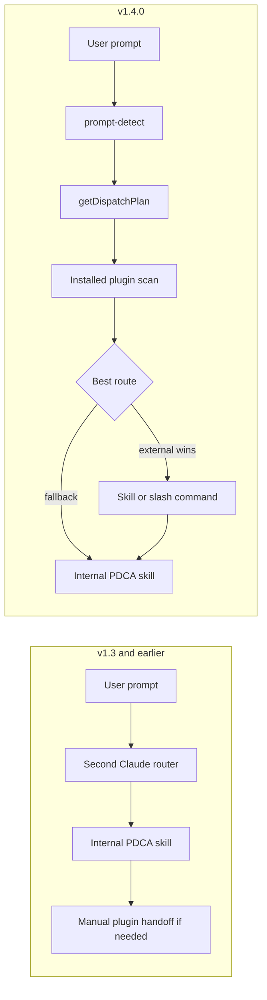

# Release Notes - v1.4.0

[English](RELEASE-v1.4.0.md) | [한국어](RELEASE-v1.4.0.ko.md)

v1.4.0 adds the Cross-Plugin Orchestrator. Second Claude Code now discovers installed Claude Code plugins at runtime, scores their skills and commands against the current prompt or PDCA phase, and injects exact dispatch instructions before internal fallback.

## Before / After Flow

The behavioral change is front-loaded routing: installed plugin capabilities are discovered and scored before Second Claude falls back to its internal PDCA path.

## What Changed

- **Runtime plugin discovery**: `hooks/lib/plugin-discovery.mjs` scans installed plugins, skills, commands, agents, and MCP declarations from the filesystem.
- **Intent scoring**: `getDispatchPlan()` normalizes keywords and PDCA phases, scores plugin capabilities, applies preferred-plugin boosts, and returns ranked `Skill:` or slash-command invocation strings.
- **Prompt-level external dispatch**: `hooks/prompt-detect.mjs` injects an `[ORCHESTRATOR]` instruction when an installed external capability should run before Second Claude self-processing.
- **PDCA phase routing**: Plan routes to `Skill: claude-mem-knowledge-agent`, Do to `Skill: frontend-design-frontend-design`, Check to `Skill: coderabbit-code-review`, and Act to `/commit-commands:commit` when those plugins are installed and win scoring.
- **Direct plugin matching**: strong generic plugin matches work outside the built-in lifecycle intents, such as `posthog event analysis` -> `Skill: posthog-exploring-autocapture-events`.
- **Short-keyword guard**: boundary checks prevent accidental matches from tiny tokens embedded inside longer words.
- **Soul feedback binding**: session-start now surfaces readiness, retro/shipping signal, and progress context through the soul feedback loop.

## MCP Surface

The `pdca-state` server now exposes **31 MCP tools**:

- 9 PDCA state tools
- 3 cycle memory tools
- 6 soul tools
- 2 project memory tools
- 7 daemon/session tools
- 4 orchestrator tools: `orchestrator_list_plugins`, `orchestrator_get_plugin`, `orchestrator_route`, `orchestrator_health`

## Verification

- `npm test`: 367 tests, 366 passing, 1 skipped.
- Verified against 14 real Claude Code plugins, 67 discovered skills, and 3 MCP servers.
- `orchestrator_route phase=check` dispatches to `Skill: coderabbit-code-review`.
- `orchestrator_route phase=act` dispatches to `/commit-commands:commit`.
- Prompt detection routes Korean review, commit, design, and research prompts to external capabilities before internal fallback.

## Updated Documents

- [README.md](../README.md)
- [README.ko.md](../README.ko.md)
- [CHANGELOG.md](../CHANGELOG.md)
- [architecture.md](architecture.md)
- [architecture.ko.md](architecture.ko.md)
- [orchestrator-architecture.md](orchestrator-architecture.md)
- [orchestrator-architecture.ko.md](orchestrator-architecture.ko.md)
- [skills/pdca.md](skills/pdca.md)
- [skills/pdca.ko.md](skills/pdca.ko.md)
