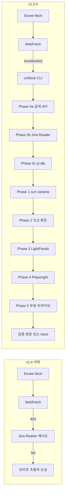

# 릴리스 노트 - v1.5.0

[English](RELEASE-v1.5.0.md) | **한국어**

v1.5.0은 **`unblock` 스킬**을 추가합니다. 9-phase zero-key 적응 fetch chain
으로, 차단된 URL을 검증된 본문으로 바꿉니다. Eevee 리서처와 자동 라우터가
fetch 실패 시 투명하게 호출합니다. API 키 0개. 유료 provider는
`--allow-paid` 플래그로 게이팅.

## 왜?

v1.5.0 이전에는 `/second-claude-code:research` 안에서 `WebFetch` 실패가
PDCA Plan phase를 그대로 좌초시켰습니다. Naver / Coupang / LinkedIn / fmkorea / X 의 단일 403이 리서치 브리프 품질을 조용히 떨어뜨렸어요. Eevee는 Jina Reader로 한 번 fallback하고 멈췄죠.

v1.5.0은 이 갭을 끝까지 닫습니다. 적대적 URL은 최대 9개의 escalating probe
— 공개 API, Jina, yt-dlp, header-diverse curl, TLS impersonation, LightPanda,
real Chrome, 무료 아카이브 클러스터, 옵션 유료 — 를 거쳐 검증된 본문이 나오거나
모든 probe 소진 후 구조화된 trace를 반환합니다.

## Before / After

## 변경사항

- **`unblock` 스킬** — 16번째 스킬. 9-phase 적응 fetch chain. API 키 0개.
- **`/second-claude-code:unblock`** — 직접 CLI 호출용 슬래시 커맨드.
- **자동 라우터 패턴** — `hooks/prompt-detect.mjs`가 적대적 URL 의도 (영어+한국어)를 감지해 unblock으로 디스패치.
- **Eevee 리서처 fallback** — `agents/eevee.md`가 `WebFetch` 실패 시 unblock 자동 호출. R5 (재시도 전 trace 읽기) 강제.
- **Research 스킬 와이어링** — `skills/research/SKILL.md`의 Web Engine fallback chain이 WebFetch와 Playwright 사이에 unblock을 추가.

## Phase 인벤토리

| Phase | Probe | 비용 | 키 없이 작동? |
|-------|-------|------|----------------|
| 0a | 11개 공개 API 라우트 (Reddit / HN / arXiv / Bluesky / GitHub / NPM / Stack Exchange / Wikipedia / Mastodon / Lemmy / oEmbed) | 무료 | yes |
| 0b | Jina Reader (`r.jina.ai`) | 20 RPM 무료 | yes |
| 0c | yt-dlp 메타 + 자막 (1800+ 미디어 사이트) | 무료 | yes (자동 설치) |
| 0d | Jina Search 키워드 라우팅 | 20 RPM 무료 | yes (키워드 입력) |
| 1 | curl UA × 헤더 × URL 변형 회전; 4xx 3회 연속 시 조기 bail | 무료 | yes |
| 2 | curl-impersonate TLS 회전 (chrome131 / safari17_0 / firefox133) + 쿠키 웜업 + locale 매칭 리퍼러 체인 | 무료 | yes (자동 설치) |
| 3 | LightPanda 헤드리스 (저렴한 브라우저 티어) | 무료 | yes (자동 설치) |
| 4 | Playwright 실제 Chrome + same-origin XHR 네트워크 인터셉트 (숨겨진 API 발견) | 무료 | yes (자동 설치) |
| 5 | 무료 아카이브 클러스터: Wayback + archive.today + AMP 병렬 race; RSS/Atom 디스커버리; OG-tag 구조 | 무료 | yes |
| 6 | 옵션 유료 (Tavily / Exa / Firecrawl) | 유료 | `--allow-paid` 필요 |

## 운영 강화

- **SSRF 가드** — `assertPublicUrl()`이 RFC1918 / loopback / link-local / 클라우드 메타데이터 호스트 거부. IPv6-mapped IPv4 포함. opt-out: `UNBLOCK_ALLOW_PRIVATE_HOSTS=1`.
- **`schema_version: 1` 엔벨로프** — 모든 체인 결과가 버전 매김된 shape. Forward-compatible.
- **`idempotency_key`** — `(url, maxPhase, allowPaid, device, selector, follow)`에 대한 djb2 hash. 호출자 dedupe 힌트.
- **Stagnation 감지** — 같은 fail reason 3회 시 live chain 단축 → Phase 5 archive.
- **Phase 0 재정렬** — URL host priors가 probe 순서 바꿈 (동영상 호스트는 yt-dlp 먼저, 공개 API 호스트는 public-api 먼저).
- **시그널 기반 동적 skip** — Phase 1이 200에 `stripped_too_short` 반환하면 Phase 4 직행 (SPA 패턴, 헤더 회전 무용).
- **`decisions[]` 감사 로그** — 모든 reorder / skip / stagnation 결정 기록.

## 엔지니어링 패턴

- 컨트롤-플레인 엔벨로프 (`schema_version` + `idempotency_key` + `decisions[]` 감사 로그)와 stagnation 감지 단축 회로는 AI 에이전트 컨트롤 컨트랙트 패턴을 단일 스킬 범위로 적응한 결과입니다.

## 검증

- `UNBLOCK_SKIP_NETWORK_TESTS=1 npm test` — **397 tests, 394 pass, 0 fail, 3 skipped**
- SSRF 가드: `http://169.254.169.254/...` 차단, `http://[::ffff:c0a8:0101]/...` 차단
- HN smoke: Phase 0a 298ms 승, schema_version 1, idempotency_key 채워짐
- Wikipedia smoke: Phase 0a `public-api/wikipedia` 라우트 승
- GitHub rate-limit smoke: 0a 403 실패, 0b로 정상 escalate

## 마이그레이션

Breaking change 없음. v1.4.x 배포는 투명하게 업그레이드.

이전 동작(unblock fallback 없음)으로 벤치마크하려면 `UNBLOCK_MAX_PHASE=-1` 설정 — Eevee가 이전 Jina 전용 동작으로 fallback.

## 다음

아키텍처 리뷰에서 차용 후보 3개 확인됐고 다음 마일스톤으로 deferred:

1. `mcp/lib/*-handlers.mjs`의 **Result-typed gate plumbing**
2. PDCA Plan/Do/Check 출력에 대한 **frozen, schema-validated phase artifacts**
3. Plan-entry 게이트로의 **사전 실행 ambiguity scoring** (Big Bang 스타일)

unblock 자체가 아닌 PDCA 레벨 개선 사항.
