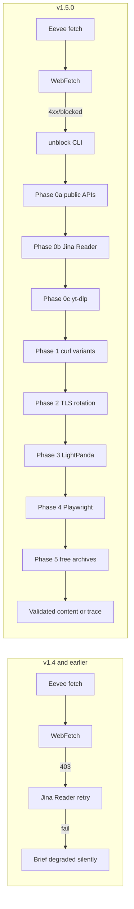

# Release Notes - v1.5.0

[English](RELEASE-v1.5.0.md) | [한국어](RELEASE-v1.5.0.ko.md)

v1.5.0 adds the **`unblock` skill** — a 9-phase zero-key adaptive fetch chain
that turns blocked URLs into validated content. Eevee researcher and the
auto-router now invoke it transparently when a fetch fails. No API keys
required; paid providers are gated behind `--allow-paid`.

## Why

Before v1.5.0, `WebFetch` failure inside `/second-claude-code:research`
left the PDCA Plan phase stranded: a single 403 from Naver / Coupang /
LinkedIn / fmkorea / X would silently degrade the research brief. Eevee
fell back to Jina Reader once and stopped.

v1.5.0 closes this gap end-to-end. Hostile URLs now run through up to nine
escalating probes — public APIs, Jina, yt-dlp, header-diverse curl,
TLS impersonation, LightPanda, real Chrome, free archive cluster, and
optional paid — until validated content is returned or every probe is
exhausted with a structured trace.

## Before / After

## What Changed

- **`unblock` skill** — 16th skill. Adaptive 9-phase fetch chain. Zero API keys.
- **`/second-claude-code:unblock`** — slash command surface for direct CLI invocation.
- **Auto-router patterns** — `hooks/prompt-detect.mjs` now detects hostile-URL intent (English + Korean) and dispatches to unblock.
- **Eevee researcher fallback** — `agents/eevee.md` invokes unblock automatically on `WebFetch` failure with R5 (read trace before retry) enforcement.
- **Research skill wiring** — `skills/research/SKILL.md` Web Engine fallback chain now lists unblock between WebFetch and Playwright.

## Phase Inventory

| Phase | Probe | Cost | Auto without keys? |
|-------|-------|------|--------------------|
| 0a | 11 public-API routes (Reddit / HN / arXiv / Bluesky / GitHub / NPM / Stack Exchange / Wikipedia / Mastodon / Lemmy / oEmbed) | free | yes |
| 0b | Jina Reader (`r.jina.ai`) | free at 20 RPM | yes |
| 0c | yt-dlp metadata + transcripts (1800+ media sites) | free | yes (auto-install) |
| 0d | Jina Search keyword routing | free at 20 RPM | yes (keyword input) |
| 1 | curl with rotating UA × headers × URL transforms; early-bail after 3 consecutive 4xx | free | yes |
| 2 | curl-impersonate TLS rotation across chrome131 / safari17_0 / firefox133 with cookie warming + locale-matched referrer chain | free | yes (auto-install) |
| 3 | LightPanda headless (cheap browser tier) | free | yes (auto-install) |
| 4 | Playwright real Chrome with same-origin XHR network intercept (hidden API discovery) | free | yes (auto-install) |
| 5 | Free archive cluster: Wayback + archive.today + AMP raced in parallel; RSS/Atom discovery; OG-tag rescue | free | yes |
| 6 | Optional paid (Tavily / Exa / Firecrawl) | paid | needs `--allow-paid` |

## Operational Hardening

- **SSRF guard** — `assertPublicUrl()` rejects RFC1918 / loopback / link-local / cloud-metadata hosts including IPv6-mapped IPv4. Opt-out: `UNBLOCK_ALLOW_PRIVATE_HOSTS=1`.
- **`schema_version: 1` envelope** — every chain result carries a versioned shape. Forward-compatible.
- **`idempotency_key`** — djb2 hash over `(url, maxPhase, allowPaid, device, selector, follow)`. Caller-side dedupe hint.
- **Stagnation detection** — same fail reason ×3 short-circuits the live chain to Phase 5 archive.
- **Phase 0 reordering** — URL host priors swap probe order (video hosts run yt-dlp first; public-API hosts run public-api first).
- **Signal-driven dynamic skip** — Phase 1 returning 200 with `stripped_too_short` jumps directly to Phase 4 (SPA pattern; header rotation won't help).
- **`decisions[]` audit log** — every reorder / skip / stagnation decision is recorded for debugging.

## Engineering Patterns

- The control-plane envelope (`schema_version` + `idempotency_key` + `decisions[]` audit log) and the stagnation-detection short-circuit follow established AI-agent control-contract patterns adapted to a single-skill scope.

## Verification

- `UNBLOCK_SKIP_NETWORK_TESTS=1 npm test` — **397 tests, 394 pass, 0 fail, 3 skipped**
- SSRF guard: `http://169.254.169.254/...` blocked, `http://[::ffff:c0a8:0101]/...` blocked
- HN smoke: Phase 0a wins in 298ms, schema_version 1, idempotency_key populated
- Wikipedia smoke: Phase 0a `public-api/wikipedia` route wins
- GitHub rate-limit smoke: 0a fails 403, chain escalates to 0b correctly

## Migration

No breaking changes. v1.4.x deployments upgrade transparently.

If you want to benchmark with the old behavior (no unblock fallback), set
`UNBLOCK_MAX_PHASE=-1` to disable the chain — Eevee will fall back to its
prior Jina-only behavior.

## What's Next

The architecture-review pass surfaced three borrow-worthy patterns deferred
to the next milestone:

1. **Result-typed gate plumbing** in `mcp/lib/*-handlers.mjs`
2. **Frozen, schema-validated phase artifacts** for PDCA Plan/Do/Check outputs
3. **Pre-execution ambiguity scoring** as a Plan-entry gate (Big Bang style)

These are PDCA-level improvements, not unblock-specific.
