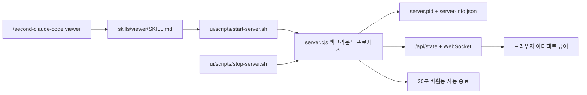

[English](architecture.md) | **한국어**

# 아키텍처

## 1.4.0 변경사항 — 크로스-플러그인 오케스트레이션

Second Claude Code가 이제 당신의 Claude Code에 설치된 **모든 플러그인을 실시간으로 찾아내고 명령**합니다. 세 개 레이어로 동작합니다.

### 레이어 1: 런타임 플러그인 탐지

`hooks/lib/plugin-discovery.mjs`가 세션 시작 시 `~/.claude/plugins/installed_plugins.json`을 스캔하고 각 플러그인의 파일시스템을 검사:

```
플러그인 파일시스템          → 추출되는 능력
─────────────────────────────────────────────
.claude-plugin/plugin.json  → 이름, 버전, 설명, mcpServers
skills/*/SKILL.md           → 스킬명 + 설명 (frontmatter 파싱)
commands/*.md               → 커맨드명 + 설명
agents/*.md                 → 에이전트명
.mcp.json                   → 대체 MCP 서버 선언
```

하드코딩 레지스트리 없음. 플러그인 설치 → 자동 등장. 삭제 → 자동 사라짐. Capability map은 매 세션 재구축.

### 레이어 2: 의도 점수화와 디스패치 계획

`getDispatchPlan()`은 키워드나 PDCA 페이즈를 intent profile로 바꾸고, 설치된 모든 플러그인의 스킬/커맨드를 점수화한 뒤 정렬된 호출 지시를 반환해요.

| 입력 | 의도 | 현재 검증된 플러그인 세트의 1순위 디스패치 |
|------|------|--------------------------------------------|
| `phase=plan` | `plan` | `Skill: claude-mem-knowledge-agent` |
| `phase=do` | `frontend-design` | `Skill: frontend-design-frontend-design` |
| `phase=check` | `review` | `Skill: coderabbit-code-review` |
| `phase=act` | `commit` | `/commit-commands:commit` |
| `posthog event analysis` | `generic` | `Skill: posthog-exploring-autocapture-events` |

자주 쓰는 생명주기 의도는 preferred-plugin 점수로 안정화하고, 일반 프롬프트도 설치된 플러그인 skill/command 텍스트와 강하게 맞으면 외부 capability가 이깁니다. 짧은 키워드는 단어 경계 기반으로만 매칭해서 `bug`가 `debugging` 안에 들어 있다는 이유로 잘못 라우팅되지 않게 했어요.

### 레이어 3: 능동적 자동 디스패치

```
사용자: "코드 리뷰해줘"
  ↓
prompt-detect 훅 (UserPromptSubmit)
  ├── getDispatchPlan(keyword="리뷰해줘") 호출
  ├── 1순위 디스패치: Skill: coderabbit-code-review
  └── [ORCHESTRATOR] 주입: 자체 처리 전 해당 Skill 호출
  ↓
외부 플러그인 결과 반환
  ↓
Claude가 결과를 최종 답변에 통합
```

전체 PDCA 사이클이 페이즈에 진입할 때도 같은 디스패처를 씁니다.

```
PDCA Check 페이즈 진입
  ├── orchestrator_route phase=check
  ├── 탐지 결과: coderabbit (code-review), codex (review), agent-teams (team-review)
  └── 자동 디스패치: "Skill: coderabbit-code-review"
  ↓
결과 반환 → PDCA Act 페이즈로
  ├── orchestrator_route phase=act
  └── 자동 디스패치: "/commit-commands:commit"
```

### 신규 MCP 도구

| 도구 | 목적 | 자동 디스패치 |
|------|------|-------------|
| `orchestrator_list_plugins` | 전체 생태계 인벤토리 | 아니오 |
| `orchestrator_get_plugin` | 단일 플러그인 상세 | 아니오 |
| `orchestrator_route` | 키워드/페이즈 → 매칭 플러그인 | **예** — `Skill:` 문자열 반환 |
| `orchestrator_health` | 생태계 건전성 점검 | 아니오 |

### 신규 서브시스템

```
hooks/lib/plugin-discovery.mjs       — 파일시스템 스캐너 + capability 매퍼 + 디스패치 가이드 생성기
mcp/lib/orchestrator-handlers.mjs    — 4개 MCP 도구 핸들러 구현
```

### SessionStart 변경사항

예전의 수동적인 "Plugin Orchestrator" 목록 대신 **Active Plugin Dispatch** 섹션이 들어갑니다. 설치된 플러그인 기준으로 페이즈별 1순위 디스패치를 미리 보여줘요.

```
📋 plan → Skill: claude-mem-knowledge-agent
🔨 do → Skill: frontend-design-frontend-design
🔍 check → Skill: coderabbit-code-review
🚀 act → /commit-commands:commit
```

### prompt-detect 변경사항

예전의 하드코딩된 `<skill-check>` 블록은 `generateDispatchGuide()`가 만든 실시간 라우팅 테이블로 바뀌었습니다. 추가로 prompt-detect는 실질적인 프롬프트마다 `getDispatchPlan()`을 호출합니다. 1순위 외부 매칭이 생명주기 의도이거나 강한 일반 플러그인 매칭이면, 자체 처리 전에 해당 Skill/command를 먼저 호출하라는 `[ORCHESTRATOR]` 지시를 주입합니다. 플러그인이 바뀌면 가이드와 즉시 디스패치 대상도 같이 바뀝니다.

### 소울 피드백 바인딩 (Phase 5)

- `soul_retro` — git shipping 메트릭 수집 (커밋 수, streak, peak hours, 트렌드 감지)
- `soul_get_synthesis_context` — synthesis 단계용 관측 데이터 준비
- `soul_get_readiness` — synthesis 임계값 도달 여부 확인 (관측 30건 또는 세션 10회)
- 세션 시작 시 시각적 진행 게이지 + retro 요약 + synthesis CTA 주입

---

## 1.3.0 변경사항

PDCA 하드 게이트 릴리스. PDCA 오케스트레이터에 9개 구체 강화를 박아서, v1.0.0의 약한 게이트로 셀프 처리 fallback과 sparse 출력이 슬쩍 통과하던 구조적 구멍을 막았어요.

1. **PDCA가 메인 오케스트레이터 (아키텍처 명확화)** — Sub-skill(`/threads`, `/newsletter`, `/academy-shorts`, `/card-news`, `/scc:write`)은 PDCA의 Do 페이즈 안에서 호출되는 빌딩 블록이지 PDCA를 대체하는 게 아닙니다. Sub-skill 내부 멀티 페이즈 파이프라인은 PDCA의 Do 안에서 돌아가고, sub-skill 자체 계약으로 게이팅되며, PDCA의 Plan + Check + Act가 그 위아래를 감싸요.
2. **도메인 자동 라우팅 (greedy)** — Do 페이즈가 사용자 프롬프트를 도메인 트리거 키워드와 그리디 매칭해서 가장 specialized한 sub-skill을 디스패치해요. "스레드" → `/threads`, "뉴스레터" → `/newsletter`, "쇼츠" → `/academy-shorts`, "카드뉴스" → `/card-news`, 그 외 → `/scc:write`. 가장 specialized한 sub-skill이 항상 우선이고, specialized가 있을 때 generic으로 가는 건 절대 금지.
3. **포맷별 길이 floor 강제** — Do 게이트가 아티팩트가 포맷 최소치 미달이면 통과 안 시켜요. 11개 포맷에 보정된 `min_chars`, `target_chars`, `min_sections`. Floor 미달 = sub-skill이 구체 scope expansion 지시와 함께 다시 디스패치. Generic "더 길게 써" 프롬프트는 명시적으로 금지돼요.
4. **Plan brief floor** — Source 최소를 3 → 5로 올렸고, 새로 사실 8개, named-source 인용 1개, 비교표 1개, 알려진 빈틈 1개, 미디어 1개, 본문 3,000자가 의무화됐어요.
5. **리뷰어 모델 다양성 룰** — Check 페이즈가 content/strategy/full preset에 distinct 모델 2개 이상 + 외부 모델(Codex, Kimi, Qwen, Gemini, Droid) 1개 이상을 강제. >2 리뷰어일 때 diversity score ≥ 0.6.
6. **False consensus 감지** — 모든 리뷰어가 평균 0.9 초과 + critical 0개로 APPROVED를 반환하면 사용 안 한 외부 모델로 adversarial pass가 자동 디스패치돼요. Goodhart 스타일 "다들 괜찮대" 거짓 신호 감지.
7. **5+ 룰 (보정된 AND 로직)** — Patch vs full rewrite 트리거. (a) any P0 finding OR (b) `p0+p1 ≥ 5` AND finding이 ≥ 3개 카테고리에 걸침일 때 발동. 초기 OR 로직이 4-finding patch set에서 over-trigger한 걸 실제 검증에서 발견하고 즉시 보정.
8. **새 `domain-pipeline-integration.md`** — Sub-skill 입출력 계약, 실패 처리(4가지 모드), 인접 페이즈와의 통합 지점을 정의한 284줄 표준.
9. **포켓몬 역할 라벨 명확화** — Eevee/Smeargle/Xatu 등은 conceptual role이지 직접 Agent dispatch target이 아닙니다. 실제 subagent dispatch는 `/scc:research`, `/scc:write`, `/scc:review`, `/scc:refine` 안에서 일어나요. 이전 실패 모드(포켓몬 이름이 dispatch 안 돼서 오케스트레이터가 셀프 처리로 fallback)가 이제 구조적으로 불가능.

검증 사이클 (2026-04-07): generic 토픽 PDCA 실행으로 7,981자 Plan brief, 6,962자 Do 아티클, Codex+sonnet 다양 리뷰어, v1.0.0 baseline에서는 놓쳤을 4 P1 findings 발견.

## 1.0.0 변경사항

이번 릴리스에는 네 가지가 추가됐어요.

1. **사이클 메모리** — 새로운 영속 레이어(`mcp/lib/cycle-memory.mjs`, 230줄)가 사이클별 페이즈 마크다운, 메트릭스, 교차 사이클 인사이트를 `.data/cycles/`에 저장해요. 3개의 새 MCP 도구(`pdca_get_cycle_history`, `pdca_save_insight`, `pdca_get_insights`)가 메모리를 MCP 클라이언트에 노출해요.
2. **도메인 인식 계약** — `pdca_start_run`이 이제 `domain` 매개변수(`code | content | analysis | pipeline`)를 받아서 페이즈 전환마다 단계별 계약, 완료 정의(DoD), 롤백 대상을 선택해요.
3. **Read-Before-Act 연결** — `handleStartRun`이 자동으로 최근 10개 인사이트(가중치 ≥ 0.1)를 불러와서 각 새 사이클이 축적된 학습으로 시작해요. `handleTransition`이 페이즈 아티팩트를 자동 저장하고, `handleEndRun`이 사이클 메트릭스를 영속해요.
4. **자기 진화** — 치명적 인사이트가 3회 이상 기록되면 `saveInsight`가 `.data/proposals/gotchas-{category}.md`에 주의사항 제안을 자동 생성해서 반복되는 실패 패턴을 재사용 가능한 체크리스트로 표면화해요.

## 0.5.3 변경사항

이번 릴리스에는 세 가지가 추가됐어요.

1. **컴패니언 데몬 기반** — 스케줄링, 백그라운드 실행, 알림 라우팅, 세션 리콜 인덱싱을 위한 로컬 데몬 헬퍼와 CLI 진입점을 추가했어요.
2. **프로젝트 메모리 레이어** — 세션 시작 시 `soul`과 별도로 지속되는 프로젝트 사실 컨텍스트를 보여줄 수 있게 정리했어요.
3. **런타임 경계 문서화** — 독립 실행 에이전트 런타임의 아이디어는 차용하더라도, 플러그인 안에 두 번째 런타임은 넣지 않는다고 명시했어요.

## 0.5.1 변경사항

이번 릴리스에 세 가지가 바뀌었어요.

1. **SubagentStart 훅** — 서브에이전트가 생성될 때 리뷰 세션 컨텍스트를 주입하는 라이프사이클 훅(`hooks/subagent-start.mjs`)이 추가됐어요. `hooks.json`의 `SubagentStart` 이벤트에 등록돼 있어요.
2. **에이전트 모델 승격** — 이브이(Eevee, 리서처)가 haiku에서 sonnet으로, 폴리곤(Porygon, 팩트체커)이 haiku에서 sonnet으로 올라갔어요. 리서치 품질과 검증 정확도를 높이기 위한 변경이에요.
3. **MMBridge 전면 통합 (Phase 1-3)** — 10개 MMBridge 커맨드가 PDCA 전 페이즈에 걸쳐 통합됐어요: research, review, security, debate, gate, followup, resume, diff, memory, handoff. 아래 MMBridge 통합 섹션에서 자세히 다뤄요.

## 0.5.0 변경사항

두 가지가 추가됐어요.

1. **Soul 시스템** — 10번째 스킬(`/scc:soul`)이 사용자의 정체성 프로필을 구축하고 유지해요. 목소리, 톤 규칙, 안티패턴 정보가 write 스킬과 tone-guardian 리뷰어에 주입돼요.
2. **Playwright MCP** — 선택적 브라우저 자동화 서버가 `.claude-plugin/plugin.json`에 추가됐어요. `WebFetch`가 JavaScript 기반 동적 URL에서 실패하면 리서처 에이전트가 `browser_navigate` + `browser_snapshot`(접근성 트리 추출)으로 대체해요. 서버가 설치돼 있지 않으면 조용히 건너뛰어요.

## 0.4.0 변경사항

다섯 가지가 추가됐어요.

1. **MCP 상태 서버** — 6개 도구를 제공하는 stdio MCP 서버(`mcp/pdca-state-server.mjs`)가 PDCA 상태를 MCP 클라이언트에 노출해요. 도구: `get`, `start`, `transition`, `check_gate`, `end`, `update_stuck`.
2. **Critic 스키마 + 점수 기반 합의** — 리뷰어가 구조화된 JSON(0.0-1.0 점수, 심각도 태그 소견)을 출력해요. 합의 게이트가 투표 수 기반에서 점수 기반으로 바뀌었어요: 평균 0.7 이상 + Critical 소견 없음 = APPROVED.
3. **라이프사이클 훅** — 훅이 3개에서 6개로 늘어났어요(0.5.1에서 8개): SessionStart, UserPromptSubmit, SubagentStop, Stop, PreCompact, PostCompact. 컴팩션 훅이 컨텍스트 압축 시 PDCA 상태를 보존해요.
4. **StuckDetector** — Plan Churn, Check Avoidance, Scope Creep 같은 안티패턴을 페이즈 전환마다 감지해요. 사이클이 헛바퀴 도는 걸 사전에 막아줘요.
5. **Worktree 격리** — Do 페이즈가 격리된 `git worktree`에서 실행돼요. APPROVED 판정이면 머지하고, MUST FIX면 버려요. 불완전한 작업이 메인 브랜치를 오염시키지 않아요.

---

## PDCA 구조

second-claude-code는 PDCA 품질 사이클을 기본 구조로 써요. 사용자에게 보이는 페이즈 이름은 Gather, Produce, Verify, Refine이고, 각각 Plan, Do, Check, Act에 대응해요.

| PDCA | 사용자 페이즈 | 주요 스킬 |
|------|--------------|-----------|
| Plan | Gather | `research`, `analyze`*, `discover`, `collect` |
| Do | Produce | `analyze`*, `write`, `workflow`, `batch` |
| Check | Verify | `review` |
| Act | Refine | `refine` |
| **최적화** | **Evolve** | **`loop`** |
| **오케스트레이터** | **전체 사이클** | **`pdca`** |
| **정체성** | **확장** | **`soul`** |

`pdca` 메타스킬이 품질 게이트를 사이에 두고 전체 사이클을 조율해요. 자연어에서 진입할 페이즈를 자동 감지하고 적절한 스킬을 체이닝해요.

*`analyze`는 두 페이즈에 걸쳐요: Plan에서는 리서치 결과를 종합하고, Do에서는 다른 프레임워크를 적용해 프로덕션 아티팩트를 만들어요.

### 15개 스킬 목록

| 스킬 | 페이즈 | 역할 |
|------|--------|------|
| `research` | Plan | 자율적 다회차 웹 리서치 |
| `analyze` | Plan / Do | 15개 전략 프레임워크 분석 |
| `write` | Do | 장문 콘텐츠 제작 |
| `review` | Check | 다관점 품질 게이트 (5명 병렬 리뷰) |
| `refine` | Act | 반복 개선 |
| `loop` | 최적화 | 고정 스위트 기반 프롬프트 자산 최적화 |
| `collect` | Plan | PARA 방식 지식 수집 |
| `workflow` | Do | 커스텀 워크플로 빌더 |
| `discover` | Plan | 스킬 탐색 |
| `batch` | Do | 대규모 동종 작업 병렬 분해/실행 |
| `soul` | 확장 | 사용자 정체성 프로필 합성 |
| `translate` | 확장 | 소울 기반 EN↔KO 번역 |
| `investigate` | Check | 원인 조사 중심 디버깅 |
| `viewer` | 확장 | PDCA 산출물 로컬 뷰어 |
| `pdca` | 전체 | 오케스트레이터 (메타스킬) |

---

## 디렉토리 구조

```
second-claude/
├── .claude-plugin/plugin.json    # 플러그인 매니페스트 — MCP 서버: pdca-state (31개 도구), playwright (선택)
├── skills/                       # 15개 스킬 (각각 SKILL.md)
│   ├── pdca/                     # PDCA 사이클 오케스트레이터 (메타스킬)
│   │   └── references/           # 페이즈 게이트 + 액션 라우터 + 질문 프로토콜
│   ├── research/                 # 자율적 심층 리서치 (WebFetch + Playwright 폴백)
│   │   └── references/           # research-methodology.md, playwright-guide.md
│   ├── write/                    # 콘텐츠 제작
│   ├── analyze/                  # 전략 프레임워크 분석 (15개 프레임워크)
│   ├── review/                   # 다관점 품질 게이트
│   ├── refine/                   # 반복 개선
│   ├── collect/                  # 지식 수집 (PARA)
│   ├── workflow/                 # 커스텀 워크플로 빌더
│   ├── discover/                 # 스킬 탐색
│   ├── loop/                     # Karpathy 스타일 프롬프트 최적화 루프
│   ├── batch/                    # 병렬 작업 분해 및 실행
│   │   └── references/           # 분해 가이드, 분할 전략, 병합 패턴
│   ├── soul/                     # 사용자 정체성 프로필 합성
│   │   └── references/           # 관찰 시그널, 합성 알고리즘, 템플릿
│   ├── translate/                # 소울 기반 EN↔KO 번역
│   ├── investigate/              # 원인 조사 중심 디버깅
│   └── viewer/                   # PDCA 산출물 로컬 뷰어
├── agents/                       # 17개 포켓몬 테마 서브에이전트
├── commands/                     # 15개 슬래시 커맨드 래퍼
├── hooks/                        # 자동 라우팅 + 컨텍스트 주입 (8개 훅)
│   ├── hooks.json                # 훅 설정
│   ├── prompt-detect.mjs         # 자연어 자동 라우터 (UserPromptSubmit)
│   ├── session-start.mjs         # 세션 배너 + 상태 초기화 (SessionStart)
│   ├── subagent-start.mjs        # 리뷰 세션 컨텍스트 초기화 (SubagentStart)
│   ├── subagent-stop.mjs         # 리뷰어 합의 집계 (SubagentStop)
│   ├── stop-failure.mjs          # Check 페이즈 품질 게이트 (StopFailure)
│   ├── session-end.mjs           # 세션 정리 (Stop)
│   └── compaction.mjs            # PDCA 상태 스냅샷/복원 (PreCompact, PostCompact)
├── references/                   # 설계 원칙, 합의 게이트
├── templates/                    # 출력 템플릿
├── scripts/                      # 셸 유틸리티
├── mcp/lib/cycle-memory.mjs      # 사이클 메모리 영속 (페이즈 스냅샷, 인사이트, 메트릭스)
└── config/                       # 사용자 설정
```

| 디렉토리 | 역할 |
|----------|------|
| `skills/` | 각 스킬마다 `SKILL.md`(짧고 컨텍스트 효율적)와 `references/` 하위 디렉토리(상세 문서)가 있어요. 점진적 공개 구조예요. |
| `skills/pdca/` | 페이즈 게이트 체크리스트, 액션 라우터, 질문 프로토콜이 `references/`에 있는 메타스킬이에요. |
| `agents/` | 3개 모델 티어에 걸친 17개 포켓몬 테마 서브에이전트 정의예요. 아래 에이전트 로스터를 참고하세요. |
| `commands/` | `/second-claude-code:*` 호출을 해당 스킬로 연결하는 얇은 래퍼예요. |
| `hooks/` | 8개 이벤트에 걸친 8개 라이프사이클 훅이에요: 자동 라우팅, 서브에이전트 시작/종료, 세션 관리, 컴팩션, 품질 게이트. |
| `references/` | 공유 지식: 설계 원칙, 합의 게이트 스펙, PARA 방법론. |

---

## 에이전트 로스터 — 포켓몬 에디션

17개 서브에이전트가 3개 모델 티어에 걸쳐 배치돼 있어요. 각 포켓몬은 에이전트의 역할에 맞는 특성을 가진 포켓몬으로 골랐어요.

### 프로덕션 에이전트 (Plan / Do)

| 에이전트 | 포켓몬 | 모델 | PDCA 페이즈 | 역할 | 선정 이유 |
|---------|--------|------|------------|------|----------|
| researcher | **이브이(Eevee)** | sonnet | Gather | 웹 검색 + 다출처 데이터 수집 | 어디든 적응하고, 여러 방향으로 진화 |
| analyst | **후딘(Alakazam)** | sonnet | Produce | 패턴 인식 + 데이터 종합 | IQ 5000, 두 숟가락 = 교차 데이터 분석 |
| strategist | **뮤츠(Mewtwo)** | sonnet | Produce | 전략 프레임워크 적용 | 최고의 전략적 두뇌 |
| writer | **루브도(Smeargle)** | opus | Produce | 장문 콘텐츠 제작 | 화가 — 어떤 기법이든 익힘 |
| editor | **메타몽(Ditto)** | opus | Refine | 콘텐츠 편집 + 품질 개선 | 원본을 더 나은 형태로 변환 |

### 리뷰 에이전트 (Check)

| 에이전트 | 포켓몬 | 모델 | PDCA 페이즈 | 역할 | 선정 이유 |
|---------|--------|------|------------|------|----------|
| deep-reviewer | **네이티오(Xatu)** | opus | Verify | 논리, 구조, 완성도 검토 | 과거와 미래를 동시에 봄 = 구조적 결함 탐지 |
| devil-advocate | **앱솔(Absol)** | sonnet | Verify | 약점과 맹점 공격 | 재해 감지 포켓몬, 위험을 경고 |
| fact-checker | **폴리곤(Porygon)** | sonnet | Verify | 주장, 수치, 출처 검증 | 디지털 네이티브, 데이터 기반 이진 판단 |
| tone-guardian | **푸린(Jigglypuff)** | haiku | Verify | 목소리와 대상 독자 적합성 | 목소리의 포켓몬, 톤에 민감 |
| structure-analyst | **안농(Unown)** | haiku | Verify | 구성과 가독성 | 글자 모양, 구조에 집착 |

### 파이프라인 & 탐색 에이전트

| 에이전트 | 포켓몬 | 모델 | PDCA 페이즈 | 역할 | 선정 이유 |
|---------|--------|------|------------|------|----------|
| orchestrator | **아르세우스(Arceus)** | sonnet | Produce | 파이프라인 조율 | 창조신, 모든 것을 조율 |
| step-executor | **괴력몬(Machamp)** | sonnet | Produce | 단일 파이프라인 스텝 실행 | 네 팔, 일을 해치움 |
| searcher | **야부엉(Noctowl)** | haiku | Gather | 외부 소스 검색 | 야행성 정찰, 날카로운 눈 |
| inspector | **자포코일(Magnezone)** | sonnet | Gather | 스킬 후보 검사 | 자기 스캐너, 디테일을 끌어당김 |
| evaluator | **테오키스(Deoxys)** | sonnet | Gather | 스킬 후보 채점 | 분석 폼, 적응형 평가 |
| connector | **캐이시(Abra)** | haiku | 확장 | 지식 연결 | 순간이동 = 먼 개념을 연결 |

### Soul 에이전트

| 에이전트 | 포켓몬 | 모델 | 페이즈 | 역할 | 선정 이유 |
|---------|--------|------|-------|------|----------|
| soul-keeper | **피카츄(Pikachu)** | opus | 확장 | 사용자 정체성 합성 | 상징적 파트너 — 트레이너를 누구보다 잘 앎 |

### 모델 분포

| 티어 | 수 | 용도 |
|------|-----|------|
| opus | 4 | 심층 리뷰, 장문 작성, 편집, 정체성 합성 |
| sonnet | 9 | 리서치, 분석, 전략, 조율, 적대적 리뷰, 팩트체킹 |
| haiku | 4 | 검색, 톤 검사, 구조 분석, 지식 연결 |

---

## PDCA 에이전트 매핑

에이전트가 PDCA 품질 사이클에 어떻게 배치되는지, Act 페이즈의 액션 라우터가 어떻게 분기하는지 보여줘요.

```
┌──────────────────────────────────────────────────────────────┐
│                      PDCA Cycle v2                           │
│                                                              │
│  Gather (Plan)     → 이브이(리서처), 야부엉(서처)            │
│    research → analyze  자포코일(인스펙터), 캐이시             │
│    + 질문 프로토콜     (커넥터)                               │
│                                                              │
│  Produce (Do)      → 후딘(애널리스트), 뮤츠(전략가)          │
│    순수 실행           루브도(라이터), 아르세우스              │
│                        (오케스트레이터), 괴력몬(스텝 실행)    │
│                                                              │
│  Verify (Check)    → 네이티오(심층 리뷰어), 앱솔              │
│    병렬 리뷰           (데빌 어드보킷), 폴리곤                │
│                        (팩트체커), 푸린                       │
│                        (톤 가디언), 안농                      │
│                        (구조 분석가)                          │
│                                                              │
│  Refine (Act)      → 메타몽(에디터)                           │
│    액션 라우터:        Plan, Do, Refine 중 하나로 분기        │
│                                                              │
└──────────────────────────────────────────────────────────────┘
```

보조 커맨드도 같은 루프를 따라가요:

- `pdca` — 품질 게이트와 액션 라우터로 전체 사이클을 조율
- `/second-claude-code:loop` — 고정 벤치마크 스위트로 프롬프트 자산을 격리 브랜치에서 최적화
- `collect` — 다음 Plan 사이클에 쓸 원천 자료와 노트를 보관
- `discover` — 현재 스킬셋으로 부족할 때 시스템을 확장
- `workflow` — Gather → Produce → Verify → Refine 전체 흐름을 자동화
- `batch` — 큰 동종 작업을 병렬 단위로 분해하고 격리된 worktree에서 동시 실행
- `soul` — 관찰된 행동 시그널로부터 사용자 정체성 프로필을 구축하고 유지
- `viewer` — 저장된 PDCA/session 아티팩트를 로컬 뷰어로 띄우고 브라우저 URL을 반환

### Artifact Viewer 라이프사이클



Viewer 커맨드는 얇은 래퍼입니다. 스킬이 zero-dependency Node 서버를 백그라운드로 시작하고, 후속 커맨드가 재사용할 런타임 메타데이터를 기록하며, HTTP/WebSocket으로 아티팩트 상태를 스트리밍합니다. 종료는 stop script 또는 idle timeout 경로를 탑니다.

### Loop Runner 아키텍처

유지보수자용 `loop` 명령은 플러그인 자신의 프롬프트 자산 바깥에 또 하나의 최적화 루프를 얹습니다.

- 스위트 매니페스트는 `benchmarks/loop/*.json`에 있고, `allowed_targets`, 가중치가 있는 `cases`, 예산, `min_delta`를 선언합니다.
- `scripts/loop-runner.mjs`가 격리된 `codex/loop-<suite>-<run_id>` 브랜치와 run worktree를 만들고, baseline과 모든 후보를 동일한 스위트 예산으로 평가합니다.
- 후보 worktree는 임시입니다. 우승 후보 패치만 격리된 run 브랜치로 복사되고, 메인 워크스페이스는 건드리지 않습니다.
- 활성 상태는 `.data/state/loop-active.json`에 저장되고, `.captures/loop-<run_id>/`에는 leaderboard, score history, summary, 케이스 로그, winner diff가 남습니다.
- 세션 훅이 시작 배너, compaction 복원, `HANDOFF.md`에 loop 상태를 노출해서 긴 최적화 실행도 안전하게 재개할 수 있습니다.

---

## PDCA 페이즈 게이트 (v1.3.0 강화)

`pdca` 메타스킬은 페이즈 전환마다 측정 가능한 계약 기반 게이트를 적용해요. v1.3.0부터 모든 게이트가 "완성된 것 같음" 같은 soft 판단이 아니라 구체 numeric/boolean 필드를 요구합니다.

```
Plan  ──[게이트: brief_char_count ≥ 3,000, 출처 ≥ 5, 사실 ≥ 8,
              인용 ≥ 1, 비교표 ≥ 1, 미디어 ≥ 1,
              meets_brief_floor: true]──→ Do
Do    ──[게이트: meets_length_floor: true (포맷별 최소치),
              meets_section_floor: true, references_count ≥ 3,
              plan_findings_integrated: true, sections_complete: true]──→ Check
Check ──[게이트: distinct_models ≥ 2, external_model_count ≥ 1,
              diversity_score ≥ 0.6, false_consensus_check_passed: true,
              verdict ∈ {APPROVED, MINOR FIXES, NEEDS IMPROVEMENT, MUST FIX}]──→ Act (또는 APPROVED면 종료)
Act   ──[5+ 룰 fire? → full rewrite | 아니면 액션 라우터 분류]──→ Plan / Do / Refine
Refine ──[게이트: 목표 충족? DoD 전체 PASS?]──→ 종료 (또는 선택지 제시)
```

### 길이 Floor (Do 게이트)

Do 페이즈가 아티팩트가 포맷별 길이 계약을 충족 못 하면 게이트 통과 안 돼요. Sub-skill이 구체 scope direction(어떤 Plan finding을 expand할지, 어떤 새 sub-section을 추가할지)과 함께 다시 디스패치됩니다. Vague한 "더 길게 써" 지시는 금지.

| 포맷 | 최소 글자 (본문) | 목표 | 최소 섹션 | Do에서 호출되는 sub-skill |
|------|----------------|------|----------|------------------------|
| 스레드 아티클 (@unclejobs.ai) | 4,000 | 5,000-7,000 | 6 | `/threads` |
| 한국어 테크 뉴스레터 | 10,000 | 12,000-15,000 | 6 토픽 | `/newsletter` |
| 일반 아티클 | 4,000 | 5,000-7,000 | 5 H2 | `/scc:write` |
| 전략/분석 리포트 | 5,000 | 6,000-9,000 | 6 섹션 | `/scc:write` |
| SWOT/RICE/OKR | 3,000 | 4,000-5,000 | 4 사분면 | `/scc:analyze` |
| 쇼츠 대본 (60-90초) | 1,800 | 2,200-2,800 | 12 씬 | `/academy-shorts` |
| 카드뉴스 (캐러셀) | 8-10 카드 | 9-12 카드 | hook + body + CTA | `/card-news` |
| PRD | 4,000 | 5,000-7,000 | 7 섹션 | `/scc:write --format prd` |
| 코드 리뷰 리포트 | 2,500 | 3,500-5,000 | 5 차원 | `/scc:review` |
| 리서치 brief | 3,000 | 4,000-6,000 | n/a | `/scc:research` |
| 미팅 노트 | 2,000 | 2,500-3,500 | 5 섹션 | `/scc:write --format decision` |

전체 표와 보정 원칙은 `skills/pdca/references/do-phase.md`에.

### 도메인 자동 라우팅 (Pre-Do Sub-Skill Selection)

PDCA가 Do 페이즈에 진입할 때 디스패처가 사용자 프롬프트를 트리거 키워드와 매칭해서 가장 specialized한 sub-skill을 골라요. Greedy matching이 룰: specialized가 있을 때는 무조건 specialized, generic은 fallback일 때만.

| 트리거 | Sub-skill |
|--------|-----------|
| 스레드 / threads / @unclejobs.ai | `/threads` |
| 뉴스레터 / newsletter | `/newsletter` |
| 쇼츠 / shorts / 릴스 / Reels | `/academy-shorts` |
| 카드뉴스 / card news / 캐러셀 | `/card-news` |
| (specialized 매치 없음) | `/scc:write` (fallback) |

Sub-skill 입출력 계약과 실패 처리는 `skills/pdca/references/domain-pipeline-integration.md` (284줄)에 정리.

### 리뷰어 다양성 (Check 게이트)

Check 페이즈가 false consensus 방지를 위해 리뷰어 모델 다양성을 강제해요:

- **최소 2 리뷰어** (`--depth deep`은 3)
- **모델당 1 리뷰어 최대** — 같은 모델 2개는 correlated error 생산이지 independent perspective 아님
- **최소 1 외부 모델** for `content`, `strategy`, `full` preset — Codex GPT-5.4, Kimi K2.5, Qwen, Gemini, Droid
- **Diversity score ≥ 0.6** when >2 리뷰어 — `distinct_models / total_reviewers`

모든 리뷰어가 평균 점수 0.9 초과 + critical 0개로 APPROVED를 반환하면 사이클이 자동 종료되지 않아요. 대신 사용 안 한 외부 모델로 adversarial pass가 자동 디스패치돼요. Goodhart 스타일 "다들 괜찮대" 거짓 신호 감지.

### 5+ 룰 (Patch vs Full Rewrite)

Act 페이즈가 plurality routing 전에 5+ 룰을 먼저 체크해요. Finding density가 임계값을 넘으면 패치 대신 통째 재작성을 강제합니다.

세 가지 트리거 조건, 어느 하나라도 만족하면 발동:

1. **Hard credibility 트리거**: any `P0_count ≥ 1` — 단일 신뢰도 killer로 강제 재작성
2. **Volume + spread 트리거** (BOTH 필요):
   - `P0_count + P1_count ≥ 5` 총 finding 수, AND
   - Findings가 ≥ 3개 distinct quality category에 걸침 (factual, source integrity, voice, structure, length, reader value)
3. (그 외) 룰 발동 안 함 — 정상 액션 라우터 plurality routing

초기 OR 로직에서 4-finding patch set이 3개 카테고리에 걸친 surgical patch 영역인데도 full rewrite로 잘못 트리거한 걸 발견하고 보정. Volume+spread를 AND로 전환해서 over-trigger 해소; hard credibility 트리거(any P0)는 별도 보존 — 신뢰도 손상은 표면 fix가 작아 보여도 누적되니까요.


### 액션 라우터 (Act 페이즈)

액션 라우터는 리뷰 소견을 근본원인별로 분류한 뒤 라우팅해요.

| 소견 분류 | 라우팅 대상 | 이유 |
|----------|-----------|------|
| SOURCE_GAP, ASSUMPTION_ERROR, FRAMEWORK_MISMATCH | Plan | 근본적인 문제라 추가 리서치가 필요 |
| COMPLETENESS_GAP, FORMAT_VIOLATION | Do | 실행 문제라 재작성이 필요 |
| EXECUTION_QUALITY | Refine | 다듬기 수준이라 반복 개선으로 충분 |

### Definition of Done — Refine 게이트 (0.5.6)

`refine` 스킬에 `--dod` 플래그를 쓸 수 있어요. 세미콜론으로 구분된 성공 기준 체크리스트예요.

1. DoD 기준이 리뷰어 컨텍스트에 구조화된 체크리스트로 주입돼요
2. 리뷰어가 일반 리뷰와 함께 기준별 `DoD-N: PASS` 또는 `DoD-N: FAIL`을 반환해요
3. 기준별 합의를 계산해요 (리뷰어 과반)
4. 에디터가 FAIL 기준을 일반 피드백보다 우선 수정해요 (라운드당 최대 3개)
5. **모든 DoD 기준이 PASS**이고 점수/판정 목표도 충족해야 종료돼요

"점수는 높은데 내가 요청한 건 안 됐네" 상황을 방지해요. `--dod` 없이 쓰면 기존과 완전히 동일해요.

### 질문 프로토콜 (Plan 페이즈)

범위를 확인하는 대화를 최대 3개 질문으로 제한해요.

- 컨텍스트가 충분하거나, `--no-questions` 플래그가 있거나, 자동화 모드일 때는 건너뛰어요
- 답변이 없는 질문은 가정을 기록하고 진행해요
- Act → Plan 복귀 시에는 질문을 건너뛰어요 (리서치 갭이 이미 식별된 상태)

페이즈 게이트 체크리스트는 `skills/pdca/references/`에 있어요.
`hooks/prompt-detect.mjs` 자동 라우터는 먼저 설치된 외부 플러그인 capability를 점수화합니다. 강한 외부 매칭이 있으면 자체 처리 전에 해당 Skill/command를 호출하라는 `[ORCHESTRATOR]` 지시를 주입해요. 외부 매칭이 없으면 PDCA 복합 레이어가 다중 페이즈 의도(예: "알아보고 써줘")를 감지해 `/second-claude-code:pdca`로 라우팅하고, 그다음 단일 스킬 매칭으로 내려갑니다.

---

## 에이전트 팀 통합

PDCA 페이즈별로 가능한 곳에서 병렬 실행을 활용해요.

```yaml
team_name: pdca-{topic-slug}
lead: 아르세우스 (오케스트레이터, sonnet)
phases:
  plan:
    parallel_agents:
      - 이브이 (리서처): "각도-1 리서치"
      - 이브이 (리서처): "각도-2 리서치"  # deep 깊이에서만
    sequential:
      - 후딘 + 뮤츠: 분석 (병합된 리서치 결과)
  do:
    agent: 루브도 (라이터, opus)
  check:
    parallel_agents:  # review 스킬이 내부적으로 병렬 처리
      - 네이티오, 앱솔, 폴리곤, 푸린, 안농
  act:
    agent: 메타몽 (에디터, opus)  # 내부 편집 루프
```

- Plan 페이즈는 `--depth deep`일 때 2개 리서치 각도를 병렬 디스패치해요
- Check 페이즈는 5명의 리뷰어를 병렬 실행해요 (review 스킬이 처리)
- 파일 소유권: 각 에이전트가 별도 출력 파일에 기록해요

---

## MMBridge 통합 — 선택 사항

MMBridge CLI가 여러 PDCA 페이즈에 걸쳐 멀티모델 AI 기능을 제공해요. 설치돼 있으면 리서치, 리뷰, 페이즈 게이트를 자동으로 보강해요. **설치하지 않아도 모든 스킬이 정상 작동해요.**

감지, 호출, 오류 처리 규칙은 `references/mmbridge-integration.md`에 있어요.

### 통합 지점

| PDCA 페이즈 | MMBridge 커맨드 | 스킬 | 동작 |
|------------|----------------|------|------|
| **Plan** | `mmbridge research` | `/scc:research` | 멀티모델 병렬 리서치, 애널리스트 입력에 병합 |
| **Check** | `mmbridge review` | `/scc:review --external` | 크로스모델 코드 리뷰, 합의 투표에 +1 |
| **Check** | `mmbridge security` | `/scc:review --preset security --external` | CWE 분류 보안 감사 |
| **Plan** | `mmbridge debate` | `/scc:analyze` | thorough 깊이에서 멀티모델 적대적 도전 |
| **Check→Act** | `mmbridge gate` | `/scc:pdca` | 페이즈 전환 시 자문용 커버리지 점검 |
| **Act** | `mmbridge followup` | `/scc:refine` | 모호한 외부 리뷰 소견 명확화 |
| **Act** | `mmbridge resume` | `/scc:refine` | 수정 후 외부 재평가 |
| **Check** | `mmbridge diff` | `/scc:review` | 코드/보안 프리셋용 주석 달린 diff 뷰 |
| **Plan** | `mmbridge memory` | `/scc:pdca` | 이전 사이클의 교차 세션 컨텍스트 |
| **Exit** | `mmbridge handoff` | `/scc:pdca` | APPROVED 종료 시 세션 요약 아티팩트 |

### 외부 리뷰어

| 리뷰어 | 제공자 | 특기 |
|--------|--------|------|
| kimi-reviewer | Kimi (K2.5) | 심층 웹 리서치, BrowseComp 60.6% |
| qwen-reviewer | Qwen | 보안 분석 |
| gemini-reviewer | Gemini | 디자인 및 시각 리뷰 |
| codex-reviewer | Codex | 코드 중심 원샷 리뷰 |

### 리뷰 흐름

```
리뷰 디스패치
├── 내부 (항상 실행)
│   ├── 네이티오 / deep-reviewer (opus)
│   ├── 앱솔 / devil-advocate (sonnet)
│   ├── 폴리곤 / fact-checker (sonnet)
│   ├── 푸린 / tone-guardian (haiku)
│   └── 안농 / structure-analyst (haiku)
│
├── 외부 — review (--external 플래그)
│   └── mmbridge review --tool kimi
│
├── 외부 — security (--preset security --external)
│   └── mmbridge security --scope all
│
└── 합의 게이트
    ├── 내부 + 외부 소견 병합
    ├── 중복 소견 제거
    ├── 심각도 보정
    ├── mmbridge gate 자문 (가능한 경우)
    └── 판정 출력: APPROVED | MINOR FIXES | NEEDS IMPROVEMENT | MUST FIX
```

### 리서치 흐름

```
리서치 디스패치
├── 내부 (항상 실행)
│   └── 이브이(sonnet) → WebSearch x5-10
│
├── 외부 (mmbridge 감지됨, depth medium 이상)
│   └── mmbridge research --type code-aware
│
└── 애널리스트 병합
    ├── 내부 결과 + mmbridge 결과
    ├── 갭 분석
    └── 라이터 종합 → 리서치 브리프
```

---

## 사이클 메모리

사이클 메모리 모듈(`mcp/lib/cycle-memory.mjs`)이 세션 경계를 넘어 지속되는 교차 사이클 지식을 제공해요. 페이즈 아티팩트, 메트릭스, 구조화된 인사이트를 `.data/cycles/`에 저장해요.

### 저장 구조

```
.data/cycles/
├── cycle-001/
│   ├── plan.md          # 페이즈 아티팩트 스냅샷
│   ├── do.md
│   ├── check.md
│   ├── act.md
│   ├── metrics.json     # 사이클 수준 메트릭스 (도메인, 판정, 소요시간)
│   └── events.jsonl     # 추가 전용 이벤트 로그
├── cycle-002/
│   └── ...
├── insights.json        # 시간 감쇠 가중치가 적용된 교차 사이클 인사이트
└── proposals/           # 자동 생성된 주의사항 제안 (자기 진화)
    └── gotchas-{category}.md
```

### 통합 지점

| 핸들러 | 트리거 | 동작 |
|--------|--------|------|
| `handleStartRun` | `pdca_start_run` | Read-Before-Act: 최근 10개 인사이트(가중치 ≥ 0.1)를 실행 컨텍스트에 로드 |
| `handleTransition` | `pdca_transition` | 완료된 페이즈 아티팩트를 `cycle-NNN/{phase}.md`에 자동 저장 |
| `handleEndRun` | `pdca_end_run` | 사이클 메트릭스를 `cycle-NNN/metrics.json`에 영속 |

### MCP 도구 (v1.0.0에서 3개 추가)

| 도구 | 매개변수 | 반환값 |
|------|---------|--------|
| `pdca_get_cycle_history` | `cycle_id?`, `last_n?` | `{ cycles: [{ id, plan, do, check, act, metrics }] }` |
| `pdca_save_insight` | `cycle_id`, `insight`, `category`, `severity` | `{ total_insights, repeated_count }` |
| `pdca_get_insights` | `category?`, `last_n?`, `min_weight?` | `{ insights: [{ cycle_id, timestamp, category, severity, text, weight }] }` |

### 자기 진화

인사이트는 30일 선형 시간 감쇠로 가중치가 적용돼요. 치명적 인사이트가 3회 이상 반복되면 `saveInsight`가 `.data/proposals/gotchas-{category}.md`에 주의사항 제안을 자동 작성해요. 이 제안은 반복되는 실패 패턴을 실행 가능한 체크리스트로 표면화해서 영구 프로젝트 주의사항으로 승격할 수 있어요.

---

## Playwright MCP — 선택적 브라우저 리서치

`playwright` MCP 서버가 `.claude-plugin/plugin.json`에 선택적 의존성으로 등록돼 있어요. 리서처 에이전트(이브이)가 `WebFetch`로 읽을 수 없는 URL에 대해 실제 Chromium 브라우저를 쓸 수 있게 해줘요.

**설치하지 않아도 research 스킬은 정상 작동해요.**

### 작동 조건

```
리서처: WebFetch(url) → 비어 있음 / 오류
                 │
                 └─ Playwright 사용 가능?
                      ├─ 예 → browser_navigate(url)
                      │         browser_snapshot()   ← 접근성 트리
                      │         파싱 + 콘텐츠 추출
                      └─ 아니오 → Gaps & Limitations에 기록, 계속 진행
```

`/second-claude-code:research`의 `--interactive` 플래그를 쓰면 WebFetch를 건너뛰고 모든 URL에 Playwright를 써요. SPA 대시보드나 JavaScript가 많은 뉴스 사이트에 유용해요.

### 비용 통제

리서치 라운드당 Playwright 내비게이션은 **최대 3회**로 제한돼요. 한도를 넘으면 추가 내비게이션을 중단하고 남은 URL을 Gaps & Limitations에 기록해요.

### 접근성 트리의 이점

`browser_snapshot()`은 원시 HTML 대신 구조화된 접근성 트리를 반환해요. 같은 정보를 담은 HTML 대비 토큰 비용이 80-90% 낮아요. 리서처가 접근성 트리에서 헤딩, 문단, 테이블 셀을 직접 추출하기 때문에 내비게이션 크롬이나 광고가 구조적으로 제외돼요.

자세한 도구 레퍼런스와 패턴은 `skills/research/references/playwright-guide.md`를 참고하세요.

---

## 라이프사이클 훅

8개 이벤트에 걸쳐 8개 훅이 등록돼 있어요. `hooks/hooks.json`에서 설정해요.

| 이벤트 | 훅 파일 | 동작 |
|--------|--------|------|
| `SessionStart` | `session-start.mjs` | 세션 배너 표시 + PDCA 상태 초기화 |
| `UserPromptSubmit` | `prompt-detect.mjs` | 외부 플러그인 디스패치 + PDCA 복합 의도 + 단일 스킬 라우팅 |
| `SubagentStart` | `subagent-start.mjs` | 리뷰 세션 컨텍스트 주입 (0.5.1 추가) |
| `SubagentStop` | `subagent-stop.mjs` | 리뷰어 합의 집계 |
| `Stop` | `session-end.mjs` | 세션 정리 |
| `StopFailure` | `stop-failure.mjs` | Check 페이즈 품질 게이트 (0.5.1 추가) |
| `PreCompact` | `compaction.mjs` | 컨텍스트 압축 전 PDCA 상태 스냅샷 |
| `PostCompact` | `compaction.mjs` | 컨텍스트 압축 후 PDCA 상태 복원 |

`PreCompact`와 `PostCompact`는 같은 `compaction.mjs` 파일을 공유해요. 컨텍스트 윈도우가 압축될 때 PDCA 사이클 상태가 유실되지 않도록 스냅샷을 찍고 복원하는 역할이에요.

---

## MCP 서버

`.claude-plugin/plugin.json`에 두 개의 MCP 서버가 등록돼 있어요.

| 서버 | 유형 | 필수 여부 | 역할 |
|------|------|----------|------|
| `pdca-state` | stdio | 필수 | 31개 도구로 PDCA 상태, 사이클 메모리, Soul, 프로젝트 메모리, 데몬, 세션 리콜, 플러그인 오케스트레이션 관리 |
| `playwright` | stdio | 선택 | Chromium 브라우저를 통한 JavaScript 렌더링 페이지 접근 |
