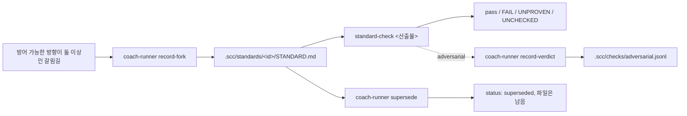
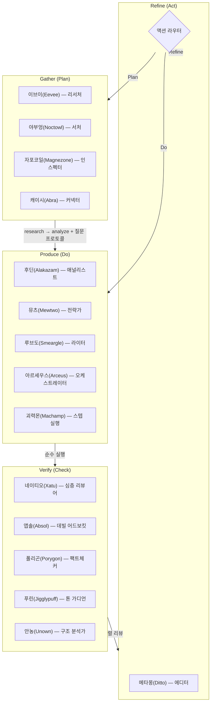
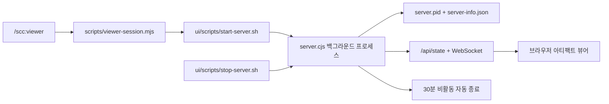
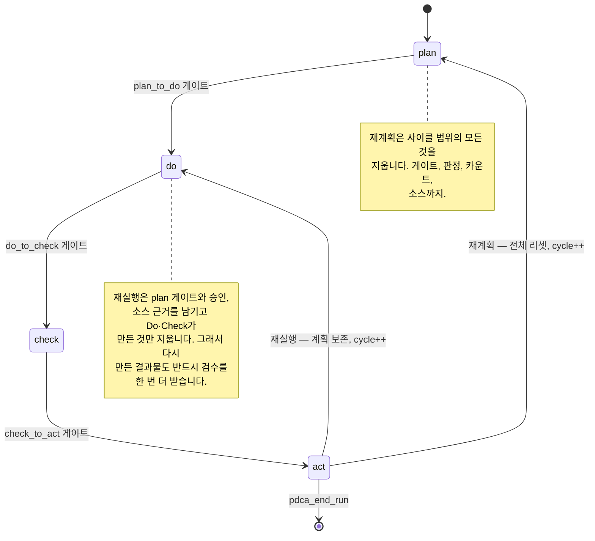

[English](architecture.md) | **한국어**

# 아키텍처 — SCC 3.0.3

## 런타임 경계

Second Claude Code는 의도적으로 Claude Code 플러그인이지, 독립 실행 에이전트 런타임이 아닙니다.

- `soul`은 사용자 선호와 행동 패턴을 위한 영속 정체성 레이어입니다.
- 프로젝트 리콜은 PDCA 복구 상태, MMBridge 메모리, 핸드오프 아티팩트, 세션 재개에 속합니다.
- 외부 스킬 탐색은 승인-우선 방식을 유지합니다.

이 경계는 의도적입니다. Hermes 스타일 런타임 기능에서 개별 서브시스템에 영감을 받을 수 있지만, 플러그인이 Claude Code 실행 모델 안에 두 번째 에이전트 OS를 내장해서는 안 됩니다.

---

## PDCA 구조

scc는 PDCA 품질 사이클을 기본 구조로 써요. 사용자에게 보이는 페이즈 이름은 Gather, Produce, Verify, Refine이고, 각각 Plan, Do, Check, Act에 대응해요.

| PDCA | 사용자 페이즈 | 주요 스킬 |
|------|--------------|-----------|
| Requirements | Clarify | `coach` |
| Plan | Gather | `research`, `analyze`*, `discover`, `collect` |
| Do | Produce | `analyze`*, `write`, `workflow`, `batch` |
| Check | Verify | `review` |
| Act | Refine | `refine` |
| **최적화** | **Evolve** | **`loop`**, `evolve` |
| **오케스트레이터** | **전체 사이클** | **`pdca`** |
| **정체성** | **확장** | **`soul`** |

`pdca` 메타스킬은 품질 게이트를 사이에 두고 전체 사이클을 조율할 수 있어요. 복합 작업에는 이 흐름을 쓰고, 개별 스킬과 명령은 직접 실행할 수 있어요.

*`analyze`는 두 페이즈에 걸쳐요: Plan에서는 리서치 결과를 종합하고, Do에서는 다른 프레임워크를 적용해 프로덕션 아티팩트를 만들어요.

### 코드 엔지니어링 레인

코드 작업은 PDCA를 유지하되 `domain=code` 전용 레인을 탑니다. 이 레인은 `engineering-discipline`의 계획-구현-검증 분리와 `Hyper-Waterfall`의 이슈/브랜치/스테이지 리포트/PR 기반 작업 기억 외부화를 흡수한 코드 전용 계약이에요.

핵심은 새 런타임을 얹는 게 아니라, 기존 Plan → Do → Check → Act 게이트를 코드 작업에 맞게 더 엄격하게 만드는 거예요. Plan에서는 테스트 가능한 수용 기준과 영향 범위를 확정하고, Do에서는 필요하면 브랜치나 워크트리로 격리해 단계별로 진행하며, Check에서는 구현자 자기 보고가 아니라 validator/reviewer 증거를 요구해요. Act에서는 clean-ai-slop, 단순화, 성능 측정이 필요할 때의 Rob Pike식 baseline/after 비교, PR 또는 로컬 리포트 핸드오프를 마무리 조건으로 둡니다.

### 15개 스킬 목록

| 스킬 | 페이즈 | 역할 |
|------|--------|------|
| `coach` | Requirements | 방어 가능한 방향이 둘 이상인 갈림길을 기준 문서로 확정 |
| `research` | Plan | 자율적 다회차 웹 리서치 |
| `analyze` | Plan / Do | 15개 전략 프레임워크 분석 |
| `write` | Do | 장문 콘텐츠 제작 |
| `review` | Check | 프리셋에 따른 품질 게이트 (2~5명 병렬 리뷰) |
| `refine` | Act | 반복 개선 |
| `loop` | 최적화 | 고정 스위트 기반 프롬프트 자산 최적화 |
| `evolve` | 유지보수 | 반복 실패 자산을 메인테이너 작성 구조 체크로 진화 |
| `collect` | Plan | PARA 방식 지식 수집 |
| `workflow` | Do | 커스텀 워크플로 빌더 |
| `discover` | Plan | 스킬 탐색 |
| `batch` | Do | 대규모 동종 작업 병렬 분해/실행 |
| `soul` | 확장 | 사용자 정체성 프로필 합성 |
| `translate` | 확장 | 소울 기반 EN↔KO 번역 |
| `pdca` | 전체 | 오케스트레이터 (메타스킬) |

스킬 목록 밖에 명령 셋이 있습니다 — `/scc:viewer`, `/scc:unblock`, `/scc:standard-check`. 실행만 하고 판단이 없습니다. 판단 0인 항목이 스킬 목록에 앉아 있으면 모델의 선택지만 갉아먹습니다.

---

## 기준 문서 (Decision Standards)

세션이 끝나면 그 안의 판단도 함께 사라집니다. 다음 세션이 이미 탈락한 안을 다시 들고 오는데, 디스크에는 아니라고 말해 주는 게 아무것도 없습니다. 기준 문서가 그 자리를 메웁니다. 갈림길 하나가 정해질 때마다 문서 하나. 프로젝트가 들고 있고, 뒤따르는 모든 세션이 읽습니다.

| 관심사 | 사는 곳 |
|---|---|
| 루트 해석, 플러그인 경로 거부 | `scripts/lib/project-root.mjs` |
| 인터뷰 상태 (재개 가능, 원자적 쓰기) | `scripts/lib/coach-state.mjs` → `<project>/.scc/state/coach.json` |
| 기준 문서 (렌더·쓰기·목록·폐기) | `scripts/lib/standard-record.mjs` → `<project>/.scc/standards/<id>/STANDARD.md` |
| adversarial 검사에 대한 리뷰어 판정 | `scripts/lib/adversarial-log.mjs` → `<project>/.scc/checks/adversarial.jsonl` |
| 인터뷰·기록 명령 | `scripts/coach-runner.mjs` |
| 준수 검사 실행기 | `scripts/standard-check.mjs`, 검사기는 `scripts/lib/standard-checkers.mjs` |


```mermaid
flowchart LR
    FORK["방어 가능한 방향이 둘 이상인 갈림길"] --> RECORD["coach-runner record-fork"]
    RECORD --> STD[".scc/standards/&lt;id&gt;/STANDARD.md"]
    STD --> CHECK["standard-check &lt;산출물&gt;"]
    CHECK --> PASS["pass / FAIL / UNPROVEN / UNCHECKED"]
    STD --> RETIRE["coach-runner supersede"]
    RETIRE --> OLD["status: superseded, 파일은 남음"]
    CHECK -.->|adversarial| VERDICT["coach-runner record-verdict"]
    VERDICT --> LOG[".scc/checks/adversarial.jsonl"]
```

이걸 붙들고 있는 불변식이 넷입니다.

**폐기는 삭제가 아닙니다.** `supersede`는 `status: active`를 `superseded`로 바꾸고 파일은 그대로 둡니다. 탈락한 안과 진 이유가 계속 읽히고, 그게 다음 세션이 같은 안을 다시 꺼내지 못하게 하는 유일한 장치입니다. 대체 문서를 `supersedes: "<옛 id>"`와 함께 먼저 쓰기 때문에, id가 충돌하면 기존 기준이 아직 살아 있는 상태에서 중단됩니다.

**검사는 코드가 아니라 데이터입니다.** 기준 문서는 사용자 프로젝트에 있고 저장소를 타고 퍼집니다. 고정 검사기 다섯 — `regex-absent`, `regex-present`, `length-between`, `similarity-below`, `frontmatter-equals` — 이 구조화된 인수를 받습니다. `run:` 류 필드, 목록에 없는 검사기 id, 모르는 필드는 건너뛰지 않고 오류로 거부합니다. 검사가 걸린 줄 아는데 러너가 조용히 넘어가면, 검사가 아예 없는 것보다 나쁩니다.

**검사기는 "아니오"를 말할 수 있어야 합니다.** 검사기마다 반드시 실패해야 하는 픽스처가 이 저장소에 딸려 있고, 검사기가 자기 픽스처를 통과시키기 시작하면 스위트가 깨집니다. 픽스처를 여기 두는 건 의도적입니다 — 프로젝트가 픽스처를 대면 그것도 신뢰 경계를 넘는 입력이 됩니다.

**자기 작업에 자기가 도장을 찍지 않습니다.** `adversarial` 검사는 리뷰어의 답이 파일에 남기 전까지 `UNPROVEN`이고, 그 답은 리뷰어가 실제로 읽은 산출물의 sha256에 묶입니다. 산출물을 고치면 답은 다시 unproven으로 돌아갑니다. 판정은 `standard-check`이 아니라 coach 러너로 받습니다. 채점하는 도구가 합격 도장까지 찍게 두지 않습니다. 검사가 없는 기준은 `UNCHECKED`입니다 — 보이지만 검증된 건 아니고, 통과로 세지 않습니다.

러너는 플러그인 설치 경로 안에는 아무것도 쓰지 않습니다. `project-root.mjs`가 사용자 스펙을
쓰기 전에 해당 경로를 거부하며, 심링크와 대소문자 변형도 포함합니다.

---

## 디렉토리 구조

```
second-claude/
├── .claude-plugin/plugin.json    # 플러그인 매니페스트 — MCP 서버: pdca-state (31개 도구), playwright (선택), mmbridge (선택)
├── skills/                       # 15개 스킬 (각각 SKILL.md)
│   ├── coach/                    # 갈림길 확정 (topology, scoring, .scc/ 아래 기준 문서)
│   ├── pdca/                     # PDCA 사이클 오케스트레이터 (메타스킬)
│   │   └── references/           # 페이즈 게이트 + 액션 라우터 + 질문 프로토콜
│   ├── research/                 # 깊이 조절형 리서치와 단계별 폴백
│   │   └── references/           # research-methodology.md, playwright-guide.md
│   ├── write/                    # 콘텐츠 제작
│   ├── analyze/                  # 전략 프레임워크 분석 (15개 프레임워크)
│   ├── review/                   # 다관점 품질 게이트
│   ├── refine/                   # 반복 개선
│   ├── collect/                  # 지식 수집 (PARA)
│   ├── workflow/                 # 커스텀 워크플로 빌더
│   ├── discover/                 # 스킬 탐색
│   ├── loop/                     # Karpathy 스타일 프롬프트 최적화 루프
│   ├── evolve/                   # 우로보로스 메인테이너 루프 (실패 수확 → 메인테이너 체크 → loop)
│   ├── batch/                    # 병렬 작업 분해 및 실행
│   │   └── references/           # 분해 가이드, 분할 전략, 병합 패턴
│   ├── soul/                     # 사용자 정체성 프로필 합성
│   │   └── references/           # 관찰 시그널, 합성 알고리즘, 템플릿
│   ├── translate/                # 소울 기반 EN↔KO 번역
│   └── unblock/                  # 엔진만 있음 — SKILL.md 없이 /scc:unblock으로 나감
│       ├── engine/               # CLI + 체인 + 10개 probe + 오케스트레이터
│       └── references/           # waf-detection, tls-impersonation, archive-fallbacks, eevee-flow
├── agents/                       # 17개 포켓몬 테마 서브에이전트
├── commands/                     # 18개 슬래시 커맨드 래퍼 (스킬 15 + 도구 전용 3)
├── hooks/                        # 라이프사이클 훅 + 컨텍스트 주입 (파일 8개, 이벤트 9개)
│   ├── hooks.json                # 훅 설정
│   ├── prompt-detect.mjs         # 활성 기준 literal trigger 보고 (UserPromptSubmit)
│   ├── session-start.mjs         # 세션 상태·컨텍스트 복원/주입 (SessionStart)
│   ├── subagent-start.mjs        # 리뷰 세션 컨텍스트 초기화 (SubagentStart)
│   ├── subagent-stop.mjs         # 리뷰어 합의 집계 (SubagentStop)
│   ├── review-result.mjs         # Agent 반환 뒤 부모 세션에 리뷰 결과 주입 (PostToolUse)
│   ├── stop-failure.mjs          # 크래시 복구 스냅샷 (StopFailure)
│   ├── session-end.mjs           # 세션 정리 (Stop)
│   └── compaction.mjs            # PDCA 상태 스냅샷/복원 (PreCompact, PostCompact)
├── references/                   # 설계 원칙, 합의 게이트
├── templates/                    # 출력 템플릿
├── scripts/                      # coach-runner, standard-check, viewer-session, export-artifact, evolve-runner
├── mcp/
│   ├── pdca-state-server.bundle.mjs # 런타임에서 사용하는 자체 포함 31개 도구 서버
│   ├── pdca-state-server.mjs      # 개발·테스트용 원본
│   └── lib/cycle-memory.mjs       # 사이클 메모리 영속 (페이즈 스냅샷, 인사이트, 메트릭스)
└── config/                       # 사용자 설정
```

| 디렉토리 | 역할 |
|----------|------|
| `skills/` | 각 스킬마다 `SKILL.md`(짧고 컨텍스트 효율적)와 `references/` 하위 디렉토리(상세 문서)가 있어요. 점진적 공개 구조예요. |
| `skills/pdca/` | 페이즈 게이트 체크리스트, 액션 라우터, 질문 프로토콜이 `references/`에 있는 메타스킬이에요. |
| `agents/` | 3개 모델 티어에 걸친 17개 포켓몬 테마 서브에이전트 정의예요. 아래 에이전트 로스터를 참고하세요. |
| `commands/` | `/scc:*` 호출을 해당 스킬로 연결하는 얇은 래퍼예요. |
| `hooks/` | 훅 파일 8개가 9개 이벤트에 등록돼 있어요: 기준 trigger 보고, 리뷰 수명주기와 부모 전달, 세션 관리, 컴팩션, 품질 게이트. |
| `references/` | 공유 지식: 설계 원칙, 합의 게이트 스펙, PARA 방법론. |

---

## 에이전트 로스터 — 포켓몬 에디션

17개 서브에이전트가 3개 모델 티어에 걸쳐 배치돼 있어요. 각 포켓몬은 에이전트의 역할에 맞는 특성을 가진 포켓몬으로 골랐어요.

### 프로덕션 에이전트 (Plan / Do)

| 에이전트 | 포켓몬 | 모델 | PDCA 페이즈 | 역할 | 선정 이유 |
|---------|--------|------|------------|------|----------|
| researcher | **이브이(Eevee)** | sonnet | Gather | 웹 검색 + 다출처 데이터 수집 | 어디든 적응하고, 여러 방향으로 진화 |
| analyst | **후딘(Alakazam)** | sonnet | Produce | 패턴 인식 + 데이터 종합 | IQ 5000, 두 숟가락 = 교차 데이터 분석 |
| strategist | **뮤츠(Mewtwo)** | sonnet | Produce | 전략 프레임워크 적용 | 최고의 전략적 두뇌 |
| writer | **루브도(Smeargle)** | opus | Produce | 장문 콘텐츠 제작 | 화가 — 어떤 기법이든 익힘 |
| editor | **메타몽(Ditto)** | opus | Refine | 콘텐츠 편집 + 품질 개선 | 원본을 더 나은 형태로 변환 |

### 리뷰 에이전트 (Check)

| 에이전트 | 포켓몬 | 모델 | PDCA 페이즈 | 역할 | 선정 이유 |
|---------|--------|------|------------|------|----------|
| deep-reviewer | **네이티오(Xatu)** | opus | Verify | 논리, 구조, 완성도 검토 | 과거와 미래를 동시에 봄 = 구조적 결함 탐지 |
| devil-advocate | **앱솔(Absol)** | sonnet | Verify | 약점과 맹점 공격 | 재해 감지 포켓몬, 위험을 경고 |
| fact-checker | **폴리곤(Porygon)** | sonnet | Verify | 주장, 수치, 출처 검증 | 디지털 네이티브, 데이터 기반 이진 판단 |
| tone-guardian | **푸린(Jigglypuff)** | sonnet | Verify | 목소리와 대상 독자 적합성 | 목소리의 포켓몬, 톤에 민감 |
| structure-analyst | **안농(Unown)** | sonnet | Verify | 구성과 가독성 | 글자 모양, 구조에 집착 |

### 파이프라인 & 탐색 에이전트

| 에이전트 | 포켓몬 | 모델 | PDCA 페이즈 | 역할 | 선정 이유 |
|---------|--------|------|------------|------|----------|
| orchestrator | **아르세우스(Arceus)** | sonnet | Produce | 파이프라인 조율 | 창조신, 모든 것을 조율 |
| step-executor | **괴력몬(Machamp)** | sonnet | Produce | 단일 파이프라인 스텝 실행 | 네 팔, 일을 해치움 |
| searcher | **야부엉(Noctowl)** | haiku | Gather | 외부 소스 검색 | 야행성 정찰, 날카로운 눈 |
| inspector | **자포코일(Magnezone)** | sonnet | Gather | 스킬 후보 검사 | 자기 스캐너, 디테일을 끌어당김 |
| evaluator | **테오키스(Deoxys)** | sonnet | Gather | 스킬 후보 채점 | 분석 폼, 적응형 평가 |
| connector | **캐이시(Abra)** | haiku | 확장 | 지식 연결 | 순간이동 = 먼 개념을 연결 |

### Soul 에이전트

| 에이전트 | 포켓몬 | 모델 | 페이즈 | 역할 | 선정 이유 |
|---------|--------|------|-------|------|----------|
| soul-keeper | **피카츄(Pikachu)** | opus | 확장 | 사용자 정체성 합성 | 상징적 파트너 — 트레이너를 누구보다 잘 앎 |

### 모델 분포

| 티어 | 수 | 용도 |
|------|-----|------|
| opus | 4 | 심층 리뷰, 장문 작성, 편집, 정체성 합성 |
| sonnet | 11 | 리서치, 분석, 전략, 조율, 적대적 리뷰, 팩트체킹, 톤 검사, 구조 분석 |
| haiku | 2 | 검색, 지식 연결 — 판정이 아닌 수집 |

---

## PDCA 에이전트 매핑

에이전트 로스터는 작업을 PDCA 품질 사이클에 배치해요. 리뷰는 프리셋에 따라 패널을
선택하며, 아래 다섯 역할은 가능한 패널이지 모든 실행이 전부 호출된다는 뜻이 아니에요.
Act 페이즈에는 액션 라우터가 있어요.


```mermaid
flowchart TD
    subgraph PLAN["Gather (Plan)"]
        direction LR
        P1["이브이(Eevee) — 리서처"]
        P2["야부엉(Noctowl) — 서처"]
        P3["자포코일(Magnezone) — 인스펙터"]
        P4["캐이시(Abra) — 커넥터"]
    end

    subgraph DO["Produce (Do)"]
        direction LR
        D1["후딘(Alakazam) — 애널리스트"]
        D2["뮤츠(Mewtwo) — 전략가"]
        D3["루브도(Smeargle) — 라이터"]
        D4["아르세우스(Arceus) — 오케스트레이터"]
        D5["괴력몬(Machamp) — 스텝 실행"]
    end

    subgraph CHECK["Verify (Check)"]
        direction LR
        C1["네이티오(Xatu) — 심층 리뷰어"]
        C2["앱솔(Absol) — 데빌 어드보킷"]
        C3["폴리곤(Porygon) — 팩트체커"]
        C4["푸린(Jigglypuff) — 톤 가디언"]
        C5["안농(Unown) — 구조 분석가"]
    end

    subgraph ACT["Refine (Act)"]
        direction LR
        A1["메타몽(Ditto) — 에디터"]
        AR{"액션 라우터"}
    end

    PLAN -->|"research → analyze + 질문 프로토콜"| DO
    DO -->|"순수 실행"| CHECK
    CHECK -->|"병렬 리뷰"| ACT
    AR -->|"Plan"| PLAN
    AR -->|"Do"| DO
    AR -->|"Refine"| ACT
```

보조 커맨드도 같은 루프를 따라가요:

- `pdca` — 품질 게이트와 액션 라우터로 전체 사이클을 조율
- `/scc:loop` — 고정 벤치마크 스위트로 프롬프트 자산을 격리 브랜치에서 최적화
- `collect` — 다음 Plan 사이클에 쓸 원천 자료와 노트를 보관
- `discover` — 현재 스킬셋으로 부족할 때 시스템을 확장
- `workflow` — Gather → Produce → Verify → Refine 전체 흐름을 자동화
- `batch` — 큰 동종 작업을 병렬 단위로 분해하고 격리된 worktree에서 동시 실행
- `soul` — 관찰된 행동 시그널로부터 사용자 정체성 프로필을 구축하고 유지
- `viewer` — 저장된 PDCA/session 아티팩트를 로컬 뷰어로 띄우고 브라우저 URL을 반환

### Artifact Viewer 라이프사이클


```mermaid
flowchart LR
    CMD["/scc:viewer"] --> RUNNER[scripts/viewer-session.mjs]
    RUNNER --> START[ui/scripts/start-server.sh]
    START --> SERVER[server.cjs 백그라운드 프로세스]
    SERVER --> META[server.pid + server-info.json]
    SERVER --> API["/api/state + WebSocket"]
    API --> UI[브라우저 아티팩트 뷰어]
    STOP[ui/scripts/stop-server.sh] --> SERVER
    SERVER --> IDLE[30분 비활동 자동 종료]
```

Viewer 커맨드는 얇은 래퍼입니다. 스킬이 zero-dependency Node 서버를 백그라운드로 시작하고, 후속 커맨드가 재사용할 런타임 메타데이터를 기록하며, HTTP/WebSocket으로 아티팩트 상태를 스트리밍합니다. 종료는 stop script 또는 idle timeout 경로를 탑니다.

### Loop Runner 아키텍처

유지보수자용 `loop` 명령은 플러그인 자신의 프롬프트 자산 바깥에 또 하나의 최적화 루프를 얹습니다.

- 스위트 매니페스트는 `benchmarks/loop/*.json`에 있고, `allowed_targets`, 가중치가 있는 `cases`, 예산, `min_delta`를 선언합니다.
- `scripts/loop-runner.mjs`가 격리된 `codex/loop-<suite>-<run_id>` 브랜치와 run worktree를 만들고, baseline과 모든 후보를 동일한 스위트 예산으로 평가합니다.
- 후보 worktree는 임시입니다. 우승 후보 패치만 격리된 run 브랜치로 복사되고, 메인 워크스페이스는 건드리지 않습니다.
- 활성 상태는 `.data/state/loop-active.json`에 저장되고, `.captures/loop-<run_id>/`에는 leaderboard, score history, summary, 케이스 로그, winner diff가 남습니다.
- 세션 훅이 시작 배너, compaction 복원, `HANDOFF.md`에 loop 상태를 노출해서 긴 최적화 실행도 안전하게 재개할 수 있습니다.

---

## PDCA 페이즈 게이트

PDCA 상태 MCP가 실제로 강제하는 전환 하위 집합은 다음과 같습니다. 포맷 floor와 리뷰 품질
검사는 스킬 계약이며 모든 런타임 요구사항은 아닙니다.

```
Plan  ──[brief + 출처 ≥5개 + analysis + Plan 승인]──→ Do
Do    ──[아티팩트 + 완료 + Plan 통합]──→ Check
Check ──[판정 + 리뷰어 ≥2명]──→ Act
Act   ──[결정 + 근본원인]──→ Plan / Do / Refine / 종료
Refine ──[스킬 계약]──→ 종료 (또는 선택지 제시)
```

### 길이 Floor (Do 스킬 계약)

Do 스킬이 포맷별 길이 계약을 확인하고 필요한 경우 구체적인 재작성을 요청합니다. PDCA 상태
MCP 전환은 현재 아티팩트 존재·완료와 Plan 통합을 확인하며 모든 길이 floor를 런타임 게이트로
강제하지는 않습니다.

| 포맷 | 최소 글자 (본문) | 목표 | 최소 섹션 | Do에서 호출되는 sub-skill |
|------|----------------|------|----------|------------------------|
| 뉴스레터 | 10,000 | 포맷별 | 6단계 아크 | `/scc:write --format newsletter` |
| 일반 아티클 | 4,000 | 5,000-7,000 | 5 H2 | `/scc:write` |
| 전략/분석 리포트 | 5,000 | 6,000-9,000 | 6 섹션 | `/scc:write` |
| SWOT/RICE/OKR | 3,000 | 4,000-5,000 | 4 사분면 | `/scc:analyze` |
| 쇼츠 대본 (60-90초) | 1,800 | 포맷별 | CTA | `/scc:write --format shorts` |
| 카드뉴스 (캐러셀) | 슬라이드 단위 | 포맷별 | 비주얼 방향 | `/scc:write --format card-news` |
| 코드 리뷰 리포트 | 2,500 | 3,500-5,000 | 5 차원 | `/scc:review` |
| 리서치 brief | 3,000 | 4,000-6,000 | n/a | `/scc:research` |

전체 표와 보정 원칙은 `skills/pdca/references/do-phase.md`에.

### 도메인 자동 라우팅 (Pre-Do Sub-Skill Selection)

PDCA가 Do 페이즈에 진입할 때 디스패처가 사용자 프롬프트를 트리거 키워드와 매칭해서 가장 specialized한 sub-skill을 골라요. Greedy matching이 룰: specialized가 있을 때는 무조건 specialized, generic은 fallback일 때만.

| 트리거 | Sub-skill |
|--------|-----------|
| newsletter / 뉴스레터 | `/scc:write --format newsletter` |
| article / 아티클 | `/scc:write --format article` |
| report / 보고서 | `/scc:write --format report` |
| shorts / 쇼츠 | `/scc:write --format shorts` |
| social / 소셜 | `/scc:write --format social` |
| card-news / 카드뉴스 | `/scc:write --format card-news` |
| (specialized 매치 없음) | `/scc:write` (fallback) |

Sub-skill 입출력 계약과 실패 처리는 `skills/pdca/references/domain-pipeline-integration.md`에 정리.

### 리뷰어 독립성 (Check 게이트)

만드는 데 관여한 쪽은 그것을 통과시키지 못합니다. 이 불변식은 에이전트 재사용으로 조용히 깨집니다. critic 로스터와 상류 단계가 빌려 쓰는 에이전트가 같은 풀에서 나오기 때문에, 같은 이름이 결정을 만들고 나서 그 결정이 다스리는 작업에 표를 던질 수 있습니다. 형식만 적대 검수이고 실질은 자기 검수입니다.

판별 기준은 어림짐작이 아니라 **활성 런의 단계**입니다. `pdca-active.json`이 `check` 아닌 단계를 가리키는 동안 리뷰어 이름의 에이전트가 뜨면 상류에서 빌려 쓴 것이고, `subagent-start`가 이를 `state/upstream-participants.json`에 기록합니다.

집계 시점에 제외된 리뷰어는 보고서는 그대로 남기고 — 발견은 여전히 발견입니다 — 표만 잃습니다. 제외 후 정족수가 모자라면 합의는 `BLOCKED — QUORUM SHORT`가 되고, 누가 배제됐고 독립 리뷰어가 몇 명 모자란지 이름을 댑니다. 정족수를 맞추려고 제외를 완화하는 길은 없습니다. 인원에 맞춰 휘는 규칙은 규칙이 아니니까요. 목록은 합의가 계산되면 비워집니다. 한 번 상류에 빌려 썼다고 그 에이전트가 이후 모든 리뷰에서 영구히 빠지지는 않습니다.

기준 문서 쪽도 같은 불변식을 답니다. 갈림길 파일이 `participants`를 기록하고, `record-verdict`는 그 목록에 있는 사람의 판정을 거부합니다.

### 리뷰어 검사 (Check 스킬 계약)

리뷰 스킬은 선택된 2~5명 프리셋을 실행하고 모델 다양성·false consensus 검사를 수행할 수
있습니다. PDCA 상태 MCP 전환 자체는 판정과 리뷰어 2명 이상 보고만 요구하며, 외부 커버리지와
adversarial 후속 검사는 선택적·자문적입니다.

### 5+ 룰 (Patch vs Full Rewrite)

Act 페이즈가 plurality routing 전에 5+ 룰을 먼저 체크해요. Finding density가 임계값을 넘으면 패치 대신 통째 재작성을 강제합니다.

세 가지 트리거 조건, 어느 하나라도 만족하면 발동:

1. **Hard credibility 트리거**: any `P0_count ≥ 1` — 단일 신뢰도 killer로 강제 재작성
2. **Volume + spread 트리거** (BOTH 필요):
   - `P0_count + P1_count ≥ 5` 총 finding 수, AND
   - Findings가 ≥ 3개 distinct quality category에 걸침 (factual, source integrity, voice, structure, length, reader value)
3. (그 외) 룰 발동 안 함 — 정상 액션 라우터 plurality routing

초기 OR 로직에서 4-finding patch set이 3개 카테고리에 걸친 surgical patch 영역인데도 full rewrite로 잘못 트리거한 걸 발견하고 보정. Volume+spread를 AND로 전환해서 over-trigger 해소; hard credibility 트리거(any P0)는 별도 보존 — 신뢰도 손상은 표면 fix가 작아 보여도 누적되니까요.


### 액션 라우터 (Act 페이즈)

액션 라우터는 리뷰 소견을 근본원인별로 분류한 뒤 라우팅해요.

| 소견 분류 | 라우팅 대상 | 이유 |
|----------|-----------|------|
| SOURCE_GAP, ASSUMPTION_ERROR, FRAMEWORK_MISMATCH | Plan | 근본적인 문제라 추가 리서치가 필요 |
| COMPLETENESS_GAP, FORMAT_VIOLATION | Do | 실행 문제라 재작성이 필요 |
| EXECUTION_QUALITY | Refine | 다듬기 수준이라 반복 개선으로 충분 |

### 전이 계약

`pdca_transition`이 사이클을 상태머신으로 강제해요. 아래 전이만 존재하고, **되돌아가는 두 경로는 둘 다 사이클을 하나 씁니다.** 그래서 `max_cycles`가 재계획만이 아니라 런 전체를 묶어요.


```mermaid
stateDiagram-v2
    [*] --> plan
    plan --> do: plan_to_do 게이트
    do --> check: do_to_check 게이트
    check --> act: check_to_act 게이트
    act --> plan: 재계획 — 전체 리셋, cycle++
    act --> do: 재실행 — 계획 보존, cycle++
    act --> [*]: pdca_end_run

    note right of plan
        재계획은 사이클 범위의 모든 것을
        지웁니다. 게이트, 판정, 카운트,
        소스까지.
    end note

    note right of do
        재실행은 plan 게이트와 승인,
        소스 근거를 남기고 Do·Check가
        만든 것만 지웁니다. 그래서 다시
        만든 결과물도 반드시 검수를
        한 번 더 받습니다.
    end note
```

| 전이 | 사이클 비용 | 살아남는 것 |
|---|---|---|
| `act → plan` | +1, `max_cycles` 상한 | 런 식별자, 아티팩트, 누적 카운터 |
| `act → do` | +1, `max_cycles` 상한 | 위 항목 + `plan_to_do`, 계획 승인, `sources_count` |

그 외는 전부 `Illegal transition`이에요. `act → do`가 있는 이유는 액션 라우터가 COMPLETENESS_GAP과 FORMAT_VIOLATION을 실행 문제로 분류하기 때문입니다 — 이 경로가 없으면 라우터 판정의 3분의 1이 갈 곳을 잃어요.

### Definition of Done — Refine 게이트

`refine` 스킬에 `--dod` 플래그를 쓸 수 있어요. 세미콜론으로 구분된 성공 기준 체크리스트예요.

1. DoD 기준이 리뷰어 컨텍스트에 구조화된 체크리스트로 주입돼요
2. 리뷰어가 일반 리뷰와 함께 기준별 `DoD-N: PASS` 또는 `DoD-N: FAIL`을 반환해요
3. 기준별 합의를 계산해요 (리뷰어 과반)
4. 에디터가 FAIL 기준을 일반 피드백보다 우선 수정해요 (라운드당 최대 3개)
5. **모든 DoD 기준이 PASS**이고 점수/판정 목표도 충족해야 종료돼요

"점수는 높은데 내가 요청한 건 안 됐네" 상황을 방지해요. `--dod` 없이 쓰면 기존과 완전히 동일해요.

### 질문 프로토콜 (Plan 페이즈)

범위를 확인하는 대화를 최대 3개 질문으로 제한해요.

- 컨텍스트가 충분하거나, `--no-questions` 플래그가 있거나, 자동화 모드일 때는 건너뛰어요
- 답변이 없는 질문은 가정을 기록하고 진행해요
- Act → Plan 복귀 시에는 질문을 건너뛰어요 (리서치 갭이 이미 식별된 상태)

페이즈 게이트 체크리스트는 `skills/pdca/references/`에 있어요.
`hooks/prompt-detect.mjs`는 의도 라우터가 아니에요. 프롬프트에 활성 프로젝트 기준이 선언한 literal trigger가 나타날 때 해당 기준을 알려줄 뿐이며, 스킬을 선택하거나 호출하지 않습니다. PDCA 선택은 일반 Claude Code 스킬·명령 흐름에서 이뤄집니다.

---

## 에이전트 팀 통합

PDCA 페이즈별로 가능한 곳에서 병렬 실행을 활용해요.

```yaml
team_name: pdca-{topic-slug}
lead: 아르세우스 (오케스트레이터, sonnet)
phases:
  plan:
    agent:
      role: 이브이 (리서처)
      task: "깊이 조절형 리서치"
    optional_parallel:
      - mmbridge research 패스  # 설정됨, medium/deep 깊이에서만
    sequential:
      - 후딘 + 뮤츠: 분석 (병합된 리서치 결과)
  do:
    agent: 루브도 (라이터, opus)
  check:
    parallel_agents:  # review 스킬이 프리셋에 따라 2~5명 선택
      - 프리셋이 선택한 리뷰어
  act:
    agent: 메타몽 (에디터, opus)  # 내부 편집 루프
```

- Plan 페이즈는 리서치 깊이 계약을 따르며, MMBridge가 설정돼 있으면 medium/deep 깊이에서 병렬 패스를 실행해요
- Check 페이즈는 프리셋이 선택한 2~5명의 리뷰어를 병렬 실행해요 (review 스킬이 처리)
- 파일 소유권: 각 에이전트가 별도 출력 파일에 기록해요

---

## MMBridge 통합 — 선택 사항

MMBridge CLI는 스킬이나 호출자가 선택한 통합 지점에서 멀티모델 AI 기능을 제공할 수 있어요. 설정된
리서치 실행에서는 추가 패스로 사용할 수 있고, 외부 리뷰는 `--external`로 명시적으로 선택하며,
페이즈 게이트 점검은 자문용이에요. **설치하지 않아도 모든 스킬이 정상 작동해요.**

감지, 호출, 오류 처리 규칙은 `references/mmbridge-integration.md`에 있어요.

### 통합 지점

| PDCA 페이즈 | MMBridge 커맨드 | 스킬 | 동작 |
|------------|----------------|------|------|
| **Plan** | `mmbridge research` | `/scc:research` | 멀티모델 병렬 리서치, 애널리스트 입력에 병합 |
| **Check** | `mmbridge review` | `/scc:review --external` | 크로스모델 코드 리뷰, 합의 투표에 +1 |
| **Check** | `mmbridge security` | `/scc:review --preset security --external` | CWE 분류 보안 감사 |
| **Plan** | `mmbridge debate` | `/scc:analyze` | thorough 깊이에서 멀티모델 적대적 도전 |
| **Check→Act** | `mmbridge gate` | `/scc:pdca` | 페이즈 전환 시 자문용 커버리지 점검 |
| **Act** | `mmbridge followup` | `/scc:refine` | 모호한 외부 리뷰 소견 명확화 |
| **Act** | `mmbridge resume` | `/scc:refine` | 수정 후 외부 재평가 |
| **Check** | `mmbridge diff` | `/scc:review` | 코드/보안 프리셋용 주석 달린 diff 뷰 |
| **Plan** | `mmbridge memory` | `/scc:pdca` | 이전 사이클의 교차 세션 컨텍스트 |
| **Exit** | `mmbridge handoff` | `/scc:pdca` | APPROVED 종료 시 세션 요약 아티팩트 |

### 외부 리뷰어

| 리뷰어 | 제공자 | 특기 |
|--------|--------|------|
| kimi-reviewer | Kimi (K2.5) | 심층 웹 리서치, BrowseComp 60.6% |
| qwen-reviewer | Qwen | 보안 분석 |
| gemini-reviewer | Gemini | 디자인 및 시각 리뷰 |
| codex-reviewer | Codex | 코드 중심 원샷 리뷰 |

### 리뷰 흐름

```
리뷰 디스패치
├── 내부 — 프리셋이 2~5개 역할 선택
│   ├── 네이티오 / deep-reviewer (opus)
│   ├── 앱솔 / devil-advocate (sonnet)
│   ├── 폴리곤 / fact-checker (sonnet)
│   ├── 푸린 / tone-guardian (sonnet)
│   └── 안농 / structure-analyst (sonnet)
│
├── 외부 — review (--external 플래그)
│   └── mmbridge review --tool kimi
│
├── 외부 — security (--preset security --external)
│   └── mmbridge security --scope all
│
└── 합의 게이트
    ├── 내부 + 외부 소견 병합
    ├── 중복 소견 제거
    ├── 심각도 보정
    ├── mmbridge gate 자문 (가능한 경우)
    └── 판정 출력: APPROVED | MINOR FIXES | NEEDS IMPROVEMENT | MUST FIX
```

### 리서치 흐름

```
리서치 디스패치
├── 리서처 (이브이, sonnet)
│   ├── 설정돼 있으면 Jina Search
│   ├── WebSearch + WebFetch 폴백
│   ├── 막히거나 빈 페이지에는 /scc:unblock
│   └── 필요할 때만 Playwright (라운드당 최대 3회)
│
├── 선택적 MMBridge 패스 (설정됨, medium/deep 깊이)
│   └── 리서치 스킬이 디스패치하는 mmbridge research
│
└── 애널리스트 병합
    ├── 확보된 내부 결과 + 선택적 외부 결과
    ├── 갭 분석
    └── 라이터 종합 → 리서치 브리프
```

---

## 메모리 경계

Second Claude Code는 메모리 레이어 두 개를 의도적으로 분리해 둡니다.

- `soul`은 지속되는 사용자 정체성과 선호 신호를 저장합니다.
- 프로젝트 리콜은 PDCA 복구 상태와 MMBridge의 연속성 기능(메모리 검색, 핸드오프, 재개)에서 옵니다.

독립 에이전트 런타임에서 아이디어를 빌려올 수는 있지만, Claude Code 플러그인 모델 안에 두 번째 런타임을 심어서는 안 됩니다.

## 사이클 메모리

사이클 메모리 모듈(`mcp/lib/cycle-memory.mjs`)이 세션 경계를 넘어 지속되는 교차 사이클 지식을 제공해요. 페이즈 아티팩트, 메트릭스, 구조화된 인사이트를 `.data/cycles/`에 저장해요.

### 저장 구조

```
.data/cycles/
├── cycle-001/
│   ├── plan.md          # 페이즈 아티팩트 스냅샷
│   ├── do.md
│   ├── check.md
│   ├── act.md
│   ├── metrics.json     # 사이클 수준 메트릭스 (도메인, 판정, 소요시간)
│   └── events.jsonl     # 추가 전용 이벤트 로그
├── cycle-002/
│   └── ...
├── insights.json        # 시간 감쇠 가중치가 적용된 교차 사이클 인사이트
└── proposals/           # 자동 생성된 주의사항 제안 (자기 진화)
    └── gotchas-{category}.md
```

### 통합 지점

| 핸들러 | 트리거 | 동작 |
|--------|--------|------|
| `handleStartRun` | `pdca_start_run` | Read-Before-Act: 최근 10개 인사이트(가중치 ≥ 0.1)를 실행 컨텍스트에 로드 |
| `handleTransition` | `pdca_transition` | 완료된 페이즈 아티팩트를 `cycle-NNN/{phase}.md`에 자동 저장 |
| `handleEndRun` | `pdca_end_run` | 사이클 메트릭스를 `cycle-NNN/metrics.json`에 영속 |

### MCP 도구

| 도구 | 매개변수 | 반환값 |
|------|---------|--------|
| `pdca_get_cycle_history` | `cycle_id?`, `last_n?` | `{ cycles: [{ id, plan, do, check, act, metrics }] }` |
| `pdca_save_insight` | `cycle_id`, `insight`, `category`, `severity` | `{ total_insights, repeated_count }` |
| `pdca_get_insights` | `category?`, `last_n?`, `min_weight?` | `{ insights: [{ cycle_id, timestamp, category, severity, text, weight }] }` |

### 자기 진화

인사이트는 30일 선형 시간 감쇠로 가중치가 적용돼요. 치명적 인사이트가 3회 이상 반복되면 `saveInsight`가 `.data/proposals/gotchas-{category}.md`에 주의사항 제안을 자동 작성해요. 이 제안은 반복되는 실패 패턴을 실행 가능한 체크리스트로 표면화해서 영구 프로젝트 주의사항으로 승격할 수 있어요.

---

## Playwright MCP — 선택적 브라우저 리서치

`playwright` MCP 서버는 `.claude-plugin/plugin.json`에서 `optional: true`로 표시돼 있어요. 리서처
에이전트(이브이)가 `WebFetch`로 읽을 수 없는 URL에 실제 Chromium 브라우저를 쓸 수 있게 해줘요.
패키지가 없거나 캐시·네트워크 조회가 실패해도 이 폴백만 비활성화되고, 사전 번들된
`pdca-state` 서버와 핵심 도구는 정상 시작해요.

**설치하지 않아도 research 스킬은 정상 작동해요.**

### 작동 조건

```
리서처: WebFetch(url) → 비어 있음 / 오류
                 │
                 └─ Playwright 사용 가능?
                      ├─ 예 → browser_navigate(url)
                      │         browser_snapshot()   ← 접근성 트리
                      │         파싱 + 콘텐츠 추출
                      └─ 아니오 → Gaps & Limitations에 기록, 계속 진행
```

`/scc:research`의 `--interactive` 플래그를 쓰면 WebFetch를 건너뛰고 모든 URL에 Playwright를 써요. SPA 대시보드나 JavaScript가 많은 뉴스 사이트에 유용해요.

### 비용 통제

리서치 라운드당 Playwright 내비게이션은 **최대 3회**로 제한돼요. 한도를 넘으면 추가 내비게이션을 중단하고 남은 URL을 Gaps & Limitations에 기록해요.

### 접근성 트리의 이점

`browser_snapshot()`은 원시 HTML 대신 구조화된 접근성 트리를 반환해요. 같은 정보를 담은 HTML 대비 토큰 비용이 80-90% 낮아요. 리서처가 접근성 트리에서 헤딩, 문단, 테이블 셀을 직접 추출하기 때문에 내비게이션 크롬이나 광고가 구조적으로 제외돼요.

자세한 도구 레퍼런스와 패턴은 `skills/research/references/playwright-guide.md`를 참고하세요.

---

## 라이프사이클 훅

훅 파일 8개가 9개 이벤트에 등록돼 있어요 (`compaction.mjs`가 PreCompact와 PostCompact 둘 다 맡습니다). `hooks/hooks.json`에서 설정해요.

| 이벤트 | 훅 파일 | 동작 |
|--------|--------|------|
| `SessionStart` | `session-start.mjs` | 세션 배너 + 가능한 상태·컨텍스트 복원/주입 |
| `UserPromptSubmit` | `prompt-detect.mjs` | 활성 기준 literal trigger 보고 |
| `SubagentStart` | `subagent-start.mjs` | 리뷰 세션 컨텍스트 주입 |
| `SubagentStop` | `subagent-stop.mjs` | 리뷰어 출력과 합의 상태를 조용히 저장 |
| `PostToolUse` (`Agent`) | `review-result.mjs` | 저장된 리뷰 요약을 부모 세션에 주입 |
| `Stop` | `session-end.mjs` | 세션 종료 품질 게이트·핸드오프·정리 |
| `StopFailure` | `stop-failure.mjs` | 크래시 복구 스냅샷 (Check 게이트를 집행하지 않음) |
| `PreCompact` | `compaction.mjs` | 컨텍스트 압축 전 PDCA 상태 스냅샷 |
| `PostCompact` | `compaction.mjs` | 다음 `SessionStart(source=compact)`에서 복원하도록 스냅샷 유지 |

`PreCompact`와 `PostCompact`는 같은 `compaction.mjs` 파일을 공유해요. 컨텍스트 윈도우가 압축되기
전에 스냅샷을 만들고, 다음 `SessionStart(source=compact)`가 그 스냅샷을 소비해서 사이클 중간의
상태 유실을 막아요.

훅의 책임은 서로 분리돼 있어요.

- `SessionStart`는 활성 상태, 크래시 복구 알림, 기준 문서, 메모리, 환경 capability를 복원·주입해요. 컴팩션 뒤 호스트가 보내는 `source=compact`에서 스냅샷을 한 번 소비해요.
- `UserPromptSubmit`(`prompt-detect`)는 활성 프로젝트 기준의 literal trigger가 프롬프트에 있는지만 보고해요. 스킬을 선택하거나 호출·설치하지 않아요.
- `SubagentStart`는 리뷰 패널 참여를 기록하고 역할 컨텍스트를 주입해요. `SubagentStop`은 리뷰어 출력에서 판정과 소견을 파싱해 프리셋 합의 상태를 조용히 저장해요. `Agent` 도구가 반환되면 `PostToolUse`가 그 상태를 부모 세션에 주입하고 완료된 세션별 패널을 정리해요.
- `Stop`은 정상 세션 종료 경로예요. 활성 PDCA의 Check가 끝나지 않았으면 이유를 stderr에 쓰고 **exit 2**로 종료를 막아요. 세션별 guard와 호스트의 `stop_hook_active` 재시도 신호로 무한 차단을 막고, 허용된 뒤에는 `HANDOFF.md`를 쓰고 요약·정리를 수행해요.
- `StopFailure`는 품질 게이트가 아니라 크래시 복구예요. 활성 PDCA 상태를 `.data/state/pdca-crash-recovery.json`에 복사하고 가능하면 오류 이벤트를 남긴 뒤, 복구 기록이 실패해도 항상 **exit 0**이에요. 다음 `SessionStart`가 스냅샷을 알려줘요.

---

## MCP 서버

`.claude-plugin/plugin.json`에 세 개의 MCP 서버가 등록돼 있어요.

| 서버 | 유형 | 필수 여부 | 역할 |
|------|------|----------|------|
| `pdca-state` | stdio | 필수 | 31개 도구로 PDCA 상태, 사이클 메모리, Soul, 프로젝트 메모리, 데몬, 세션 리콜, 플러그인 오케스트레이션 관리 |
| `playwright` | stdio | 선택 | Chromium 브라우저를 통한 JavaScript 렌더링 페이지 접근 |
| `mmbridge` | stdio | 선택 | 외부 멀티모델 리서치·리뷰 통합 |

### 사전 번들된 PDCA 상태 서버

매니페스트는 런타임에 `mcp/pdca-state-server.bundle.mjs`를 시작해요. 31개 도구와 런타임
의존성을 하나의 체크인된 파일에 담았기 때문에, 새로 설치한 플러그인이 핵심 `pdca-state` MCP
도구를 쓰기 위해 `npm install`, 네트워크, `node_modules`를 먼저 필요로 하지 않아요. 읽기 쉬운
`mcp/pdca-state-server.mjs`는 개발·테스트용 원본이고, `npm run build:mcp`가 번들을 재생성하며
CI가 생성물의 변경 여부를 확인해요.

서버의 런타임 데이터는 `${CLAUDE_PLUGIN_DATA}` 아래에 저장하고(없으면 플러그인의 `.data/`),
상태 변경은 파일 잠금으로 직렬화해요. 번들은 별도 런타임이 아니라 설치 시 사용하는 산출물이에요.

## 크로스-플러그인 오케스트레이션

크로스-플러그인 지원은 명시적으로 요청하는 advisory MCP 기능이에요. `orchestrator_list_plugins`,
`orchestrator_get_plugin`, `orchestrator_route`, `orchestrator_health`가 설치된 플러그인을 살펴
인벤토리·상태·순위가 있는 route plan을 반환해요. 반환된 Skill, 슬래시 명령, MCP 서버, 외부
프로세스를 실행하지 않아요. 호출자가 계획을 검토한 뒤 필요할 때 명시적으로 호출하고,
`prompt-detect`는 계획을 자동 실행으로 바꾸지 않아요.

---

릴리스 기록과 마이그레이션 노트는 [CHANGELOG.md](../CHANGELOG.md)에 모아 두었습니다. 이 문서는
과거 릴리스 내용을 복사하지 않고 SCC 3.0.3 런타임의 현재 구조를 설명합니다.
