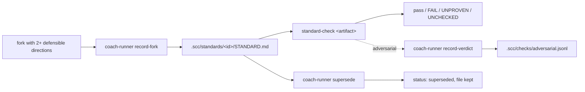
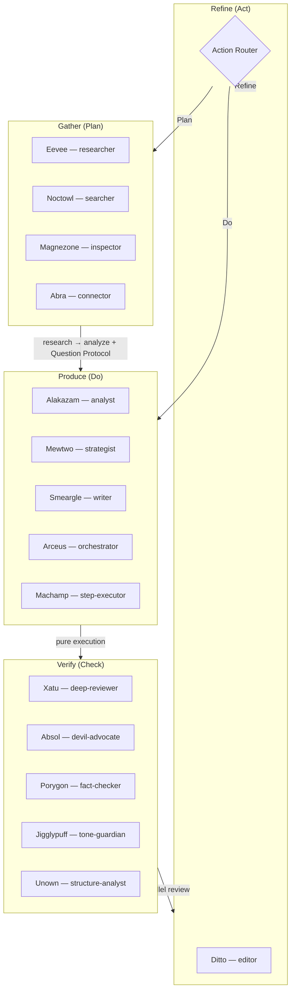
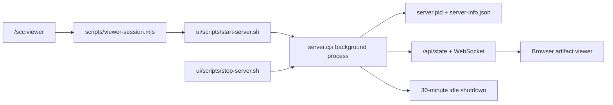
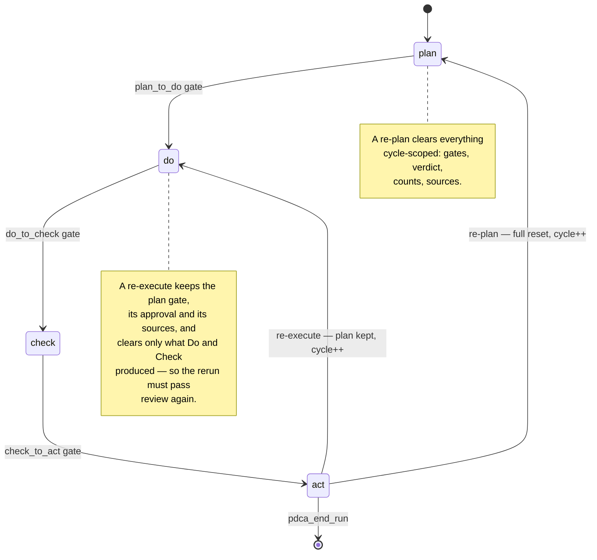

**English** | [한국어](architecture.ko.md)

# Architecture — SCC 3.0.2

## Runtime Boundary

Second Claude Code is intentionally a Claude Code plugin, not a standalone agent runtime.

- `soul` is the persistent identity layer for user preferences and behavioral patterns.
- Project recall belongs to PDCA recovery state, MMBridge memory, handoff artifacts, and session resume.
- External skill discovery remains approval-first.

This boundary is deliberate. Hermes-style runtime features can inspire individual subsystems, but the plugin should not embed a second agent OS inside the Claude Code execution model.

---

## PDCA Structure

Second Claude Code is structured as a PDCA-native knowledge-work system.
The product-facing phases are `Gather → Produce → Verify → Refine`, which map
directly to `Plan → Do → Check → Act`.

| PDCA | Product Phase | Primary Skills |
|------|---------------|----------------|
| Requirements | Clarify | `coach` |
| Plan | Gather | `research`, `analyze`*, `discover`, `collect` |
| Do | Produce | `analyze`*, `write`, `workflow`, `batch` |
| Check | Verify | `review` |
| Act | Refine | `refine` |
| **Optimization** | **Evolve** | **`loop`**, `evolve` |
| **Orchestrator** | **Full Cycle** | **`pdca`** |
| **Identity** | **Extend** | **`soul`** |

The `pdca` meta-skill can orchestrate a full cycle with quality gates between phase transitions.
It is one explicit workflow option; individual skills and commands remain usable directly.

*`analyze` spans both phases: in Plan it synthesizes research findings; in Do it can apply a different framework for the production artifact.

### The 15 skills

| Skill | Phase | Role |
|---|---|---|
| `coach` | Requirements | Settles a fork with two or more defensible directions into a standard |
| `research` | Plan | Autonomous multi-round web research |
| `analyze` | Plan / Do | 15 strategic frameworks |
| `write` | Do | Long-form content production |
| `review` | Check | Preset-dependent quality gate (2–5 parallel reviewers) |
| `refine` | Act | Iterative improvement to a target |
| `loop` | Optimization | Fixed-suite prompt asset optimization (maintainer-only) |
| `evolve` | Maintenance | Evolves a recurring-failure asset against a maintainer-authored check (maintainer-only) |
| `collect` | Plan | PARA-classified knowledge capture |
| `workflow` | Do | Custom pipeline builder |
| `discover` | Plan | Skill discovery and installation |
| `batch` | Do | Parallel decomposition of large homogeneous work |
| `soul` | Extend | User identity profile synthesis |
| `translate` | Extend | Soul-aware EN↔KO translation |
| `pdca` | Full cycle | Orchestrator (meta-skill) |

Three commands sit outside the skill list: `/scc:viewer`, `/scc:unblock`, and `/scc:standard-check`. They execute and make no judgment, and a judgment-free entry in the skill list costs the model a choice without giving it one.

## Decision Standards

A session ends and its reasoning goes with it. The next session re-proposes an option that already lost, and nothing on disk says otherwise. Standards are the fix: one record per settled fork, written by the project, read by every session that follows.

| Concern | Where it lives |
|---|---|
| Root resolution, plugin-path refusal | `scripts/lib/project-root.mjs` |
| Interview state (resumable, atomic write) | `scripts/lib/coach-state.mjs` → `<project>/.scc/state/coach.json` |
| Standard record (render, write, list, retire) | `scripts/lib/standard-record.mjs` → `<project>/.scc/standards/<id>/STANDARD.md` |
| Reviewer verdicts on adversarial checks | `scripts/lib/adversarial-log.mjs` → `<project>/.scc/checks/adversarial.jsonl` |
| Interview and record commands | `scripts/coach-runner.mjs` |
| Compliance runner | `scripts/standard-check.mjs`, checkers in `scripts/lib/standard-checkers.mjs` |



Four invariants hold this together.

**A record is retired, never deleted.** `supersede` flips `status: active` to `superseded` and leaves the file. The rejected options and why they lost stay readable, which is the only thing that stops a later session from re-proposing them. A replacement is written first, carrying `supersedes: "<old id>"`, so a colliding id aborts while the existing standard is still active.

**A check is data, not code.** Standards live in the user's project and travel through its repository. Five fixed checkers — `regex-absent`, `regex-present`, `length-between`, `similarity-below`, `frontmatter-equals` — take structured arguments. A `run:`-style field, an unknown checker id, and an unknown field are all refused with an error rather than skipped, because an author who believes a check is enforced while the runner steps over it is worse off than one with no check at all.

**A checker must be able to say no.** Each one ships a fixture in this repository that it must reject, and the suite fails if a checker starts passing its own fixture. The fixtures live here rather than in the user's project, because a project-supplied fixture would be another input crossing the trust boundary.

**Nobody stamps their own work.** An `adversarial` check stays `UNPROVEN` until a reviewer's answer is on file, bound to the sha256 of the artifact they actually read — edit the artifact and the answers return to unproven. Verdicts are recorded through the coach runner, never through `standard-check`, so the tool that grades the work is not the tool that records passing grades. A standard with no checks reports `UNCHECKED`: visible, not verified, and never a pass.

The runner refuses to write anywhere inside the plugin install; `project-root.mjs` rejects that path,
including symlinks and case variants, before user specifications are written.

### Code Engineering Lane

Code work keeps the same PDCA cycle but runs through a stricter `domain=code` lane. This lane absorbs `engineering-discipline`'s plan/implementation/validation separation and `Hyper-Waterfall`'s issue/branch/stage-report/PR external memory pattern as a code-specific contract.

The point is not to add a second runtime. It tightens the existing Plan -> Do -> Check -> Act gates: Plan defines executable acceptance criteria and impact scope, Do isolates non-trivial work in a branch or worktree and records stage reports when needed, Check requires validator/reviewer evidence instead of worker self-report, and Act finishes cleanup, simplification, measured performance claims, and PR or local handoff state.

## Directory Structure

```
second-claude/
├── .claude-plugin/plugin.json    # Plugin manifest — MCP servers: pdca-state (31 tools), playwright (optional), mmbridge (optional)
├── skills/                       # 15 skills (SKILL.md each)
│   ├── coach/                    # Fork settlement (topology, scoring, standards under .scc/)
│   ├── pdca/                     # PDCA cycle orchestrator (meta-skill)
│   │   └── references/           # Phase gates + action router + question protocol
│   ├── research/                 # Depth-controlled research with layered fallbacks
│   │   └── references/           # research-methodology.md, playwright-guide.md
│   ├── write/                    # Content production
│   ├── analyze/                  # Strategic framework analysis (15 frameworks)
│   ├── review/                   # Multi-perspective quality gate
│   ├── refine/                   # Iterative improvement
│   ├── collect/                  # Knowledge collection (PARA)
│   ├── workflow/                 # Custom workflow builder
│   ├── discover/                 # Skill discovery
│   ├── loop/                     # Karpathy-style prompt optimization loop
│   ├── evolve/                   # Ouroboros maintainer loop (harvest failures → maintainer check → loop)
│   ├── batch/                    # Parallel task decomposition and execution
│   │   └── references/           # Decomposition guide, split strategies, merge patterns
│   ├── soul/                     # User identity profile synthesis
│   │   └── references/           # Observation signals, synthesis algorithm, templates
│   ├── translate/                # Soul-aware EN↔KO translation
│   └── unblock/                  # Engine only — no SKILL.md; ships as /scc:unblock
│       ├── engine/               # CLI + chain + 10 probes + orchestrator
│       └── references/           # waf-detection, tls-impersonation, archive-fallbacks, eevee-flow
├── agents/                       # 17 specialized subagents (Pokemon-themed)
├── commands/                     # 18 slash commands — 15 skill wrappers + 3 tools
├── hooks/                        # Lifecycle hooks + context injection (8 files, 9 events)
│   ├── hooks.json                # Hook configuration
│   ├── session-start.mjs         # Session startup state/context restore and injection
│   ├── prompt-detect.mjs         # Active-standard literal-trigger reporting
│   ├── subagent-start.mjs        # Review-panel context and participation tracking
│   ├── subagent-stop.mjs         # Persist reviewer result and consensus state
│   ├── review-result.mjs         # Inject review state into parent after Agent returns
│   ├── session-end.mjs           # Stop gate, handoff, and cleanup
│   ├── stop-failure.mjs          # Crash-recovery snapshot
│   ├── compaction.mjs            # Pre/PostCompact snapshot lifecycle
│   └── lib/                      # Shared hook modules
│       ├── plugin-discovery.mjs  # Runtime plugin capability discovery for advisory plans
│       ├── soul-observer.mjs     # Soul signal detection + readiness/retro utilities
│       ├── event-log.mjs         # PDCA event sourcing (append-only JSONL)
│       └── ...                   # file-mutex-sync, project-memory, review-config, report-generator, companion-daemon, utils
├── mcp/
│   ├── pdca-state-server.bundle.mjs # Self-contained 31-tool server used at runtime
│   ├── pdca-state-server.mjs     # Unbundled source used for development and tests
│   └── lib/
│       ├── orchestrator-handlers.mjs  # orchestrator_* tool handlers
│       ├── soul-handlers.mjs          # soul_* tool handlers (inc. retro, synthesis, readiness)
│       ├── cycle-memory.mjs           # Cycle memory persistence (phase snapshots, insights, metrics)
│       └── ...                        # pdca-handlers, memory-handlers, etc.
├── references/                   # Design principles, consensus gate
├── templates/                    # Output templates
├── scripts/                      # coach-runner, standard-check, viewer-session, export-artifact, evolve-runner
└── config/                       # User configuration
```

| Directory | Role |
|-----------|------|
| `skills/` | Each skill has a `SKILL.md` (short, context-efficient) plus a `references/` subdirectory for deep documentation. Progressive disclosure in action. |
| `skills/pdca/` | Meta-skill with phase gate checklists, Action Router, and Question Protocol in `references/`. |
| `agents/` | 17 Pokemon-themed subagent definitions across 3 model tiers. See Agent Roster below. |
| `commands/` | Thin wrappers that route `/scc:*` invocations to the matching skill. |
| `hooks/` | 8 hook files registered across 9 events: standard-trigger reporting, review lifecycle and parent handoff, session lifecycle, compaction, and quality gates. |
| `references/` | Shared knowledge: design principles, consensus gate spec, PARA method. |

---

## Agent Roster — Pokemon Edition

17 specialized subagents across 3 model tiers, themed as Pokemon.
Each Pokemon is chosen because its characteristics match the agent's role.

### Production Agents (Plan / Do)

| Agent | Pokemon | Model | PDCA Phase | Role | Why This Pokemon |
|-------|---------|-------|------------|------|------------------|
| researcher | **Eevee** | sonnet | Gather | Web search + multi-source data collection | Adapts anywhere, evolves in many directions |
| analyst | **Alakazam** | sonnet | Produce | Pattern recognition + data synthesis | IQ 5000, two spoons = cross-data analysis |
| strategist | **Mewtwo** | sonnet | Produce | Strategic framework application | Ultimate strategic mind |
| writer | **Smeargle** | opus | Produce | Long-form content creation | The painter — masters any technique |
| editor | **Ditto** | opus | Refine | Content editing + quality improvement | Transforms the original into a better form |

### Review Agents (Check)

| Agent | Pokemon | Model | PDCA Phase | Role | Why This Pokemon |
|-------|---------|-------|------------|------|------------------|
| deep-reviewer | **Xatu** | opus | Verify | Logic, structure, and completeness | Sees past and future simultaneously = structural flaw detection |
| devil-advocate | **Absol** | sonnet | Verify | Attacks weakest points and blind spots | The disaster-sensing Pokemon, warns of danger |
| fact-checker | **Porygon** | sonnet | Verify | Verifies claims, numbers, and sources | Digital native, data-driven binary judgment |
| tone-guardian | **Jigglypuff** | sonnet | Verify | Voice and audience fit | THE voice Pokemon, sensitive to tone |
| structure-analyst | **Unown** | sonnet | Verify | Organization and readability | Letter-shaped, obsessed with structure |

### Pipeline & Discover Agents

| Agent | Pokemon | Model | PDCA Phase | Role | Why This Pokemon |
|-------|---------|-------|------------|------|------------------|
| orchestrator | **Arceus** | sonnet | Produce | Pipeline orchestration | Creator god, coordinates everything |
| step-executor | **Machamp** | sonnet | Produce | Single pipeline step execution | Four arms, gets things done |
| searcher | **Noctowl** | haiku | Gather | External source search | Nocturnal scout, sharp eyes |
| inspector | **Magnezone** | sonnet | Gather | Skill candidate inspection | Magnetic scanner, attracts details |
| evaluator | **Deoxys** | sonnet | Gather | Skill candidate scoring | Analysis form, adaptive evaluation |
| connector | **Abra** | haiku | Extend | Knowledge linking | Teleport = connects distant concepts |

### Soul Agents

| Agent | Pokemon | Model | Phase | Role | Why This Pokemon |
|-------|---------|-------|-------|------|------------------|
| soul-keeper | **Pikachu** | opus | Extend | User identity synthesis | The iconic companion — knows the trainer better than anyone |

### Model Distribution

| Tier | Count | Use |
|------|-------|-----|
| opus | 4 | Deep review, long-form writing, editorial, soul synthesis |
| sonnet | 11 | Research, analysis, strategy, orchestration, adversarial review, fact-checking, tone-checking, structure analysis |
| haiku | 2 | Search and knowledge linking — collection, not judgment |

---

## PDCA Agent Mapping

The roster maps jobs to the PDCA quality cycle. A review run selects a preset; the five
review roles below are the available panel, not a promise that every run dispatches all of them.
The Action Router operates in Act:



Supporting commands reinforce the same loop:

- `pdca` orchestrates the full cycle with quality gates and the Action Router
- `/scc:loop` runs fixed benchmark suites to evolve prompt assets in isolated winner branches
- `collect` keeps source material and notes available for the next planning cycle
- `discover` expands the system when the current skill set is not enough
- `workflow` automates full Gather → Produce → Verify → Refine runs
- `batch` decomposes large homogeneous tasks into parallel units executed concurrently in isolated worktrees
- `soul` builds and maintains a persistent user identity profile from observed behavioral signals
- `viewer` starts the local artifact viewer for saved PDCA/session artifacts and returns a browser URL

### Artifact Viewer Lifecycle



The viewer command is intentionally a thin wrapper: it delegates to the skill, which starts the zero-dependency Node server in the background, records runtime metadata for follow-up commands, streams artifact state through HTTP/WebSocket, and shuts down through either the stop script or the idle timeout.

### Loop Runner Architecture

The maintainer-facing `loop` command adds a second optimization loop around the plugin's own prompt assets:

- Suite manifests live in `benchmarks/loop/*.json` and declare `allowed_targets`, weighted `cases`, budget, and `min_delta`.
- `scripts/loop-runner.mjs` creates an isolated `codex/loop-<suite>-<run_id>` branch plus run worktree, then evaluates the baseline and every candidate under the exact same suite budget.
- Candidate worktrees are temporary. Only the winning patch is copied back into the isolated run branch, and the main workspace remains untouched.
- Active state is persisted in `.data/state/loop-active.json`, while `.captures/loop-<run_id>/` stores the leaderboard, score history, summary, case logs, and winner diff.
- Session hooks surface loop state in startup banners, compaction restoration, and `HANDOFF.md`, so long-running optimization runs can be resumed safely.

---

## PDCA Phase Gates

The PDCA state MCP enforces the following transition subset. Format floors and reviewer quality
checks are documented skill contracts, not all runtime requirements:

```
Plan  ──[brief + ≥5 sources + analysis + Plan approval]──→ Do
Do    ──[artifact + complete + Plan integrated]──→ Check
Check ──[verdict + ≥2 reviewers]──→ Act
Act   ──[decision + root cause]──→ Plan / Do / Refine / Exit
Refine ──[skill contract]──→ Exit (or present options)
```

### Length Floors (Do skill contract)

The Do skill checks format-specific length contracts and can request a targeted rewrite. The PDCA
state MCP transition currently checks artifact presence/completeness and Plan integration; it does
not make every length floor a universal runtime gate.

| Format | Min chars (body) | Target | Min sections | Sub-skill in Do |
|--------|-----------------|--------|--------------|----------------|
| Newsletter | 10,000 | format-specific | 6-stage arc | `/scc:write --format newsletter` |
| Generic article | 4,000 | 5,000-7,000 | 5 H2 | `/scc:write` |
| Strategy/analysis report | 5,000 | 6,000-9,000 | 6 sections | `/scc:write` |
| SWOT/RICE/OKR doc | 3,000 | 4,000-5,000 | 4 quadrants | `/scc:analyze` |
| Shorts script (60-90s) | 1,800 | format-specific | CTA | `/scc:write --format shorts` |
| Card news (carousel) | slide-by-slide | format-specific | visual direction | `/scc:write --format card-news` |
| Code review report | 2,500 | 3,500-5,000 | 5 dimensions | `/scc:review` |
| Research brief | 3,000 | 4,000-6,000 | n/a | `/scc:research` |

Full table and calibration principles in `skills/pdca/references/do-phase.md`.

### Domain Auto-Routing (Pre-Do Sub-Skill Selection)

When PDCA enters the Do phase, it matches the requested artifact format against the supported write/analyze paths. Specialized external capabilities may be suggested separately, but are not invoked by the lifecycle hook.

| Triggers | Sub-skill |
|---------|-----------|
| newsletter / 뉴스레터 | `/scc:write --format newsletter` |
| article / 아티클 | `/scc:write --format article` |
| report / 보고서 | `/scc:write --format report` |
| shorts / 쇼츠 | `/scc:write --format shorts` |
| social / 소셜 | `/scc:write --format social` |
| card-news / 카드뉴스 | `/scc:write --format card-news` |
| (no specialized match) | `/scc:write` (fallback) |

Sub-skill input/output contracts and failure handling are documented in `skills/pdca/references/domain-pipeline-integration.md`.

### Reviewer Independence (Check Gate)

Whoever helped produce something does not get to certify it. Agent reuse breaks this quietly: the
critic roster and the agents an upstream phase borrows come from the same pool, so one name can
shape a decision and then vote on the work that decision governs — adversarial in form, self-review
in substance.

The discriminator is the active run's phase, not a heuristic. A reviewer-named agent starting while
`pdca-active.json` reports any phase other than `check` was borrowed upstream; `subagent-start`
records it in `state/upstream-participants.json`.

At aggregation, an excluded reviewer keeps its report — the findings are still findings — and loses
its vote. If exclusion leaves the panel short, consensus is `BLOCKED — QUORUM SHORT` and names who
was barred and how many independent reviewers are missing. Quorum is never reached by relaxing an
exclusion, because a rule that bends to fit the headcount is not a rule. The list is cleared once
consensus is computed, so a name borrowed upstream once is not barred from every review thereafter.

The standards side carries the same invariant: a fork file records `participants`, and
`record-verdict` refuses a verdict from anyone on that list.

### Reviewer checks (Check skill contract)

The review skill dispatches the selected 2–5 reviewer preset and may perform model-diversity or
false-consensus checks. The PDCA state MCP transition itself requires only a verdict and at least
two reported reviewers; external coverage and adversarial follow-up are optional/advisory.

### 5+ Rule (Patch vs Full Rewrite)

The Act phase checks the 5+ Rule before plurality routing. The rule fires a full rewrite (instead of patching) when finding density crosses a threshold.

Three trigger conditions, any one fires the rule:

1. **Hard credibility trigger**: any `P0_count ≥ 1` — single credibility-killer forces rewrite
2. **Volume + spread trigger** (BOTH required):
   - `P0_count + P1_count ≥ 5` total findings, AND
   - Findings span ≥ 3 distinct quality categories (factual, source integrity, voice, structure, length, reader value)
3. (Otherwise) no rule fire — normal Action Router plurality routing

Calibrated from initial OR logic after observing over-trigger on a 4-finding patch set spanning 3 categories — clearly surgical patch territory but flagged as full rewrite. Switching to AND for the volume+spread path resolved the over-trigger; the hard credibility path is preserved separately because credibility damage compounds even when surface fixes look small.


### Action Router (Act Phase)

The Action Router classifies review findings by root cause before routing:

| Finding Category | Route | Rationale |
|-----------------|-------|-----------|
| SOURCE_GAP, ASSUMPTION_ERROR, FRAMEWORK_MISMATCH | Plan | Fundamental issues need more research |
| COMPLETENESS_GAP, FORMAT_VIOLATION | Do | Execution issues need rewrite |
| EXECUTION_QUALITY | Refine | Polish issues need iteration |

### Transition Contract

`pdca_transition` enforces the cycle as a state machine. Only these moves exist, and both backward routes cost a cycle, so `max_cycles` bounds the whole run rather than just re-planning.



| From → To | Cycle cost | What survives |
|---|---|---|
| `act → plan` | +1, capped by `max_cycles` | Run identity, artifacts, cumulative counters |
| `act → do` | +1, capped by `max_cycles` | The above, plus `plan_to_do`, plan approval, and `sources_count` |

Anything else raises `Illegal transition`. The `act → do` route exists because the Action Router classifies COMPLETENESS_GAP and FORMAT_VIOLATION as execution problems — without it, a third of the router's decisions would have nowhere to go.

### Definition of Done — Refine Gate

The `refine` skill accepts an optional `--dod` flag: a semicolon-separated checklist of success criteria. When active:

1. DoD criteria are injected into each reviewer's context as a structured checklist
2. Reviewers evaluate each criterion as `DoD-N: PASS` or `DoD-N: FAIL` alongside their normal review
3. Per-criterion consensus is computed (majority across reviewers)
4. The editor prioritizes FAIL criteria before general feedback (up to 3 fixes per round)
5. Refine exits only when **all DoD criteria PASS** AND the score/verdict target is met

This prevents the "score is high but the specific thing I asked for isn't done" failure mode. Without `--dod`, refine behaves exactly as before.

### Question Protocol (Plan Phase)

Limits interactive dialogue to max 3 scope-clarifying questions:
- Skipped when context is sufficient, `--no-questions` is set, or in automation mode
- Unanswered questions → save assumptions and proceed
- Act→Plan return skips questions (research gap already identified)

Phase gate checklists live in `skills/pdca/references/`.
The `hooks/prompt-detect.mjs` hook is deliberately narrow: it checks the prompt for
literal trigger strings declared by active project standards and reports matching
standards. It does not select or invoke a skill. PDCA selection remains part of the
normal Claude Code skill/command flow.

---

## Lifecycle Hooks

8 hook files registered across 9 events in `hooks/hooks.json` (`compaction.mjs` serves both PreCompact and PostCompact):

| Event | Hook file | Behavior |
|-------|-----------|----------|
| `SessionStart` | `session-start.mjs` | Session banner plus available state/context restoration and injection |
| `UserPromptSubmit` | `prompt-detect.mjs` | Active-standard literal-trigger reporting |
| `SubagentStart` | `subagent-start.mjs` | Review session context injection |
| `SubagentStop` | `subagent-stop.mjs` | Silently persist reviewer output and consensus state |
| `PostToolUse` (`Agent`) | `review-result.mjs` | Inject the persisted review summary into the parent session |
| `Stop` | `session-end.mjs` | Session-end quality gate, handoff, and cleanup |
| `StopFailure` | `stop-failure.mjs` | Crash-recovery snapshot (does not enforce the Check gate) |
| `PreCompact` | `compaction.mjs` | PDCA state snapshot before context compression |
| `PostCompact` | `compaction.mjs` | Retains the snapshot for the following `SessionStart(source=compact)` |

`PreCompact` and `PostCompact` share the same `compaction.mjs` file. It snapshots PDCA cycle state before
context-window compression; the following `SessionStart(source=compact)` consumes that snapshot, preventing
mid-cycle state loss.

The hooks have deliberately separate responsibilities:

- `SessionStart` restores active state, crash-recovery notices, standards, memory, and environment capabilities. A compact snapshot is consumed once when the host follows compaction with `source=compact`.
- `UserPromptSubmit` (`prompt-detect`) reports matching literal triggers from active project standards. It does not choose, invoke, or install a skill.
- `SubagentStart` records review-panel participation and injects role context. `SubagentStop` parses reviewer output and silently persists the preset's quorum state. When the `Agent` tool returns, `PostToolUse` injects that state into the parent session and removes a completed namespaced panel.
- `Stop` is the normal session-end path. With an active PDCA run whose Check phase is incomplete, it writes the reason to stderr and exits **2**, which asks Claude Code to continue. A session-scoped guard and the host's `stop_hook_active` retry signal prevent an infinite denial loop. Once allowed, it writes `HANDOFF.md` and performs non-blocking summaries and cleanup.
- `StopFailure` is crash recovery, not a quality gate. It copies active PDCA state to `.data/state/pdca-crash-recovery.json`, appends an error event when possible, and exits **0** even when recovery logging fails. The next `SessionStart` surfaces the snapshot.

## MCP servers

`.claude-plugin/plugin.json` registers three MCP servers:

| Server | Transport | Required | Role |
|--------|-----------|----------|------|
| `pdca-state` | stdio | Yes | 31 tools for PDCA state, cycle memory, Soul, project memory, daemon/session recall, and plugin orchestration |
| `playwright` | stdio | Optional | Chromium access for JavaScript-rendered pages |
| `mmbridge` | stdio | Optional | External multi-model research and review integration |

### Prebundled PDCA state server

The manifest starts `mcp/pdca-state-server.bundle.mjs`, a checked-in, self-contained bundle containing
the 31-tool `pdca-state` server and its runtime dependencies. This is important at cold start: a fresh
plugin install does not need `npm install`, network access, or a `node_modules` directory before the core
`pdca-state` MCP tools become available. `mcp/pdca-state-server.mjs` remains the readable source used by development and
tests; `npm run build:mcp` regenerates the bundle, and CI fails if the generated artifact drifts.

The server stores runtime data below `${CLAUDE_PLUGIN_DATA}` (falling back to the plugin's `.data/`)
and serializes state mutations with file locks. The bundled server is an installation artifact, not a
second runtime boundary.

## Cross-plugin orchestration

Cross-plugin support is an explicit, advisory MCP capability. `orchestrator_list_plugins`,
`orchestrator_get_plugin`, `orchestrator_route`, and `orchestrator_health` inspect installed plugins and
return inventory, health, or ranked route plans. They do not execute a returned Skill, slash command,
MCP server, or external process. A caller may review a plan and explicitly invoke a capability; the
`prompt-detect` hook never turns a plan into automatic execution.

---

## Agent Team Integration

PDCA phases leverage parallel execution where possible:

```yaml
team_name: pdca-{topic-slug}
lead: Arceus (orchestrator, sonnet)
phases:
  plan:
    agent:
      role: Eevee (researcher)
      task: "depth-controlled research"
    optional_parallel:
      - mmbridge research pass  # configured, medium/deep depth only
    sequential:
      - Alakazam + Mewtwo: analyze (merged research results)
  do:
    agent: Smeargle (writer, opus)
  check:
    parallel_agents:  # selected by the review preset (2–5 reviewers)
      - preset-selected reviewers
  act:
    agent: Ditto (editor, opus)  # loop internal editing
```

- Plan phase follows the research depth contract; a configured MMBridge pass runs in parallel at medium/deep depth
- Check phase runs the selected 2–5 reviewer preset (handled by the review skill)
- File ownership: each agent writes to separate output files

---

## MMBridge Integration — Optional

MMBridge CLI can provide multi-model AI capabilities at integration points selected by a skill or
caller. A configured research run may use it as an additional pass; external review remains opt-in
through `--external`, and phase-gate checks are advisory.
**Entirely optional** — all skills work fully without MMBridge.

For detection, invocation, and error handling rules, see `references/mmbridge-integration.md`.

### Integration Points

| PDCA Phase | MMBridge Command | Skill | Behavior |
|-----------|-----------------|-------|----------|
| **Plan** | `mmbridge research` | `/scc:research` | Parallel multi-model research, merged into analyst input |
| **Check** | `mmbridge review` | `/scc:review --external` | Cross-model code review, +1 consensus voter |
| **Check** | `mmbridge security` | `/scc:review --preset security --external` | CWE-classified security audit |
| **Plan** | `mmbridge debate` | `/scc:analyze` | Multi-model adversarial challenge at thorough depth |
| **Check→Act** | `mmbridge gate` | `/scc:pdca` | Advisory coverage check at phase transition |
| **Act** | `mmbridge followup` | `/scc:refine` | Clarify ambiguous external review findings |
| **Act** | `mmbridge resume` | `/scc:refine` | External re-assessment after fixes |
| **Check** | `mmbridge diff` | `/scc:review` | Annotated diff view for code/security presets |
| **Plan** | `mmbridge memory` | `/scc:pdca` | Cross-session context from prior cycles |
| **Exit** | `mmbridge handoff` | `/scc:pdca` | Session summary artifact on APPROVED exit |

### External Reviewers

| Reviewer | Provider | Strength |
|----------|----------|----------|
| kimi-reviewer | Kimi (K2.5) | Deep web research, BrowseComp 60.6% |
| qwen-reviewer | Qwen | Security analysis |
| gemini-reviewer | Gemini | Design and visual review |
| codex-reviewer | Codex | Code-focused one-shot review |

### Review Flow

```
Review Dispatch
├── Internal — preset selects 2–5 roles
│   ├── Xatu / deep-reviewer (opus)
│   ├── Absol / devil-advocate (sonnet)
│   ├── Porygon / fact-checker (sonnet)
│   ├── Jigglypuff / tone-guardian (sonnet)
│   └── Unown / structure-analyst (sonnet)
│
├── External — review (--external flag)
│   └── mmbridge review --tool kimi
│
├── External — security (--preset security --external)
│   └── mmbridge security --scope all
│
└── Consensus Gate
    ├── Merge internal + external findings
    ├── Deduplicate overlapping issues
    ├── Apply severity calibration
    ├── mmbridge gate advisory (if available)
    └── Emit verdict: APPROVED | MINOR FIXES | NEEDS IMPROVEMENT | MUST FIX
```

### Research Flow

```
Research Dispatch
├── researcher (sonnet)
│   ├── Jina Search when configured
│   ├── WebSearch + WebFetch fallback
│   ├── /scc:unblock for hostile or empty pages
│   └── Playwright only when needed (max 3 navigations/round)
│
├── Optional MMBridge pass (configured, medium/deep depth)
│   └── mmbridge research (dispatched by the research skill)
│
└── Analyst Merge
    ├── available internal findings + optional external findings
    ├── Gap analysis
    └── Writer synthesis → Research Brief
```

---

## Memory Boundary

Second Claude Code keeps two memory layers separate on purpose:

- `soul` stores persistent user identity and preference signals.
- Project recall comes from PDCA recovery state plus MMBridge continuity features such as memory search, handoff, and resume.

This project can borrow ideas from standalone agent runtimes, but it should not embed a second runtime inside the Claude Code plugin model.

## Cycle Memory

The cycle memory module (`mcp/lib/cycle-memory.mjs`) provides durable cross-cycle knowledge that survives session boundaries. It stores phase artifacts, metrics, and structured insights under `.data/cycles/`.

### Storage Layout

```
.data/cycles/
├── cycle-001/
│   ├── plan.md          # Phase artifact snapshot
│   ├── do.md
│   ├── check.md
│   ├── act.md
│   ├── metrics.json     # Cycle-level metrics (domain, verdict, durations)
│   └── events.jsonl     # Append-only event log
├── cycle-002/
│   └── ...
├── insights.json        # Cross-cycle structured insights with time-decay weights
└── proposals/           # Auto-generated gotcha proposals (self-evolution)
    └── gotchas-{category}.md
```

### Integration Points

| Handler | Trigger | Behavior |
|---------|---------|----------|
| `handleStartRun` | `pdca_start_run` | Read-Before-Act: loads 10 most recent insights (weight ≥ 0.1) into run context |
| `handleTransition` | `pdca_transition` | Auto-saves completed phase artifact to `cycle-NNN/{phase}.md` |
| `handleEndRun` | `pdca_end_run` | Persists cycle metrics to `cycle-NNN/metrics.json` |

### MCP Tools

| Tool | Params | Returns |
|------|--------|---------|
| `pdca_get_cycle_history` | `cycle_id?`, `last_n?` | `{ cycles: [{ id, plan, do, check, act, metrics }] }` |
| `pdca_save_insight` | `cycle_id`, `insight`, `category`, `severity` | `{ total_insights, repeated_count }` |
| `pdca_get_insights` | `category?`, `last_n?`, `min_weight?` | `{ insights: [{ cycle_id, timestamp, category, severity, text, weight }] }` |

### Self-Evolution

Insights use a 30-day linear time-decay for weight. When a critical insight repeats 3+ times, `saveInsight` automatically writes a gotcha proposal to `.data/proposals/gotchas-{category}.md`. These proposals surface recurring failure patterns as actionable checklists that can be promoted to permanent project gotchas.

---

## Playwright MCP — Optional Browser Research

The `playwright` MCP server is registered in `.claude-plugin/plugin.json` with `optional: true`. It provides
a real Chromium browser to the researcher agent (Eevee) for URLs that `WebFetch` cannot read. A missing
package or cache/network failure disables this fallback only; the prebundled `pdca-state` server and its
core tools still start normally.

**This is entirely optional** — the research skill works fully without Playwright installed.

### When it activates

```
researcher: WebFetch(url) → empty / error
                 │
                 └─ Playwright available?
                      ├─ yes → browser_navigate(url)
                      │         browser_snapshot()   ← accessibility tree
                      │         parse + extract content
                      └─ no  → log in Gaps & Limitations, continue
```

The `--interactive` flag on `/scc:research` forces Playwright for every URL, bypassing WebFetch entirely. Useful for SPA dashboards or news sites with heavy JavaScript rendering.

### Cost control

Max **3 Playwright navigations per research round**. Exceeding the cap triggers a hard stop on further navigations; remaining URLs are noted in Gaps & Limitations.

### Accessibility tree advantage

`browser_snapshot()` returns a structured accessibility tree rather than raw HTML. Token cost is 80-90% lower than equivalent HTML for the same information. The researcher extracts headings, paragraphs, and table cells directly from the tree — navigation chrome and ads are structurally excluded.

See `skills/research/references/playwright-guide.md` for full tool reference and patterns.

---

Release history and migration notes live in [CHANGELOG.md](../CHANGELOG.md). This architecture guide
describes the SCC 3.0.2 runtime rather than copying historical release notes.
