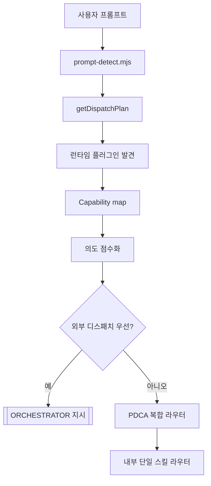
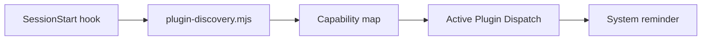

[English](orchestrator-architecture.md) | **한국어**

# 오케스트레이터 아키텍처 - v1.4.0

Second Claude Code v1.4.0의 크로스-플러그인 오케스트레이터는 설치된 Claude Code 플러그인을 런타임에 발견하고, 사용자 의도와 점수화한 뒤, 자체 PDCA 스킬로 fallback하기 전에 정확한 `Skill:` 또는 슬래시 커맨드 호출 지시를 주입합니다.

## 디스패치 레이어



1. **런타임 발견** - `hooks/lib/plugin-discovery.mjs`가 `~/.claude/plugins/installed_plugins.json`, 각 플러그인의 `skills/`, `commands/`, `agents/`, `.claude-plugin/plugin.json`을 스캔합니다.
2. **의도 점수화** - `getDispatchPlan()`이 키워드나 PDCA 페이즈를 정규화하고, 플러그인 capability를 점수화하고, preferred-plugin 보정을 적용한 뒤, 정렬된 호출 지시를 반환합니다.
3. **프롬프트 디스패치** - `hooks/prompt-detect.mjs`가 lifecycle 의도나 강한 일반 플러그인 매칭을 발견하면 `[ORCHESTRATOR]` 블록을 주입합니다.

## 검증된 라우트

| 입력 | 의도 | 1순위 디스패치 |
| --- | --- | --- |
| `phase=plan` | PDCA Plan | `Skill: claude-mem-knowledge-agent` |
| `phase=do` | PDCA Do | `Skill: frontend-design-frontend-design` |
| `phase=check` | PDCA Check | `Skill: coderabbit-code-review` |
| `phase=act` | PDCA Act | `/commit-commands:commit` |
| `코드 리뷰해줘` | 리뷰 lifecycle 의도 | `Skill: coderabbit-code-review` |
| `커밋해줘` | Act lifecycle 의도 | `/commit-commands:commit` |
| `posthog event analysis` | 직접 일반 플러그인 매칭 | `Skill: posthog-exploring-autocapture-events` |

짧은 키워드는 단어 경계 검사를 거칩니다. 예를 들어 `bug` 같은 작은 토큰이 `debugging` 안에서 우연히 매칭되는 일을 막습니다.

## 세션 시작 컨텍스트



세션 시작 시 훅은 "Active Plugin Dispatch" 표를 주입합니다. 이 표는 모델을 위한 안내 컨텍스트이며, 페이즈별 1순위 플러그인, capability 수, 정확한 호출 문자열을 포함합니다.

## 프롬프트 레벨 디스패치

실질적인 프롬프트마다 `prompt-detect`가 `getDispatchPlan()`을 호출합니다. 외부 capability가 1순위로 선택되면 다음 형태의 지시를 주입합니다.

```text
[ORCHESTRATOR]
Invoke this installed plugin capability before self-processing:
Skill: coderabbit-code-review
```

모델은 먼저 해당 외부 스킬 또는 커맨드를 호출하고 결과를 통합해야 합니다. 외부 라우트가 이기지 못하면 기존 PDCA 복합 라우터, 그다음 내부 단일 스킬 라우터로 내려갑니다.

## MCP 도구 표면 - 총 31개

| 영역 | 개수 | 도구 |
| --- | ---: | --- |
| PDCA 상태 | 9 | `pdca_get_state`, `pdca_start_run`, `pdca_transition`, `pdca_check_gate`, `pdca_end_run`, `pdca_update_stuck_flags`, `pdca_list_runs`, `pdca_get_events`, `pdca_get_analytics` |
| 사이클 메모리 | 3 | `pdca_get_cycle_history`, `pdca_save_insight`, `pdca_get_insights` |
| Soul | 6 | `soul_get_profile`, `soul_record_observation`, `soul_get_observations`, `soul_retro`, `soul_get_synthesis_context`, `soul_get_readiness` |
| 프로젝트 메모리 | 2 | `project_memory_get`, `project_memory_upsert` |
| 데몬과 세션 | 7 | `daemon_get_status`, `daemon_schedule_workflow`, `daemon_list_jobs`, `daemon_start_background_run`, `daemon_list_background_runs`, `daemon_queue_notification`, `session_recall_search` |
| 오케스트레이터 | 4 | `orchestrator_list_plugins`, `orchestrator_get_plugin`, `orchestrator_route`, `orchestrator_health` |

네 개의 `orchestrator_*` 도구는 플러그인 인벤토리, 단일 플러그인 조회, 라우트 계획, 생태계 상태 점검을 위한 공개 MCP 표면입니다.

## 파일 구조

```text
second-claude/
├── hooks/
│   ├── session-start.mjs              # Active Plugin Dispatch 주입
│   ├── prompt-detect.mjs              # 프롬프트 레벨 외부 디스패치
│   └── lib/
│       ├── plugin-discovery.mjs       # 런타임 스캐너, 점수화, 디스패치 플래너
│       └── soul-observer.mjs          # 훅용 soul readiness 헬퍼
├── mcp/
│   ├── pdca-state-server.mjs          # MCP 도구 31개
│   └── lib/
│       ├── orchestrator-handlers.mjs  # orchestrator_* 도구 구현
│       ├── soul-handlers.mjs
│       └── ...
├── tests/
│   ├── hooks/prompt-detect.test.mjs   # 29개 테스트
│   └── mcp/orchestrator-handlers.test.mjs  # 17개 테스트
└── config/
    └── stage-contracts.json           # PDCA 페이즈 계약
```

## 검증 범위

- `npm test`: 총 367개 테스트, 366개 통과, 1개 스킵.
- `tests/hooks/prompt-detect.test.mjs`: 한국어 리뷰, 커밋, 디자인, 리서치 프롬프트가 내부 fallback 전에 외부 capability로 디스패치되는지 검증합니다.
- `tests/mcp/orchestrator-handlers.test.mjs`: 실제 발견된 플러그인 데이터, preferred phase routing, 일반 플러그인 매칭, 짧은 키워드 경계 guard를 검증합니다.
- `tests/integration/skill-flow.test.mjs`: 더 강한 외부 플러그인 라우트가 없을 때 기존 PDCA 복합 라우팅이 유지되는지 검증합니다.
