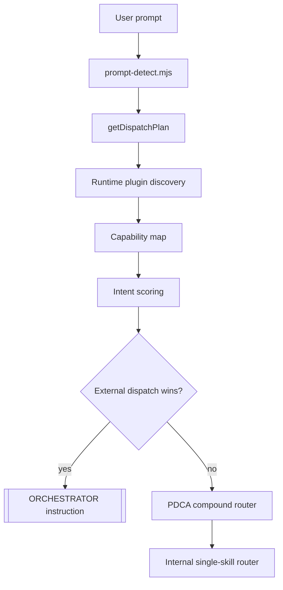

[English](orchestrator-architecture.md) | [한국어](orchestrator-architecture.ko.md)

# Orchestrator Architecture - v1.5.0

Second Claude Code v1.4.x added a cross-plugin orchestrator. Its job is to discover installed Claude Code plugins at runtime, score them against the user's intent, and inject exact `Skill:` or slash-command dispatch instructions before Second Claude falls back to its own PDCA skills.

v1.5.0 extends this with the `unblock` skill — a 9-phase zero-key fetch chain that the auto-router and Eevee researcher invoke when a URL returns 4xx, captcha, WAF, or empty SPA body. See `skills/unblock/` and `commands/unblock.md` for the slash-command surface, and the auto-router patterns in `hooks/prompt-detect.mjs`.

## Dispatch Layers



1. **Runtime discovery** - `hooks/lib/plugin-discovery.mjs` scans `~/.claude/plugins/installed_plugins.json`, plugin `skills/`, `commands/`, `agents/`, and `.claude-plugin/plugin.json` files.
2. **Intent scoring** - `getDispatchPlan()` normalizes a keyword or PDCA phase, scores plugin capabilities, applies preferred-plugin boosts, and returns ranked invocation instructions.
3. **Prompt dispatch** - `hooks/prompt-detect.mjs` injects an `[ORCHESTRATOR]` block when the top external match is a lifecycle intent or a strong generic plugin match.

## Verified Routes

| Input | Intent | Top dispatch |
| --- | --- | --- |
| `phase=plan` | PDCA Plan | `Skill: claude-mem-knowledge-agent` |
| `phase=do` | PDCA Do | `Skill: frontend-design-frontend-design` |
| `phase=check` | PDCA Check | `Skill: coderabbit-code-review` |
| `phase=act` | PDCA Act | `/commit-commands:commit` |
| `코드 리뷰해줘` | review lifecycle intent | `Skill: coderabbit-code-review` |
| `커밋해줘` | act lifecycle intent | `/commit-commands:commit` |
| `posthog event analysis` | direct generic plugin match | `Skill: posthog-exploring-autocapture-events` |

Short keyword matches are guarded by word-boundary logic so small terms do not accidentally match inside larger words, such as `bug` inside `debugging`.

## Session-Start Context


At session start, the hook injects a compact "Active Plugin Dispatch" table. It is advisory context for the model and includes per-phase top picks, plugin names, capability counts, and exact invocation strings.

## Prompt-Level Dispatch

For substantive prompts, `prompt-detect` calls `getDispatchPlan()`. If the top match should run externally, it injects an instruction shaped like:

```text
[ORCHESTRATOR]
Invoke this installed plugin capability before self-processing:
Skill: coderabbit-code-review
```

The model must then call the external skill or command first and integrate the result. If no external route wins, prompt detection continues to the older PDCA compound router and then the internal single-skill router.

## MCP Tool Surface - 31 Tools Total

| Area | Count | Tools |
| --- | ---: | --- |
| PDCA state | 9 | `pdca_get_state`, `pdca_start_run`, `pdca_transition`, `pdca_check_gate`, `pdca_end_run`, `pdca_update_stuck_flags`, `pdca_list_runs`, `pdca_get_events`, `pdca_get_analytics` |
| Cycle memory | 3 | `pdca_get_cycle_history`, `pdca_save_insight`, `pdca_get_insights` |
| Soul | 6 | `soul_get_profile`, `soul_record_observation`, `soul_get_observations`, `soul_retro`, `soul_get_synthesis_context`, `soul_get_readiness` |
| Project memory | 2 | `project_memory_get`, `project_memory_upsert` |
| Daemon and session | 7 | `daemon_get_status`, `daemon_schedule_workflow`, `daemon_list_jobs`, `daemon_start_background_run`, `daemon_list_background_runs`, `daemon_queue_notification`, `session_recall_search` |
| Orchestrator | 4 | `orchestrator_list_plugins`, `orchestrator_get_plugin`, `orchestrator_route`, `orchestrator_health` |

The four `orchestrator_*` tools are the public MCP surface for plugin inventory, single-plugin inspection, route planning, and ecosystem health.

## File Architecture

```text
second-claude/
├── hooks/
│   ├── session-start.mjs              # Active Plugin Dispatch injection
│   ├── prompt-detect.mjs              # prompt-level external dispatch
│   └── lib/
│       ├── plugin-discovery.mjs       # runtime scanner, scorer, dispatch planner
│       └── soul-observer.mjs          # hook-side soul readiness helpers
├── mcp/
│   ├── pdca-state-server.mjs          # 31 MCP tools
│   └── lib/
│       ├── orchestrator-handlers.mjs  # orchestrator_* tool implementations
│       ├── soul-handlers.mjs
│       └── ...
├── tests/
│   ├── hooks/prompt-detect.test.mjs   # 29 tests
│   └── mcp/orchestrator-handlers.test.mjs  # 17 tests
└── config/
    └── stage-contracts.json           # PDCA phase contracts
```

## Validation Coverage

- `npm test`: 368 tests total, 367 passing, 1 skipped.
- `tests/hooks/prompt-detect.test.mjs`: Korean review, commit, design, and research prompts dispatch to external capabilities before internal fallback.
- `tests/mcp/orchestrator-handlers.test.mjs`: plugin list/get/route/health handlers cover real discovered plugin data, preferred phase routing, generic plugin matches, and short-keyword boundary guards.
- `tests/integration/skill-flow.test.mjs`: confirms the prompt router still preserves PDCA compound routing when no stronger external plugin route wins.
