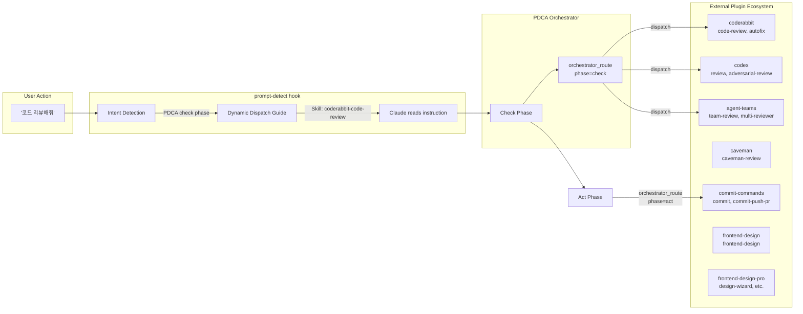
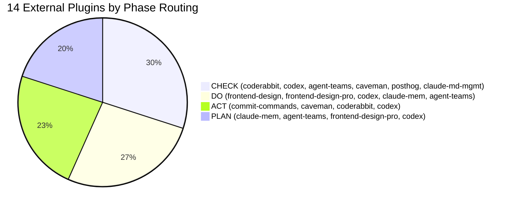
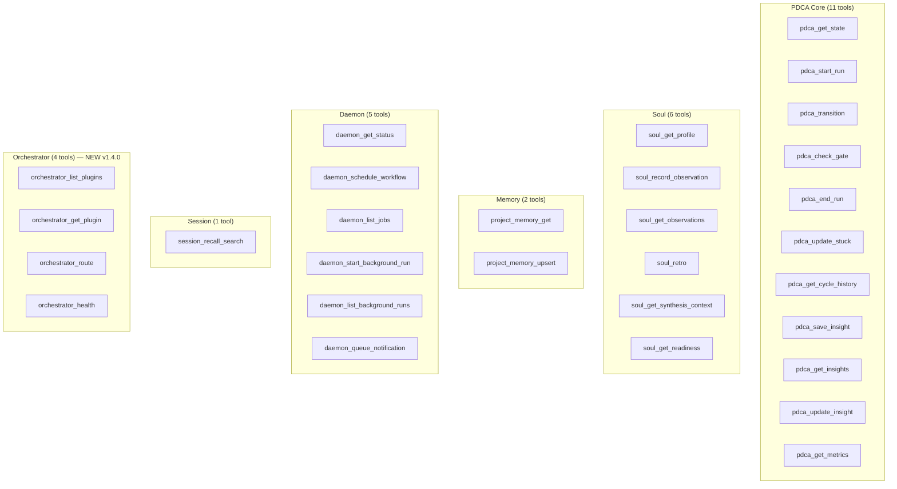

# Orchestrator Architecture — v1.4.0

## Plugin Discovery Flow

```mermaid
flowchart TB
    subgraph Session["Session Start"]
        SS[SessionStart Hook]
        PD[plugin-discovery.mjs]
        SS --> PD
    end

    subgraph Scan["Filesystem Scan"]
        PJ[~/.claude/plugins/installed_plugins.json]
        SK1[skills/*/SKILL.md]
        CM1[commands/*.md]
        AG1[agents/*.md]
        MC[.claude-plugin/plugin.json → mcpServers]
        PD --> PJ --> SK1
        PJ --> CM1
        PJ --> AG1
        PJ --> MC
    end

    subgraph Map["Capability Map"]
        CM2[{Plugin → Skills/Commands/MCP map}]
        SK1 --> CM2
        CM1 --> CM2
        AG1 --> CM2
        MC --> CM2
    end

    SS --> |injects| CTX[Active Plugin Dispatch<br/>in system-reminder]
    CM2 --> CTX
```

## Auto-Dispatch Flow



## Plugin Ecosystem (real-time scan results as of 2026-05-02)



## MCP Tool Surface — 28 Tools Total



## File Architecture

```
second-claude/
│
├── hooks/
│   ├── session-start.mjs          ← Active Plugin Dispatch injection
│   ├── prompt-detect.mjs          ← Dynamic dispatch guide (replaced hardcoded skill-check)
│   └── lib/
│       ├── plugin-discovery.mjs   ← ★ Runtime scanner + dispatch guide generator
│       ├── soul-observer.mjs      ← readSoulReadiness(), readLatestRetro()
│       └── ...
│
├── mcp/
│   ├── pdca-state-server.mjs      ← 28 tools (24 core + 4 orchestrator)
│   └── lib/
│       ├── orchestrator-handlers.mjs  ← ★ orchestrator_* tool implementations
│       ├── soul-handlers.mjs          ← soul_retro, get_synthesis_context, get_readiness
│       └── ...
│
├── tests/
│   ├── mcp/orchestrator-handlers.test.mjs  ← 11 tests
│   └── mcp/soul-handlers.test.mjs          ← +9 soul tests
│
└── config/
    └── stage-contracts.json        ← PDCA phase contracts (applies to external dispatch too)
```
