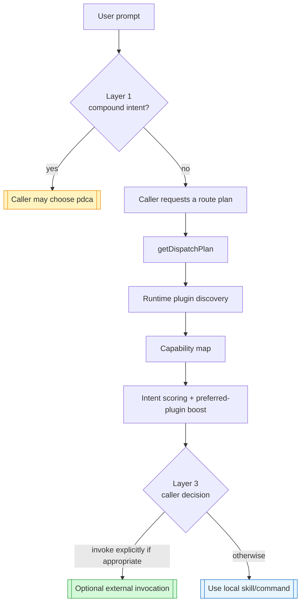

[English](orchestrator-architecture.md) | [한국어](orchestrator-architecture.ko.md)

# Orchestrator Architecture — SCC 3.0.2

SCC 3.0.2 can inspect installed Claude Code plugins, score capabilities against a requested intent,
and return an advisory dispatch plan. The orchestrator does not execute external Skills or slash
commands.

The `unblock` chain is a separate access path. A caller may choose `/scc:unblock` when URL recovery
is needed; prompt-detect does not invoke it or inject invocation instructions. See
`skills/unblock/engine/` and `commands/unblock.md`.

## Dispatch Layers


```mermaid
flowchart TB
    U[User prompt] --> L1{"Layer 1<br/>compound intent?"}
    L1 -->|yes| PDCA[["Caller may choose pdca"]]
    L1 -->|no| L2["Caller requests a route plan"]
    L2 --> G[getDispatchPlan]
    G --> D[Runtime plugin discovery]
    D --> C[Capability map]
    C --> S["Intent scoring + preferred-plugin boost"]
    S --> L3{"Layer 3<br/>caller decision"}
    L3 -->|invoke explicitly if appropriate| O[["Optional external invocation"]]
    L3 -->|otherwise| I[["Use local skill/command"]]

    style PDCA fill:#fff3bf,stroke:#f08c00
    style O fill:#d3f9d8,stroke:#2f9e44
    style I fill:#e7f5ff,stroke:#1971c2
```

The `prompt-detect` hook is not the orchestrator. It only reports active-standard literal triggers.
Only an explicit MCP call such as `orchestrator_route` asks for a route plan; receiving that plan does
not execute the suggested capability.

1. **Runtime discovery** - `hooks/lib/plugin-discovery.mjs` scans `~/.claude/plugins/installed_plugins.json`, plugin `skills/`, `commands/`, `agents/`, and `.claude-plugin/plugin.json` files.
2. **Intent scoring** - `getDispatchPlan()` normalizes a keyword or PDCA phase, scores plugin capabilities, applies preferred-plugin boosts, and returns a ranked advisory plan.
3. **Caller-directed invocation** - Claude or another caller may explicitly invoke a returned Skill or command after considering the plan.

**What is discovered vs. what is fixed.** Which plugins exist, and every skill/command/agent inside them, is read from disk at runtime — install one and it appears, remove one and it disappears. What is *not* dynamic is the preference table: `INTENT_PROFILES` in `plugin-discovery.mjs` hardcodes which plugin each lifecycle intent favours (review → `coderabbit`, act → `commit-commands`, design → `frontend-design`, memory/research → `claude-mem`). A newly installed review plugin is discovered and scorable, but it does not inherit the `+60` preferred-plugin boost by default.

That default is overridable without touching source. Drop a `plugin-preferences.json` into `${CLAUDE_PLUGIN_DATA}` keyed by intent — `{"review": ["my-reviewer"], "commit": []}` — and it replaces the pinned list for that intent. An empty array removes the pin entirely and lets capabilities compete on text match alone. A malformed file is ignored rather than taking routing down.

## Verified Routes

With the **default** preferences. A `plugin-preferences.json` override changes which plugin wins each lifecycle intent, so these are the shipped defaults rather than a guarantee about your machine.

| Input | Intent | Top dispatch |
| --- | --- | --- |
| `phase=plan` | PDCA Plan | `Skill: claude-mem:knowledge-agent` |
| `phase=do` | PDCA Do | `Skill: frontend-design:frontend-design` |
| `phase=check` | PDCA Check | `Skill: coderabbit:code-review` |
| `phase=act` | PDCA Act | `/commit-commands:commit` |
| `코드 리뷰해줘` | review lifecycle intent | `Skill: coderabbit:code-review` |
| `커밋해줘` | act lifecycle intent | `/commit-commands:commit` |
| `posthog event analysis` | direct generic plugin match | `Skill: posthog:exploring-autocapture-events` |

Short keyword matches are guarded by word-boundary logic so small terms do not accidentally match inside larger words, such as `bug` inside `debugging`.

## Session-Start Context


```mermaid
flowchart LR
    SS[SessionStart hook] --> STATE[Restore state/context]
    STATE --> CTX[System reminder]
```

At session start, `session-start.mjs` restores and injects runtime state and context. It does not scan installed plugins or inject an "Active Plugin Dispatch" table. Plugin discovery occurs when an orchestrator tool is explicitly requested.

## Prompt-Level Dispatch

When a caller requests a route plan, `getDispatchPlan()` returns ranked capability names. The caller may use them to make an explicit invocation decision; `prompt-detect` does not inject an invocation instruction.

```text
Advisory route plan (example):
Skill: coderabbit:code-review
```

The returned name is not an execution result. Claude may call it explicitly when it is appropriate, or continue with a local skill/command. `orchestrator_*` MCP tools only provide inventory, inspection, planning, and health data.

## MCP Tool Surface - 31 Tools Total

| Area | Count | Tools |
| --- | ---: | --- |
| PDCA state | 9 | `pdca_get_state`, `pdca_start_run`, `pdca_transition`, `pdca_check_gate`, `pdca_end_run`, `pdca_update_stuck_flags`, `pdca_list_runs`, `pdca_get_events`, `pdca_get_analytics` |
| Cycle memory | 3 | `pdca_get_cycle_history`, `pdca_save_insight`, `pdca_get_insights` |
| Soul | 6 | `soul_get_profile`, `soul_record_observation`, `soul_get_observations`, `soul_retro`, `soul_get_synthesis_context`, `soul_get_readiness` |
| Project memory | 2 | `project_memory_get`, `project_memory_upsert` |
| Daemon and session | 7 | `daemon_get_status`, `daemon_schedule_workflow`, `daemon_list_jobs`, `daemon_start_background_run`, `daemon_list_background_runs`, `daemon_queue_notification`, `session_recall_search` |
| Orchestrator | 4 | `orchestrator_list_plugins`, `orchestrator_get_plugin`, `orchestrator_route`, `orchestrator_health` |

The four `orchestrator_*` tools are the public MCP surface for plugin inventory, single-plugin inspection, route planning, and ecosystem health.

The manifest also registers `playwright` as an optional MCP server (`optional: true`). Its package and
cache are not part of core startup: if Playwright is unavailable, research records the gap and uses its
fallback path while the prebundled `pdca-state` server remains available.

## File Architecture

```text
second-claude/
├── hooks/
│   ├── session-start.mjs              # state/context restoration and injection; no plugin scan
│   ├── prompt-detect.mjs              # active-standard literal-trigger reporting
│   └── lib/
│       ├── plugin-discovery.mjs       # runtime scanner, scorer, dispatch planner
│       └── soul-observer.mjs          # hook-side soul readiness helpers
├── mcp/
│   ├── pdca-state-server.bundle.mjs    # prebundled 31-tool server used at runtime
│   ├── pdca-state-server.mjs          # readable source for development/tests
│   └── lib/
│       ├── orchestrator-handlers.mjs  # orchestrator_* tool implementations
│       ├── soul-handlers.mjs
│       └── ...
├── tests/
│   ├── hooks/prompt-detect-standards.test.mjs  # 6 tests
│   └── mcp/orchestrator-handlers.test.mjs  # 17 tests
└── config/
    └── stage-contracts.json           # PDCA phase contracts
```

## Validation Coverage

- Test totals vary by checkout and run; verify them with `npm test` rather than relying on a fixed count.
- `tests/hooks/prompt-detect-standards.test.mjs`: a prompt containing a standard's literal trigger surfaces that standard and its path. The keyword router this hook used to carry was removed — it names evidence and never instructs a skill invocation.
- `tests/mcp/orchestrator-handlers.test.mjs`: plugin list/get/route/health handlers cover real discovered plugin data, preferred phase routing, generic plugin matches, and short-keyword boundary guards.
- `tests/integration/skill-flow.test.mjs`: confirms normal skill-flow behavior alongside the standards-only prompt hook.
