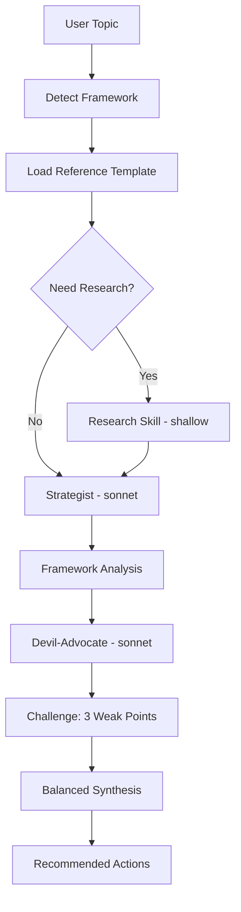

[English](analyze.md) | **한국어**

# Analyze

> SWOT, RICE, OKR, GTM 등 전략 프레임워크를 적용하고 반박 패스를 내장한 분석 스킬입니다.

## 빠른 예시

```
우리 SaaS 제품을 SWOT 분석해
```

**동작 방식:** 스킬이 SWOT 프레임워크 레퍼런스를 로드하고, 전략가 서브에이전트가 근거와 함께 프레임워크를 적용합니다. 그 뒤 반론자(devil-advocate)가 가장 취약한 3가지 포인트를 공격하고, 양쪽 관점을 종합하여 균형 잡힌 인사이트와 권고 사항을 도출합니다.

## 실전 예시

**입력:**
```
/second-claude-code:analyze --framework swot --depth standard "second-claude vs superpowers 플러그인"
```

**진행 과정:**
1. 프레임워크 감지 후 `frameworks/swot.md`의 증거 요건 및 구조 규칙을 로드.
2. 전략가(sonnet)가 프레임워크 적용: 강점 5개, 약점 5개, 기회 4개, 위협 4개 -- 각각 "So what?" 시사점 포함.
3. 반론자(sonnet)가 가장 취약한 3가지를 공격: 불명확한 타겟 오디언스, "OS" 비유의 과대약속, 검증되지 않은 멀티 에이전트 품질 주장.
4. 양측을 종합하여 균형 잡힌 인사이트와 우선순위화된 권고 사항 3가지를 도출.

**출력 예시:**
> **S2. 증거 강제 장치를 갖춘 15개 내장 전략 프레임워크**
> `analyze` 스킬은 15개 프레임워크 레퍼런스 문서(SWOT, Porter, PESTLE, RICE, OKR, lean-canvas, battlecard 등)를 기본 탑재하며, 각 문서에 "증거 요건(Evidence Expectations)" 섹션이 있어 막연한 주장을 차단합니다.
>
> *So what?* 전략, 프로덕트 매니지먼트, 컨설팅 분야 사용자에게 엄밀함을 강제하는 즉시 사용 가능한 분석 스캐폴딩을 제공합니다.
>
> **반론 약점 #2: "OS" 비유가 과대약속**
> second-claude를 "지식 노동 OS"라 부르면 포괄성, 안정성, 성숙도를 암시합니다. v0.2.0 단계에서 이 중 어느 것에도 해당하지 않습니다.

## 옵션

| 플래그 | 값 | 기본값 |
|--------|-----|--------|
| `--framework` | 아래 목록 참조 | 자동 감지 |
| `--with-research` | flag | off |
| `--depth` | `quick\|standard\|thorough` | `standard` |
| `--skip-challenge` | flag | off |
| `--lang` | `ko\|en` | `ko` |

### 지원 프레임워크 (15종)

**상황 및 환경 분석:**
`swot` `porter` `pestle`

**우선순위 및 목표:**
`rice` `okr` `north-star`

**제품 및 전략:**
`prd` `lean-canvas` `gtm` `ansoff`

**사용자 및 경험:**
`persona` `journey-map` `value-prop`

**경쟁 및 가격:**
`battlecard` `pricing`

### Depth 동작 방식

- **quick**: 템플릿 적용만 수행. 반박 라운드 없음.
- **standard**: 템플릿 적용 후 반박 1라운드(가장 취약한 3가지 공격).
- **thorough**: 리서치 추가 + 반박 2라운드.

## 작동 원리



## 주의사항

- **모든 섹션에 동일한 깊이 강요** -- 프레임워크 사분면에 따라 근거 분량이 자연스럽게 다릅니다. 약한 섹션을 억지 내용으로 채우지 마세요.
- **증거 없는 막연한 주장** -- 프레임워크 레퍼런스가 "증거 요건"을 강제합니다: 이름, 수치, 또는 구체적 관찰이 반드시 필요합니다.
- **반론 결과 무시** -- 반론 소견은 최종 종합에 반드시 반영되어야 하며, 조용히 누락해서는 안 됩니다.

## 연동 스킬

| 스킬 | 관계 |
|------|------|
| research | `--with-research` 설정 시 또는 `--depth thorough` 시 호출 |
| review | 분석 결과를 추가 검증할 때 사용 가능 |
| pipeline | 전략 워크플로우의 한 단계로 연결 가능 |
| write | 분석 결과가 리포트나 아티클의 입력으로 활용 |
