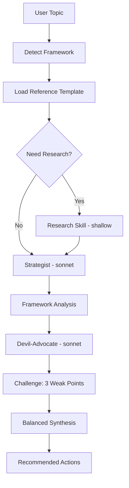

# Analyze

> Apply strategic frameworks such as SWOT, RICE, OKR, or GTM with a built-in challenge pass.

## Quick Example

```
Analyze second-claude vs superpowers using SWOT
```

**What happens:** The skill loads the SWOT framework reference, a strategist subagent applies it with evidence, a devil-advocate attacks the 3 weakest points, then both perspectives are synthesized into balanced insight with recommended actions.

## Real-World Example

**Input:**
```
/second-claude-code:analyze --framework swot --depth standard "second-claude vs superpowers plugin"
```

**Process:**
1. Framework detection loads `frameworks/swot.md` with its evidence expectations and structural rules.
2. Strategist (sonnet) applies the framework: 5 Strengths, 5 Weaknesses, 4 Opportunities, 4 Threats -- each with a "So what?" implication.
3. Devil-advocate (sonnet) attacks the 3 weakest points: vague target audience, overpromising "OS" metaphor, and unproven multi-agent quality claims.
4. Synthesis merges both into balanced insight and 3 prioritized recommended actions.

**Output excerpt:**
> **S2. 15 built-in strategic frameworks with evidence-enforcement**
> The `analyze` skill ships with 15 framework reference documents (SWOT, Porter, PESTLE, RICE, OKR, lean-canvas, battlecard, etc.), each with explicit "Evidence Expectations" sections that forbid generic claims.
>
> *So what?* For users in strategy, product management, or consulting, second-claude provides ready-to-use analytical scaffolding that enforces rigor.
>
> **Challenge Weakness #2: The "OS" metaphor overpromises**
> Calling second-claude a "Knowledge Work OS" implies comprehensiveness, reliability, and maturity. At v0.2.0, it is none of these.

## Options

| Flag | Values | Default |
|------|--------|---------|
| `--framework` | see list below | auto-detect |
| `--with-research` | flag | off |
| `--depth` | `quick\|standard\|thorough` | `standard` |
| `--skip-challenge` | flag | off |
| `--lang` | `ko\|en` | `ko` |

### Supported Frameworks (15)

**Situational & Environmental:**
`swot` `porter` `pestle`

**Prioritization & Goals:**
`rice` `okr` `north-star`

**Product & Strategy:**
`prd` `lean-canvas` `gtm` `ansoff`

**User & Experience:**
`persona` `journey-map` `value-prop`

**Competitive & Pricing:**
`battlecard` `pricing`

### Depth Behavior

- **quick**: Apply the template only. No challenge round.
- **standard**: Apply plus one challenge round (attack 3 weakest points).
- **thorough**: Add research and a second challenge round.

## How It Works



## Gotchas

- **Forcing equal depth across sections** -- Some framework quadrants naturally have more evidence. Do not pad weak sections with filler.
- **Generic claims without evidence** -- The framework references enforce "Evidence Expectations": names, numbers, or specific observations required.
- **Discarding the challenge** -- Challenge findings must appear in the final synthesis, not be silently dropped.

## Troubleshooting

- **Wrong framework selected** -- When auto-detection picks the wrong framework, specify it explicitly: `/scc:analyze --framework porter "your topic"`. The 15 supported frameworks are listed in the Options section above.
- **Generic claims in output** -- The framework references enforce "Evidence Expectations." If the output lacks specifics, try `--with-research` to gather real data before analysis, or `--depth thorough` for a second challenge round.
- **Depth levels explained** -- `quick` maps to depth 1 (template only, no challenge). `standard` maps to depth 2 (template + one challenge round). `thorough` maps to depth 3 (adds research and a second challenge round). Use `--depth thorough` or the alias `deep` for maximum rigor.

## Works With

| Skill | Relationship |
|-------|-------------|
| research | Called when `--with-research` is set or `--depth thorough` |
| review | Can review the analysis output for additional validation |
| workflow | Chainable as a step in strategic workflows |
| write | Analysis outputs feed into reports or articles |
