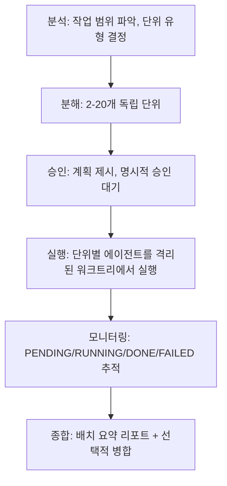

[English](batch.md) | **한국어**

# Batch

> 대규모 작업을 독립적인 단위로 분해하여 각각 별도의 워크트리에서 병렬로 실행하는 스킬입니다.

## 빠른 예시

```
/scc:batch --topic "AI 인프라 트렌드 10부작 뉴스레터 시리즈" --skill write --parallel 3
```

**동작 방식:** 스킬이 Explore 에이전트를 디스패치해 주제 범위를 파악한 뒤 독립적인 단위로 분해합니다(최소 2개, 기본 최대 10개, `--units`로 최대 20개까지 확장 가능). 전체 분해 계획을 표로 제시하며, 사용자가 명시적으로 승인하기 전까지는 실행이 시작되지 않습니다. 승인 후에는 단위마다 에이전트 하나가 격리된 워크트리에서 실행되고, 동시 실행 개수는 `--parallel`(기본값 3)로 제한됩니다. 각 단위의 상태(`PENDING`/`RUNNING`/`DONE`/`FAILED`)를 추적하다가, 모든 단위가 끝나면 배치 요약 리포트를 `.captures/batch-{run_id}/00-summary.md`에 저장합니다.

## 실전 예시

**입력:**
```
/scc:batch --topic "AI 인프라 트렌드 10부작 뉴스레터 시리즈" --skill write --parallel 3 --synthesize --format article --lang en
```

**진행 과정:**
1. 분석 -- Explore 에이전트가 주제 범위를 파악해 겹치지 않는 10개 하위 주제 도출: 컴퓨트 스케일링, 스토리지 계층화, 네트워킹, 오케스트레이션, 옵저버빌리티, 보안, 엣지 추론, 비용 최적화, MLOps 툴링, 하드웨어 가속기. 각 단위 스킬은 `write`(기본값, `--skill write`와 일치), `--format article`을 각 단위의 write 실행에 전달.
2. 분해 -- 10개 단위로 분할. 각 단위는 id, 라벨, 겹치지 않는 구체적 주제, `skill: write`, 출력 경로 `.captures/batch-{run_id}/{slug}.md`로 구성. 독립성 검증 -- 어떤 단위도 다른 단위의 초안을 참조하지 않음.
3. 승인 -- 분해 계획 표(`# | 라벨 | 주제 | 스킬 | 출력 파일`)와 총 단위 수(10개), 예상 비용(write 단일 실행의 10배), 병렬도(3) 제시. 명시적 승인 전까지 실행 보류.
4. 실행 -- 승인 후 10개 단위 에이전트를 각각 격리된 워크트리(`worktree-batch-{run_id}-unit-{id}`)에서 실행. 동시 실행 3개로 제한 -- 3개씩 진행되고 나머지 7개는 대기하다 슬롯이 열리면 시작. 각 단위는 `--lang en`을 출력 언어로 전달받음.
5. 모니터링 -- 단위별 `PENDING`/`RUNNING`/`DONE`/`FAILED` 상태를 추적하고, 완료될 때마다 실시간 상태 표 출력.
6. 종합 -- 10개 단위 전체 완료. `--synthesize` 설정에 따라 10개 이슈를 통합 문서로 병합한 뒤, 배치 요약 리포트를 `.captures/batch-{run_id}/00-summary.md`에 저장.

**출력 예시:**
```
## Batch Summary — AI infrastructure trends newsletter series (2026-07-12)

Units: 10/10 completed
Failed: none

### Output Files
| # | Label | Status | Path |
|---|-------|--------|------|
| 1 | Compute scaling | DONE | .captures/batch-.../01-compute-scaling.md |
| 2 | Storage tiering | DONE | .captures/batch-.../02-storage-tiering.md |
...

### Synthesis
Combined document merging all 10 issues saved to .captures/batch-.../merged.md
```

## 옵션

| 플래그 | 값 | 기본값 |
|--------|-----|--------|
| `--topic` | 문자열 | (필수) |
| `--skill` | `write`, `research`, `analyze`, `refine` | `write` |
| `--units` | 정수 2-20 | 자동 (최대 10) |
| `--parallel` | 정수 1-5 | `3` |
| `--format` | write 스킬의 포맷 값 | `article` |
| `--lang` | `ko`, `en` | `ko` |
| `--synthesize` | 플래그 | off |

## 작동 원리



## 분해 규칙

**분할 전략** (전체 내용은 스킬의 `references/decomposition-guide.md` 참고):

| 전략 | 적용 상황 |
|------|-----------|
| 주제별 | 대상 주제에 겹치지 않는 자연스러운 하위 주제가 있을 때 |
| 섹션별 | 문서에 병렬로 작성 가능한 명확히 구분된 섹션이 있을 때 |
| 경쟁사/기업별 | 동일한 평가 기준으로 N개의 특정 대상을 다룰 때 |
| 프레임워크별 | 동일한 주제를 여러 프레임워크로 분석할 때 |
| 기간별 | 반복 산출물이 겹치지 않는 별도 기간을 다룰 때 |
| 페르소나/독자별 | 동일한 핵심 콘텐츠를 여러 독자층에 맞게 변형할 때 |

**독립성 요건** (예외 없음):
- 각 단위는 별도의 출력 파일을 생성함
- 어떤 단위도 다른 단위의 출력을 입력으로 사용하지 않음
- 단위는 순서와 무관하게 완료되어도 일관성이 유지됨
- 다른 단위의 출력에 의존하는 단위 후보는 하나로 합치거나 `workflow`가 처리할 순차 작업으로 분류함

## 주의사항

- 비용은 단위 수에 비례해 늘어납니다. N개 단위는 단일 스킬 실행 대비 약 N배 비용이 들며, 승인 단계에서 항상 예상 비용을 함께 제시합니다.
- 분해 품질이 결과물 품질을 좌우합니다. 주제가 막연하면 결과물도 막연해지므로, 주제를 구체화할 수 없다면 분해 전에 사용자에게 먼저 확인하세요.
- 승인 단계는 예외 없이 필수입니다. 분해 오류는 실행 전에 고치는 비용이 실행 후보다 훨씬 저렴합니다.
- 워크트리는 종합 단계 이후 폐기됩니다. 단위 워크트리를 남겨두지 않고 요약 리포트 생성 후 정리합니다.
- 순차적 작업은 배치 대상이 아닙니다. 한 단위의 결과가 다른 단위에 필요하다면(예: 2부가 1부의 결론을 전제로 함) `workflow`를 대신 사용하세요.
- 일부 실패가 전체 실패를 의미하지는 않습니다. 일부 단위가 실패해도 완료된 단위는 그대로 전달하고, 실패한 단위는 에러 요약과 권장 조치를 리포트에 남깁니다. 완료된 작업을 보류하지 않습니다.

## 문제 해결

- 단위끼리 겹치거나 서로 의존하는 것으로 드러난 경우 -- 승인 단계에서 피드백과 함께 계획을 반려하면 스킬이 다시 분해해서 제시합니다. 의존성이 근본적인 구조라면 애초에 배치로 처리할 작업이 아니므로 `workflow`를 사용하세요.
- 실행 중 단위 하나가 실패한 경우 -- 배치 전체가 중단되지 않습니다. 나머지 단위는 계속 실행되며, 실패 내역은 종합 단계의 실패 섹션에 에러 요약과 권장 조치로 기록됩니다. 완료된 단위는 그대로 전달됩니다.
- 예상 비용이 너무 높아 보이는 경우 -- 비용은 단위 수에 비례합니다. `--units N`으로 범위를 줄이거나, 승인하기 전에 단위 수 자체를 재검토하세요.
- 기본 최대치인 10개보다 많은 단위가 필요한 경우 -- `--units N`으로 최대 20개까지 재정의할 수 있습니다.
- 결과물에 통합 문서가 보이지 않는 경우 -- `--synthesize`는 기본값이 off입니다. 설정하지 않으면 단위별 파일과 요약 리포트만 생성되고, 하나로 병합된 문서는 만들어지지 않습니다.

## 연동 스킬

| 스킬 | 관계 |
|------|------|
| write | 기본 단위 스킬 (`--skill write`) |
| research | 선택 가능한 단위 스킬 (`--skill research`) |
| analyze | 선택 가능한 단위 스킬 (`--skill analyze`) |
| refine | 선택 가능한 단위 스킬 (`--skill refine`) |
| workflow | 단위 간 순차 의존성이 있을 때 대신 사용 |
| pdca | 작업이 애초에 유사 단위로 나뉘지 않을 때 대신 사용 |
