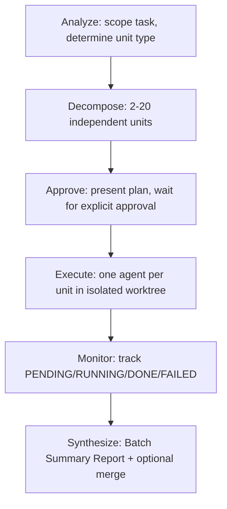

# Batch

> Use when decomposing a large task into independent units that run in parallel, each in its own worktree.

## Quick Example

```
/scc:batch --topic "10-part newsletter series on AI infrastructure trends" --skill write --parallel 3
```

**What happens:** The skill dispatches an Explore agent to scope the topic, then decomposes it into independent units (minimum 2, up to 10 by default, up to 20 with `--units`). The full decomposition plan is presented as a table, and execution does not begin until the user explicitly approves it. Once approved, one agent per unit spawns in its own isolated worktree, with concurrency capped at `--parallel` (default 3). Each unit's status (`PENDING`/`RUNNING`/`DONE`/`FAILED`) is tracked as units complete, and a Batch Summary Report is saved to `.captures/batch-{run_id}/00-summary.md` once all units finish.

## Real-World Example

**Input:**
```
/scc:batch --topic "10-part newsletter series on AI infrastructure trends" --skill write --parallel 3 --synthesize --format article --lang en
```

**Process:**
1. Analyze -- an Explore agent scoped the topic and found 10 non-overlapping sub-topics: compute scaling, storage tiering, networking, orchestration, observability, security, edge inference, cost optimization, MLOps tooling, and hardware accelerators. Skill for each unit: `write` (the default, matching `--skill write`); `--format article` is passed through to each unit's write invocation.
2. Decompose -- split into 10 units, each with an id, label, a specific non-overlapping topic, `skill: write`, and an output path at `.captures/batch-{run_id}/{slug}.md`. Verified independence: no unit reads another unit's draft.
3. Approve -- presented the decomposition table (`# | Label | Topic | Skill | Output File`) along with total units (10), estimated cost (10× a single `write` invocation), and parallelism (3). Execution did not start until explicit approval was given.
4. Execute -- after approval, spawned 10 unit agents, each in its own isolated worktree (`worktree-batch-{run_id}-unit-{id}`). Concurrency capped at 3 -- 3 units ran at a time, the remaining 7 queued and started as slots opened. Each unit received `--lang en` as its output language.
5. Monitor -- tracked `PENDING`/`RUNNING`/`DONE`/`FAILED` per unit and printed a live status table as each completed.
6. Synthesize -- all 10 units completed. Because `--synthesize` was set, the 10 issues were merged into one combined document, then the Batch Summary Report was saved to `.captures/batch-{run_id}/00-summary.md`.

**Output excerpt:**
```
## Batch Summary — AI infrastructure trends newsletter series (2026-07-12)

Units: 10/10 completed
Failed: none

### Output Files
| # | Label | Status | Path |
|---|-------|--------|------|
| 1 | Compute scaling | DONE | .captures/batch-.../01-compute-scaling.md |
| 2 | Storage tiering | DONE | .captures/batch-.../02-storage-tiering.md |
...

### Synthesis
Combined document merging all 10 issues saved to .captures/batch-.../merged.md
```

## Options

| Flag | Values | Default |
|------|--------|---------|
| `--topic` | string | (required) |
| `--skill` | `write`, `research`, `analyze`, `refine` | `write` |
| `--units` | integer 2-20 | auto (up to 10) |
| `--parallel` | integer 1-5 | `3` |
| `--format` | write-skill formats | `article` |
| `--lang` | `ko`, `en` | `ko` |
| `--synthesize` | flag | off |

## How It Works



## Decomposition Rules

**Split strategies** (full detail in the skill's `references/decomposition-guide.md`):

| Strategy | Use When |
|----------|----------|
| By Topic | The subject has natural, non-overlapping sub-topics |
| By Section | A document has clearly bounded sections that can be written in parallel |
| By Competitor / Company | The task covers N named entities under the same evaluation criteria |
| By Framework | The same subject is analyzed through multiple distinct frameworks |
| By Time Period | A recurring output covers distinct time windows |
| By Persona / Audience | The same core content must be adapted for multiple distinct audiences |

**Independence requirements** (non-negotiable):
- Each unit produces a separate output file
- No unit uses another unit's output as input
- Units can complete in any order without inconsistency
- A candidate unit that depends on another unit's output gets merged into one unit or flagged as sequential work for `workflow`

## Gotchas

- **Cost scales linearly** -- N units cost roughly N× a single invocation of the unit skill. The Approve gate always shows the estimated cost before execution starts.
- **Decomposition quality determines output quality** -- Vague unit topics produce vague output. If a topic can't be made specific and non-overlapping, clarify with the user before decomposing.
- **The Approve gate is mandatory** -- No exceptions. Decomposition errors are cheap to fix before execution and expensive after.
- **Worktrees are discarded after synthesis** -- Unit worktrees do not persist; they are cleaned up once the summary report is produced.
- **Sequential tasks are not a batch job** -- If one unit's output feeds another (e.g. part 2 builds on part 1's conclusion), route to `workflow` instead.
- **Partial failure is not total failure** -- If some units fail, the skill delivers the completed units and reports the failures with an error summary and recommended action rather than discarding successful work.

## Troubleshooting

- **Units turn out to overlap or depend on each other** -- Reject the plan at the Approve gate with feedback; the skill re-decomposes and re-presents. If the dependency is inherent, this isn't a batch job -- use `workflow` instead.
- **A unit fails during execution** -- The batch does not abort. Remaining units keep running, and the failure is logged and reported in the Synthesize step's Failures section with a recommended action. Completed units are still delivered.
- **Estimated cost looks too high** -- Cost scales linearly with unit count. Reduce scope with `--units N` or reconsider the unit count before approving.
- **Need more than the default 10 units** -- Override with `--units N` (accepts up to 20).
- **No combined document in the output** -- `--synthesize` is off by default. Without it, batch produces per-unit files and the summary report only, not one merged document.

## Works With

| Skill | Relationship |
|-------|-------------|
| write | Default unit skill (`--skill write`) |
| research | Selectable unit skill (`--skill research`) |
| analyze | Selectable unit skill (`--skill analyze`) |
| refine | Selectable unit skill (`--skill refine`) |
| workflow | Use instead when units have inherent sequencing |
| pdca | Use instead when the task isn't naturally divisible into similar units |
