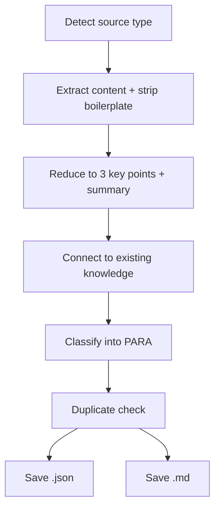

[English](collect.md) | **한국어**

# Collect

> URL, 메모, 파일, 발췌문을 PARA 구조의 지식 베이스로 수집하는 스킬입니다.

## 빠른 예시

```
이 URL 저장해줘: https://sdk.vercel.ai/docs
```

**동작 방식:** 스킬이 소스 유형(URL)을 감지하여 콘텐츠를 가져오고 보일러플레이트를 제거합니다. 핵심 포인트 정확히 3개와 요약으로 축약한 뒤, 특정 공유 개념을 통해 기존 지식과 연결하고, PARA로 분류하여 이중 출력(`.json` + `.md`)으로 저장합니다.

## 실전 예시

**입력:**
```
https://sdk.vercel.ai/docs -- 나중에 참고할 수 있게 저장해줘
```

**진행 과정:**
1. 소스 감지 -- URL로 식별. `sdk.vercel.ai`에서 `ai-sdk.dev/docs`로의 301 리다이렉트 추적.
2. 추출 -- WebFetch가 내비게이션, 푸터, 사이드바를 제거. 약 3,500단어의 구조화된 문서를 추출.
3. 축약 -- 핵심 포인트 3개 생성: (a) 벤더 독립적 LLM 통합을 위한 프로바이더 추상화 레이어, (b) Core(생성)와 UI(프레임워크 훅)를 분리한 듀얼 모듈 아키텍처, (c) 모델 동작을 확장하는 컴포저블 미들웨어 시스템.
4. 연결 -- "작은 표면적을 가진 컴포저블 아키텍처"라는 공유 개념을 통해 기존 `design-principles.md`에 링크.
5. 분류 -- `resource` 지정 (마감도 없고 진행 중인 책임도 없는 참고 자료).
6. 중복 검사 -- 저장소 전체에서 `sdk.vercel.ai`와 `ai-sdk.dev`를 검색. 중복 없음.
7. `.data/knowledge/resources/vercel-ai-sdk-docs.json` 및 `.data/knowledge/resources/vercel-ai-sdk-docs.md`에 저장.

**출력 예시:**
> **요약:** Vercel AI SDK는 두 핵심 모듈을 통해 여러 LLM 프로바이더(Anthropic, OpenAI, Google 등)의 통합을 하나로 묶는 TypeScript 툴킷입니다: AI SDK Core는 텍스트/객체/도구 생성을, AI SDK UI는 프레임워크 독립적 챗 인터페이스를 담당합니다.
>
> **핵심 포인트:**
> 1. 프로바이더 추상화 레이어 -- 단일 통합 API로 여러 LLM 프로바이더를 래핑하여 SDK 레벨에서 벤더 종속을 해소.
> 2. 듀얼 모듈 아키텍처 -- Core가 생성을, UI가 프레임워크 독립적 훅을 제공하여 연산과 프레젠테이션을 분리.
> 3. 컴포저블 미들웨어 시스템 -- 코어 파이프라인 수정 없이 모델 동작을 래핑하고 커스터마이징 가능.
>
> **연결:** "작은 표면적을 가진 컴포저블 아키텍처" -- design-principles.md 원칙 #1, #7과 링크.

## 옵션

| 플래그 | 값 | 기본값 |
|--------|-----|--------|
| `--tags` | `"tag1,tag2"` | 자동 생성 |
| `--category` | `project`, `area`, `resource`, `archive` | 자동 분류 |
| `--search` | `"query"` | off |
| `--connect` | `true`, `false` | `true` |

## 작동 원리



## PARA 분류

| 카테고리 | 기준 |
|----------|------|
| `project` | 마감이나 산출물이 있는 진행 중 작업 |
| `area` | 지속적 책임 영역 |
| `resource` | 참고 자료 (분류 모호 시 기본값) |
| `archive` | 비활성 자료 |

## 주의사항

- 콘텐츠를 원문 그대로 저장하지 않습니다. 축약 단계에서 반드시 정제해야 하며, 복사 금지.
- 연결은 구체적인 공유 개념을 명시해야 합니다. "AI 관련"같은 막연한 연결은 거부됩니다.
- 핵심 포인트는 정확히 3개 -- 더 많지도, 적지도 않게.
- 분류가 모호하면 `resource`로 기본 지정합니다.
- 검색 모드(`--search "query"`)는 저장된 JSON을 스캔하여 제목, 요약, 핵심 포인트, 태그를 대상으로 매칭 순위를 매깁니다.

## 연동 스킬

| 스킬 | 관계 |
|------|------|
| `research` | 리서치 세션의 결과물을 아카이브 |
| `hunt` | 발견한 스킬의 메타데이터를 저장 |
| `loop` | 최종 승인된 초안을 수집 |
| `pipeline` | 업스트림 출력을 지식 베이스에 영속화하는 단계로 활용 가능 |
