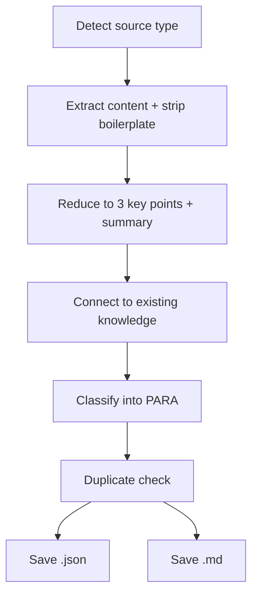

# Collect

> Use when collecting URLs, notes, files, or excerpts into structured PARA knowledge.

## Quick Example

```
/second-claude-code:collect https://sdk.vercel.ai/docs
```

**What happens:** The skill detects the source type (URL), fetches and strips boilerplate, reduces the content to exactly 3 key points and a summary, connects it to existing knowledge via a specific shared concept, classifies it into PARA, and saves dual output (`.json` + `.md`).

## Real-World Example

**Input:**
```
https://sdk.vercel.ai/docs -- save this for later
```

**Process:**
1. Source detection -- identified as URL. Followed 301 redirect from `sdk.vercel.ai` to `ai-sdk.dev/docs`.
2. Extraction -- WebFetch stripped navigation, footer, and sidebar. Extracted ~3,500 words of structured documentation.
3. Reduction -- produced 3 key points: (a) provider abstraction layer for vendor-agnostic LLM integration, (b) dual-module architecture separating Core (generation) from UI (framework hooks), (c) composable middleware system for extending model behavior.
4. Connection -- linked to existing `design-principles.md` through "composable architecture with small surface area" as the shared concept.
5. Classification -- assigned `resource` (reference material, no deadline, not an ongoing responsibility).
6. Duplicate check -- grepped for `sdk.vercel.ai` and `ai-sdk.dev` across the repository. No duplicates found.
7. Saved to `.data/knowledge/resources/vercel-ai-sdk-docs.json` and `.data/knowledge/resources/vercel-ai-sdk-docs.md`.

**Output excerpt:**
> **Summary:** The Vercel AI SDK is a TypeScript toolkit that unifies LLM integration across providers (Anthropic, OpenAI, Google, etc.) through two core modules: AI SDK Core for text/object/tool generation and AI SDK UI for framework-agnostic chat interfaces.
>
> **Key Points:**
> 1. Provider abstraction layer -- a single unified API wraps multiple LLM providers, solving vendor lock-in at the SDK level.
> 2. Dual-module architecture -- Core handles generation, UI provides framework-agnostic hooks, separating computation from presentation.
> 3. Composable middleware system -- enables wrapping and customizing model behavior without modifying the core pipeline.
>
> **Connection:** "Composable architecture with small surface area" -- linked to design-principles.md Principles #1 and #7.

## Options

| Flag | Values | Default |
|------|--------|---------|
| `--tags` | `"tag1,tag2"` | auto-generated |
| `--category` | `project`, `area`, `resource`, `archive` | auto-classified |
| `--search` | `"query"` | off |
| `--connect` | `true`, `false` | `true` |

## How It Works



## PARA Classification

| Category | Rule |
|----------|------|
| `project` | Active work with a deadline or deliverable |
| `area` | Ongoing responsibility |
| `resource` | Reference material (default when ambiguous) |
| `archive` | Inactive material |

## Gotchas

- **Verbatim storage** -- Content is never stored verbatim. The reduction step must distill, not copy.
- **Vague connections** -- Connections must name a specific shared concept. Vague links like "related to AI" are rejected.
- **Wrong key point count** -- Key points must be exactly 3 -- no more, no less.
- **Ambiguous classification** -- When classification is ambiguous, default to `resource`.
- **Search mode scope** -- Search mode (`--search "query"`) scans stored JSON and ranks matches across title, summary, key points, and tags.

## Troubleshooting

- **URL returns empty content** -- The target page may block automated fetching, require authentication, or return JavaScript-only content. Try an alternative URL for the same content, or paste the content directly as text input instead.
- **PARA classification seems wrong** -- Override the auto-classification with `--category`: e.g., `--category project` if the skill misclassified active work as a resource.
- **"Duplicate found" warning** -- The skill checks for existing entries with the same URL or title. If the content has genuinely changed, remove the old entry first or use a different URL.
- **Connection to existing knowledge is vague** -- Connections must name a specific shared concept. If the auto-connection is too generic, the skill will retry. You can also disable connections with `--connect false`.

## Works With

| Skill | Relationship |
|-------|-------------|
| `research` | Archive findings from a research session |
| `hunt` | Save metadata about discovered skills |
| `loop` | Collect the final approved draft |
| `pipeline` | Can be a step that persists upstream output to the knowledge base |
