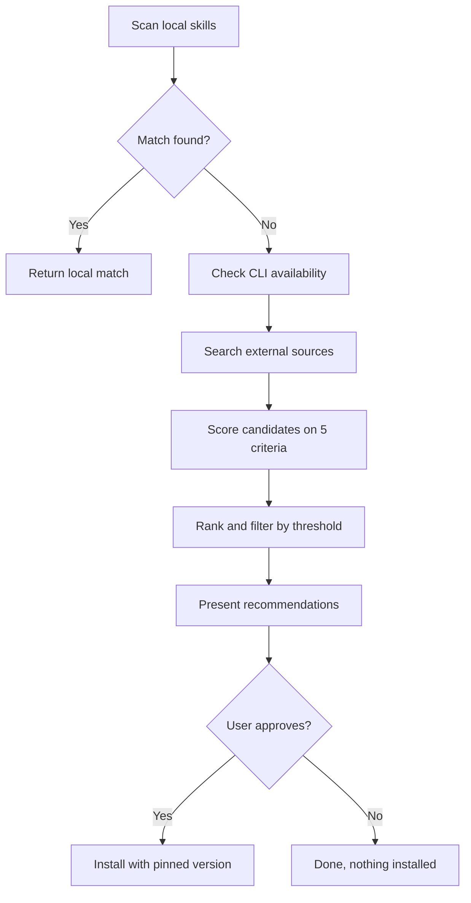

[English](discover.md) | **한국어**

# Discover

> 현재 스킬로 처리할 수 없는 작업이 있을 때 새로운 스킬을 탐색하는 스킬입니다.

## 빠른 예시

```
terraform 보안 감사 스킬 있어?
```

**동작 방식:** 스킬이 먼저 로컬 스킬을 스캔하여 일치 항목을 찾습니다. 없으면 최대 4개 외부 소스(npx, npm, gh, web)를 검색하고, 가중치 평가 기준(관련성, 인기도, 최신성, 의존성, 출처 신뢰도)으로 후보를 채점하여 순위별 추천을 제시합니다. 명시적 승인 없이는 아무것도 설치하지 않습니다.

## 실전 예시

**입력:**
```
terraform 보안 감사용 스킬이 있나?
```

**진행 과정:**
1. 로컬 스캔 -- `skills/`의 7개 스킬(review, analyze, research, write, loop, pipeline, collect) 확인. terraform 보안 감사를 다루는 스킬 없음.
2. CLI 가용성 확인 -- `npx`, `npm`, `gh` 모두 사용 가능.
3. 외부 검색 -- npm, GitHub(`gh search repos`), 웹 검색을 질의. 후보 5개와 MCP 서버 언급 3개 발견.
4. 평가 -- 5개 가중치 기준으로 각 후보를 채점. 1위: Terraform 스킬(4.85/5.0), 스타 1,350개, 전날 업데이트. 2위: HashiCorp 공식 agent-skills 컬렉션(4.35/5.0).
5. 추천 -- 설치 명령과 함께 순위별 목록 제시. 명시적 승인을 대기.

**출력 예시:**

> | 순위 | 후보 | 점수 | 설치 명령 |
> |------|------|------|----------|
> | 1 | `terraform-skill` | **4.85** | `claude install antonbabenko/terraform-skill` |
> | 2 | `agent-skills` | **4.35** | `claude install hashicorp/agent-skills` |
> | 3 | `devops-claude-skills` | **3.50** | `claude install ahmedasmar/devops-claude-skills` |
> | 4 | `claude-code-skills` | **3.40** | `claude install levnikolaevich/claude-code-skills` |
> | 5 | `security-scanner-plugin` | **2.35** | `claude install harish-garg/security-scanner-plugin` |

## 검색 소스

| 소스 | 조건 |
|------|------|
| 로컬 `skills/` | 항상 최우선 검색 |
| `npx skills search` | `npx` 사용 가능 시 |
| `npm search --json` | `npm` 사용 가능 시 |
| `gh search repos` | `gh` 사용 가능 시 |

## 평가 가중치

| 기준 | 가중치 | 설명 |
|------|--------|------|
| 관련성 (Relevance) | 30% | 스킬이 검색어와 얼마나 부합하는지 |
| 인기도 (Popularity) | 20% | 스타, 다운로드, 커뮤니티 채택 |
| 최신성 (Recency) | 20% | 마지막 업데이트 일자 |
| 의존성 (Dependencies) | 15% | 의존성 개수와 크기 |
| 출처 신뢰도 (Source trust) | 15% | 저자 평판, 공식 vs 커뮤니티 |

## 점수 기준

| 범위 | 판정 |
|------|------|
| 4.0+ | 강력 추천 |
| 3.0-3.9 | 조건부 사용 가능 |
| <3.0 | 다른 대안이 없을 때만 언급 |

## 작동 원리



## 주의사항

- 자동 설치 금지. 항상 명시적 사용자 승인을 대기합니다.
- 패키지 이름을 만들어내지 마세요. 검색 결과에서 확인된 패키지만 추천합니다.
- 설치 시 정확한 버전을 고정합니다. 유동적 범위(floating range) 금지.
- 무겁거나 오래된 패키지는 추천 노트에 표시합니다.
- 마켓플레이스 CLI를 사용할 수 없으면 로컬 스캔 전용 모드로 우아하게 폴백합니다.
- 각 저장소의 전체 소스를 읽지 않으므로, 평가는 메타데이터 기반입니다. 위험도가 높은 후보는 설치 전에 직접 확인을 권고합니다.

## 연동 스킬

| 스킬 | 관계 |
|------|------|
| `pipeline` | 파이프라인이 누락된 스킬을 참조할 때 discover를 트리거 |
| `collect` | 발견한 스킬의 메타데이터를 지식 베이스에 저장 |
| `research` | discover는 스킬 탐색에 집중; research는 일반 정보 수집 담당 |
