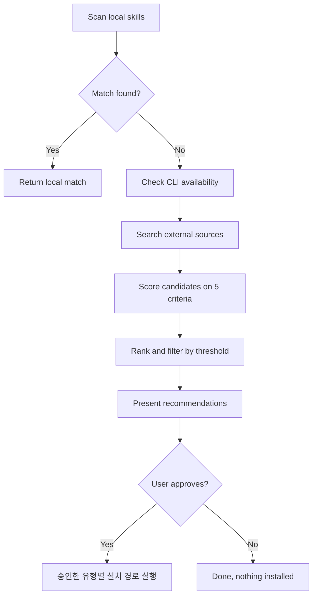

[English](discover.md) | **한국어**

# Discover

> 현재 스킬로 처리할 수 없는 작업이 있을 때 새로운 스킬을 탐색하는 스킬입니다.

**자동 라우팅되지 않습니다.** 스킬에 `disable-model-invocation: true`가 붙어 있어 `/scc:discover`로 직접 부를 때만 돕니다. 파일은 플러그인에 그대로 남습니다.

## 빠른 예시

```
terraform 보안 감사 스킬 있어?
```

**동작 방식:** 스킬이 먼저 기본 도구와 로컬 스킬을 확인합니다. 처리할 수 없을 때만 외부 소스를 검색하고, 상위 3개 후보의 README/SKILL.md를 읽어 평가한 뒤 순위별 추천을 제시합니다. 명시적 승인 없이는 아무것도 설치하지 않습니다.

## 실전 예시

**입력:**
```
terraform 보안 감사용 스킬이 있나?
```

**진행 과정:**
1. 로컬 스캔 -- 현재 `skills/`에 설치된 스킬(review, analyze, research, write, refine, discover, workflow 등)을 확인. terraform 보안 감사를 다루는 스킬 없음.
2. CLI 가용성 확인 -- `npx`, `npm`, `gh` 모두 사용 가능.
3. 외부 검색 -- 사용 가능한 registry, GitHub, npm, 웹을 검색합니다. CLI가 없으면 범위가 줄었다고 기록합니다.
4. 후보 검사 -- 상위 3개 후보의 README/SKILL.md를 실제로 읽고, 막히면 감점과 함께 기록합니다.
5. 평가 -- 관련성·인기도·최신성·의존성·출처 신뢰도를 채점하고, 추천 메모에 확인한 릴리스·커밋·마켓플레이스 revision을 기록합니다.
6. 추천 -- 순위표를 보여주고 명시적 승인을 기다립니다. 탐색 중 설치는 시작하지 않습니다.

**출력 예시:**

> | 순위 | 후보 | 유형 | 점수 | 승인 후 경로 |
> |------|------|------|------|----------------------|
> | 1 | `terraform-plugin` | Claude 마켓플레이스 plugin | **4.85** | `claude plugin marketplace add acme/marketplace` 후 `claude plugin install terraform-plugin@acme` |
> | 2 | `agent-skills` | Skills 생태계 | **4.35** | `npx --yes skills add vercel-labs/agent-skills --skill vercel-optimize --agent claude-code` |
> | 3 | `devops-library` | npm/library dependency | **3.50** | upstream package가 문서화한 설치 명령 사용 |

위 명령은 각 후보 유형의 지원 경로를 보여주는 예시입니다. 앞의 두 경로는
실행 직전에 명시적 승인이 필요하며, npm 행은 일반적인 스킬 설치기가 아닙니다.
마켓플레이스가 이미 등록되어 있으면 `marketplace add`는 생략합니다. 저장소에
필수 manifest나 `SKILL.md`가 없으면 설치 명령을 만들지 말고 커스텀 통합 또는
승인을 위한 upstream 지침을 제시합니다.

## 후보 유형과 승인 경계

| 후보 유형 | 추천 전 검사 | 승인 후 설치 |
|----------------|-----------------------------|------------------------|
| Claude 마켓플레이스 plugin | 마켓플레이스 source·manifest, plugin manifest·이름 | 없을 때 `claude plugin marketplace add <source>`, 이어서 `claude plugin install <plugin>@<marketplace>` |
| Skills 생태계 저장소 | `SKILL.md`, 스킬 이름, 대상 agent, 확인한 source revision | `npx --yes skills add <owner>/<repo> --skill <skill> --agent claude-code` |
| npm/library dependency | Claude 스킬을 제공한다는 upstream 문서 | upstream 명령만 사용; `npm install`만으로는 스킬을 설치하지 않음 |
| 지원되지 않는 저장소 | 지원 manifest·설치기가 없음 | 명령을 만들지 않고 커스텀 통합 제안 |

탐색 중에는 이 명령을 실행하지 않습니다. 승인은 후보·source·대상
스킬/plugin·프로젝트 또는 전역 범위를 구체적으로 지정해야 합니다. 확인한
릴리스·커밋·마켓플레이스 revision을 기록하세요. `plugin@marketplace`는 Claude
CLI selector이며 GitHub 저장소 tag를 붙이는 설치 문법이 아닙니다.

## 검색 소스

| 소스 | 조건 |
|------|------|
| 로컬 `skills/` | 항상 최우선 검색 |
| `npx --yes skills find "<query>"` | `npx` 사용 가능 시 |
| `npm search --json` | `npm` 사용 가능 시 |
| `gh search repos` | `gh` 사용 가능 시 |
| 웹 검색 | 항상 가능하지만 가장 낮은 신뢰도 폴백 |

## 평가 가중치

| 기준 | 가중치 | 설명 |
|------|--------|------|
| 관련성 (Relevance) | 30% | 스킬이 검색어와 얼마나 부합하는지 |
| 인기도 (Popularity) | 20% | 스타, 다운로드, 커뮤니티 채택 |
| 최신성 (Recency) | 20% | 마지막 업데이트 일자 |
| 의존성 (Dependencies) | 15% | 의존성 개수와 크기 |
| 출처 신뢰도 (Source trust) | 15% | 저자 평판, 공식 vs 커뮤니티 |

## 점수 기준

| 범위 | 판정 |
|------|------|
| 4.0+ | 강력 추천 |
| 3.0-3.9 | 조건부 사용 가능 |
| <3.0 | 추천하지 않고 커스텀 파이프라인을 제안 |

## 작동 원리


```mermaid
graph TD
    A[Scan local skills] --> B{Match found?}
    B -- Yes --> C[Return local match]
    B -- No --> D[Check CLI availability]
    D --> E[Search external sources]
    E --> F[Score candidates on 5 criteria]
    F --> G[Rank and filter by threshold]
    G --> H[Present recommendations]
    H --> I{User approves?}
    I -- Yes --> J[승인한 유형별 설치 경로 실행]
    I -- No --> K[Done, nothing installed]
```

## 주의사항

- 자동 설치 금지. 항상 명시적 사용자 승인을 대기합니다.
- 패키지 이름을 만들어내지 마세요. 검색 결과에서 확인된 패키지만 추천합니다.
- 확인한 릴리스·커밋·마켓플레이스 revision을 기록하되, 지원하지 않는 접미사로 고정되었다고 주장하지 않습니다.
- 무겁거나 오래된 패키지는 추천 노트에 표시합니다.
- 마켓플레이스 CLI를 사용할 수 없으면 로컬 스캔 전용 모드로 우아하게 폴백합니다.
- 저장소 전체를 감사하지는 않습니다. 상위 3개를 검사하지만, 위험도가 높은 후보는 설치 전에 직접 확인하십시오.

## 문제 해결

- **후보가 안 나온다** -- 검색어를 넓히십시오. npm, GitHub, 웹을 훑기 때문에 "terraform security compliance audit for AWS GovCloud"보다 "terraform" 쪽이 결과가 많습니다.
- **점수가 전부 3.0 미만** -- 매칭이 약하다는 뜻입니다. 품질이 낮은 외부 스킬을 설치하는 것보다 기존 스킬로 파이프라인을 엮는 편이 낫습니다.
- **CLI가 없어 검색 범위가 줄었다** -- 외부 검색에 `npx skills find`, `npm`, `gh`를 씁니다. 없으면 조용히 축소 동작하지만 훑는 소스가 줄어듭니다. 전 범위를 쓰려면 설치하십시오.
- **설치 경로가 불명확하다** -- 먼저 후보 유형을 분류합니다. 마켓플레이스 2단계 경로나 skills 저장소의 `npx skills add`를 사용하고, 예전 Claude 설치 지름길을 대신 만들지 마십시오.

## 연동 스킬

| 스킬 | 관계 |
|------|------|
| `workflow` | 저장된 워크플로우에 필요한 capability가 없을 때 discover를 검토 |
| `collect` | 발견한 스킬의 메타데이터를 지식 베이스에 저장 |
| `research` | discover는 스킬 탐색에 집중; research는 일반 정보 수집 담당 |
