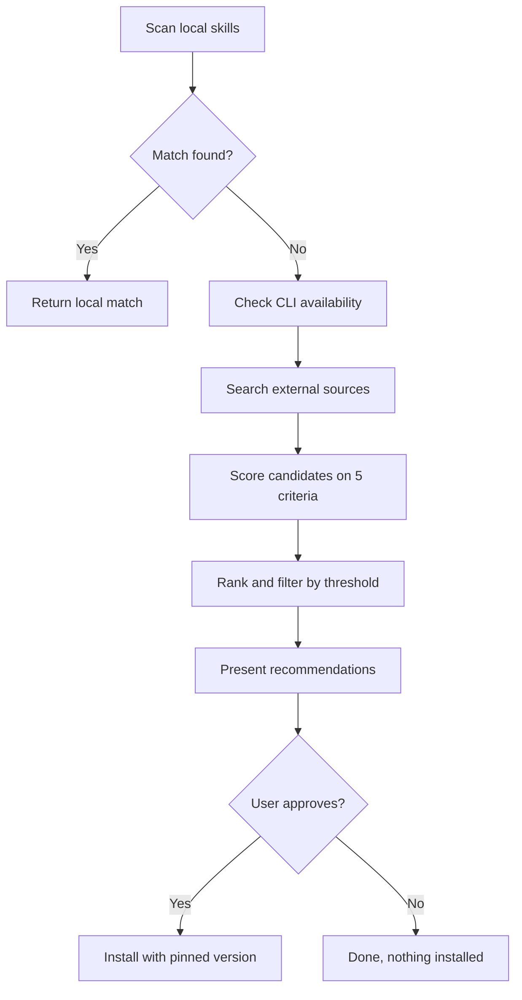

# Discover

> Use when the current skills cannot handle a task and new skills are needed.

## Quick Example

```
/second-claude-code:discover "terraform security audit"
```

**What happens:** The skill scans local skills first for a match. If none is found, it searches up to 4 external sources (npx, npm, gh, web), scores each candidate on a weighted rubric (relevance, popularity, recency, dependencies, source trust), and presents ranked recommendations. Nothing is installed without explicit approval.

## Real-World Example

**Input:**
```
Is there a skill for terraform security auditing?
```

**Process:**
1. Local scan -- checked 7 skills in `skills/` (review, analyze, research, write, loop, pipeline, collect). None covers terraform security auditing.
2. CLI availability -- confirmed `npx`, `npm`, and `gh` are all available.
3. External search -- queried npm, GitHub (`gh search repos`), and web search. Found 5 candidates plus 3 MCP server mentions.
4. Evaluation -- scored each candidate on the 5-criterion weighted rubric. Top result: a Terraform skill (4.85/5.0) with 1,350 stars, updated the previous day. Second: an official HashiCorp agent-skills collection (4.35/5.0).
5. Recommendation -- presented ranked list with install commands. Awaited explicit approval before installing.

**Output excerpt:**

> | Rank | Candidate | Score | Install Command |
> |------|-----------|-------|-----------------|
> | 1 | `terraform-skill` | **4.85** | `claude install antonbabenko/terraform-skill@v1.3.0` |
> | 2 | `agent-skills` | **4.35** | `claude install hashicorp/agent-skills@v2.1.0` |
> | 3 | `devops-claude-skills` | **3.50** | `claude install ahmedasmar/devops-claude-skills@v0.8.2` |
> | 4 | `claude-code-skills` | **3.40** | `claude install levnikolaevich/claude-code-skills@v1.0.1` |
> | 5 | `security-scanner-plugin` | **2.35** | `claude install harish-garg/security-scanner-plugin@v0.3.0` |

## Search Sources

| Source | Condition |
|--------|-----------|
| Local `skills/` | Always searched first |
| `npx skills search` | When `npx` is available |
| `npm search --json` | When `npm` is available |
| `gh search repos` | When `gh` is available |

## Evaluation Weights

| Criterion | Weight | Description |
|-----------|--------|-------------|
| Relevance | 30% | How closely the skill matches the query |
| Popularity | 20% | Stars, downloads, community adoption |
| Recency | 20% | Last update date |
| Dependencies | 15% | Dependency count and weight |
| Source trust | 15% | Author reputation, official vs community |

## Score Thresholds

| Range | Verdict |
|-------|---------|
| 4.0+ | Strong recommendation |
| 3.0-3.9 | Viable with caveats |
| <3.0 | Mention only if nothing else exists |

## How It Works



## Gotchas

- **Auto-installing without approval** -- Never auto-install. Always wait for explicit user approval.
- **Inventing package names** -- Never invent package names. Only recommend packages confirmed to exist through search results.
- **Floating version ranges** -- Pin exact versions on install. No floating ranges.
- **Ignoring stale dependencies** -- Flag heavy or stale packages in the recommendation notes.
- **Missing CLIs** -- If marketplace CLIs are unavailable, degrade gracefully to local-scan-only mode.
- **Metadata-only evaluation** -- Without reading each repo's full source, evaluation relies on metadata. Recommend the user inspect high-risk candidates before installing.

## Troubleshooting

- **No candidates found** -- Try a broader query with fewer specific terms. The skill searches npm, GitHub, and web sources, so generic terms like "terraform" may yield more results than "terraform security compliance audit for AWS GovCloud."
- **All scores below 3.0** -- Scores below 3.0 indicate weak matches. Consider building a custom pipeline with existing skills instead of installing a low-quality external skill.
- **Missing CLIs reduce search coverage** -- The skill uses `npx`, `npm`, and `gh` for external search. If any of these are unavailable, it degrades gracefully but searches fewer sources. Install the missing CLI tools for full coverage.
- **Install command shows no version pin** -- The skill requires pinned versions on install (e.g., `claude install user/skill@v1.2.0`). If the output shows an unpinned command, add the version manually before running it.

## Works With

| Skill | Relationship |
|-------|-------------|
| `pipeline` | A pipeline may reference a missing skill, triggering discover |
| `collect` | Save metadata about discovered skills to the knowledge base |
| `research` | Discover focuses on skill discovery; research handles general information gathering |
