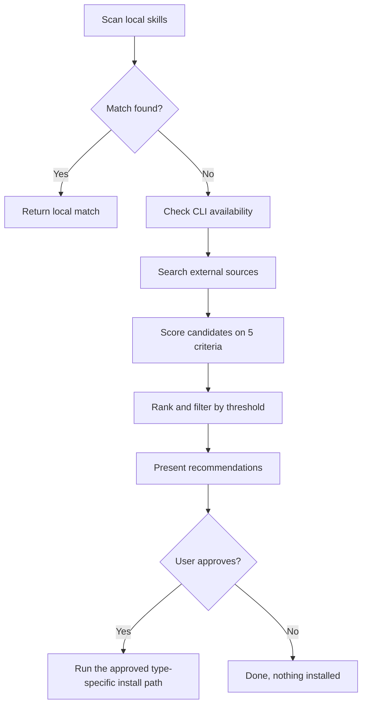

[한국어](discover.ko.md)

# Discover

> Use when the current skills cannot handle a task and new skills are needed.

## Quick Example

```
/scc:discover "terraform security audit"
```

**What happens:** The skill checks built-in tools and local skills first. Only when they cannot handle the request does it search configured external sources, inspect the top three candidates, score them, and present ranked recommendations. Nothing is installed without explicit approval.

## Real-World Example

**Input:**
```
Is there a skill for terraform security auditing?
```

**Process:**
1. Local scan -- checked the currently installed skills in `skills/` (including review, analyze, research, write, refine, discover, and workflow). None covers terraform security auditing.
2. CLI availability -- confirmed `npx`, `npm`, and `gh` are all available.
3. External search -- queried the available registry, GitHub, npm, and web sources. Missing CLIs reduce coverage and are reported.
4. Candidate inspection -- fetched and read the README/SKILL.md for the top three candidates; blocked inspection is recorded and penalized.
5. Evaluation -- scored relevance, popularity, recency, dependencies, and source trust, then recorded the inspected release, commit, or marketplace revision in the recommendation notes.
6. Recommendation -- presented the ranked list and waited for explicit approval. Installation did not start during discovery.

**Output excerpt:**

> | Rank | Candidate | Type | Score | Approval-gated path |
> |------|-----------|------|-------|----------------------|
> | 1 | `terraform-plugin` | Claude marketplace plugin | **4.85** | `claude plugin marketplace add acme/marketplace` then `claude plugin install terraform-plugin@acme` |
> | 2 | `agent-skills` | Skills ecosystem | **4.35** | `npx --yes skills add vercel-labs/agent-skills --skill vercel-optimize --agent claude-code` |
> | 3 | `devops-library` | npm/library dependency | **3.50** | Follow the upstream package's documented install command |

The commands are examples of the supported path for each candidate type. The
first two require explicit approval immediately before execution; the npm row
is not a generic skill installer. If a marketplace is already configured,
`marketplace add` is unnecessary. If a repository lacks the required manifest
or `SKILL.md`, do not invent an install command—recommend a custom integration
or show the upstream instructions for approval.

## Candidate Types and Approval

| Candidate type | Inspect before recommending | Install after approval |
|----------------|-----------------------------|------------------------|
| Claude marketplace plugin | Marketplace source, marketplace manifest, plugin manifest, plugin name | `claude plugin marketplace add <source>` if absent, then `claude plugin install <plugin>@<marketplace>` |
| Skills ecosystem repository | `SKILL.md`, available skill names, target agent, resolved source revision | `npx --yes skills add <owner>/<repo> --skill <skill> --agent claude-code` |
| npm/library dependency | Upstream docs proving it supplies a Claude skill | Use only the upstream command; `npm install` alone does not install a skill |
| Unsupported repository | No supported manifest or installer | No invented command; propose custom integration |

Discovery itself never runs these commands. Approval must name the candidate,
source, target skill/plugin, and project versus global scope. Record the
inspected release, commit, or marketplace revision; `plugin@marketplace` is the
Claude CLI selector and is not a GitHub repository tag install shortcut.

## Search Sources

| Source | Condition |
|--------|-----------|
| Local `skills/` | Always searched first |
| `npx --yes skills find "<query>"` | When `npx` is available |
| `npm search --json` | When `npm` is available |
| `gh search repos` | When `gh` is available |
| Web search | Always available as the lowest-trust fallback |

## Evaluation Weights

| Criterion | Weight | Description |
|-----------|--------|-------------|
| Relevance | 30% | How closely the skill matches the query |
| Popularity | 20% | Stars, downloads, community adoption |
| Recency | 20% | Last update date |
| Dependencies | 15% | Dependency count and weight |
| Source trust | 15% | Author reputation, official vs community |

## Score Thresholds

| Range | Verdict |
|-------|---------|
| 4.0+ | Strong recommendation |
| 3.0-3.9 | Viable with caveats |
| <3.0 | Do not recommend; suggest a custom pipeline instead |

## How It Works


```mermaid
graph TD
    A[Scan local skills] --> B{Match found?}
    B -- Yes --> C[Return local match]
    B -- No --> D[Check CLI availability]
    D --> E[Search external sources]
    E --> F[Score candidates on 5 criteria]
    F --> G[Rank and filter by threshold]
    G --> H[Present recommendations]
    H --> I{User approves?}
    I -- Yes --> J[Run the approved type-specific install path]
    I -- No --> K[Done, nothing installed]
```

## Gotchas

- **Auto-installing without approval** -- Never auto-install. Always wait for explicit user approval.
- **Inventing package names** -- Never invent package names. Only recommend packages confirmed to exist through search results.
- **Untracked revisions** -- Record the inspected release, commit, or marketplace revision; do not claim that an unsupported command suffix pins it.
- **Ignoring stale dependencies** -- Flag heavy or stale packages in the recommendation notes.
- **Missing CLIs** -- If marketplace CLIs are unavailable, degrade gracefully to local-scan-only mode.
- **Metadata-only evaluation** -- Full repositories are not audited. The top three are inspected, but the user should inspect high-risk candidates before installing.

## Troubleshooting

- **No candidates found** -- Try a broader query with fewer specific terms. The skill searches npm, GitHub, and web sources, so generic terms like "terraform" may yield more results than "terraform security compliance audit for AWS GovCloud."
- **All scores below 3.0** -- Scores below 3.0 indicate weak matches. Consider building a custom pipeline with existing skills instead of installing a low-quality external skill.
- **Missing CLIs reduce search coverage** -- The skill uses `npx skills find`, `npm`, and `gh` for external search. If any of these are unavailable, it degrades gracefully but searches fewer sources. Install the missing CLI tools for full coverage.
- **Install path is unclear** -- Classify the candidate first. Use the marketplace two-step flow or `npx skills add` for a skills repository; never substitute a legacy Claude install shortcut.

## Works With

| Skill | Relationship |
|-------|-------------|
| `workflow` | A saved workflow may reference a missing capability, prompting discover |
| `collect` | Save metadata about discovered skills to the knowledge base |
| `research` | Discover focuses on skill discovery; research handles general information gathering |
