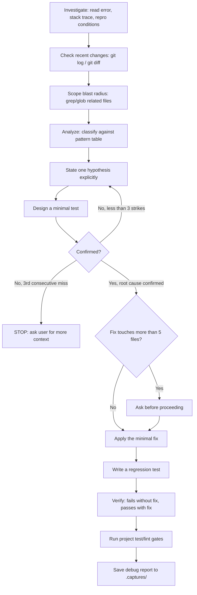

[English](investigate.md) | **한국어**

# Investigate

> 에러, 예상치 못한 동작, 근본 원인(root cause) 분석이 필요할 때 사용하는 스킬입니다.

## 빠른 예시

```
체크아웃 페이지에서 이 에러 좀 봐줘: TypeError: Cannot read properties of undefined (reading 'items')
```

**동작 방식:** 스킬은 먼저 증거부터 모읍니다 -- 정확한 에러 메시지와 스택 트레이스, 재현 조건, 그리고 `git log --oneline -20`과 `git diff HEAD~5 --stat`으로 확인한 최근 변경 사항까지 파악한 뒤, 의견을 내기 전에 알려진 패턴 표에 대조해 먼저 분류합니다. 각 가설은 명시적으로 세운 뒤 최소한의 테스트로 검증하며, 3번 연속 가설이 틀리면 조사를 멈추고 추가 맥락을 요청합니다. 근본 원인이 확인되면 최소한의 수정을 적용하고 회귀 테스트를 작성한 뒤, 구조화된 디버그 리포트를 저장합니다.

## 실전 예시

**입력:**
```
TypeError: Cannot read properties of undefined (reading 'items') -- 체크아웃 페이지에서 오늘부터 발생, 어제까지는 정상이었음
```

**진행 과정:**
1. 조사 -- 정확한 에러와 스택 트레이스(카트 요약 컴포넌트의 렌더링 함수)를 확인하고, 재현 조건을 특정했습니다 (장바구니가 비어있는 사용자가 장바구니 페이지를 거치지 않고 `/checkout`으로 바로 이동할 때만 발생). `git log --oneline -20`을 확인한 결과 최근 5개 커밋 중 카트 요약 컴포넌트 변경은 없었습니다. `git diff HEAD~5 --stat`에서 이틀 전 카트 스토어 모듈을 건드린 카트 상태 리팩터링을 발견했습니다. `cart.items`와 `cart.lineItems`를 grep하여 영향 범위를 확인: 4개 파일에 걸쳐 6곳의 호출부.
2. 분석 -- 패턴 표에 대조한 결과 **Nil/undefined**(TypeError, 옵셔널 체이닝 누락)로 분류했습니다.
3. 가설 수립 및 검증 -- 가설 1: "직접 진입 시 하이드레이션이 끝나기 전이라 `cart` 자체가 `null`이다." 렌더링 시점에 로그를 추가해 확인한 결과 `cart`는 유효한 객체였습니다 -- 기각 (1스트라이크). 가설 2: "리팩터링에서 `cart.lineItems`를 `cart.items`로 이름을 바꿨지만, 카트 요약 컴포넌트는 여전히 예전 필드명 `lineItems`를 구조분해하고 있어 지금은 `undefined`다." 확인됨: 이틀 전 diff에서 카트 스토어 모듈의 이름 변경이 카트 요약 컴포넌트에는 반영되지 않은 것을 발견했고, 예전 필드명으로 최소 재현을 시도하니 동일한 에러가 재현됐습니다.
4. 수정 및 검증 -- Blast Radius Gate: 수정이 4개 파일에 걸쳐 있어 5개 파일 기준 미만이므로 별도 확인 없이 진행했습니다. `cart.lineItems`로 남아있던 4곳을 `cart.items`로 수정했습니다. 빈 카트로 체크아웃에 직접 진입해도 카트 요약 컴포넌트가 에러 없이 렌더링되는지 검증하는 회귀 테스트를 작성했습니다. 검증 결과: 수정 전 코드에서는 테스트가 실패하고, 수정 후에는 통과했습니다. 프로젝트 테스트 스위트를 실행한 결과 전부 통과했습니다.
5. `.captures/investigate-typeerror-cart-items-2026-07-12.md`에 디버그 리포트를 저장했습니다.

**출력 예시:**
```
## Debug Report

### Symptom
TypeError: Cannot read properties of undefined (reading 'items') when navigating
directly to /checkout with an empty cart.

### Root Cause
A cart-state refactor renamed `cart.lineItems` to `cart.items` in the cart
store module, but the cart summary component still destructured the old
`lineItems` field, which was now undefined.

### Fix
Cart summary component -- updated 4 stale `cart.lineItems` references
to `cart.items`.

### Verification
- [x] Original scenario no longer reproduces
- [x] Regression test written and passing
- [x] Test fails without fix, passes with fix
- [x] Related tests passing

### Risk: LOW
### Confidence: 9/10
```

## 옵션

| 플래그 | 값 | 기본값 |
|--------|-----|--------|
| `--scope` | `<path>` | 자동 감지 |
| `--depth` | `shallow\|deep` | `shallow` |

### Depth 동작 방식

- **shallow** (기본값) -- 최근 변경 사항만 확인: `git log --oneline -20`, `git diff HEAD~5 --stat`.
- **deep** -- 전체 히스토리 검토.

## 작동 원리



## 패턴 분류

| 패턴 | 증상 | 확인 방법 |
|------|------|-----------|
| Race condition | 간헐적 실패 | 타이밍/순서 의존성 |
| State corruption | 잘못된 값 | 상태 변경 지점 추적 |
| Nil/undefined | TypeError | 옵셔널 체이닝 누락 |
| Import/dep conflict | 모듈 에러 | node_modules, 버전 불일치 |
| MCP protocol error | 도구 호출 실패 | 요청/응답 스키마 불일치 |
| Hook execution order | 예상치 못한 부작용 | 훅 등록 순서 |
| Skill file parsing | 라우팅 오류 | YAML 프론트매터 + 패턴 매칭 |
| Schema drift | 경계 지점 타입 에러 | 스키마 대 핸들러 비교 |
| Stale cache | 캐시 삭제 후 정상 작동 | 캐시 무효화 경로 |
| Config drift | 로컬에서는 되는데 다른 곳에서 안 됨 | 환경 변수 차이 |

## 서브에이전트

| 서브에이전트 | 모델 | 제약 조건 |
|--------------|------|-----------|
| `evidence-gatherer` | sonnet | 로그 읽기, 코드베이스 grep, 최근 커밋 조회 -- 증거 수집만, 수정 금지 (도구: Read, Bash, Glob, Grep) |
| `root-cause-analyst` | opus | 수집된 증거를 바탕으로 신뢰도 점수와 함께 단일 근본 원인 판단 |

## 자동 저장

모든 조사는 Write 도구로 전체 디버그 리포트를 작성하고, 저장 경로를 알려줍니다.

- **경로**: `.captures/investigate-{slug}-{YYYY-MM-DD}.md`
- **`{slug}`**: 에러 유형을 소문자로 바꾸고 공백을 하이픈으로 치환, 최대 40자.

## 주의사항

- **"일단 빠르게 고치고 나중에 제대로 고치자"** -- 항상 잘못된 접근입니다. 먼저 조사하고, 확인된 원인을 고친 뒤, 곧바로 회귀 테스트를 작성합니다 -- 물어보지 말고 바로 작성합니다.
- **범위 이탈** -- 조사 중에는 버그와 무관한 파일을 건드리지 않습니다. 리팩터링 유혹을 참아야 합니다 -- 이번 세션은 오직 이 버그를 위한 것입니다.
- **애플리케이션 코드부터 의심하기** -- 버그가 의존성 패키지에 있다면, 애플리케이션 코드를 탓하기 전에 버전과 릴리스 노트부터 확인합니다.
- **오래된 MCP 상태** -- 캐시된 상태를 지우려면 MCP 서버 재시작이 필요할 수 있습니다. 깨끗하게 재시작한 뒤 다시 확인합니다.
- **"내 컴퓨터에서는 되는데"** -- 이 말을 믿지 마세요. 환경 차이를 직접 확인합니다.

## 연동 스킬

| 스킬 | 관계 |
|------|------|
| `pdca` | PDCA Check 단계의 디버깅 경로를 담당하며, `review`의 검증 경로와 나란히 동작합니다 |
| `review` | 리뷰에서 나온 지적이 품질 문제가 아니라 재현 가능한 기능 버그라면 investigate로 넘겨 근본 원인을 조사합니다 |
| `research` | 근본 원인이 의존성 패키지에 있다면, research가 버전 동작과 릴리스 노트를 먼저 확인합니다 |
| `refine` | 회귀 테스트 통과 후, 수정 과정에서 함께 바뀐 사용자 대상 문구가 있다면 refine이 다듬습니다 |
