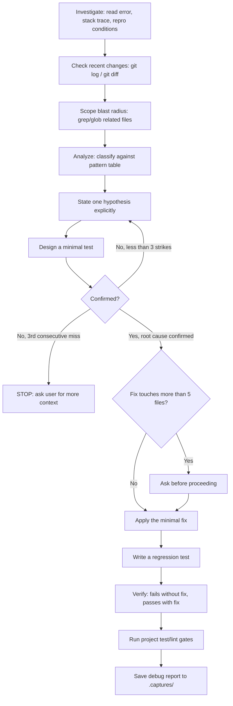

# Investigate

> Use when debugging errors, unexpected behavior, or root-cause analysis.

## Quick Example

```
/second-claude-code:investigate "TypeError: Cannot read properties of undefined (reading 'items')" on the checkout page
```

**What happens:** The skill gathers evidence first -- the exact error and stack trace, reproduction conditions, and recent changes via `git log --oneline -20` and `git diff HEAD~5 --stat` -- then classifies the failure against a known pattern table before forming any opinion. Each hypothesis is stated explicitly and tested with a minimal check; three consecutive wrong hypotheses stop the investigation and hand it back to you for more context. Once the root cause is confirmed, the skill applies the minimal fix, writes a regression test, and saves a structured debug report.

## Real-World Example

**Input:**
```
TypeError: Cannot read properties of undefined (reading 'items') on the checkout page -- started happening today, was fine yesterday
```

**Process:**
1. Investigate -- read the exact error and stack trace (the cart summary component's render function), identified reproduction conditions (only when a user with an empty cart navigates directly to `/checkout`, bypassing the cart page). Checked `git log --oneline -20`: no changes to the cart summary component in the last 5 commits. `git diff HEAD~5 --stat` showed a cart-state refactor touching the cart store module two days ago. Grepped for `cart.items` and `cart.lineItems` to scope the blast radius: 6 call sites across 4 files.
2. Analyze -- classified against the pattern table: matches **Nil/undefined** (TypeError, missing optional chaining).
3. Hypothesize & Test -- Hypothesis 1: "`cart` itself is `null` on direct navigation, before hydration completes." Added a log at render time -- `cart` was a valid object, not `null`. Rejected (strike 1). Hypothesis 2: "the refactor renamed `cart.lineItems` to `cart.items`, but the cart summary component still destructures the old `lineItems` field, which is now `undefined`." Confirmed: the diff from two days ago showed the rename in the cart store module was never mirrored in the cart summary component; a minimal repro with the old field name reproduced the exact error.
4. Fix & Verify -- Blast Radius Gate: fix touches 4 files, under the 5-file threshold, so no confirmation needed. Applied the minimal fix: updated the 4 stale `cart.lineItems` references to `cart.items`. Wrote a regression test asserting the cart summary component renders without throwing on direct checkout navigation with a freshly initialized cart. Verified: test fails on the pre-fix code, passes after the fix. Ran the project's test suite -- all passing.
5. Saved the debug report to `.captures/investigate-typeerror-cart-items-2026-07-12.md`.

**Output excerpt:**
```
## Debug Report

### Symptom
TypeError: Cannot read properties of undefined (reading 'items') when navigating
directly to /checkout with an empty cart.

### Root Cause
A cart-state refactor renamed `cart.lineItems` to `cart.items` in the cart
store module, but the cart summary component still destructured the old
`lineItems` field, which was now undefined.

### Fix
Cart summary component -- updated 4 stale `cart.lineItems` references
to `cart.items`.

### Verification
- [x] Original scenario no longer reproduces
- [x] Regression test written and passing
- [x] Test fails without fix, passes with fix
- [x] Related tests passing

### Risk: LOW
### Confidence: 9/10
```

## Options

| Flag | Values | Default |
|------|--------|---------|
| `--scope` | `<path>` | auto-detected |
| `--depth` | `shallow\|deep` | `shallow` |

### Depth Behavior

- **shallow** (default) -- recent changes only: `git log --oneline -20` and `git diff HEAD~5 --stat`.
- **deep** -- full history review.

## How It Works



## Pattern Classification

| Pattern | Symptoms | Check |
|---------|----------|-------|
| Race condition | Intermittent failure | Timing/ordering dependency |
| State corruption | Wrong values | Trace state mutation points |
| Nil/undefined | TypeError | Missing optional chaining |
| Import/dep conflict | Module errors | node_modules, version mismatch |
| MCP protocol error | Tool invocation failure | Request/response schema mismatch |
| Hook execution order | Unexpected side effects | Hook registration sequence |
| Skill file parsing | Routing mismatch | YAML frontmatter + pattern match |
| Schema drift | Type errors at boundaries | Schema vs handler comparison |
| Stale cache | Works after clear | Cache invalidation path |
| Config drift | Works locally, fails elsewhere | Environment variable differences |

## Subagents

| Subagent | Model | Constraint |
|----------|-------|------------|
| `evidence-gatherer` | sonnet | Read logs, grep the codebase, list recent commits -- evidence only, no fixes (tools: Read, Bash, Glob, Grep) |
| `root-cause-analyst` | opus | Given the evidence, determine the single root cause with a confidence score |

## Auto-Save

Every investigation writes a full debug report using the Write tool and reports the saved path.

- **Path**: `.captures/investigate-{slug}-{YYYY-MM-DD}.md`
- **`{slug}`**: the error type, lowercased, spaces replaced with hyphens, capped at 40 characters.

## Gotchas

- **"Quick fix for now, proper fix later"** -- Always the wrong approach. Investigate first, fix the confirmed cause, then write the regression test immediately -- do not ask, just write it.
- **Scope creep** -- During investigation, do not modify files unrelated to the bug. Resist the refactoring temptation; the session is for the bug only.
- **Blaming application code first** -- If the bug is in a dependency, confirm the version and check release notes before blaming app code.
- **Stale MCP state** -- An MCP server restart may be needed to clear cached state. Verify with a clean restart.
- **"Works on my machine"** -- Don't trust it. Check environment differences explicitly.

## Troubleshooting

- **Investigation stops after 3 wrong hypotheses** -- This is the 3-Strike Rule working as intended, not a malfunction. Three consecutive wrong hypotheses stop the investigation and ask you for more context instead of continuing to guess. Provide additional reproduction details, logs, or constraints, then restart the hypothesis step.
- **Asked to confirm before applying the fix** -- The Blast Radius Gate triggers when the confirmed fix touches more than 5 files. Review the listed files before approving, or narrow `--scope` to reduce the affected area.
- **Can't find the saved debug report** -- Reports save to `.captures/investigate-{slug}-{YYYY-MM-DD}.md`, where `{slug}` is the error type lowercased with spaces replaced by hyphens (max 40 characters). Check that path for today's date.
- **`--depth deep` feels unnecessary** -- The default `shallow` only looks at the last 20 commits and the last 5 commits' diff stat. Switch to `deep` only when the bug predates recent history or shallow history doesn't explain the reproduction conditions.

## Works With

| Skill | Relationship |
|-------|-------------|
| `pdca` | Provides PDCA's Check-phase debugging path, alongside `review`'s verification path |
| `review` | A review finding that turns out to be a reproducible functional bug, not a quality issue, hands off to investigate for root-cause work |
| `research` | When the root cause traces to a dependency, research can confirm version behavior and release notes before the fix is applied |
| `refine` | Once the regression test passes, refine can iterate on any user-facing copy the fix touched |
