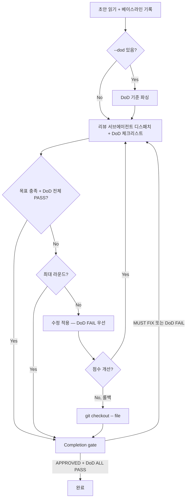

[English](refine.md) | **한국어**

# Refine

> 초안을 리뷰 목표 점수에 도달할 때까지 반복적으로 개선하는 스킬입니다.

## 빠른 예시

```
이 아티클을 4.5/5로 올려 -- draft.md
```

**동작 방식:** 스킬이 현재 초안을 읽고, 리뷰어를 독립 서브에이전트로 디스패치하여 상위 피드백 3개를 반영한 뒤 다시 리뷰합니다. 목표 점수 충족, 최대 라운드 소진, 또는 개선 정체 시까지 이 사이클을 반복합니다. 종료 전에 최종 Completion Gate를 통과해야 합니다.

### Definition of Done (DoD) 모드

```
이 아티클 개선해 --dod "팩트 오류 없음; 모든 섹션에 구체적 예시; 결론이 도입부와 연결"
```

**동작 방식:** 동일한 리뷰-수정 루프에 DoD 체크리스트가 추가됩니다. 리뷰어가 각 기준을 PASS/FAIL로 평가하고, 에디터는 FAIL 기준을 우선 수정합니다. 모든 DoD 기준이 PASS이고 판정 목표를 충족해야 종료됩니다.

## 실전 예시

**입력:**
```
이 아티클을 4.5/5까지 개선해줘 -- 최대 3라운드
```

**진행 과정:**
1. 베이스라인 읽기 -- 파일 해시 기록 후 전체 리뷰 디스패치(deep-reviewer, devil-advocate, tone-guardian).
2. 라운드 1 -- 리뷰어가 2.0/5 (MUST FIX) 반환. 상위 3개 수정 적용: 구체적 예시/데이터 추가, 뼈대뿐인 항목을 주장-근거-시사점 구조로 확장, 프레이밍과 도전 축으로 결론 재작성. 점수 3.8/5 (+1.8).
3. 라운드 2 -- 리뷰어가 3.8/5 (MINOR FIXES) 반환. 상위 3개 수정: 저자 논지 추가, 섹션 간 인과 메타 문단으로 연결, 섹션별 한계/주의사항 추가. 점수 4.2/5 (+0.4).
4. 라운드 3 -- 리뷰어가 4.2/5 (MINOR FIXES) 반환. 상위 3개 수정: 순환적 수사 마무리, 실무자 일화 추가, 검증 불가 주장 완화. 점수 4.5/5 (+0.3).
5. Completion Gate -- quick 프리셋(devil-advocate + fact-checker)이 APPROVED 반환. 종료.

**출력 예시:**
```
Round 0 (baseline):  2.0/5  ||||..............  MUST FIX
Round 1 (post-edit): 3.8/5  |||||||||||||||...  MINOR FIXES  (+1.8)
Round 2 (post-edit): 4.2/5  ||||||||||||||||..  MINOR FIXES  (+0.4)
Round 3 (post-edit): 4.5/5  ||||||||||||||||||  APPROVED     (+0.3)
```

**`--dod` 사용 시** (DoD가 에디터에게 특정 기준 수정을 강제하므로 더 적은 라운드로 목표에 도달하는 경우가 많아요):
```
Round 0 (baseline):  2.0/5  ||||..............  MUST FIX
  DoD: [x] 팩트 오류 없음  [ ] 구체적 예시  [ ] 결론-도입 연결

Round 1 (post-edit): 3.8/5  |||||||||||||||...  MINOR FIXES  (+1.8)
  DoD: [x] 팩트 오류 없음  [x] 구체적 예시  [ ] 결론-도입 연결

Round 2 (post-edit): 4.5/5  ||||||||||||||||||  APPROVED     (+0.7)
  DoD: [x] 팩트 오류 없음  [x] 구체적 예시  [x] 결론-도입 연결  ✓ ALL PASS
```

## 옵션

| 플래그 | 값 | 기본값 |
|--------|-----|--------|
| `--max` | `1-10` | `3` |
| `--target` | 점수 (예: `4.5`) 또는 판정 (예: `APPROVED`) | `APPROVED` |
| `--promise` | 각 리뷰어 컨텍스트에 제약으로 주입되는 텍스트 | 없음 |
| `--dod` | 세미콜론 구분 성공 기준 체크리스트 (예: `"팩트 오류 없음; 예시 포함"`) | 없음 |

## 작동 원리



## 주의사항

- 리뷰 디스패치는 반드시 실제 서브에이전트를 사용해야 하며, 인라인 시뮬레이션은 안 됩니다. 하나의 컨텍스트에서 모든 리뷰어 관점을 돌리면 집단사고(groupthink)가 발생합니다.
- 퇴행 시 롤백은 `git checkout -- <file>`을 사용하며, 인메모리 해시 비교가 아닙니다. Git이 기준입니다.
- 수확 체감은 정상입니다(예: +1.8, +0.4, +0.3). 한 라운드에서 개선 폭이 0이면 반복을 낭비하지 말고 조기 종료하세요.
- Completion Gate(`--preset quick`)는 필수입니다. 절대 생략하지 마세요 -- MUST FIX 판정이 나오면 계속 진행됩니다.
- 라운드당 상위 피드백 3개만 반영합니다. 전부 적용하면 과잉 편집으로 점수가 오히려 하락할 수 있습니다.
- `--dod` 기준은 3-5개가 적당합니다. 5개 초과 시 리뷰어 집중도가 분산되어 `--max` 라운드 내 전체 PASS가 어려워집니다.

## 연동 스킬

| 스킬 | 관계 |
|------|------|
| `review` | 매 라운드 스코어링 엔진으로 디스패치 |
| `write` | refine이 개선할 초안을 생성하는 주요 스킬 |
| `pipeline` | 파이프라인 단계로 활용 가능 (예: `autopilot` 프리셋) |
| `collect` | 최종 승인된 초안을 지식 베이스에 저장 |
