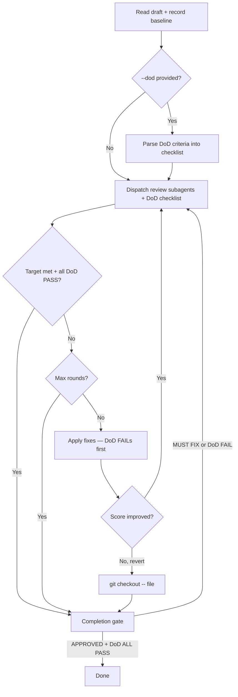

# Refine

> Use when iteratively improving a draft until it meets a review target.

## Quick Example

```
/second-claude-code:refine draft.md --target 4.5 --max 3
```

**What happens:** The skill reads the current draft, dispatches reviewers as independent subagents, applies the top 3 feedback items, then re-reviews. This cycle repeats until the target score is met, the max rounds are exhausted, or improvement plateaus. A final completion gate must pass before refine exits.

### With Definition of Done

```
/second-claude-code:refine draft.md --dod "no factual errors; every section has concrete examples; conclusion connects back to intro"
```

**What happens:** Same review-fix loop, but reviewers also evaluate each DoD criterion as PASS/FAIL. The editor prioritizes failing DoD criteria first. Refine only exits when all DoD criteria pass AND the verdict target is met.

## Real-World Example

**Input:**
```
Improve this article to 4.5/5 -- max 3 rounds
```

**Process:**
1. Baseline read -- record the file hash and run a full review dispatch (deep-reviewer, devil-advocate, tone-guardian).
2. Round 1 -- reviewers return 2.0/5 (MUST FIX). Top 3 fixes applied: add concrete examples/data, expand skeletal bullets into claim-evidence-implication structure, rewrite conclusion with framing and challenge axes. Score rises to 3.8/5 (+1.8).
3. Round 2 -- reviewers return 3.8/5 (MINOR FIXES). Top 3 fixes: add authorial thesis, connect sections with causal meta-paragraph, add limitations/caveats per section. Score rises to 4.2/5 (+0.4).
4. Round 3 -- reviewers return 4.2/5 (MINOR FIXES). Top 3 fixes: circular rhetorical closure, practitioner anecdote, soften unverifiable claims. Score rises to 4.5/5 (+0.3).
5. Completion gate -- quick preset (devil-advocate + fact-checker) returns APPROVED. Refine exits.

**Output excerpt:**
```
Round 0 (baseline):  2.0/5  ||||..............  MUST FIX
Round 1 (post-edit): 3.8/5  |||||||||||||||...  MINOR FIXES  (+1.8)
Round 2 (post-edit): 4.2/5  ||||||||||||||||..  MINOR FIXES  (+0.4)
Round 3 (post-edit): 4.5/5  ||||||||||||||||||  APPROVED     (+0.3)
```

**With `--dod`** (DoD forces the editor to address specific criteria, often reaching the target in fewer rounds):
```
Round 0 (baseline):  2.0/5  ||||..............  MUST FIX
  DoD: [x] no factual errors  [ ] concrete examples  [ ] conclusion connects

Round 1 (post-edit): 3.8/5  |||||||||||||||...  MINOR FIXES  (+1.8)
  DoD: [x] no factual errors  [x] concrete examples  [ ] conclusion connects

Round 2 (post-edit): 4.5/5  ||||||||||||||||||  APPROVED     (+0.7)
  DoD: [x] no factual errors  [x] concrete examples  [x] conclusion connects  ✓ ALL PASS
```

## Options

| Flag | Values | Default |
|------|--------|---------|
| `--max` | `1-10` | `3` |
| `--target` | score (e.g. `4.5`) or verdict (e.g. `APPROVED`) | `APPROVED` |
| `--promise` | text injected into each reviewer's context as a constraint | none |
| `--dod` | semicolon-separated success criteria (e.g. `"no factual errors; has examples"`) | none |

## How It Works



## Gotchas

- **Inline simulation instead of subagents** -- Review dispatch must use real subagents, not inline simulation. Running all reviewer perspectives in a single context causes groupthink.
- **In-memory hash instead of git** -- Revert on regression uses `git checkout -- <file>`, not in-memory hash comparison. Git is the source of truth.
- **Ignoring diminishing returns** -- Diminishing returns are expected (e.g. +1.8, +0.4, +0.3). If a round produces zero delta, stop early rather than wasting iterations.
- **Skipping the completion gate** -- The completion gate (`--preset quick`) is mandatory. Never skip it -- a MUST FIX verdict forces refine to continue.
- **Applying all feedback at once** -- Only the top 3 feedback items are applied per round. Applying everything risks over-editing and score regression.
- **Too many DoD criteria** -- Keep `--dod` to 3-5 criteria. More than 5 dilutes reviewer focus and makes unanimous PASS unlikely within `--max` rounds.

## Troubleshooting

- **Score not improving** -- Refine stops early when a round produces zero score delta (diminishing returns). This is expected behavior, not an error. If the baseline score is already high, there may be little room for improvement.
- **Review feels repetitive or shallow** -- Ensure refine dispatches real subagents, not inline simulation. Running all reviewer perspectives in a single context causes groupthink and repetitive feedback.
- **Revert happened unexpectedly** -- When a round causes score regression, refine reverts using `git checkout -- <file>`. This requires the file to be in a git repository with the current version committed. Working in a non-git directory or with uncommitted changes will cause revert to fail.
- **Prerequisite: git repository** -- The refine skill uses `git checkout -- <file>` for revert on regression. Your working directory must be a git repo and the target file must be committed before running refine.

## Works With

| Skill | Relationship |
|-------|-------------|
| `review` | Dispatched each round as the scoring engine |
| `write` | Commonly produces the initial draft that refine polishes |
| `workflow` | Refine can be a step in a workflow (e.g. `autopilot` preset) |
| `collect` | Save the final approved draft to the knowledge base |
