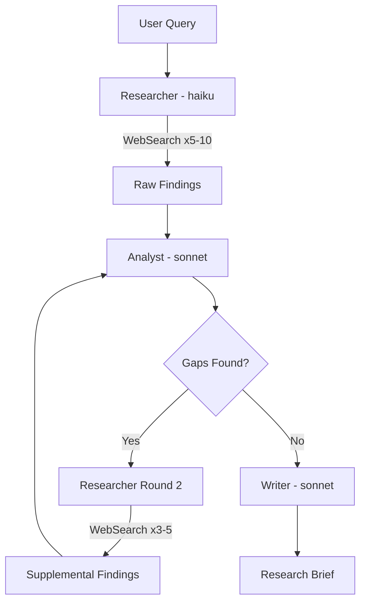

[English](research.md) | **한국어**

# Research

> 자율적 다회차 웹 리서치를 수행하여 구조화된 리서치 브리프를 생성합니다.

## 빠른 예시

```
AI 에이전트 프레임워크 현황을 조사해
```

**동작 방식:** 리서처 서브에이전트가 다양한 검색어로 여러 차례 웹 검색을 수행하고, 애널리스트가 수집된 자료를 구조화하면서 누락 영역을 식별한 뒤, 라이터가 출처, 데이터 포인트, 한계점을 포함한 리서치 브리프로 종합합니다.

## 실전 예시

**입력:**
```
/second-claude-code:research "AI 에이전트 프레임워크 현황 2026" --depth deep
```

**진행 과정:**
1. 리서처(haiku)가 다양한 검색어로 초기 검색 5회를 실행하고, 고가치 URL 4개의 전체 페이지를 가져옵니다.
2. 애널리스트(sonnet)가 수집 자료를 카테고리별로 구조화하고, 프로토콜 표준, 코딩 에이전트, 벤더 SDK 비교 영역의 누락을 식별합니다.
3. 리서처가 식별된 누락 영역을 대상으로 보충 검색 4회와 페이지 추출 2회를 실행합니다.
4. 프로토콜 채택 데이터의 잔여 공백을 채우기 위한 최종 타겟 검색을 수행합니다.
5. 라이터(sonnet)가 모든 결과를 브리프 형식으로 종합합니다.

**출력 예시:**
> **발견 출처:** 19개 고유 URL | **채택 출처:** 14개 (관련성 주석 포함)
>
> | 지표 | 수치 | 출처 |
> |------|------|------|
> | AI 에이전트 시장 규모 (2025) | $7.63B | StackOne |
> | 프로덕션 에이전트 도입률 | 57.3% | LangChain Survey |
> | MCP 월간 SDK 다운로드 | 97M | DEV Community |
> | AI 에이전트 탑재 엔터프라이즈 앱 (2026E) | 40% | Gartner |

## 옵션

| 플래그 | 값 | 기본값 |
|--------|-----|--------|
| `--depth` | `shallow\|medium\|deep` | `medium` |
| `--sources` | `web\|academic\|news` | `web` |
| `--lang` | `ko\|en\|auto` | `auto` |

### Depth 동작 방식

- **shallow** (1라운드): 검색 3회, 갭 분석 없음. 빠른 사실 확인용.
- **medium** (2라운드): 검색 5회 + 갭 분석 + 타겟 후속 검색.
- **deep** (반복): 10회 이상 검색, 반복적 갭 보충 사이클. 경쟁사 분석이나 심층 문헌 조사에 적합.

## 작동 원리



## 주의사항

- **검색 1회로 끝남** -- 리서처는 depth 최소 기준(3/5/10)을 반드시 충족해야 합니다. 디스패치 제약이 이를 강제합니다.
- **분석 없이 링크만 나열** -- 애널리스트 서브에이전트가 필수입니다. 단순 링크 나열은 거부되며 모든 발견에 종합 문장이 필요합니다.
- **출처 날조** -- 모든 URL은 실제 WebSearch 결과에서 가져와야 합니다. 라이터가 URL을 만들어낼 수 없습니다.
- **중복 검색어** -- 리서처는 동의어, 관련 용어, 다른 관점을 활용하여 검색어를 변주해야 합니다.
- **영어 출처 편중** -- `--lang ko` 사용 시 최소 30%의 검색을 한국어 검색어로 수행합니다.

## 연동 스킬

| 스킬 | 관계 |
|------|------|
| write | `--skip-research` 미설정 시 초안 작성 전 자동 호출 |
| analyze | `--with-research` 설정 시 호출 |
| workflow | 세션별 출력 캐싱으로 중복 검색 방지 |
