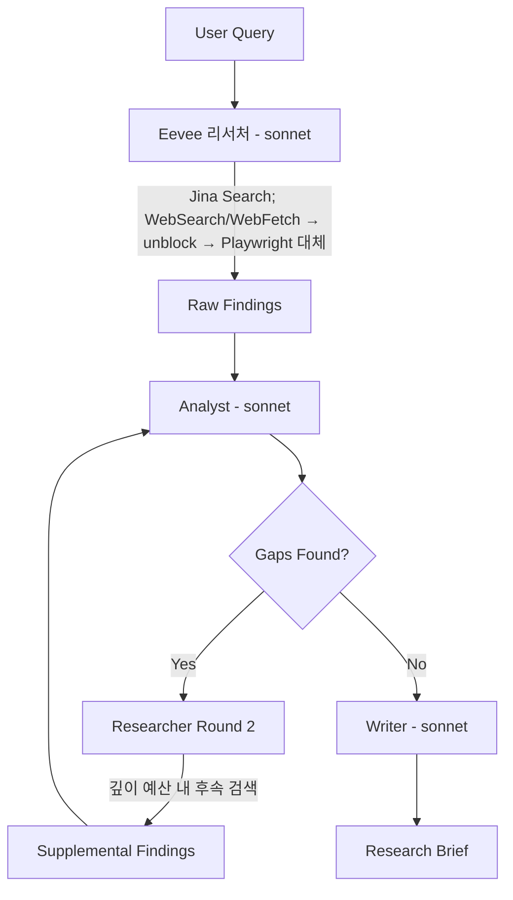

[English](research.md) | **한국어**

# Research

> 잘 찾는 손. 여러 각도로 웹을 훑고, 빈틈을 분석한 뒤 출처가 있는 브리프로 남깁니다.

## 빠른 예시

```
AI 에이전트 프레임워크 현황을 조사해
```

**동작 방식:** 이브이(Eevee, sonnet)가 깊이에 맞춰 다양한 검색어로 웹 검색을 수행하고, 애널리스트가 자료를 구조화하면서 누락 영역을 식별한 뒤, 라이터가 출처·데이터 포인트·한계점을 포함한 리서치 브리프로 종합합니다. 검색 횟수는 깊이로 제어되며 고유 출처 20개를 보장하지 않습니다.

기본 `--engine jina`은 `JINA_API_KEY`가 있을 때 Jina Search/Reader를 사용합니다.
키가 없거나 Jina가 실패하면 WebSearch/WebFetch로 대체하고, 막힌 페이지는
`unblock`, 마지막 브라우저 대체 경로는 Playwright를 사용합니다. 이는 접근
경로의 대체일 뿐 검색 횟수나 고유 출처 수를 추가로 보장하지 않습니다.

## 실전 예시

**입력:**
```
/scc:research "AI 에이전트 프레임워크 현황 2026" --depth deep
```

**진행 과정:**
1. 리서처 이브이(sonnet)가 선택한 깊이로 검색합니다: shallow 정확히 3회, medium 정확히 5회, deep 10회 이상. Jina 키가 없으면 같은 횟수의 WebSearch 호출로 대체합니다.
2. 애널리스트(sonnet)가 수집 자료를 카테고리별로 구조화하고, 프로토콜 표준, 코딩 에이전트, 벤더 SDK 비교 영역의 누락을 식별합니다.
3. 깊이가 허용하는 범위에서 식별된 공백을 보충 검색합니다.
4. 해결하지 못한 공백은 숨기지 않고 기록합니다.
5. 라이터(sonnet)가 결과를 브리프 형식으로 종합합니다.

**출력 예시:**
> **검색 깊이:** medium(검색 5회) | **채택 출처:** 검증된 URL(관련성 주석 포함)
>
> | 지표 | 수치 | 출처 |
> |------|------|------|
> | AI 에이전트 시장 규모 (2025) | $7.63B | StackOne |
> | 프로덕션 에이전트 도입률 | 57.3% | LangChain Survey |
> | MCP 월간 SDK 다운로드 | 97M | DEV Community |
> | AI 에이전트 탑재 엔터프라이즈 앱 (2026E) | 40% | Gartner |

## 옵션

| 플래그 | 값 | 기본값 |
|--------|-----|--------|
| `--depth` | `shallow\|medium\|deep` | `medium` |
| `--sources` | `web\|academic\|news` | `web` |
| `--lang` | `ko\|en\|auto` | `auto` |
| `--engine` | `jina\|legacy` | `jina` |

### Depth 동작 방식

- **shallow**: 검색 정확히 3회, 심층 읽기와 갭 분석 라운드 없음.
- **medium**: 검색 정확히 5회와 심층 읽기 최대 2회.
- **deep**: 검색 10회 이상, 심층 읽기 제한 없음, 갭 보충 최대 3라운드.

`jina` 엔진은 검색에 Jina Search, 심층 읽기에 Jina Reader를 씁니다.
`--engine legacy`, `JINA_API_KEY` 부재, Jina 실패 시 해당 작업을
WebSearch/WebFetch로 대체합니다. 횟수는 호출 수이며 고유 출처 20개를
보장하지 않습니다. 중복·사용 불가 페이지는 기록하거나 제외합니다.

## 작동 원리


```mermaid
graph TD
    A[User Query] --> B[Eevee 리서처 - sonnet]
    B -->|Jina Search; WebSearch/WebFetch → unblock → Playwright 대체| C[Raw Findings]
    C --> D[Analyst - sonnet]
    D --> E{Gaps Found?}
    E -->|Yes| F[Researcher Round 2]
    F -->|깊이 예산 내 후속 검색| G[Supplemental Findings]
    G --> D
    E -->|No| H[Writer - sonnet]
    H --> I[Research Brief]
```

## 주의사항

- **검색 1회로 끝남** -- 리서처는 depth 최소 기준(3/5/10회 이상)을 충족하고 실제 횟수를 보고합니다.
- **분석 없이 링크만 나열** -- 애널리스트 서브에이전트가 필수입니다. 단순 링크 나열은 거부되며 모든 발견에 종합 문장이 필요합니다.
- **출처 날조** -- 모든 URL은 실제 Jina Search 또는 WebSearch 결과에서 가져와야 합니다. 라이터가 URL을 만들어낼 수 없습니다.
- **중복 검색어** -- 리서처는 동의어, 관련 용어, 다른 관점을 활용하여 검색어를 변주해야 합니다.
- **영어 출처 편중** -- `--lang ko` 사용 시 최소 30%의 검색을 한국어 검색어로 수행합니다.

## 문제 해결

- **"결과 없음"** -- 질의 표현을 바꿔 보십시오. 동의어, 더 넓은 용어, 다른 각도. 리서처가 질의를 알아서 변주하지만 처음이 지나치게 좁으면 한계가 있습니다.
- **소스가 압축된 JS나 못 읽을 내용을 돌려준다** -- 읽을 수 없는 페이지는 자동으로 버리고 대체 소스를 찾습니다. 특정 주제에서 자주 그러면 `--sources academic`이나 `--sources news`로 구조화된 소스를 겨냥하십시오.
- **웹 검색을 못 쓴다** -- Jina와 WebSearch 모두 웹 접근이 필요합니다. 둘 다 unavailable이면 자료를 직접 주고 이후 스킬에 `--skip-research`를 쓰십시오.
- **리서치가 너무 느리다** -- 단순 사실 확인은 `--depth shallow`(검색 3회, 공백 분석 없음). 또는 자료를 직접 주고 write 스킬에 `--skip-research`를 붙여 아예 건너뛰십시오.

## 연동 스킬

| 스킬 | 관계 |
|------|------|
| write | `--skip-research` 미설정 시 초안 작성 전 자동 호출 |
| analyze | `--with-research` 설정 시 호출 |
| workflow | 세션별 출력 캐싱으로 중복 검색 방지 |
