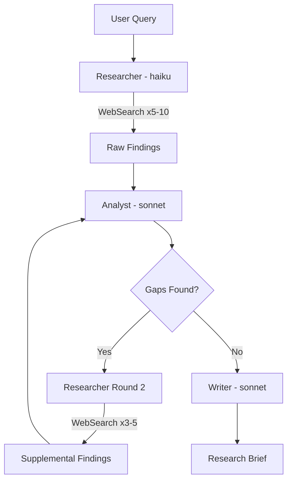

# Research

> Autonomous multi-round web research that produces structured Research Briefs.

## Quick Example

```
Research the current state of AI agent frameworks in 2026
```

**What happens:** A researcher subagent executes multiple web searches with varied query phrasings, an analyst structures the raw findings and identifies gaps, then a writer synthesizes everything into a formatted Research Brief with sources, data points, and limitations.

## Real-World Example

**Input:**
```
/second-claude-code:research "AI agent landscape 2026" --depth deep
```

**Process:**
1. Researcher (haiku) runs 5 initial searches across varied phrasings, fetches 4 full pages for high-value URLs.
2. Analyst (sonnet) structures raw findings into categories, identifies gaps in protocol standards, coding agents, and vendor SDK comparison.
3. Researcher executes 4 gap-filling searches plus 2 page fetches targeting the identified gaps.
4. A final targeted search fills remaining holes in protocol adoption data.
5. Writer (sonnet) synthesizes all findings into the output brief format.

**Output excerpt:**
> **Sources found:** 19 unique URLs | **Sources kept:** 14 with relevance notes
>
> | Metric | Value | Source |
> |--------|-------|--------|
> | AI agent market size (2025) | $7.63B | StackOne |
> | Production agent deployment | 57.3% | LangChain Survey |
> | MCP monthly SDK downloads | 97M | DEV Community |
> | Enterprise apps with AI agents (2026E) | 40% | Gartner |

## Options

| Flag | Values | Default |
|------|--------|---------|
| `--depth` | `shallow\|medium\|deep` | `medium` |
| `--sources` | `web\|academic\|news` | `web` |
| `--lang` | `ko\|en\|auto` | `auto` |

### Depth Behavior

- **shallow** (1 round): 3 searches, no gap analysis. Quick factual lookups.
- **medium** (2 rounds): 5 searches + gap analysis + targeted follow-up.
- **deep** (iterative): 10+ searches across repeated gap-fill cycles. For competitive intel or thorough literature review.

## How It Works



## Gotchas

- **Stops after 1 search** -- Researcher must meet depth minimums (3/5/10). The dispatch constraint enforces this.
- **Lists links without analysis** -- Analyst subagent is required. Raw link dumps are rejected; every finding needs a synthesis sentence.
- **Hallucinated sources** -- Every URL must come from an actual WebSearch result. Writer cannot invent URLs.
- **Duplicate queries** -- Researcher must vary query phrasing with synonyms, related terms, and different angles.
- **English-only sources** -- When `--lang ko`, at least 30% of searches use Korean queries.

## Troubleshooting

- **"No results found"** -- Check your query phrasing. Try synonyms, broader terms, or different angles. The researcher varies queries automatically, but an overly narrow initial query can limit results.
- **Source returned minified JS or unreadable content** -- The researcher auto-discards unreadable pages and searches for alternative sources. If this happens frequently for a topic, try `--sources academic` or `--sources news` to target more structured content.
- **WebSearch is unavailable** -- The research skill requires web search access. If running in an offline environment or without the WebSearch MCP tool configured, research cannot execute. Provide source material manually and use `--skip-research` on downstream skills.
- **Research phase is too slow** -- Use `--depth shallow` for quick factual lookups (3 searches, no gap analysis). Alternatively, provide your own sources and skip research entirely with `--skip-research` on the write skill.

## Works With

| Skill | Relationship |
|-------|-------------|
| write | Auto-called before drafting unless `--skip-research` is set |
| analyze | Called when `--with-research` is set |
| workflow | Output cached per session to avoid redundant searches |
