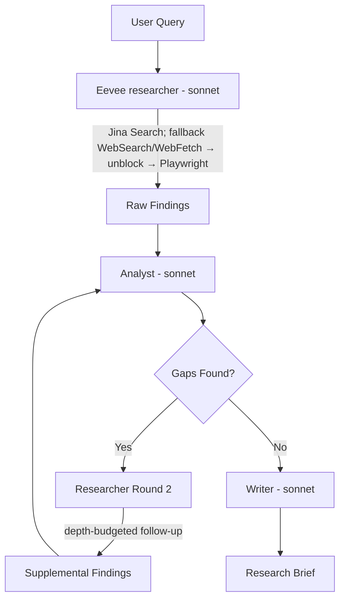

[한국어](research.ko.md)

# Research

> Autonomous multi-round web research that produces structured Research Briefs.

## Quick Example

```
Research the current state of AI agent frameworks in 2026
```

**What happens:** Eevee (sonnet) executes depth-controlled web searches with varied query phrasings, an analyst structures findings and identifies gaps, then a writer synthesizes a Research Brief with sources, data points, and limitations. Search count is controlled; the skill does not guarantee 20 unique sources.

With the default `--engine jina`, the researcher uses Jina Search/Reader when
`JINA_API_KEY` is available. Without the key (or after a Jina failure), it
replaces those calls with WebSearch/WebFetch. A blocked page can then use
`unblock`, with Playwright as a final browser fallback. These are access
fallbacks, not extra search-count or unique-source guarantees.

## Real-World Example

**Input:**
```
/scc:research "AI agent landscape 2026" --depth deep
```

**Process:**
1. Researcher Eevee (sonnet) runs the selected depth: exactly 3 search calls (shallow), exactly 5 (medium), or 10+ (deep). With the legacy engine or no Jina key, the same counts use WebSearch calls.
2. Analyst (sonnet) structures raw findings into categories, identifies gaps in protocol standards, coding agents, and vendor SDK comparison.
3. Where depth permits, the researcher fills analyst-identified gaps within the search budget.
4. The researcher documents unresolved gaps rather than inventing coverage.
5. Writer (sonnet) synthesizes findings into the output brief format.

**Output excerpt:**
> **Search depth:** medium (5 searches) | **Sources kept:** validated URLs with relevance notes
>
> | Metric | Value | Source |
> |--------|-------|--------|
> | AI agent market size (2025) | $7.63B | StackOne |
> | Production agent deployment | 57.3% | LangChain Survey |
> | MCP monthly SDK downloads | 97M | DEV Community |
> | Enterprise apps with AI agents (2026E) | 40% | Gartner |

## Options

| Flag | Values | Default |
|------|--------|---------|
| `--depth` | `shallow\|medium\|deep` | `medium` |
| `--sources` | `web\|academic\|news` | `web` |
| `--lang` | `ko\|en\|auto` | `auto` |
| `--engine` | `jina\|legacy` | `jina` |

### Depth Behavior

- **shallow**: exactly 3 search calls; no deep reads or gap-analysis round.
- **medium**: exactly 5 search calls plus up to 2 deep reads.
- **deep**: 10+ search calls, unlimited deep reads, and up to 3 gap-fill rounds.

The `jina` engine uses Jina Search for search calls and Jina Reader for deep
reads. `--engine legacy`, a missing `JINA_API_KEY`, or a Jina failure uses
WebSearch/WebFetch for the corresponding work. Counts are calls, not a promise
of 20 unique sources; duplicate or unusable pages are documented or discarded.

## How It Works


```mermaid
graph TD
    A[User Query] --> B[Eevee researcher - sonnet]
    B -->|Jina Search; fallback WebSearch/WebFetch → unblock → Playwright| C[Raw Findings]
    C --> D[Analyst - sonnet]
    D --> E{Gaps Found?}
    E -->|Yes| F[Researcher Round 2]
    F -->|depth-budgeted follow-up| G[Supplemental Findings]
    G --> D
    E -->|No| H[Writer - sonnet]
    H --> I[Research Brief]
```

## Gotchas

- **Stops after 1 search** -- Researcher must meet depth minimums (3/5/10+). The skill reports the actual count.
- **Lists links without analysis** -- Analyst subagent is required. Raw link dumps are rejected; every finding needs a synthesis sentence.
- **Hallucinated sources** -- Every URL must come from an actual Jina Search or WebSearch result. Writer cannot invent URLs.
- **Duplicate queries** -- Researcher must vary query phrasing with synonyms, related terms, and different angles.
- **English-only sources** -- When `--lang ko`, at least 30% of searches use Korean queries.

## Troubleshooting

- **"No results found"** -- Check your query phrasing. Try synonyms, broader terms, or different angles. The researcher varies queries automatically, but an overly narrow initial query can limit results.
- **Source returned minified JS or unreadable content** -- The researcher auto-discards unreadable pages and searches for alternative sources. If this happens frequently for a topic, try `--sources academic` or `--sources news` to target more structured content.
- **Web search is unavailable** -- The research skill requires web access. If Jina and WebSearch are unavailable, provide source material manually and use `--skip-research` on downstream skills.
- **Research phase is too slow** -- Use `--depth shallow` for quick factual lookups (3 searches, no gap analysis). Alternatively, provide your own sources and skip research entirely with `--skip-research` on the write skill.

## Works With

| Skill | Relationship |
|-------|-------------|
| write | Runs internally before drafting unless `--skip-research` is set |
| analyze | Called when `--with-research` is set |
| workflow | Output cached per session to avoid redundant searches |
