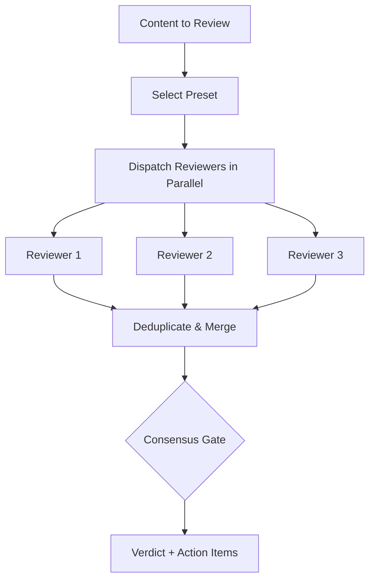

[English](review.md) | **한국어**

# Review

> 전문 리뷰어를 병렬로 실행한 뒤 Consensus Gate (합의 게이트)를 통해 소견을 병합합니다.

## 빠른 예시

```
이 README를 리뷰해
```

**동작 방식:** 3명의 리뷰어(deep-reviewer, devil-advocate, tone-guardian)가 독립된 컨텍스트에서 병렬 디스패치됩니다. 각 리뷰어는 심각도 레벨이 포함된 구조화된 소견을 제출하고, 합의 게이트가 이를 단일 판정으로 병합합니다.

## 실전 예시

**입력:**
```
/second-claude-code:review --preset content README.md
```

**진행 과정:**
1. Deep-reviewer(opus)가 논리, 구조, 완성도를 분석 -- 각 소견마다 정확한 위치를 인용.
2. Devil-advocate(sonnet)가 가장 취약한 3가지를 공격: 과장된 주장, 암시적 보증, 검증되지 않은 가치 제안.
3. Tone-guardian(haiku)이 문체 일관성과 타겟 독자 적합성을 점검.
4. 소견 중복 제거 및 병합. 합의 게이트 적용: 승인 1/3, 기준 미충족.
5. 우선순위화된 액션 아이템과 함께 최종 판정 발행.

**출력 예시:**
> ## 판정: MINOR FIXES
> **합의**: 1/3 (기준 2/3 미충족, Critical 소견 없음)
>
> | # | 소견 | 리뷰어 | 심각도 |
> |---|------|--------|--------|
> | M1 | 플랫폼 호환성 주장에 근거 부족 | deep-reviewer | Major |
> | M2 | 콘텐츠 생산 도구에 출력 예시 없음 | deep-reviewer | Major |
> | M3 | "지식 노동 OS" 포지셔닝이 범위를 과대약속 | devil-advocate | Major |
> | M4 | 계보 섹션이 존재하지 않는 보증을 암시 | devil-advocate | Major |

## 프리셋

| 프리셋 | 리뷰어 구성 | 기준 |
|--------|------------|------|
| `content` | deep-reviewer + devil-advocate + tone-guardian | 2/3 |
| `strategy` | deep-reviewer + devil-advocate + fact-checker | 2/3 |
| `code` | deep-reviewer + fact-checker + structure-analyst | 2/3 |
| `quick` | devil-advocate + fact-checker | 2/2 |
| `full` | 리뷰어 5명 전원 | 3/5 |

## 리뷰어

| 리뷰어 | 모델 | 담당 영역 |
|--------|------|----------|
| `deep-reviewer` | opus | 논리, 구조, 완성도 |
| `devil-advocate` | sonnet | 취약점 및 사각지대 |
| `fact-checker` | sonnet | 주장, 수치, 출처 |
| `tone-guardian` | haiku | 문체 및 독자 적합성 |
| `structure-analyst` | haiku | 구성 및 가독성 |

## 옵션

| 플래그 | 값 | 기본값 |
|--------|-----|--------|
| `--preset` | `content\|strategy\|code\|quick\|full` | `content` |
| `--threshold` | 숫자 | `0.67` |
| `--strict` | flag | off |
| `--external` | flag | off |

### Consensus Gate (합의 게이트) 판정

| 판정 | 조건 |
|------|------|
| **APPROVED** | 기준 충족, Critical/Major 소견 없음 |
| **MINOR FIXES** | 기준 충족, Critical 없으나 Major/Minor 잔존 |
| **NEEDS IMPROVEMENT** | 기준 미충족, Critical 없음 -- 실질적 재작업 필요 |
| **MUST FIX** | 어떤 리뷰어든 Critical 소견 발생 시 (다른 모든 조건 무시) |

### 외부 리뷰어

`--external` 설정 시, 스킬이 설치된 외부 CLI를 감지하여 병렬 리뷰를 디스패치합니다. 외부 리뷰는 추가 투표권 1표로 반영됩니다. 감지 순서: `mmbridge` > `kimi` > `codex` > `gemini`. 감지된 CLI가 없으면 플래그가 자동으로 무시됩니다.

## 작동 원리



## 주의사항

- **리뷰어 간 영향** -- 리뷰어는 독립된 컨텍스트로 디스패치됩니다. 서로의 출력을 볼 수 없게 해야 합니다.
- **막연한 소견** -- 모든 소견은 정확한 위치(섹션, 줄)를 인용해야 합니다. "더 나아질 수 있다" 같은 표현은 실행 불가능합니다.
- **검증 없는 팩트체크** -- Fact-checker가 출처 URL 없이 검증 완료를 주장할 수 없습니다.
- **Strict 모드 주의** -- `--strict` 사용 시, 기준 미충족이면 모든 소견이 Minor여도 MUST FIX 판정이 내려집니다.

## 연동 스킬

| 스킬 | 관계 |
|------|------|
| write | 초안 작성 후 `content` 프리셋으로 자동 호출 |
| analyze | 분석 결과 검증에 활용 가능 |
| loop | 리뷰 소견 기반으로 판정 개선까지 반복 |
| pipeline | 품질 게이트 단계로 연결 가능 |
