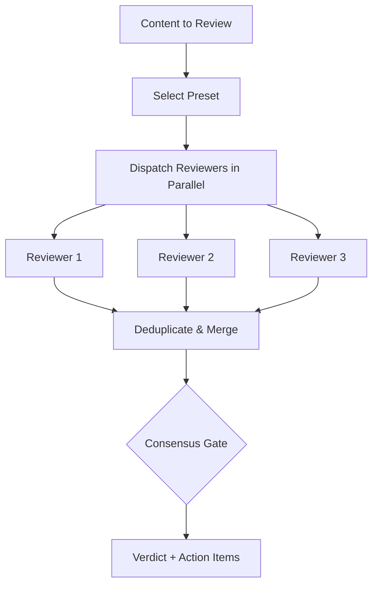

# Review

> Run parallel specialized reviewers, then merge findings through a consensus gate.

## Quick Example

```
Review this README for quality
```

**What happens:** Three reviewers (deep-reviewer, devil-advocate, tone-guardian) are dispatched in parallel with independent context. Each produces structured findings with severity levels. A consensus gate merges them into a single verdict.

## Real-World Example

**Input:**
```
/second-claude-code:review --preset content README.md
```

**Process:**
1. Deep-reviewer (opus) analyzes logic, structure, and completeness -- cites exact lines for each finding.
2. Devil-advocate (sonnet) attacks the 3 weakest points: grandiose claims, implied endorsements, unproven value proposition.
3. Tone-guardian (haiku) checks voice consistency and audience fit.
4. Findings are deduplicated and merged. Consensus gate applies: 1/3 approved, threshold not met.
5. Final verdict issued with prioritized action items.

**Output excerpt:**
> ## Verdict: MINOR FIXES
> **Consensus**: 1/3 (threshold 2/3 not met, no Critical findings)
>
> ### Major
> - **M1** Platform compatibility claims lack evidence (deep-reviewer) -- Section 7 claims OpenClaw, Codex, and Gemini compatibility without installation instructions or verification steps.
> - **M2** No output examples shown for a content production tool (deep-reviewer) -- A writing/analysis tool should demonstrate its output quality directly in the README.
> - **M3** "Knowledge Work OS" positioning overpromises scope (devil-advocate) -- At v0.2.0, calling the plugin an "OS" implies comprehensiveness and maturity it does not yet have.
> - **M4** Lineage section implies endorsements that do not exist (devil-advocate) -- Referencing other projects without explicit endorsement creates false credibility.

## Presets

| Preset | Reviewers | Threshold |
|--------|-----------|-----------|
| `content` | deep-reviewer + devil-advocate + tone-guardian | 2/3 |
| `strategy` | deep-reviewer + devil-advocate + fact-checker | 2/3 |
| `code` | deep-reviewer + fact-checker + structure-analyst | 2/3 |
| `quick` | devil-advocate + fact-checker | 2/2 |
| `full` | all 5 reviewers | 3/5 |

## Reviewers

| Reviewer | Model | Focus |
|----------|-------|-------|
| `deep-reviewer` | opus | Logic, structure, completeness |
| `devil-advocate` | sonnet | Weakest points and blind spots |
| `fact-checker` | sonnet | Claims, numbers, sources |
| `tone-guardian` | haiku | Voice and audience fit |
| `structure-analyst` | haiku | Organization and readability |

## Options

| Flag | Values | Default |
|------|--------|---------|
| `--preset` | `content\|strategy\|code\|quick\|full` | `content` |
| `--threshold` | number | `0.67` |
| `--strict` | flag | off |
| `--external` | flag | off |

### Consensus Gate Verdicts

| Verdict | Condition |
|---------|-----------|
| **APPROVED** | Threshold met, no Critical or Major findings |
| **MINOR FIXES** | Threshold met, no Critical findings, but Major/Minor issues remain |
| **NEEDS IMPROVEMENT** | Threshold NOT met, no Critical findings -- substantive rework needed |
| **MUST FIX** | Any Critical finding from any reviewer (overrides everything) |

### External Reviewers

When `--external` is set, the skill detects an installed external CLI and dispatches a parallel review. The external review counts as one additional voter. Detection order: `mmbridge` > `kimi` > `codex` > `gemini`. If no CLI is detected, the flag is silently ignored.

## How It Works



## Gotchas

- **Reviewer convergence** -- Reviewers are dispatched with independent context. Do not let them see each other's output.
- **Vague findings** -- Each finding must cite exact locations (sections, lines). "Could be better" is not actionable.
- **Unverified fact-checks** -- Fact-checker cannot claim verification without source URLs.
- **Strict mode surprises** -- With `--strict`, a threshold miss yields MUST FIX even when all findings are Minor.

## Troubleshooting

- **All reviewers agree on everything** -- Check that reviewers are dispatched with independent context (no shared state between them). If convergence persists, try the `full` preset for more diverse perspectives.
- **NEEDS IMPROVEMENT verdict unexpected** -- This means the consensus threshold was not met but no Critical findings were found. The reviewers disagree enough that substantive rework is needed. Check the per-reviewer scores and address the Major findings to reach the threshold.
- **`--external` flag had no effect** -- The flag is silently ignored if no supported external CLI is detected. The skill checks for `mmbridge`, `kimi`, `codex`, and `gemini` in that order. Install one of these CLIs to enable cross-model review.
- **`--threshold` range** -- The threshold is a fraction between 0 and 1 (e.g., `--threshold 0.5` means 50% of reviewers must approve). The default is `0.67` (2/3). With `--strict`, a threshold miss yields MUST FIX even when all findings are Minor.

## Works With

| Skill | Relationship |
|-------|-------------|
| write | Auto-called after drafting with `content` preset |
| analyze | Can validate analysis output |
| refine | Iterates on review findings until verdict improves |
| workflow | Chainable as a quality gate step |
