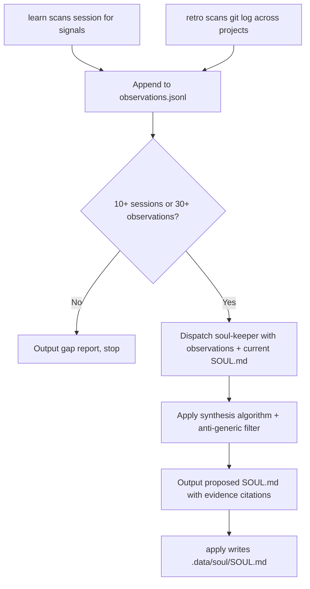

[English](soul.md) | **한국어**

# Soul

> 여러 세션에 걸친 사용자의 행동 패턴을 관찰하고, 근거 기반의 지속적인 정체성 프로필(SOUL.md)로 종합하는 스킬입니다.

## 빠른 예시

```
/scc:soul learn
```

**동작 방식:** analyst 서브에이전트가 현재 세션을 스캔해 행동 신호(정정, 스타일, 전문성, 의사결정, 감정 신호)를 추출합니다. `signal_type`이나 `raw_text`가 빠진 관찰은 거부되며, 유효한 항목만 `observations.jsonl`에 추가한 뒤 "Added N observations (total: M)" 형태로 결과를 보고합니다.

## 서브커맨드

| 서브커맨드 | 설명 |
|-----------|------|
| `init` | 템플릿을 기반으로 새 관찰 로그와 SOUL.md 스텁을 생성합니다. `.data/soul/`가 이미 있으면 경고 후 `--force`를 요구합니다. |
| `learn` | 현재 세션의 관찰을 기록해 관찰 로그에 추가합니다. |
| `show` | 근거 인용과 함께 현재 SOUL.md를 표시합니다. |
| `propose` | 전체 종합을 실행해 제안된 SOUL.md 초안을 출력합니다 -- 아직 저장하지는 않습니다. |
| `apply` | 사용자 검토 후 제안된 SOUL.md를 `.data/soul/SOUL.md`에 저장합니다. |
| `diff` | 현재 SOUL.md와 제안된 버전을 비교해 변경 사항을 강조합니다. |
| `reset` | 현재 SOUL.md를 보관하고 관찰 로그를 새로 시작합니다. |
| `retro` | git 히스토리 기반 작업 지표를 보여줍니다. |

## 실전 예시

**입력:**
```
/scc:soul propose
```
*상황: 12개 세션, 34개 관찰이 이미 쌓여 있으며 대부분 `hybrid` 모드에서 자동 기록되었습니다.*

**진행 과정:**
1. 임계값 확인 -- 세션 12개, 관찰 34개 모두 최소 기준(세션 10개 또는 관찰 30개)을 넘어 종합이 진행됩니다.
2. 작업 지표 반영 -- 과거 `retro` 실행에서 나온 최근 `shipping` 항목 4개를 Work Patterns, Shipping Cadence 차원의 정량적 근거로 포함합니다.
3. 디스패치 -- soul-keeper(Pikachu, opus)가 전체 관찰 로그, 작업 지표, 현재 SOUL.md(아직 없어 이번이 첫 종합)를 전달받습니다.
4. 종합 -- soul-keeper가 종합 알고리즘을 적용합니다. 모든 차원은 근거 인용 2개 이상이 필요하고, 모순되는 행동은 평균으로 뭉개지 않고 조건부 규칙으로 남깁니다.
5. 출력 -- 근거 인용이 포함된 제안된 SOUL.md가 반환됩니다. 이전 SOUL.md가 없어 이번에는 드리프트 검사가 실행되지 않습니다.
6. 아직 파일에는 저장되지 않습니다 -- 사용자가 제안 내용을 검토한 뒤 `apply`를 호출해야 반영됩니다.

**출력 예시:**
> **Decision Style**
>
> **특성**: 되돌리기 쉬운 저위험 변경은 빠르게 승인하지만, 퍼블릭 API나 스키마에 영향을 주는 변경에서는 속도를 늦추고 확인 질문을 던집니다.
>
> **근거**:
> - obs-20260615-03 -- 내부 헬퍼 리팩터링 -- "그냥 해줘"라며 첫 제안을 즉시 승인 -- 저위험 변경에는 검토가 느슨함.
> - obs-20260622-11 -- 데이터베이스 마이그레이션 제안 -- 승인 전 후속 질문 세 가지 -- 되돌릴 수 없는 변경에는 검토가 엄격함.
>
> **조건부 규칙**:
> - 저위험·되돌리기 쉬운 상황: 논의 없이 승인.
> - 스키마 또는 퍼블릭 API 관련 상황: 진행 전 확인 요구.
>
> **예측 가치**: 다음 스키마 변경에서도 즉시 "진행해"가 아니라 확인 질문이 먼저 나올 것으로 예상됩니다.

## 옵션

| 플래그 | 값 | 기본값 | 효과 |
|--------|-----|--------|------|
| `--mode` | `manual\|learning\|hybrid` | `hybrid` | `manual`은 사용자가 직접 호출할 때만 관찰, `learning`은 매 세션 자동 관찰, `hybrid`는 자동 관찰에 더해 새 관찰 10개마다 종합을 제안 |
| `--template` | `default\|developer\|writer\|researcher` | `default` | `init`의 시작 템플릿 |
| `--import` | 파일 경로 | 없음 | 외부 파일의 관찰을 로그로 가져오기 |
| `--period` | `week\|month\|quarter` | `week` | `retro` 지표의 기간 범위 |
| `--projects` | 콤마로 구분된 경로 | 자동 감지 | `retro`가 git을 스캔할 프로젝트 디렉터리 |

### 모드별 동작

- **manual** -- 사용자가 직접 `learn`을 호출할 때만 관찰이 기록됩니다. 자동 로깅은 없습니다.
- **learning** -- SessionStart 훅이 매 세션마다 자동으로 `learn`을 호출합니다. 종합은 여전히 명시적인 `propose` 호출이 필요합니다.
- **hybrid** -- `learning`과 동일하되, 새 관찰 10개마다 종합을 제안합니다.

## 작동 원리



이미 SOUL.md가 있다면 `propose`는 자동으로 `diff`를 실행해 비교합니다. 어떤 차원이든 30%를 초과해 변화하면 "SIGNIFICANT DRIFT DETECTED"로 표시되며, 사용자의 명시적 확인 없이는 절대 자동 반영되지 않습니다.

## 관찰 카테고리

`observations.jsonl`에 기록되는 모든 관찰은 6가지 `signal_type` 중 하나에 속합니다.

| Signal Type | 트리거 조건 |
|------------|-----------|
| `correction` | 사용자가 반박, 정정, 방향 전환을 할 때 -- 확고한 선호를 드러내는 가장 강한 신호 |
| `style` | 사용자가 글을 쓰고 요청을 구조화하며 소통하는 방식 |
| `expertise` | 사용자가 지식을 드러내거나 전문 용어를 정확히 쓰거나 지식 공백을 드러낼 때 |
| `decision` | 사용자가 트레이드오프를 결정하고 옵션을 승인·거부하며 판단 기준을 드러낼 때 |
| `emotional` | 몰입, 열의, 답답함 등 에너지 신호 -- 가장 휘발성이 강해 최근 데이터에 가중치를 둠 |
| `shipping` | `retro`가 수집하는 정량적 git 지표 -- 대화 분석이 아님 |

## SOUL.md 구조

`default` 템플릿(그 외 `developer`, `writer`, `researcher` 선택 가능)은 다음 차원으로 종합됩니다.

| 섹션 | 내용 |
|------|------|
| Identity | 일반론을 걸러낸 한 문장짜리 핵심 특성 |
| Communication Preferences | 패턴, 근거, 조건부 규칙, 예측 가치 |
| Expertise | 신뢰도(높음/중간/신규)가 표시된 주요 도메인, 알려진 공백, 도메인 간 연결 |
| Decision Style | 상황·위험도별 조건부 규칙을 포함한 트레이드오프 판단 방식 |
| Work Patterns | 스코프 처리 방식, 모호함에 대한 대응 |
| Shipping Cadence | `retro` 데이터 기반 커밋 리듬, 커밋 규모 성향, 집중 패턴, 작업 시간대 |
| Tone Rules | 트리거와 근거를 포함한 활성 톤 규칙 표 |
| Anti-Patterns | 맥락과 근거를 포함한 거부된 행동 표 |
| Observation Log Stats | 총 관찰 수, 커버된 세션, 기간 범위, 차원별 근거 강도 |

## 저장 위치

| 파일 | 설명 |
|------|------|
| `.data/soul/SOUL.md` | 종합된 소울 문서 |
| `.data/soul/observations.jsonl` | 추가 전용 관찰 로그 (한 줄에 JSON 객체 하나) |
| `.data/soul/meta.json` | 초기화 시각, 템플릿, 마지막 종합 날짜, 관찰 수 |
| `.data/soul/archive/` | `reset` 호출로 보관된 이전 소울 버전 |

## 주의사항

- 가장 흔한 실패는 어떤 지식노동자에게나 해당될 법한 일반적인 차원을 만드는 것입니다. soul-keeper는 출력 전에 일반화 필터를 거치며, LinkedIn 자기소개처럼 읽히는 차원은 거부됩니다.
- 관찰 로그는 시간이 지날수록 커집니다. soul-keeper에게는 최근 5개 세션만 원문 그대로 전달되고, 그 이전 세션은 세션당 한 단락으로 요약되며 요약 구간의 관찰 데이터는 세션당 500토큰을 넘지 않아야 합니다.
- 채팅에서는 직설적이고 리포트에서는 장황한 사용자는 모순이 아닙니다. 이런 경우는 평균으로 뭉개지 않고 "X 상황에서는 Y" 형태의 조건부 규칙으로 남깁니다.
- SOUL.md는 사용자가 업무 맥락으로 명시적으로 제공하지 않는 한 의료 정보, 재정 상태, 관계 상태, 정치·종교 성향을 절대 기록하지 않습니다. 민감한 신호가 관찰되면 내용 없이 "민감 신호 생략됨"으로만 기록합니다.
- 어떤 차원이든 30%를 초과하는 변화는 자동 반영되지 않습니다. `propose`가 "SIGNIFICANT DRIFT DETECTED"로 표시하며 사용자의 명시적 확인을 요구합니다.

## 연동 스킬

| 스킬 | 관계 |
|------|------|
| `write` | `.data/soul/SOUL.md`의 `## Tone Rules`를 읽어 선택된 보이스 가이드와 병합합니다. 소울 규칙이 포맷 기본값보다 우선하지만, 명시적으로 지정한 `--voice` 플래그는 넘어서지 않습니다. |
| `translate` | `write`와 동일한 톤 규칙 해석을 따릅니다 -- 소울 규칙은 선택된 스타일 위에 놓이는 비협상 제약이지만, 명시적으로 지정한 `--style` 플래그는 넘어서지 않습니다. |
| `review` | SOUL.md가 존재하면 `tone-guardian` 리뷰어가 그 안의 `## Tone Rules`와 `## Anti-Patterns`를 핵심 보이스 기준으로 포함합니다. |
