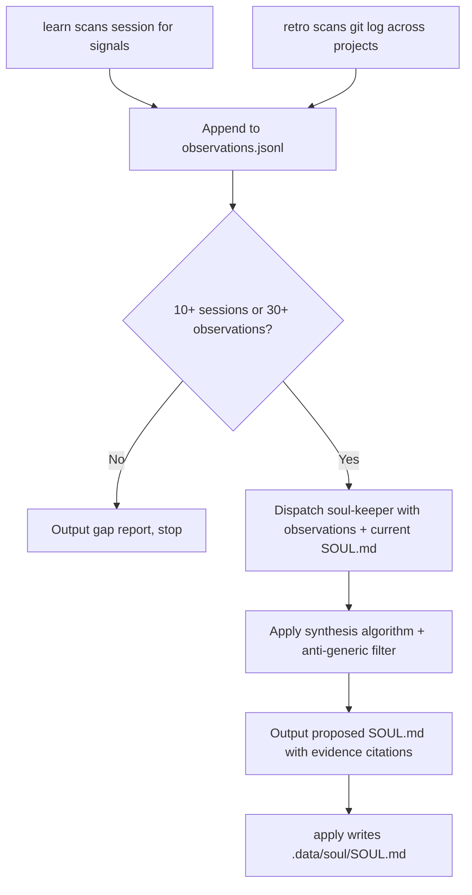

# Soul

> Use when observing user behavioral patterns across sessions and synthesizing a persistent, evidence-backed identity profile (SOUL.md).

## Quick Example

```
/second-claude-code:soul learn
```

**What happens:** The skill dispatches the analyst subagent to scan the current session for behavioral signals (corrections, style, expertise, decisions, emotional markers), rejects any observation missing a `signal_type` or `raw_text`, appends the valid ones to `observations.jsonl`, and reports "Added N observations (total: M)".

## Subcommands

| Subcommand | Description |
|------------|-------------|
| `init` | Bootstrap a fresh observation log and SOUL.md stub from a template. Warns and requires `--force` if `.data/soul/` already exists. |
| `learn` | Record new observations from the current session into the observation log |
| `show` | Display current SOUL.md with evidence citations |
| `propose` | Run full synthesis and output a proposed SOUL.md diff -- does not write yet |
| `apply` | Write the proposed SOUL.md to `.data/soul/SOUL.md` after user review |
| `diff` | Compare current SOUL.md against a proposed version, highlighting changes |
| `reset` | Archive current SOUL.md and start a fresh observation log |
| `retro` | Show shipping metrics from git history across projects |

## Real-World Example

**Input:**
```
/second-claude-code:soul propose
```
*Context: 12 sessions and 34 observations already logged, most recorded automatically under `hybrid` mode.*

**Process:**
1. Threshold check -- 12 sessions and 34 observations both clear the minimum (10 sessions OR 30 observations), so synthesis proceeds.
2. Shipping metrics -- the 4 most recent `shipping` entries from past `retro` runs are pulled in as quantitative evidence for the Work Patterns and Shipping Cadence dimensions.
3. Dispatch -- soul-keeper (Pikachu, opus) receives the full observation log, the shipping metrics, and the current SOUL.md (none exists yet, so this is a first synthesis).
4. Synthesis -- soul-keeper applies the synthesis algorithm: every dimension needs 2+ evidence citations, and contradictions are written as conditional rules rather than averaged into one trait.
5. Output -- a proposed SOUL.md comes back with evidence citations inline. There's no prior SOUL.md to diff against yet, so no drift check runs this time.
6. Nothing is written to disk -- the user reviews the proposal and calls `apply` to persist it.

**Output excerpt:**
> **Decision Style**
>
> **Characterization**: Approves fast on reversible, low-stakes changes; slows down and asks clarifying questions when a change touches a public API or schema.
>
> **Evidence**:
> - obs-20260615-03 -- refactor of an internal helper -- approved the first proposed approach with "just do it" -- low scrutiny on low-stakes changes.
> - obs-20260622-11 -- proposed database migration -- asked three follow-up questions before approving -- high scrutiny on irreversible changes.
>
> **Conditional rules**:
> - In low-stakes / reversible contexts: approves without discussion.
> - In schema or public-API contexts: requests confirmation before proceeding.
>
> **Predictive value**: Expect clarifying questions before approval on the next schema change, not an immediate "go ahead."

## Options

| Flag | Values | Default | Effect |
|------|--------|---------|--------|
| `--mode` | `manual\|learning\|hybrid` | `hybrid` | `manual` = only user-triggered observation; `learning` = auto-observe every session; `hybrid` = auto-observe + prompts for synthesis after every 10th new observation |
| `--template` | `default\|developer\|writer\|researcher` | `default` | Starter template for `init` |
| `--import` | file path | none | Import observations from an external file into the log |
| `--period` | `week\|month\|quarter` | `week` | Time range for `retro` metrics |
| `--projects` | comma-separated paths | auto-detect | Project directories for `retro` git scanning |

### Mode Behavior

- **manual** -- Observations are only recorded when the user explicitly calls `learn`. No automatic logging.
- **learning** -- The SessionStart hook adds a `learn` call to every session automatically. Synthesis still requires an explicit `propose`.
- **hybrid** -- Same as `learning`, plus a synthesis prompt after every 10th new observation.

## How It Works



If a current SOUL.md already exists, `propose` automatically runs `diff` against it. Any dimension shifting more than 30% is flagged "SIGNIFICANT DRIFT DETECTED" and requires explicit user acknowledgment -- large shifts are never auto-applied.

## Observation Categories

Each observation logged to `observations.jsonl` carries one of six `signal_type` values:

| Signal Type | Triggered By |
|------------|--------------|
| `correction` | User pushes back, corrects, or redirects -- the highest-signal category, reveals firm preferences |
| `style` | How the user writes, structures requests, and communicates |
| `expertise` | User demonstrates knowledge, uses jargon accurately, or reveals a gap |
| `decision` | User makes trade-offs, approves/rejects options, reveals decision criteria |
| `emotional` | Energy, engagement, frustration, or enthusiasm markers -- the most perishable signals, weighted by recency |
| `shipping` | Quantitative git metrics collected by `retro`, not conversational analysis |

## SOUL.md Structure

The `default` template (other options: `developer`, `writer`, `researcher`) synthesizes into these dimensions:

| Section | Content |
|---------|---------|
| Identity | One-sentence core characterization, filtered for genericness |
| Communication Preferences | Pattern, evidence, conditional rules, predictive value |
| Expertise | Primary domains with confidence level, known gaps, cross-domain patterns |
| Decision Style | How the user trades off options, conditional rules by stakes/context |
| Work Patterns | Scope handling, ambiguity response |
| Shipping Cadence | Cadence type, commit profile, focus pattern, work rhythm -- from `retro` data |
| Tone Rules | Table of active tone rules with trigger and evidence source |
| Anti-Patterns | Table of rejected behaviors with context and evidence |
| Observation Log Stats | Total observations, sessions covered, date range, per-dimension evidence strength |

## Storage

| File | Description |
|------|------|
| `.data/soul/SOUL.md` | The synthesized soul document |
| `.data/soul/observations.jsonl` | Append-only observation log (one JSON object per line) |
| `.data/soul/meta.json` | Init timestamp, template, last synthesis date, observation count |
| `.data/soul/archive/` | Archived soul versions from `reset` calls |

## Gotchas

- **Generic Soul Trap** -- The most common failure: dimensions that could describe any knowledge worker. soul-keeper runs an anti-generic filter before output; a dimension that reads like a LinkedIn bio is rejected.
- **Token Budget** -- Observation logs grow large. Only the last 5 sessions are passed to soul-keeper verbatim; older sessions are summarized to one paragraph each, capped at 500 tokens of observation data per session in the summary window.
- **Contradiction Handling** -- A user who is direct in chat but verbose in reports is not contradictory. Contradictions become conditional rules ("in X context, Y behavior"), never averaged into one flattened trait.
- **Privacy** -- SOUL.md never records medical data, financial details, relationship status, or political/religious beliefs unless the user explicitly provides them as work-relevant context. A sensitive signal is logged as "sensitive signal omitted" with no content.
- **Drift Approval** -- A >30% shift in any dimension is never auto-applied. `propose` surfaces it as "SIGNIFICANT DRIFT DETECTED" and requires explicit user acknowledgment.

## Troubleshooting

- **`propose` outputs a gap report instead of a profile** -- Below the minimum threshold of 10 sessions OR 30 observations. Keep running `learn` (or let `hybrid`/`learning` mode auto-observe) until the threshold is met.
- **A dimension reads like a generic bio** -- Rejected by the anti-generic filter for lacking 2+ evidence citations. Accumulate more specific sessions and re-run `propose`.
- **"SIGNIFICANT DRIFT DETECTED" appears in `propose` or `diff` output** -- A dimension shifted more than 30% from the current SOUL.md. Review the diff and acknowledge explicitly before `apply` -- large shifts are never auto-applied.
- **`apply` has nothing to write** -- `apply` requires `propose` to have already run in the same session; it will not persist a SOUL.md that wasn't just proposed and reviewed.
- **`init` warns that `.data/soul/` already exists** -- Pass `--force` to proceed, or use `reset` instead if the intent is to archive the current soul and start fresh.

## Works With

| Skill | Relationship |
|-------|-------------|
| `write` | Reads `## Tone Rules` from `.data/soul/SOUL.md` and merges them with the selected voice guide -- soul rules override format defaults but never an explicit `--voice` flag |
| `translate` | Same tone-rule resolution as `write` -- soul rules are non-negotiable constraints on top of the selected style, but never override an explicit `--style` flag |
| `review` | The `tone-guardian` reviewer includes `## Tone Rules` and `## Anti-Patterns` from SOUL.md as primary voice criteria when it exists |
