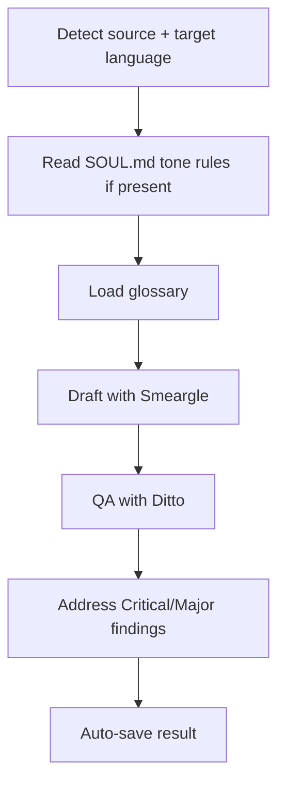

[English](translate.md) | **한국어**

# Translate

> 형식과 문체, 기술 용어의 정확도를 유지하며 영어와 한국어 콘텐츠를 서로 번역하는 스킬입니다.

## 빠른 예시

```
/scc:translate --input docs/skills/collect.md --target ko
```

**동작 방식:** 원문이 영어임을 감지합니다(목표 언어는 `--target ko`로 이미 지정됨). 문체는 `natural`, 형식은 `preserve`가 기본값으로 적용되며, `references/glossary.md` 용어집을 불러온 뒤 Smeargle이 한국어 초안을 작성합니다. 이어서 Ditto가 정확성과 서식을 검수하고, 마지막으로 결과물을 자동 저장합니다.

## 실전 예시

**입력:**
```
Translate this into Korean, natural style, preserve the formatting:

## Quick Start

Install the plugin, then run its first skill. The agent auto-detects
your project type and loads the right hook chain before each checkpoint.
```

**진행 과정:**
1. 언어 감지 -- 원문을 영어로 판단합니다. 요청에 목표 언어("한국어로")가 이미 나와 있어 따로 물어볼 필요가 없습니다. 문체와 형식은 각각 `--style natural`, `--format preserve`에 대응합니다.
2. 소울 확인 -- `.data/soul/SOUL.md`가 있고, `## Tone Rules` 항목은 문장을 짧고 단정하게 쓰며 존대 표현을 중복하지 말라고 규정합니다. 이 규칙이 `natural` 문체 위에 추가 제약으로 더해집니다.
3. 용어집 로드 -- `references/glossary.md`에서 plugin → 플러그인, agent → 에이전트, hook → 훅, checkpoint → 체크포인트 매핑을 확인합니다. 이렇게 정의된 용어는 다른 표현으로 바꾸지 않고 그대로 씁니다.
4. 초안 작성 -- Smeargle(라이터, opus)가 한국어 초안을 만듭니다. natural 모드에 맞춰 문장을 재구성하고 소울 규칙과 용어집 네 개 용어를 반영하며, `##` 제목은 제목 그대로 유지합니다.
5. 검수 -- Ditto(에디터, opus)가 정확성을 확인하고, 제목과 문단 구조가 그대로 남아 있는지(`--format preserve`) 점검합니다. "hook chain"이 한 곳에서 용어집 대신 다른 표현으로 옮겨진 Major 소견 1건이 나왔습니다.
6. 수정 -- 저장 전에 해당 Major 소견을 반영합니다. Minor 소견은 없었습니다.
7. 자동 저장 -- `.captures/translate-en-to-ko-quick-start-2026-07-12.md`에 저장합니다.

**출력 예시:**
> ## 빠른 시작
>
> 플러그인을 설치하고 첫 스킬을 실행하세요. 에이전트가 프로젝트 유형을 자동으로 감지해 각 체크포인트 전에 알맞은 훅 체인을 불러옵니다.

## 옵션

| 플래그 | 값 | 기본값 |
|--------|-----|--------|
| `--style` | `literal\|natural\|creative` | `natural` |
| `--format` | `preserve\|adapt` | `preserve` |
| `--source` | `en\|ko` | 자동 감지 |
| `--target` | `en\|ko` | 원문 언어의 반대 |
| `--glossary` | 파일 경로 | `references/glossary.md` |
| `--skip-qa` | flag | off |
| `--input` | 파일 경로 | 없음 |

## 작동 원리



## 스타일 모드

| 스타일 | 동작 |
|--------|------|
| `literal` | 원문에 가장 가깝게 1:1로 옮깁니다. 문법적으로 무리가 없다면 문장 구조와 어순도 그대로 유지합니다. 법률 문서, 계약서, 명세서에 적합합니다. |
| `natural` | 목표 언어로 처음부터 쓴 것처럼 읽히는 유창한 번역입니다. 자연스러운 흐름을 위해 문장을 재구성합니다. 대부분의 콘텐츠에 기본으로 적용됩니다. |
| `creative` | 대상 독자에 맞춰 의미와 관용구, 문화적 맥락을 재해석합니다. 문단 구조를 바꾸기도 합니다. 마케팅 카피, 뉴스레터, 소셜 콘텐츠에 적합합니다. |

## 포맷 모드

| 모드 | 동작 |
|------|------|
| `preserve` | 제목, 목록 순서, 표 레이아웃, 코드 블록 위치 등 원문 구조를 그대로 유지합니다. 자연어 내용만 번역합니다. |
| `adapt` | 대상 문화에 맞춰 문서 구조를 현지화합니다. 한국어→영어는 중첩된 존대 구조를 단순화할 수 있고, 영어→한국어는 맥락을 보완하는 소제목을 추가할 수 있습니다. 문화적으로 자연스럽다면 섹션 순서도 바꿉니다. |

## 서식 보존 규칙

다음 요소는 어떤 모드에서든 그대로 유지됩니다.

- 마크다운 제목 위계(`#`, `##`, `###`)
- 코드 블록 -- ``` 안의 내용은 절대 번역하지 않고, 주변 주석은 `creative` 모드에서만 번역합니다
- 인라인 코드 -- 백틱 안의 내용은 번역하지 않습니다
- 표 -- 열 개수와 정렬을 유지하고, 셀 안의 내용만 번역합니다
- 링크 -- URL은 그대로 두고 링크 텍스트만 번역합니다
- HTML 태그 -- 태그는 유지하고 안쪽 텍스트만 번역합니다
- YAML 프론트매터 -- 키는 그대로 두고, 사람이 읽는 문자열 값만 번역합니다
- 목록 -- 중첩 깊이와 번호 매기기 방식을 유지합니다
- 강조 표시 -- `**굵게**`, `*기울임*`, `~~취소선~~` 기호는 번역된 텍스트를 감싼 채 그대로 남습니다

## 소울 기반 보이스

문체는 다음 우선순위로 정해집니다.
1. 명시적인 `--style` 플래그 -- 항상 최우선
2. `.data/soul/SOUL.md`의 `## Tone Rules`(존재할 경우) -- 선택된 스타일 위에 반드시 지켜야 할 제약으로 더해집니다
3. 대상 언어의 관습을 기본값으로 사용 (영어→한국어는 기본이 해요체)

소울 톤 규칙은 언어 기본값보다 우선하지만, 명시적인 `--style` 플래그를 넘어서지는 못합니다.

## 언어별 규칙

### 영어 → 한국어
- 기본 존대 수준은 해요체입니다. 소울 톤 규칙이 다른 수준을 지정할 때만 바뀝니다.
- 한국어로 정착된 표현이 없는 기술 용어는 영어 그대로 둡니다(예: "CI/CD").
- 숫자와 단위는 아라비아 숫자를 유지하며, `--format adapt`일 때만 단위를 변환합니다.

### 한국어 → 영어
- `--style literal`이 아니면 존대 표현은 걷어냅니다.
- `creative` 모드에서는 한국 고유의 문화적 표현을 영어권에 맞는 대응 표현으로 바꿉니다.
- 한국 고유명사는 널리 쓰이는 영어식 이름이 없으면 로마자 표기법(Revised Romanization)을 따릅니다.

## 주의사항

- **기본값을 직역으로 착각하지 않기** -- 기본 문체는 단어 대 단어 번역이 아니라 `natural`(자연스럽게 다듬은 의역)입니다. 대상 언어에 딱 맞는 관용구가 없어도 `natural`이나 `creative` 모드에서는 가장 가까운 표현으로 바꿉니다. 원문 그대로 남기는 건 `--style literal`일 때뿐입니다.
- **코드 블록과 인라인 코드** -- ``` 안이나 백틱 안의 내용은 절대 번역하지 않습니다. 번역 대상은 주변 문장뿐이고, `creative` 모드에서만 인접한 주석까지 포함됩니다.
- **존댓말과 반말 혼용** -- 하나의 번역 안에서 존댓말과 반말을 섞으면 안 됩니다. 시작할 때 존대 수준(기본 해요체)을 정하고 검수 단계까지 일관되게 유지합니다.
- **용어집 무시** -- `references/glossary.md`(또는 `--glossary`로 지정한 파일)에 매핑이 있으면 매번 그대로 따라야 합니다. Ditto의 검수 단계에서 용어집 항목을 모두 다시 확인합니다.
- **`preserve` 모드에서 구조 변경** -- 제목, 목록 중첩, 표의 열은 그대로 두고 그 안의 자연어 텍스트만 바꿉니다.
- **목표 언어 추측** -- 요청만으로 원문이나 목표 언어가 분명하지 않으면 스킬이 먼저 물어봅니다. 영어→한국어라고 임의로 가정하지 않습니다.
- **고유명사 번역** -- 용어집에 매핑이 없으면 고유명사는 원문 그대로 둡니다. 한국 고유명사를 영어로 옮길 때만 로마자 표기법을 적용합니다.

## 문제 해결

- **스킬이 목표 언어를 되묻는 경우** -- 요청만으로 원문과 목표 언어를 구분할 수 없었기 때문입니다. 바로 답해 주거나, 다음부터는 `--source`나 `--target`을 미리 지정해 되묻는 과정을 건너뛸 수 있습니다.
- **번역 결과가 평소 말투와 다른 경우** -- 소울 톤 규칙은 `.data/soul/SOUL.md`에 `## Tone Rules` 항목이 있을 때만 적용됩니다. 없으면 대상 언어의 관습대로 기본값이 적용됩니다. `soul` 스킬을 먼저 실행하거나 `--style`을 직접 지정하세요.
- **기술 용어가 문서마다 다르게 번역되는 경우** -- `references/glossary.md`에 해당 용어가 매핑되어 있는지 확인합니다. 프로젝트에서 다른 용어를 쓴다면 `--glossary`로 별도 파일을 지정하거나, 번역 전에 기본 용어집에 누락된 용어를 추가합니다.
- **검수 단계가 느리게 느껴지는 경우** -- `--skip-qa`는 Ditto의 정확성·서식·용어집 검수를 건너뜁니다. 위 세 가지를 확인할 유일한 장치가 사라지므로, 부담이 적거나 버려도 되는 결과물에만 쓰세요.

## 연동 스킬

| 스킬 | 관계 |
|------|------|
| `soul` | 번역 전에 참고하는 `## Tone Rules`를 제공합니다 |
| `write` | 번역이 필요한 원본 초안을 작성합니다 |
| `collect` | 자동 저장된 번역 결과를 지식 베이스에 보관할 수 있습니다 |
| `workflow` | 이중 언어 출력 파이프라인의 한 단계로 연결할 수 있습니다 |
