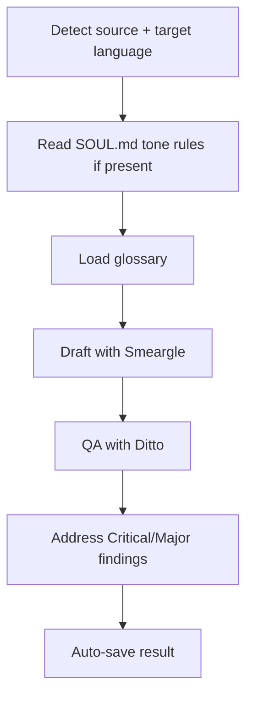

# Translate

> Use when translating content between English and Korean while preserving formatting, voice, and technical accuracy.

## Quick Example

```
/scc:translate --input docs/skills/collect.md --target ko
```

**What happens:** The skill detects English as the source (Korean target set explicitly), defaults to `natural` style and `preserve` format, loads `references/glossary.md` for terminology, dispatches Smeargle to draft the Korean version, dispatches Ditto to QA it for accuracy and formatting, then auto-saves the result.

## Real-World Example

**Input:**
```
Translate this into Korean, natural style, preserve the formatting:

## Quick Start

Install the plugin, then run its first skill. The agent auto-detects
your project type and loads the right hook chain before each checkpoint.
```

**Process:**
1. Language detection -- source identified as English; the request names the target ("into Korean"), so no clarifying question is needed. Style and format map to `--style natural --format preserve`.
2. Soul check -- `.data/soul/SOUL.md` exists and its `## Tone Rules` section calls for short, declarative sentences and minimal nested honorifics. This constrains the `natural`-style draft on top of the language default.
3. Glossary load -- `references/glossary.md` maps "plugin" → 플러그인, "agent" → 에이전트, "hook" → 훅, "checkpoint" → 체크포인트. Mapped terms are used verbatim rather than any alternate phrasing.
4. Draft -- Smeargle (writer, opus) produces the Korean draft: natural-mode restructuring, the soul tone constraint, and the four glossary terms applied, with the `##` heading kept as a heading.
5. QA -- Ditto (editor, opus) checks accuracy and confirms the heading and paragraph shape survived (`--format preserve`). One Major finding: "hook chain" was rendered with a synonym instead of the glossary term 훅 in one clause.
6. Fix -- the Major finding is corrected before saving; no Minor findings remained.
7. Auto-save -- written to `.captures/translate-en-to-ko-quick-start-2026-07-12.md`.

**Output excerpt:**
> ## 빠른 시작
>
> 플러그인을 설치하고 첫 스킬을 실행하세요. 에이전트가 프로젝트 유형을 자동으로 감지해 각 체크포인트 전에 알맞은 훅 체인을 불러옵니다.

## Options

| Flag | Values | Default |
|------|--------|---------|
| `--style` | `literal\|natural\|creative` | `natural` |
| `--format` | `preserve\|adapt` | `preserve` |
| `--source` | `en\|ko` | auto-detect |
| `--target` | `en\|ko` | opposite of source |
| `--glossary` | file path | `references/glossary.md` |
| `--skip-qa` | flag | off |
| `--input` | file path | none |

## How It Works



## Style Modes

| Style | Behavior |
|-------|----------|
| `literal` | Closest possible 1:1 translation. Preserves sentence structure and word order where grammatically valid. Suitable for legal, contractual, or specification documents. |
| `natural` | Fluent, idiomatic translation that reads as if originally written in the target language. Restructures sentences for natural flow. Default for most content. |
| `creative` | Adapts meaning, idioms, and cultural references for the target audience. May restructure paragraphs. Suitable for marketing copy, newsletters, and social content. |

## Format Modes

| Mode | Behavior |
|------|----------|
| `preserve` | Keep the original document structure intact: headings, bullet order, table layout, code block positions. Translate only the natural-language content. |
| `adapt` | Localize the document structure for the target culture. Korean→English may flatten nested honorific structures. English→Korean may add contextual headers. Reorder sections if culturally appropriate. |

## Formatting Preservation

These elements are preserved exactly in every mode:

- Markdown heading hierarchy (`#`, `##`, `###`)
- Code blocks -- content inside ``` fences is never translated; surrounding comments are translated only in `creative` mode
- Inline code -- content inside backticks is never translated
- Tables -- column count and alignment preserved; only cell content is translated
- Links -- URLs preserved; only link text is translated
- HTML tags -- tags preserved; only inner text is translated
- YAML frontmatter -- keys preserved; only human-readable string values are translated
- Bullet/numbered lists -- nesting depth and numbering scheme preserved
- Emphasis markers -- `**bold**`, `*italic*`, `~~strikethrough~~` stay wrapped around the translated text

## Soul-Aware Voice

Voice is resolved in priority order:
1. An explicit `--style` flag -- always wins
2. `## Tone Rules` in `.data/soul/SOUL.md`, if it exists -- merges with the selected style as a non-negotiable constraint
3. Target-language conventions as the baseline (e.g. 해요체 by default for English→Korean)

Soul tone rules override language defaults but never override an explicit `--style` flag.

## Language-Specific Rules

### English → Korean
- Default speech level: 해요체. Overridden only by soul tone rules that specify a different level.
- Technical terms without an established Korean equivalent stay in English (e.g. "CI/CD").
- Numbers and units stay in Arabic numerals; units convert only under `--format adapt`.

### Korean → English
- Honorific markers drop unless `--style literal`.
- Korean-specific cultural references adapt to English equivalents in `creative` mode.
- Korean proper nouns use Revised Romanization unless a common English name exists.

## Gotchas

- **Assuming literal-by-default** -- The default style is `natural` (idiomatic, restructured for fluency), not word-for-word. Idioms without a direct target-language match still get adapted to an equivalent in `natural`/`creative` mode; only `--style literal` preserves them as-is.
- **Code blocks and inline code** -- Never translated inside ``` fences or backtick spans; only surrounding prose (and, in `creative` mode, adjacent comments) is translated.
- **Mixed speech levels** -- 존댓말 and 반말 must not mix within one translation. Lock the level at the start (default 해요체) and keep it consistent through QA.
- **Glossary drift** -- When `references/glossary.md` (or a custom `--glossary` file) has a mapping, it must be used every time; Ditto's QA pass cross-checks every glossary term.
- **Structure changes in `preserve` mode** -- Headings, list nesting, and table columns must stay identical; only the natural-language text inside them changes.
- **Guessing the target language** -- If source or target isn't clear from the prompt, the skill asks. It never assumes English→Korean by default.
- **Proper nouns** -- Left as-is unless a glossary entry maps them; Korean names romanize via Revised Romanization only when translating to English.

## Troubleshooting

- **Skill asks which language is the target** -- The prompt didn't make source/target clear. Answer directly, or avoid the question next time with `--source` and/or `--target`.
- **Translation doesn't match my usual voice** -- Soul tone rules only apply if `.data/soul/SOUL.md` exists with a `## Tone Rules` section; without it, voice falls back to target-language conventions. Run the `soul` skill first, or set `--style` explicitly.
- **A technical term is translated inconsistently** -- Check whether it's mapped in `references/glossary.md`. If the project uses different terminology, point `--glossary` at a custom file, or add the missing term to the default glossary before translating.
- **QA felt too slow for a quick draft** -- `--skip-qa` skips Ditto's accuracy, formatting, and glossary review. Use it only for low-stakes or throwaway output -- it removes the only check on the four points above.

## Works With

| Skill | Relationship |
|-------|-------------|
| `soul` | Supplies `## Tone Rules` that translate reads before drafting |
| `write` | Drafts content that may need a bilingual counterpart |
| `collect` | Can archive the auto-saved translation into the knowledge base |
| `workflow` | Chainable as a step in a bilingual-output pipeline |
