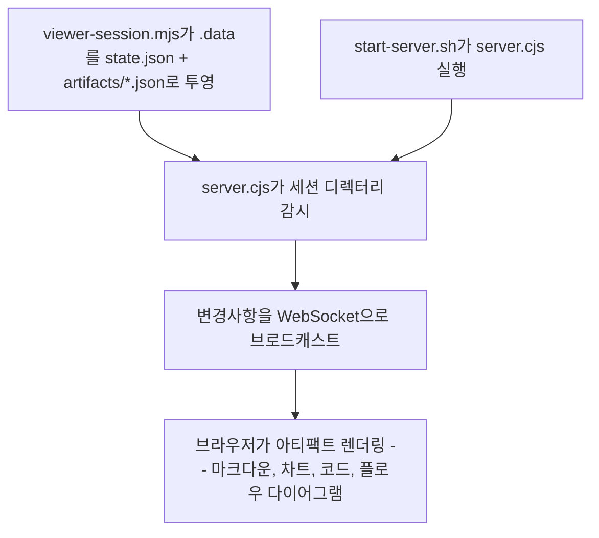
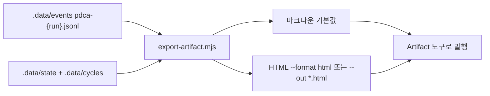

[English](viewer.md) | **한국어**

# Viewer

> 도구 전용 명령: PDCA 아티팩트를 로컬 웹 UI로 열거나, 같은 런을 공유용 출처 페이지로 내보냅니다. 상태를 서빙하거나 투영할 뿐 품질 판단은 하지 않습니다.

라이브 뷰어는 로컬 WebSocket 서버입니다. Claude Code Artifact가 **아닙니다**. `localhost`를 발행하지 말고, 그 런타임을 내보내기에 넣지 마십시오. SCC는 호스트 루프를 소유하지 않으며 두 번째 런타임도 심지 않습니다.

## 빠른 예시

```
/scc:viewer
```

**동작 방식:** 먼저 `scripts/viewer-session.mjs`가 이번 런으로 세션 디렉터리를 만들고, 그다음 그 디렉터리를 대상으로 `ui/scripts/start-server.sh`를 실행합니다. 이 스크립트는 미리 빌드된 뷰어 UI(`ui/dist`)를 서빙하면서 `state.json`과 `artifacts/*.json`의 변경을 감시하고, 서버가 준비되면 로컬 URL이 담긴 JSON을 출력합니다. 이 URL을 브라우저에서 열면 마크다운, 차트, 코드, 플로우 다이어그램 등 각 아티팩트가 렌더링되고, 파이프라인이 새 아티팩트를 기록할 때마다 WebSocket을 통해 화면이 실시간으로 갱신됩니다.

## 실전 예시

**입력:**
```
AI 에이전트 시장 리포트 사이클이 방금 끝났어 -- 아티팩트 보여줘
```

**진행 과정:**
1. 세션 확인 -- `--session-dir`가 주어지지 않았으므로 현재 활성화된 PDCA 상태에서 세션 디렉터리를 찾습니다.
2. 서버 실행 -- `bash ui/scripts/start-server.sh --session-dir "<세션 경로>" --dist-dir "${CLAUDE_PLUGIN_ROOT}/ui/dist"`를 실행합니다.
3. 재사용 확인 -- `start-server.sh`가 `state/server.pid`를 확인합니다. 아직 실행 중인 서버가 없으므로 서버 스크립트를 백그라운드로 새로 띄웁니다.
4. 서빙 + 감시 -- 서버가 3847번 포트를 열어 `ui/dist`를 서빙하고, `state.json`과 `artifacts/` 아래 모든 파일을 읽은 뒤 두 대상 모두에 대한 변경 감시를 시작합니다.
5. 준비 신호 -- 포트 바인딩이 끝나면 `start-server.sh`가 최대 5초 정도 `state/server-info` 생성을 폴링한 뒤 이를 출력합니다.
6. 검증 -- 핵심 원칙(Iron Law)에 따라, URL을 사용자에게 전달하기 전에 실제로 응답하는지 먼저 확인합니다.
7. 렌더링 -- URL을 열면 WebSocket으로 연결되어, 해당 세션의 아티팩트(마크다운 브리프, 바 차트, 코드 샘플)가 렌더링되고 이후 파이프라인이 아티팩트를 추가할 때마다 화면이 실시간으로 갱신됩니다.

**출력 예시:**
```json
{
  "ok": true,
  "status": "running",
  "url": "http://localhost:3847",
  "pid": 52117,
  "port": 3847,
  "session_dir": "/Users/you/project/.scc/sessions/2026-07-12-ai-agent-report",
  "dist_dir": "/Users/you/project/ui/dist"
}
```
> `http://localhost:3847`을 열면 마크다운 리서치 브리프, 프레임워크 채택 현황을 보여주는 바 차트, 코드 샘플이 표시되며, 파이프라인이 아티팩트를 추가로 기록할 때마다 화면이 실시간으로 갱신됩니다. 이 URL은 로컬 전용입니다. Artifact가 아닙니다.

## 옵션

| 플래그 | 값 | 기본값 |
|--------|-----|--------|
| `--session-dir` | `.scc/sessions/{id}` 디렉터리 경로 | 현재 PDCA 세션 |
| `--port` | 포트 번호 | `3847` |
| `--export` | 서버를 띄우는 대신 공유용 페이지로 내보내기 | 꺼짐 |
| `--format` | `md` \| `html` | `md` |
| `--out` | 내보낸 파일 경로 | `pdca-export.md` (`*.html`이면 HTML) |

`--format html`과 `--out *.html`은 같은 선택입니다. 둘 다 없으면 마크다운이 기본입니다.

## 두 가지 표면

| 표면 | 무엇인가 | 무엇이 아닌가 |
|------|----------|----------------|
| 라이브 뷰어 | `viewer-session.mjs`가 투영한 세션 디렉터리 위의 로컬 WebSocket UI | Artifact가 아님. 30분 놀면 죽음. 공유 URL 없음 |
| 내보내기 | `scripts/export-artifact.mjs`가 쓰는 마크다운 또는 HTML 한 장. Artifact 도구로 발행 | 호스트 루프 재생이 아님. 두 번째 런타임이 아님 |

하니스 궤적 로그는 모델 컨텍스트를 다시 유도할 수 있습니다. SCC는 그렇게 하지 않습니다. 내보내기는 추가 전용 이벤트 로그에서 PDCA 게이트, 리뷰, 라우터 결정만 복원합니다. HTML 페이지는 그 로그의 **투영**입니다.

## 내보내기 형식

띄운 뷰어는 로컬이고 30분 놀면 죽습니다. 결과를 남에게 건네려면 내보내기를 씁니다. 두 형식 모두 `scripts/export-artifact.mjs`로 같은 이벤트 로그를 읽습니다. 파일을 쓴 뒤에는 마크다운이든 HTML이든 Artifact 도구로 발행하면 공유 URL이 나옵니다.

### 마크다운 (기본값)

mermaid를 그리는 호스트용 기본값입니다.

```bash
node "${CLAUDE_PLUGIN_ROOT}/scripts/export-artifact.mjs" --out pdca-export.md
```

마크다운 한 장을 쓰고 `{"out","artifacts","cycles","source"}`를 찍습니다. 차트와 플로우는 mermaid로 바뀌므로 번들도, 깨질 외부 자산도 없습니다.

### HTML (`--format html` 또는 `--out *.html`)

```bash
node "${CLAUDE_PLUGIN_ROOT}/scripts/export-artifact.mjs" --format html --out pdca-export.html
```

같은 로그에서 Claude Artifact 제약에 맞는 페이지 한 장을 씁니다.

- HTML 파일 하나, 그 안에 전부
- CSS와 JS는 인라인
- 이미지는 data URI 또는 SVG
- `fetch` 없음, WebSocket 없음
- Nivo/Shiki CDN 없음
- 16MB를 한참 밑돌 것

라이브 뷰어의 Nivo 차트, Shiki 하이라이터, WebSocket 감시는 이 파일로 따라오지 **않습니다**.

### 무엇을 읽는가

읽는 곳은 파이프라인이 실제로 쓰는 자리입니다 — `.data/state/pdca-last-completed.json`, `.data/events/pdca-{run_id}.jsonl` 이벤트 로그, `.data/cycles/` 마크다운. 루트가 다르면 `--data-dir`, 예전 런을 보려면 `--run <run_id>`를 넘깁니다. `--session-dir` 형태는 여전히 띄운 뷰어의 `state.json` + `artifacts/*.json` 배치를 읽습니다.

숫자의 출처 두 가지.

- 단계별 타임라인과 소요 시간은 **이벤트 로그**에서 복원합니다. 각 단계가 언제 시작하고 끝났는지를 런 단위로 남기는 유일한 기록입니다.
- 재진입 사유는 `state.action_router_history`에서 옵니다. 런이 Act를 떠날 때마다 `pdca_transition`이 씁니다. 이 필드가 생기기 전 런은 추론으로 떨어집니다 — 나중 사이클에 기록된 단계를 재진입으로 세지만 사유는 없습니다.

내보낸 페이지가 앞세우는 건 내용이 아니라 **감사 기록**입니다. 어떤 게이트를
통과했는지, 설정된 리뷰어 수와 소견, Act 재진입마다의 사유, 계획과 산출 사이의
어긋남을 보여줍니다. 리뷰어 수는 런의 event/state 데이터에서 읽으며 고정된
5명 주장이 아닙니다. 산출물은 그 아래에 붙습니다.

## 작동 원리



이 경로는 라이브 뷰어입니다. 내보내기는 서버를 띄우지 않습니다.



## 아티팩트 타입

모든 아티팩트 파일은 `id`, `type`, `phase`, `title`을 공통으로 가지며, 타입별로 다음 필드가 추가됩니다. 라이브 뷰어는 Nivo와 Shiki로 그립니다. 마크다운 내보내기는 mermaid 펜스를 씁니다. HTML 내보내기는 CSS/JS와 SVG 또는 data URI 이미지를 인라인으로 넣으며 Nivo/Shiki CDN은 쓰지 않습니다.

| 타입 | 라이브 뷰어 | 타입별 필드 |
|------|------------|------------|
| `markdown` | 마크다운 본문 | `content` |
| `chart` | Nivo 기반 차트 (`bar`, `line`, `pie`, `radar`) | `chartType`, `data.labels`, `data.datasets[].values` |
| `code` | Shiki 기반 신택스 하이라이팅 코드 | `language`, `code` |
| `flow` | SVG 노드/엣지 다이어그램 | `nodes[]` (`id`, `label`, `x`, `y`), `edges[]` (`from`, `to`) |

## 세션 디렉터리 구조

PDCA 세션마다 다음과 같은 자체 디렉터리를 가집니다.

```
.scc/sessions/{session-id}/
├── state.json           ← PDCA 상태 (phase, 현재 단계, 소요 시간)
├── artifacts/
│   ├── 001-research.json
│   ├── 002-draft.json
│   └── 003-analysis.json
└── state/
    ├── server-info      ← 포트, PID
    └── server.pid
```

## 선택 컴패니언

컴패니언 플러그인은 선택입니다. `/scc:coach`를 대체하지 않습니다. 결정 주인은 `.scc/standards`에 남습니다. SCC 의존성으로 넣지 마십시오.

| 플러그인 | 역할 |
|----------|------|
| `design-crit` | HTML 와이어프레임 Keep/Cut |
| `design-with-ai` | 코드 전에 방향 |
| `alexei-led/architect` | 읽기 전용 결합 검토 |

## 주의사항

- 서버가 실제로 응답하는지 확인하지 않고 라이브 뷰어 URL부터 공유하지 않습니다. 죽은 서버는 끊긴 링크만 남깁니다. 그 URL은 그래도 Artifact가 아닙니다.
- JSON 형식이 올바르다고 해서 화면도 맞게 나온다는 보장은 없습니다. 검증에서 멈추지 말고 뷰어를 열어 차트·플로우·마크다운이 실제로 어떻게 보이는지 확인합니다.
- 원본 JSON 스크린샷은 뷰어 화면의 대체재가 아닙니다. 뷰어는 아티팩트를 인터랙티브하게 렌더링하기 위해 존재합니다.
- `state.json`이 없거나 `artifacts/` 아래에 파일이 하나도 없는 세션 디렉터리로 서버를 띄우면 에러 없이 빈 화면만 뜹니다.
- 서버는 30분간 활동이 없으면 자동으로 종료됩니다. 오래 방치된 세션이라면 공유 전에 `state/server.pid`부터 확인합니다.
- 라이브 런타임을 내보내기에 넣지 않습니다. HTML 내보내기는 이벤트 로그의 정적 투영입니다. WebSocket 없음, `fetch` 없음, Nivo/Shiki CDN 없음, 두 번째 호스트 루프 없음.

## 문제 해결

- `--port`로 지정한 포트가 이미 사용 중이면 서버가 바인딩에 실패하고, `start-server.sh`는 `state/server.log`의 에러 내용을 담아 `{"ok":false,"status":"failed",...}`를 반환합니다. 다른 `--port` 값으로 다시 시도합니다.
- `start-server.sh`는 약 5초 정도 `state/server-info` 생성을 기다립니다. 그 안에 생성되지 않으면 `{"ok":false,"status":"timeout",...}`를 반환하니, 세션 디렉터리의 `state/server.log`에서 실제 에러를 확인합니다.
- URL을 열었는데 빈 화면만 보인다면 세션 디렉터리에 `state.json`이 없거나 `artifacts/` 아래 파일이 없는 경우입니다. PDCA는 이 레이아웃이 아니라 `.data/state`와 `.data/cycles/`에 기록하므로, `scripts/viewer-session.mjs`를 먼저 돌려야 합니다. 이걸 건너뛴 게 대부분의 원인입니다.
- 브라우저를 30분 이상 방치하면 서버가 자동 종료됩니다. 같은 세션 디렉터리로 `start-server.sh`를 다시 실행하면 서버가 살아있을 때는 그대로 재사용하고, 죽어있을 때는 새로 띄웁니다. 수동으로 끄려면 `bash ui/scripts/stop-server.sh --session-dir "<세션 경로>"`를 실행합니다.

## 연동 스킬

| 스킬 | 관계 |
|------|------|
| `pdca` | 뷰어가 렌더링하는 `state.json`과 `artifacts/*.json`을 기록합니다 |
| `write` | PDCA Do 단계에서 실행되며, 결과물을 세션 아티팩트로 저장하면 뷰어가 표시할 수 있습니다 |
| `analyze` | PDCA Plan 단계에서 실행되며, 차트와 분석 결과를 세션 아티팩트로 저장하면 뷰어가 표시할 수 있습니다 |
| `coach` | 갈림길을 `.scc/standards`에 정착시킵니다. 선택 디자인/아키텍처 컴패니언이 이를 대체하지 않습니다 |
