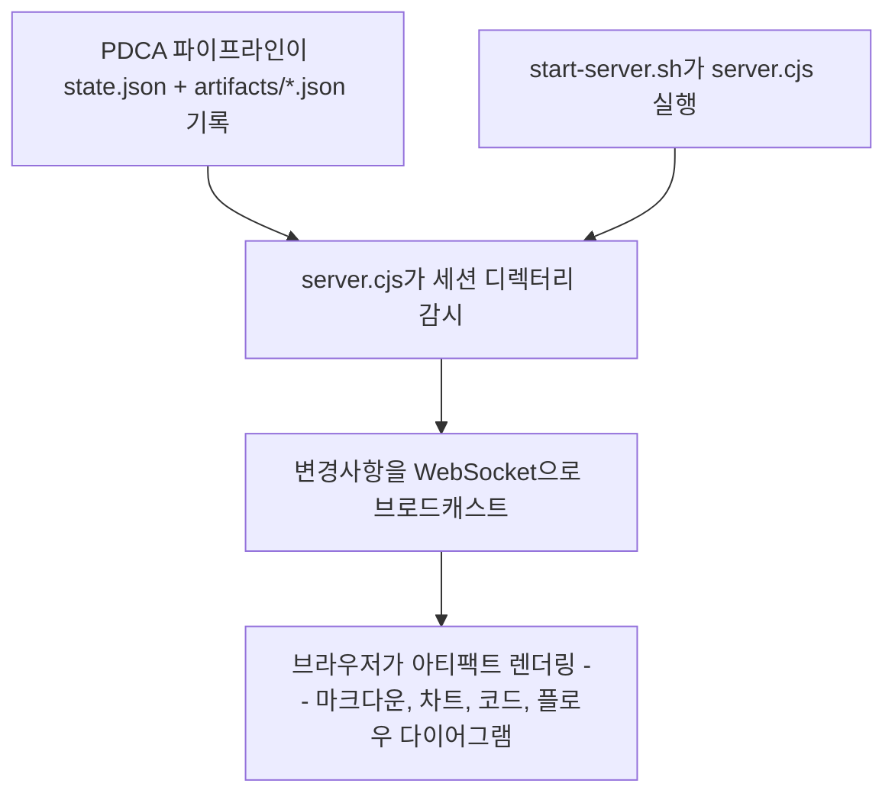

[English](viewer.md) | **한국어**

# Viewer

> PDCA 파이프라인 결과물을 로컬 웹 UI로 열어 아티팩트를 인터랙티브하게 보여주는 스킬입니다.

## 빠른 예시

```
/scc:viewer
```

**동작 방식:** 현재 PDCA 세션 디렉터리를 대상으로 `ui/scripts/start-server.sh`를 실행합니다. 이 스크립트는 미리 빌드된 뷰어 UI(`ui/dist`)를 서빙하면서 `state.json`과 `artifacts/*.json`의 변경을 감시하고, 서버가 준비되면 로컬 URL이 담긴 JSON을 출력합니다. 이 URL을 브라우저에서 열면 마크다운, 차트, 코드, 플로우 다이어그램 등 각 아티팩트가 렌더링되고, 파이프라인이 새 아티팩트를 기록할 때마다 WebSocket을 통해 화면이 실시간으로 갱신됩니다.

## 실전 예시

**입력:**
```
AI 에이전트 시장 리포트 사이클이 방금 끝났어 -- 아티팩트 보여줘
```

**진행 과정:**
1. 세션 확인 -- `--session-dir`가 주어지지 않았으므로 현재 활성화된 PDCA 상태에서 세션 디렉터리를 찾습니다.
2. 서버 실행 -- `bash ui/scripts/start-server.sh --session-dir "<세션 경로>" --dist-dir "${CLAUDE_PLUGIN_ROOT}/ui/dist"`를 실행합니다.
3. 재사용 확인 -- `start-server.sh`가 `state/server.pid`를 확인합니다. 아직 실행 중인 서버가 없으므로 서버 스크립트를 백그라운드로 새로 띄웁니다.
4. 서빙 + 감시 -- 서버가 3847번 포트를 열어 `ui/dist`를 서빙하고, `state.json`과 `artifacts/` 아래 모든 파일을 읽은 뒤 두 대상 모두에 대한 변경 감시를 시작합니다.
5. 준비 신호 -- 포트 바인딩이 끝나면 `start-server.sh`가 최대 5초 정도 `state/server-info` 생성을 폴링한 뒤 이를 출력합니다.
6. 검증 -- 핵심 원칙(Iron Law)에 따라, URL을 사용자에게 전달하기 전에 실제로 응답하는지 먼저 확인합니다.
7. 렌더링 -- URL을 열면 WebSocket으로 연결되어, 해당 세션의 아티팩트(마크다운 브리프, 바 차트, 코드 샘플)가 렌더링되고 이후 파이프라인이 아티팩트를 추가할 때마다 화면이 실시간으로 갱신됩니다.

**출력 예시:**
```json
{
  "ok": true,
  "status": "running",
  "url": "http://localhost:3847",
  "pid": 52117,
  "port": 3847,
  "session_dir": "/Users/you/project/.scc/sessions/2026-07-12-ai-agent-report",
  "dist_dir": "/Users/you/project/ui/dist"
}
```
> `http://localhost:3847`을 열면 마크다운 리서치 브리프, 프레임워크 채택 현황을 보여주는 바 차트, 코드 샘플이 표시되며, 파이프라인이 아티팩트를 추가로 기록할 때마다 화면이 실시간으로 갱신됩니다.

## 옵션

| 플래그 | 값 | 기본값 |
|--------|-----|--------|
| `--session-dir` | `.scc/sessions/{id}` 디렉터리 경로 | 현재 PDCA 세션 |
| `--port` | 포트 번호 | `3847` |

## 작동 원리



## 아티팩트 타입

모든 아티팩트 파일은 `id`, `type`, `phase`, `title`을 공통으로 가지며, 타입별로 다음 필드가 추가됩니다.

| 타입 | 렌더링 형태 | 타입별 필드 |
|------|------------|------------|
| `markdown` | 마크다운 본문 | `content` |
| `chart` | Nivo 기반 차트 (`bar`, `line`, `pie`, `radar`) | `chartType`, `data.labels`, `data.datasets[].values` |
| `code` | Shiki 기반 신택스 하이라이팅 코드 | `language`, `code` |
| `flow` | SVG 노드/엣지 다이어그램 | `nodes[]` (`id`, `label`, `x`, `y`), `edges[]` (`from`, `to`) |

## 세션 디렉터리 구조

PDCA 세션마다 다음과 같은 자체 디렉터리를 가집니다.

```
.scc/sessions/{session-id}/
├── state.json           ← PDCA 상태 (phase, 현재 단계, 소요 시간)
├── artifacts/
│   ├── 001-research.json
│   ├── 002-draft.json
│   └── 003-analysis.json
└── state/
    ├── server-info      ← 포트, PID
    └── server.pid
```

## 주의사항

- 서버가 실제로 응답하는지 확인하지 않고 URL부터 공유하지 않습니다. 죽은 서버는 끊긴 링크만 남깁니다.
- JSON 형식이 올바르다고 해서 화면도 맞게 나온다는 보장은 없습니다. 검증에서 멈추지 말고 뷰어를 열어 차트·플로우·마크다운이 실제로 어떻게 보이는지 확인합니다.
- 원본 JSON 스크린샷은 뷰어 화면의 대체재가 아닙니다. 뷰어는 아티팩트를 인터랙티브하게 렌더링하기 위해 존재합니다.
- `state.json`이 없거나 `artifacts/` 아래에 파일이 하나도 없는 세션 디렉터리로 서버를 띄우면 에러 없이 빈 화면만 뜹니다.
- 서버는 30분간 활동이 없으면 자동으로 종료됩니다. 오래 방치된 세션이라면 공유 전에 `state/server.pid`부터 확인합니다.

## 문제 해결

- `--port`로 지정한 포트가 이미 사용 중이면 서버가 바인딩에 실패하고, `start-server.sh`는 `state/server.log`의 에러 내용을 담아 `{"ok":false,"status":"failed",...}`를 반환합니다. 다른 `--port` 값으로 다시 시도합니다.
- `start-server.sh`는 약 5초 정도 `state/server-info` 생성을 기다립니다. 그 안에 생성되지 않으면 `{"ok":false,"status":"timeout",...}`를 반환하니, 세션 디렉터리의 `state/server.log`에서 실제 에러를 확인합니다.
- URL을 열었는데 빈 화면만 보인다면 세션 디렉터리에 `state.json`이 없거나 `artifacts/` 아래 파일이 없는 경우입니다. PDCA 파이프라인이 실제로 결과물을 기록했는지 먼저 확인합니다.
- 브라우저를 30분 이상 방치하면 서버가 자동 종료됩니다. 같은 세션 디렉터리로 `start-server.sh`를 다시 실행하면 서버가 살아있을 때는 그대로 재사용하고, 죽어있을 때는 새로 띄웁니다. 수동으로 끄려면 `bash ui/scripts/stop-server.sh --session-dir "<세션 경로>"`를 실행합니다.

## 연동 스킬

| 스킬 | 관계 |
|------|------|
| `pdca` | 뷰어가 렌더링하는 `state.json`과 `artifacts/*.json`을 기록합니다 |
| `write` | PDCA Do 단계에서 실행되며, 결과물을 세션 아티팩트로 저장하면 뷰어가 표시할 수 있습니다 |
| `analyze` | PDCA Plan 단계에서 실행되며, 차트와 분석 결과를 세션 아티팩트로 저장하면 뷰어가 표시할 수 있습니다 |
