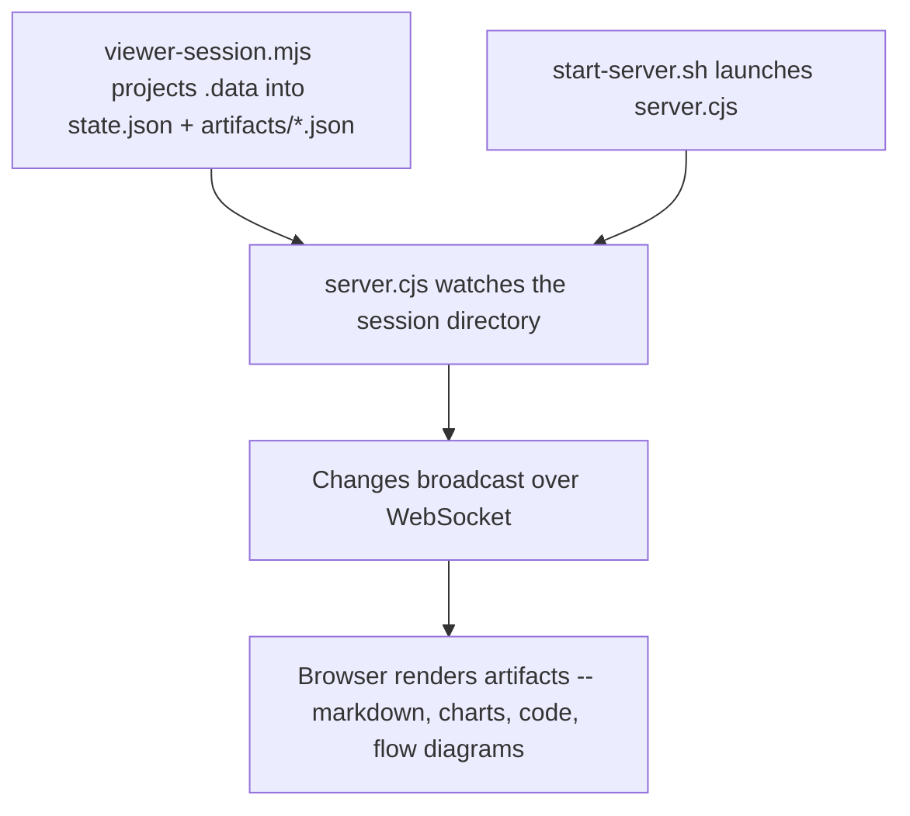
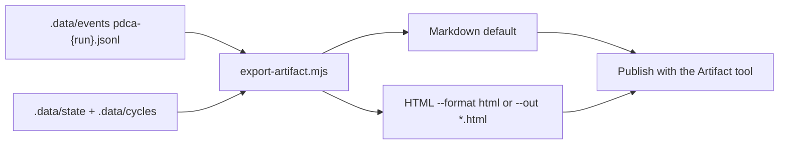

[한국어](viewer.ko.md)

# Viewer

> Tool-only command: open PDCA artifacts in a local web UI, or export the same run as a shareable provenance page. It serves or projects state. It does not make a quality judgment.

The live viewer is a local WebSocket server. It is **not** a Claude Code Artifact. Do not publish `localhost`, and do not pack that runtime into the export. SCC does not own the host loop and does not embed a second one.

## Quick Example

```
/scc:viewer
```

**What happens:** The command first runs `scripts/viewer-session.mjs`, which builds the session directory from the run, then runs `ui/scripts/start-server.sh` against it. The script serves the pre-built viewer UI from `ui/dist`, watches `state.json` and `artifacts/*.json` for changes, and prints a JSON blob with a local URL once the server is ready. Opening that URL in a browser renders each artifact -- markdown, charts, code, flow diagrams -- and updates live over WebSocket as the pipeline writes new artifacts.

## Real-World Example

**Input:**
```
The AI agent market report cycle just finished -- show me the artifacts
```

**Process:**
1. Session lookup -- no `--session-dir` was given, so the current PDCA session is resolved from the active PDCA state.
2. Launch -- runs `bash ui/scripts/start-server.sh --session-dir "<session-dir>" --dist-dir "${CLAUDE_PLUGIN_ROOT}/ui/dist"`.
3. Reuse check -- `start-server.sh` looks for `state/server.pid`; none exists yet, so it spawns the server script in the background instead of reusing a running instance.
4. Serve + watch -- the server binds port 3847, serves `ui/dist`, loads `state.json` plus every file under `artifacts/`, and starts watching both for changes.
5. Ready signal -- once the port is bound, `start-server.sh` polls for `state/server-info` (up to ~5 seconds) and prints it.
6. Verify -- per the Iron Law, the URL is checked to confirm it actually responds before it's handed to the user.
7. Render -- opening the URL connects over WebSocket; the browser renders the session's artifacts (a markdown brief, a bar chart, a code sample) and updates live as the pipeline writes more.

**Output excerpt:**
```json
{
  "ok": true,
  "status": "running",
  "url": "http://localhost:3847",
  "pid": 52117,
  "port": 3847,
  "session_dir": "/Users/you/project/.scc/sessions/2026-07-12-ai-agent-report",
  "dist_dir": "/Users/you/project/ui/dist"
}
```
> Open `http://localhost:3847` -- the session shows a markdown research brief, a bar chart of framework adoption, and a code sample, each updating live as the pipeline writes more artifacts. That URL is local only. It is not an Artifact.

## Options

| Flag | Values | Default |
|------|--------|---------|
| `--session-dir` | path to a `.scc/sessions/{id}` directory | current PDCA session |
| `--port` | port number | `3847` |
| `--export` | write a shareable page instead of serving | off |
| `--format` | `md` \| `html` | `md` |
| `--out` | export path | `pdca-export.md` (`*.html` selects HTML) |

`--format html` and `--out *.html` are the same choice. Markdown stays the default when neither is set.

## Two surfaces

| Surface | What it is | What it is not |
|---------|------------|----------------|
| Live viewer | Local WebSocket UI over the session directory that `viewer-session.mjs` projected | Not an Artifact. Dies after 30 minutes idle. No shareable URL |
| Export | One file from `scripts/export-artifact.mjs`, Markdown or HTML, published with the Artifact tool | Not a replay of the host loop. Not a second runtime |

A harness trajectory log can re-derive model context. SCC does not. Export reconstructs only PDCA gates, reviews, and router decisions from the append-only event log. The HTML page is a **projection** of that log.

## Export formats

The live viewer is local and dies after 30 minutes of inactivity. To hand someone the result, export instead. Both formats read the same event log through `scripts/export-artifact.mjs`. After the file is written, publish the Markdown or HTML with the Artifact tool to get a shareable URL.

### Markdown (default)

For mermaid-friendly hosts:

```bash
node "${CLAUDE_PLUGIN_ROOT}/scripts/export-artifact.mjs" --out pdca-export.md
```

This writes one Markdown file and prints `{"out","artifacts","cycles","source"}`. Charts and flows become mermaid, so there is no bundle and no external asset to break.

### HTML (`--format html` or `--out *.html`)

```bash
node "${CLAUDE_PLUGIN_ROOT}/scripts/export-artifact.mjs" --format html --out pdca-export.html
```

Same log, one Claude-Artifact-safe page:

- one self-contained HTML file
- inline CSS and JS
- images as data URI or SVG
- no `fetch`, no WebSocket
- no Nivo or Shiki CDN
- well under 16MB

The live viewer's Nivo charts, Shiki highlighter, and WebSocket watch do **not** travel into this file.

### What it reads

It reads what the pipeline actually writes — `.data/state/pdca-last-completed.json`, the `.data/events/pdca-{run_id}.jsonl` event log, and the `.data/cycles/` markdown. Pass `--data-dir` for a different root or `--run <run_id>` to pick an older run. The `--session-dir` form still reads the live viewer's `state.json` + `artifacts/*.json` layout.

Two things about where the numbers come from:

- The phase timeline and its durations are reconstructed from the **event log**, the only per-run record of when each phase started and ended.
- Re-entry reasons come from `state.action_router_history`, written by `pdca_transition` whenever a run leaves Act. Runs recorded before that field existed fall back to inference: a phase logged under a later cycle counts as a re-entry, but carries no reason.

The export leads with the **audit trail**, not the content: which gates passed,
the configured reviewer count and findings, every Act re-entry with its reason,
and any drift between planned and delivered scope. The count comes from the
run's event/state data; it is not a fixed five-reviewer claim. The artifacts
follow underneath.

## How It Works



That path is the live viewer. Export does not start it:



## Artifact Types

Each artifact file must have `id`, `type`, `phase`, and `title`, plus type-specific fields. The live viewer renders these with Nivo and Shiki. Markdown export uses mermaid fences. HTML export inlines CSS/JS and SVG or data-URI images — never a Nivo/Shiki CDN.

| Type | Live viewer | Type-specific fields |
|------|-----------|----------------------|
| `markdown` | Markdown prose | `content` |
| `chart` | Chart via Nivo (`bar`, `line`, `pie`, `radar`) | `chartType`, `data.labels`, `data.datasets[].values` |
| `code` | Syntax-highlighted code via Shiki | `language`, `code` |
| `flow` | SVG node/edge diagram | `nodes[]` (`id`, `label`, `x`, `y`), `edges[]` (`from`, `to`) |

## Session Directory

Each PDCA session lives in its own directory:

```
.scc/sessions/{session-id}/
├── state.json           ← PDCA state (phases, current phase, durations)
├── artifacts/
│   ├── 001-research.json
│   ├── 002-draft.json
│   └── 003-analysis.json
└── state/
    ├── server-info      ← Port, PID
    └── server.pid
```

## Optional companions

Companion plugins are optional. They must not replace `/scc:coach`. The decision owner stays `.scc/standards`. Do not add these as SCC dependencies.

| Plugin | Role |
|--------|------|
| `design-crit` | HTML wireframes Keep/Cut |
| `design-with-ai` | Direction before code |
| `alexei-led/architect` | Read-only coupling review |

## Gotchas

- **Confirm before sharing** -- Don't hand over a live-viewer URL without confirming the server actually responds. A dead server produces a broken link. That URL is still not an Artifact.
- **JSON validity isn't visual correctness** -- A well-formed artifact file can still render wrong. Open the viewer and check the rendered chart, flow, or markdown -- don't stop at validating the JSON.
- **Raw JSON is not a substitute** -- A screenshot of the artifact JSON is not the same as the rendered page. The viewer exists to render artifacts interactively.
- **Session must be populated first** -- Starting the server against a session directory with no `state.json` or nothing under `artifacts/` produces a blank page, not an error.
- **"Still running" is not guaranteed** -- The server auto-stops after 30 minutes of inactivity. Check `state/server.pid` before assuming a long-idle server is still up.
- **Do not embed the live runtime** -- HTML export is a static projection of the event log. No WebSocket, no `fetch`, no Nivo/Shiki CDN, no second host loop.

## Troubleshooting

- **Port already in use** -- If `--port` collides with another process, the server fails to bind and `start-server.sh` returns `{"ok":false,"status":"failed",...}` with the error tail from `state/server.log`. Retry with a different `--port`.
- **Server never starts (timeout)** -- `start-server.sh` polls for `state/server-info` for about 5 seconds; if it never appears, it returns `{"ok":false,"status":"timeout",...}`. Check `state/server.log` in the session directory for the underlying error.
- **Blank page after opening the URL** -- The session directory has no `state.json` or nothing under `artifacts/`. PDCA writes `.data/state` and `.data/cycles/`, not this layout, so run `scripts/viewer-session.mjs` first; skipping it is the usual cause.
- **Viewer stopped responding** -- If the browser was idle for 30 minutes, the server auto-stopped. Re-run `start-server.sh` for the same session directory -- it's a no-op if a server is already running, or starts a fresh one otherwise. To stop it explicitly: `bash ui/scripts/stop-server.sh --session-dir "<session-dir>"`.

## Works With

| Skill | Relationship |
|-------|--------------|
| `pdca` | Writes the `state.json` and `artifacts/*.json` files the viewer renders |
| `write` | Runs inside PDCA's Do phase; its output can be saved as a session artifact for the viewer to display |
| `analyze` | Runs inside PDCA's Plan phase; its charts and findings can be saved as a session artifact for the viewer to display |
| `coach` | Settles forks into `.scc/standards`. Optional design/architecture companions do not replace it |
