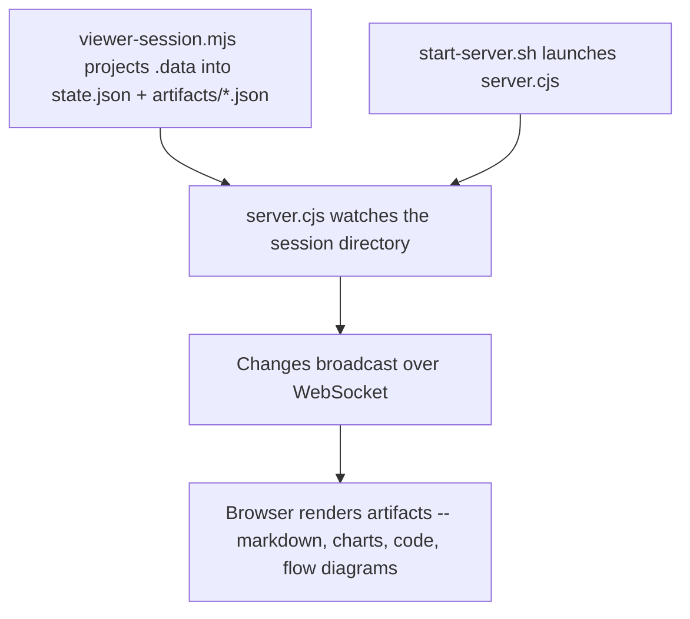

# Viewer

> Use when the user asks to open the SCC Artifact Viewer, show artifacts, inspect PDCA pipeline outputs, or after a PDCA pipeline run completes.

## Quick Example

```
/scc:viewer
```

**What happens:** The skill first runs `scripts/viewer-session.mjs`, which builds the session directory from the run, then runs `ui/scripts/start-server.sh` against it. The script serves the pre-built viewer UI from `ui/dist`, watches `state.json` and `artifacts/*.json` for changes, and prints a JSON blob with a local URL once the server is ready. Opening that URL in a browser renders each artifact -- markdown, charts, code, flow diagrams -- and updates live over WebSocket as the pipeline writes new artifacts.

## Real-World Example

**Input:**
```
The AI agent market report cycle just finished -- show me the artifacts
```

**Process:**
1. Session lookup -- no `--session-dir` was given, so the current PDCA session is resolved from the active PDCA state.
2. Launch -- runs `bash ui/scripts/start-server.sh --session-dir "<session-dir>" --dist-dir "${CLAUDE_PLUGIN_ROOT}/ui/dist"`.
3. Reuse check -- `start-server.sh` looks for `state/server.pid`; none exists yet, so it spawns the server script in the background instead of reusing a running instance.
4. Serve + watch -- the server binds port 3847, serves `ui/dist`, loads `state.json` plus every file under `artifacts/`, and starts watching both for changes.
5. Ready signal -- once the port is bound, `start-server.sh` polls for `state/server-info` (up to ~5 seconds) and prints it.
6. Verify -- per the Iron Law, the URL is checked to confirm it actually responds before it's handed to the user.
7. Render -- opening the URL connects over WebSocket; the browser renders the session's artifacts (a markdown brief, a bar chart, a code sample) and updates live as the pipeline writes more.

**Output excerpt:**
```json
{
  "ok": true,
  "status": "running",
  "url": "http://localhost:3847",
  "pid": 52117,
  "port": 3847,
  "session_dir": "/Users/you/project/.scc/sessions/2026-07-12-ai-agent-report",
  "dist_dir": "/Users/you/project/ui/dist"
}
```
> Open `http://localhost:3847` -- the session shows a markdown research brief, a bar chart of framework adoption, and a code sample, each updating live as the pipeline writes more artifacts.

## Options

| Flag | Values | Default |
|------|--------|---------|
| `--session-dir` | path to a `.scc/sessions/{id}` directory | current PDCA session |
| `--port` | port number | `3847` |

## How It Works



## Artifact Types

Each artifact file must have `id`, `type`, `phase`, and `title`, plus type-specific fields:

| Type | Renders as | Type-specific fields |
|------|-----------|----------------------|
| `markdown` | Markdown prose | `content` |
| `chart` | Chart via Nivo (`bar`, `line`, `pie`, `radar`) | `chartType`, `data.labels`, `data.datasets[].values` |
| `code` | Syntax-highlighted code via Shiki | `language`, `code` |
| `flow` | SVG node/edge diagram | `nodes[]` (`id`, `label`, `x`, `y`), `edges[]` (`from`, `to`) |

## Session Directory

Each PDCA session lives in its own directory:

```
.scc/sessions/{session-id}/
├── state.json           ← PDCA state (phases, current phase, durations)
├── artifacts/
│   ├── 001-research.json
│   ├── 002-draft.json
│   └── 003-analysis.json
└── state/
    ├── server-info      ← Port, PID
    └── server.pid
```

## Gotchas

- **Confirm before sharing** -- Don't hand over a URL without confirming the server actually responds. A dead server produces a broken link.
- **JSON validity isn't visual correctness** -- A well-formed artifact file can still render wrong. Open the viewer and check the rendered chart, flow, or markdown -- don't stop at validating the JSON.
- **Raw JSON is not a substitute** -- A screenshot of the artifact JSON is not the same as the rendered page. The viewer exists to render artifacts interactively.
- **Session must be populated first** -- Starting the server against a session directory with no `state.json` or nothing under `artifacts/` produces a blank page, not an error.
- **"Still running" is not guaranteed** -- The server auto-stops after 30 minutes of inactivity. Check `state/server.pid` before assuming a long-idle server is still up.

## Troubleshooting

- **Port already in use** -- If `--port` collides with another process, the server fails to bind and `start-server.sh` returns `{"ok":false,"status":"failed",...}` with the error tail from `state/server.log`. Retry with a different `--port`.
- **Server never starts (timeout)** -- `start-server.sh` polls for `state/server-info` for about 5 seconds; if it never appears, it returns `{"ok":false,"status":"timeout",...}`. Check `state/server.log` in the session directory for the underlying error.
- **Blank page after opening the URL** -- The session directory has no `state.json` or nothing under `artifacts/`. PDCA writes `.data/state` and `.data/cycles/`, not this layout, so run `scripts/viewer-session.mjs` first; skipping it is the usual cause.
- **Viewer stopped responding** -- If the browser was idle for 30 minutes, the server auto-stopped. Re-run `start-server.sh` for the same session directory -- it's a no-op if a server is already running, or starts a fresh one otherwise. To stop it explicitly: `bash ui/scripts/stop-server.sh --session-dir "<session-dir>"`.

## Works With

| Skill | Relationship |
|-------|--------------|
| `pdca` | Writes the `state.json` and `artifacts/*.json` files the viewer renders |
| `write` | Runs inside PDCA's Do phase; its output can be saved as a session artifact for the viewer to display |
| `analyze` | Runs inside PDCA's Plan phase; its charts and findings can be saved as a session artifact for the viewer to display |
