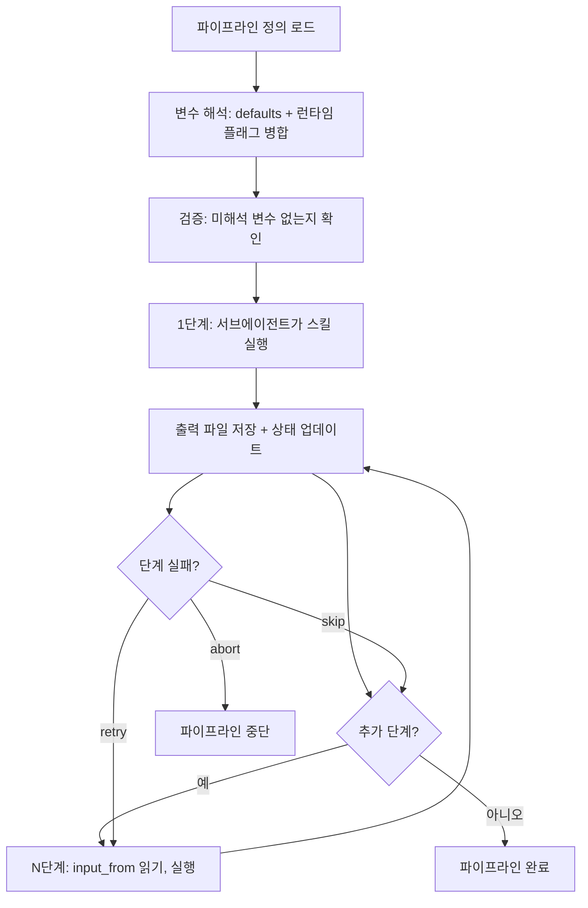

[English](workflow.md) | **한국어**

# Workflow

> 여러 /scc 명령을 재사용 가능한 워크플로우로 연결하는 스킬입니다.

## 빠른 예시

```
/second-claude-code:workflow create "weekly-report" --steps research,analyze,write
```

**동작 방식:** 스킬이 3단계 순차 실행의 JSON 정의를 생성하고, 각 단계의 출력 선언과 `input_from` 참조의 호환성을 검증한 뒤 파이프라인을 저장합니다. `/scc:workflow run "weekly-report" --topic "edge computing"`을 실행하면 모든 `{{variable}}` 플레이스홀더를 먼저 해석한 후, 각 단계를 새로운 서브에이전트로 실행하며 데이터를 파일을 통해 전달합니다.

## 실전 예시

**입력:**
```
/second-claude-code:workflow run "market-scan" --topic "edge computing" --var framework=porter --var lang=en
```

**진행 과정:**
1. 정의 로드 -- `market-scan`은 research, analyze, write 3단계로 구성. 각 단계의 args에 `{{topic}}`, `{{framework}}`, `{{lang}}` 변수 사용.
2. 변수 해석 -- `{{topic}}`은 `--topic` 플래그에서, `{{framework}}`과 `{{lang}}`은 `--var` 플래그에서 해석. `{{date}}`와 `{{run_id}}`는 자동 생성. 실행 시작 전 모든 `{{...}}` 토큰이 해석 완료되었는지 검증.
3. 실행 -- 1단계(research)가 `market-scan-20260320T143000-research.md` 출력. 2단계(analyze)가 `input_from`으로 해당 파일을 읽어 `market-scan-20260320T143000-analysis.md` 출력. 3단계(write)가 분석 결과를 읽어 최종 리포트 출력.
4. 실패 전략 -- 1-2단계는 `abort`(기초 단계, 없으면 진행 무의미). 3단계는 `retry`(업스트림 재실행 없이 재시도 가능).
5. 상태 추적 -- 각 단계 완료 후 `pipeline-active.json`에 `resolved_vars` 포함 활성 상태 기록. 중단 시 `current_step`부터 동일한 변수 값으로 재개.

**출력 예시:**
```json
{
  "name": "market-scan",
  "defaults": {
    "topic": "",
    "framework": "porter",
    "lang": "en"
  },
  "steps": [
    {
      "skill": "/second-claude-code:research",
      "args": "\"{{topic}}\" --depth deep --sources web,news,academic --lang {{lang}}",
      "output": "{{output_dir}}/{{run_id}}-research.md",
      "on_fail": "abort"
    },
    {
      "skill": "/second-claude-code:analyze",
      "args": "--framework {{framework}} --with-research --depth deep --lang {{lang}}",
      "input_from": "{{output_dir}}/{{run_id}}-research.md",
      "output": "{{output_dir}}/{{run_id}}-analysis.md",
      "on_fail": "abort"
    },
    {
      "skill": "/second-claude-code:write",
      "args": "--format report --voice expert --skip-research --lang {{lang}}",
      "input_from": "{{output_dir}}/{{run_id}}-analysis.md",
      "output": "{{output_dir}}/{{run_id}}-report.md",
      "on_fail": "retry"
    }
  ]
}
```

## 서브커맨드

| 명령 | 용도 |
|------|------|
| `create` | 새 파이프라인 정의 |
| `run` | 저장된 파이프라인 실행 (`--topic`, `--output_dir`, 커스텀 `--var` 플래그 사용 가능) |
| `list` | 저장된 파이프라인 목록 조회 |
| `show` | 파이프라인 정의 상세 보기 (`--topic` 제공 시 변수 해석 결과 표시) |
| `delete` | 파이프라인 삭제 |

## 변수

파이프라인 정의에서 `{{placeholder}}` 구문을 사용하면 실행 시점에 값이 해석됩니다. 오케스트레이터가 모든 단계의 `args`, `output`, `input_from` 필드에서 변수를 해석한 후 실행을 시작합니다.

### 내장 변수

| 변수 | 출처 | 기본값 |
|------|------|--------|
| `{{topic}}` | `--topic "X"` 실행 플래그 | 정의에 사용된 경우 **필수** |
| `{{date}}` | 자동 생성 | 실행 시작 시점의 `YYYY-MM-DD` |
| `{{output_dir}}` | `--output_dir "path"` 플래그 | 현재 작업 디렉토리 |
| `{{run_id}}` | 자동 생성 | `{pipeline_name}-{timestamp}` |

### 커스텀 변수

`--var key=value`로 임의의 변수를 전달합니다:

```
/scc:workflow run "weekly-report" --topic "edge computing" --var framework=porter --var lang=en
```

커스텀 변수는 `{{framework}}`, `{{lang}}` 등으로 참조합니다.

### 기본값 선언

파이프라인 정의의 `"defaults"`에서 기본값을 선언할 수 있습니다:

```json
{
  "defaults": {
    "topic": "",
    "lang": "ko",
    "framework": "swot"
  }
}
```

**해석 우선순위:** 런타임 플래그 > 기본값 > 빈 값. `{{variable}}`에 기본값도 런타임 플래그도 없으면 오케스트레이터가 누락된 변수 목록과 함께 오류를 출력하고 중단합니다.

## 옵션

| 플래그 | 값 | 기본값 |
|--------|-----|--------|
| `--topic` | 실행 시 런타임 토픽 인자 | 없음 |
| `--output_dir` | 모든 단계 출력의 디렉토리 | 현재 작업 디렉토리 |
| `--var` | `key=value` 쌍, 커스텀 변수용 (반복 가능) | 없음 |
| `--skip-research` | write 단계에 전달하여 중복 리서치 방지 | off |
| `on_fail` (단계별) | `abort`, `skip`, `retry` | `abort` |
| `parallel` (단계별) | `true`, `false` | `false` |

## 작동 원리



## 프리셋

`/second-claude-code:workflow run <preset>`으로 프리셋을 실행합니다:

| 프리셋 | 단계 | 용도 |
|--------|------|------|
| `autopilot` | research, analyze, write, review, refine | 엔드투엔드 콘텐츠 프로덕션 |
| `quick-draft` | research, write | 분석이 불필요한 빠른 초안 작성 |
| `quality-gate` | review, refine | 기존 콘텐츠의 사후 품질 검수 |

모든 프리셋은 `--topic`과 `--var` 플래그를 지원합니다.

**autopilot**: 기본 엔드투엔드 파이프라인. research가 소스를 수집하고, analyze가 프레임워크를 적용하며(기본: SWOT, `--var framework=porter`로 변경 가능), write가 결과물을 생성하고, review가 비평하고, refine이 피드백을 반영합니다. 완성도 높은 결과물에 적합합니다.

**quick-draft**: 분석과 리뷰를 건너뜁니다. research 결과가 바로 write로 전달됩니다. 수동으로 정제할 시간 제약이 있는 초안에 적합합니다.

**quality-gate**: 기존 파일을 입력으로 받아(`--var input=path/to/file.md`) review를 실행한 후 refine으로 이슈를 수정합니다. 리서치 없이 기존 콘텐츠를 다듬는 데 적합합니다.

## 주의사항

- 단계 간 메모리 공유를 절대 가정하지 마세요. 모든 데이터는 파일을 통해 전달되어야 합니다.
- 출력은 즉시 저장하여, 이후 단계 실패 시 이전 결과가 소실되지 않도록 합니다.
- 파이프라인당 최대 10단계. 초과 시 여러 파이프라인으로 분할하세요.
- 업스트림에서 이미 리서치가 실행된 경우, write 단계에 `--skip-research`를 사용하세요. 그렇지 않으면 리서치가 중복 실행됩니다.
- `{{topic}}`을 사용하는 파이프라인 실행 시 항상 `--topic`을 전달하세요. 누락 시 오케스트레이터가 누락 변수 목록과 함께 오류를 출력합니다.
- 변수 해석은 실행 시작 시 1회만 수행됩니다. 파이프라인 중간에 `--topic`을 변경하려면 새 실행이 필요합니다.
- 중단된 실행 재개 시, 오케스트레이터는 저장된 상태의 `resolved_vars`를 재사용합니다 -- 플래그를 다시 해석하지 않습니다.
- `input_from`으로 서로를 참조하는 병렬 단계는 자동으로 직렬화됩니다.

## 문제 해결

- **"변수가 해석되지 않음" 오류** -- 파이프라인 정의의 `{{variable}}` 철자를 확인하세요. 변수 이름은 영숫자와 밑줄만 허용됩니다(`[a-zA-Z_][a-zA-Z0-9_]*`). `"defaults"`에 선언되어 있거나 `--topic`, `--output_dir`, `--var key=value`로 제공되는지 확인하세요.
- **단계가 중간에 실패** -- 실패한 단계의 `on_fail` 전략을 확인하세요. `abort`(기본값)는 전체 파이프라인을 중단합니다. `skip`은 다음 단계로 넘어갑니다. `retry`는 실패한 단계를 재실행합니다. 중단된 파이프라인을 재개하려면 동일한 파이프라인을 다시 실행하세요 -- 오케스트레이터가 마지막 저장 상태부터 이어갑니다.
- **파이프라인을 찾을 수 없음** -- `/scc:workflow list`로 파이프라인 이름을 확인하세요. 정의 파일은 `${CLAUDE_PLUGIN_DATA}/pipelines/{name}.json`에 저장됩니다.
- **예상과 다른 출력 위치** -- `{{output_dir}}`이 설정되었는지 확인하세요. `--output_dir` 없이 실행하면 모든 출력은 현재 작업 디렉토리로 갑니다.

## 연동 스킬

| 스킬 | 관계 |
|------|------|
| `research` | 콘텐츠 파이프라인의 일반적 첫 단계 |
| `analyze` | 전략 프레임워크를 적용하는 일반적 중간 단계 |
| `write` | 최종 결과물을 생산하는 일반적 마지막 단계 |
| `loop` | write 뒤에 반복 개선 단계로 이어질 수 있음 |
| `review` | 주로 write 내부에서 호출되나, 독립 단계로도 활용 가능 |
