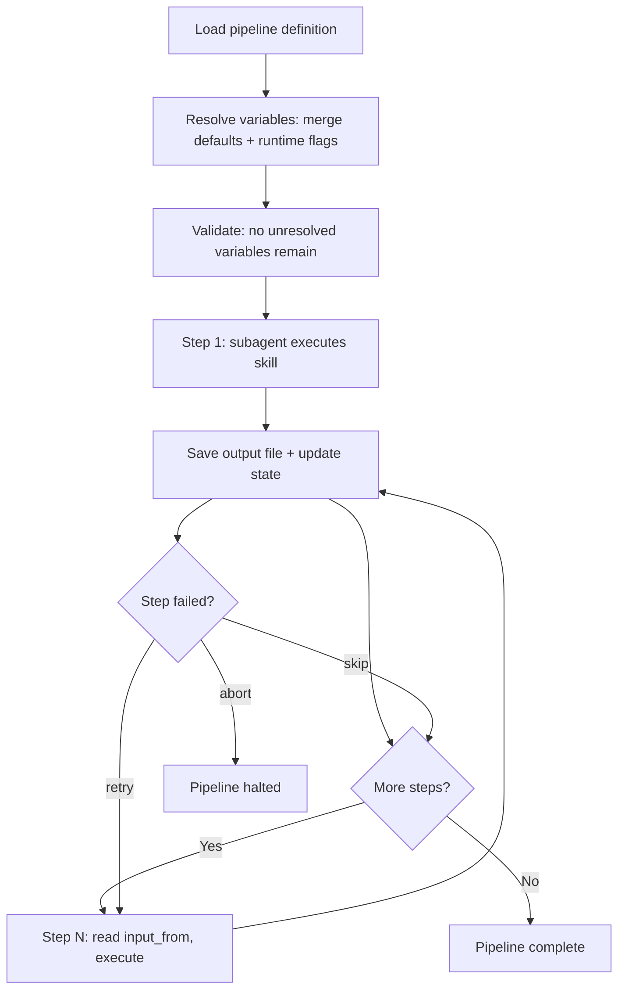

# Pipeline

> Use when chaining multiple /scc commands into a reusable PDCA workflow.

## Quick Example

```
/second-claude-code:workflow create "weekly-report" --steps research,analyze,write
```

**What happens:** The skill creates a JSON definition with 3 sequential steps, validates that each step declares an output and that `input_from` references are compatible, then saves the pipeline for reuse. Running `/second-claude-code:workflow run "weekly-report" --topic "edge computing"` executes each step as a fresh subagent, passing data through files. All `{{variable}}` placeholders are resolved before execution begins.

## Real-World Example

**Input:**
```
/second-claude-code:workflow run "market-scan" --topic "edge computing" --var framework=porter --var lang=en
```

**Process:**
1. Definition loaded -- `market-scan` has 3 steps: research, analyze, write. Each step uses `{{topic}}`, `{{framework}}`, and `{{lang}}` variables in its args.
2. Variable resolution -- `{{topic}}` resolved from `--topic` flag, `{{framework}}` and `{{lang}}` from `--var` flags, `{{date}}` and `{{run_id}}` auto-generated. All `{{...}}` tokens verified resolved before execution begins.
3. Execution -- Step 1 (research) outputs `market-scan-20260320T143000-research.md`. Step 2 (analyze) reads that file via `input_from` and outputs `market-scan-20260320T143000-analysis.md`. Step 3 (write) reads the analysis and outputs the final report.
4. Failure strategy -- Steps 1-2 set to `abort` (foundational; no point continuing without them). Step 3 set to `retry` (writing can be retried without re-running upstream).
5. State tracking -- active state written to `pipeline-active.json` after each step, including `resolved_vars`. If interrupted, resume picks up from `current_step` with the same variable values.

**Output excerpt:**
```json
{
  "name": "market-scan",
  "defaults": {
    "topic": "",
    "framework": "porter",
    "lang": "en"
  },
  "steps": [
    {
      "skill": "/second-claude-code:research",
      "args": "\"{{topic}}\" --depth deep --sources web,news,academic --lang {{lang}}",
      "output": "{{output_dir}}/{{run_id}}-research.md",
      "on_fail": "abort"
    },
    {
      "skill": "/second-claude-code:analyze",
      "args": "--framework {{framework}} --with-research --depth deep --lang {{lang}}",
      "input_from": "{{output_dir}}/{{run_id}}-research.md",
      "output": "{{output_dir}}/{{run_id}}-analysis.md",
      "on_fail": "abort"
    },
    {
      "skill": "/second-claude-code:write",
      "args": "--format report --voice expert --skip-research --lang {{lang}}",
      "input_from": "{{output_dir}}/{{run_id}}-analysis.md",
      "output": "{{output_dir}}/{{run_id}}-report.md",
      "on_fail": "retry"
    }
  ]
}
```

## Subcommands

| Command | Purpose |
|---------|---------|
| `create` | Define a new pipeline |
| `run` | Execute a saved pipeline (accepts `--topic`, `--output_dir`, and custom `--var` flags) |
| `list` | Show all saved pipelines |
| `show` | Inspect a pipeline definition (resolves variables if `--topic` provided) |
| `delete` | Remove a pipeline |

## Variables

Pipeline definitions use `{{placeholder}}` syntax for values that are resolved at runtime. The orchestrator resolves all variables in every step's `args`, `output`, and `input_from` fields before execution begins.

### Built-in Variables

| Variable | Source | Default |
|----------|--------|---------|
| `{{topic}}` | `--topic "X"` flag at runtime | **required** if present in definition |
| `{{date}}` | auto-generated | `YYYY-MM-DD` of run start |
| `{{output_dir}}` | `--output_dir "path"` flag | current working directory |
| `{{run_id}}` | auto-generated | `{pipeline_name}-{timestamp}` |

### Custom Variables

Pass arbitrary variables with `--var key=value`:

```
/scc:pipeline run "weekly-report" --topic "edge computing" --var framework=porter --var lang=en
```

Custom variables are referenced as `{{framework}}`, `{{lang}}`, etc.

### Default Values

Declare defaults in the pipeline definition under `"defaults"`:

```json
{
  "defaults": {
    "topic": "",
    "lang": "ko",
    "framework": "swot"
  }
}
```

**Resolution priority:** Runtime flags override defaults. Defaults override empty. If a `{{variable}}` has no default and no runtime flag, the orchestrator aborts with a clear error listing the missing variables.

## Options

| Flag | Values | Default |
|------|--------|---------|
| `--topic` | runtime topic argument for the run | none |
| `--output_dir` | output directory for all step outputs | current working directory |
| `--var` | `key=value` pairs for custom variables (repeatable) | none |
| `--skip-research` | passed to write steps to avoid redundant research | off |
| `on_fail` (per step) | `abort`, `skip`, `retry` | `abort` |
| `parallel` (per step) | `true`, `false` | `false` |

## How It Works



## Presets

Run a named preset with `/second-claude-code:workflow run <preset>`:

| Preset | Steps | Use For |
|--------|-------|---------|
| `autopilot` | research, analyze, write, review, loop | End-to-end content production |
| `quick-draft` | research, write | Fast first draft when analysis is unnecessary |
| `quality-gate` | review, loop | Post-hoc quality check on existing content |

All presets accept `--topic` and `--var` flags for runtime parameterization.
Together they let you automate the full Gather → Produce → Verify → Refine loop.

**autopilot**: The default end-to-end pipeline. Research gathers sources, analyze applies a framework (default: SWOT, override with `--var framework=porter`), write produces the artifact, review critiques it, and loop incorporates feedback. Best for polished deliverables.

**quick-draft**: Skips analysis and review. Research feeds directly into write. Best for time-sensitive first drafts that will be manually refined.

**quality-gate**: Takes an existing file as input (`--var input=path/to/file.md`), runs review, then loop to fix issues. Best for polishing existing content without re-researching.

## Gotchas

- **Assuming shared memory** -- Never assume shared memory between steps. All data must pass through files.
- **Delayed output saves** -- Save outputs immediately so later failures do not erase earlier work.
- **Oversized pipelines** -- Maximum 10 steps per pipeline. Split oversized workflows into smaller pipelines.
- **Redundant research** -- Use `--skip-research` on write steps when research already ran upstream, otherwise research executes redundantly.
- **Missing variables at runtime** -- Always provide `--topic` when running a pipeline that uses `{{topic}}`. The orchestrator aborts with a clear error listing missing variables.
- **Variable resolution is one-time** -- Resolution happens once at run start. Mid-pipeline changes to `--topic` require a new run.
- **Resumption reuses saved values** -- When resuming an interrupted run, the orchestrator reuses `resolved_vars` from the saved state -- it does not re-resolve from flags.
- **False parallelism** -- Parallel steps that reference each other via `input_from` are automatically serialized.

## Troubleshooting

- **"Variable not resolved" error** -- Check `{{variable}}` spelling in your pipeline definition. Variable names must be alphanumeric plus underscores (`[a-zA-Z_][a-zA-Z0-9_]*`). Ensure the variable is either declared in `"defaults"` or provided via `--topic`, `--output_dir`, or `--var key=value` at runtime.
- **Step fails mid-pipeline** -- Check the `on_fail` strategy for the failed step. `abort` halts the entire pipeline (default). `skip` moves to the next step. `retry` re-runs the failed step. To resume a halted pipeline, run the same pipeline again -- the orchestrator picks up from the last saved state.
- **Pipeline not found** -- Verify the pipeline name with `/scc:pipeline list`. Pipeline definitions are stored at `${CLAUDE_PLUGIN_DATA}/pipelines/{name}.json`.
- **Unexpected output location** -- Check whether `{{output_dir}}` is set. Without `--output_dir`, all outputs go to the current working directory.

## Works With

| Skill | Relationship |
|-------|-------------|
| `research` | Common first step for content pipelines |
| `analyze` | Common middle step applying strategic frameworks |
| `write` | Common final step producing polished output |
| `loop` | Can follow write as an iterative refinement step |
| `review` | Often invoked internally by write; can also be an explicit step |
