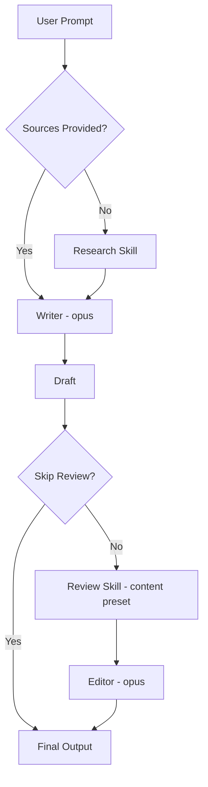

[English](write.md) | **한국어**

# Write

> 뉴스레터, 아티클, 리포트, 숏폼, 소셜 콘텐츠를 자동 리서치 및 리뷰와 함께 작성합니다.

## 빠른 예시

```
AI 에이전트의 미래에 대한 아티클을 써줘
```

**동작 방식:** 리서치 단계를 자동 트리거한 뒤, 선택된 포맷과 문체로 초안을 작성하고, review 스킬을 통해 리뷰를 수행한 다음, Critical과 Major 소견을 반영하는 편집 패스를 적용합니다.

## 실전 예시

**입력:**
```
AI 에이전트의 미래에 대한 전문가 아티클을 써줘, 약 800단어
```

**진행 과정:**
1. 리서치 단계 자동 트리거 -- 시장 데이터, 기업 도입, 도전과제, 사례 연구, 멀티 에이전트 아키텍처를 다루는 웹 검색 5회.
2. 라이터(opus)가 `article` 포맷 + `expert` 문체로 초안 작성: 권위 있고, 증거 기반이며, 도메인 용어를 사용.
3. 분량 협상 활성화: 아티클 포맷 최소 기준은 3,000단어, 사용자 요청은 약 800단어. 스킬이 사용자에게 알리고 대안을 제시.
4. 리뷰 자동 트리거, `content` 프리셋(deep-reviewer + devil-advocate + tone-guardian) 적용.
5. 에디터(opus)가 모든 Critical/Major 소견을 반영하여 수정.

**출력 예시:**
> 2026년 3월 현재, AI 에이전트 시장은 전례 없는 속도로 성장하고 있다. Grand View Research에 따르면 글로벌 AI 에이전트 시장 규모는 2025년 76억 3천만 달러에서 2026년 109억 1천만 달러로, 단 1년 만에 43% 이상 팽창했다.
>
> **품질 점수:** 7/10 -- 12개 이상 출처 인용, 모든 주요 주장에 데이터 뒷받침, 전문가 문체 일관 유지.

## 옵션

| 플래그 | 값 | 기본값 |
|--------|-----|--------|
| `--format` | `newsletter\|article\|shorts\|report\|social\|card-news` | `newsletter` |
| `--voice` | `peer-mentor\|expert\|casual` | 포맷별 기본값 |
| `--publish` | `notion\|file` | `file` |
| `--skip-research` | flag | off |
| `--skip-review` | flag | off |
| `--lang` | `ko\|en` | `ko` |

### 문체(Voice)

| 문체 | 기본 적용 포맷 |
|------|---------------|
| `peer-mentor` | newsletter |
| `expert` | report, article |
| `casual` | shorts, social |

### 포맷 규칙

| 포맷 | 최소 분량 | 핵심 요건 |
|------|----------|----------|
| `newsletter` | 2,000단어 | 6단계 내러티브 아크, 리서치 데이터 2개 이상 |
| `article` | 3,000단어 | 증거 기반 구조 |
| `report` | 4,000단어 | 번호 매긴 권고안 |
| `shorts` | 약 300단어 | CTA 필수 |
| `social` | 플랫폼 최적화 | 짧은 포스트 |
| `card-news` | 슬라이드 단위 | 슬라이드별 비주얼 방향 |

### 분량 협상

사용자 지정 분량이 포맷 최소 기준과 충돌할 때:
1. 스킬이 사용자에게 충돌 사실을 알립니다.
2. 대안 제시: 더 짧은 포맷으로 전환하거나, 원래 포맷의 최소 분량을 유지.
3. 사용자가 고수하면 의도를 존중하되, 출력 메타데이터에 오버라이드 사실을 기록.

스킬은 사용자 요청을 무단으로 축소하거나 초과하지 않습니다.

## 작동 원리



## 주의사항

- **소스 없이 리서치 생략** -- 실제 소스 자료가 이미 제공된 경우에만 `--skip-research`를 사용하세요. 라이터에게 근거가 필요합니다.
- **숏폼에 CTA 누락** -- `shorts`와 `social` 포맷에는 콜투액션이 필수입니다. 라이터 제약이 이를 강제합니다.
- **리뷰 없이 발행** -- 리뷰 패스가 Critical/Major 이슈를 잡아냅니다. 생략하면 결함 있는 콘텐츠가 발행될 위험이 있습니다.

## 연동 스킬

| 스킬 | 관계 |
|------|------|
| research | 초안 작성 전 자동 호출 (`--skip-research` 미설정 시) |
| review | 초안 작성 후 `content` 프리셋으로 자동 호출 (`--skip-review` 미설정 시) |
| pipeline | 커스텀 워크플로우의 한 단계로 연결 가능 |
| loop | 리뷰 소견 반영 후 반복 개선 |
